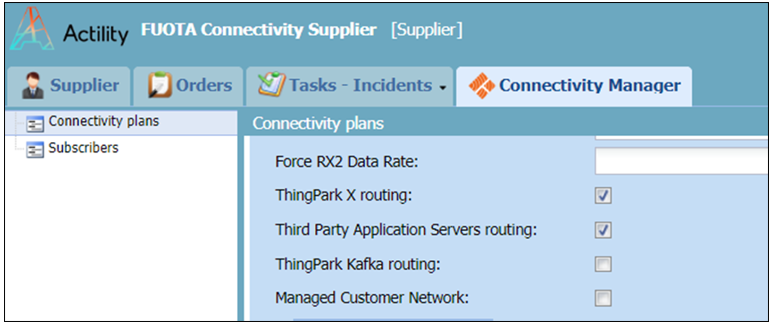

# Appendix

## Connectivity Plan Setup

To allow all subscribers to activate ThingPark X options proceed as follows:

+	Go to the Connectivity Manager tool (you should be logged-in with the role of  Connectivity Supplier) in the ThingPark Wireless platform.

+	In the relevant Connectivity Plan tick the ThingPark X routing box to enable the functionality. This is illustrated in the following capture.



## IoT-Flow RoutingProfile

To enable Thingpark X IOT-FLOW routing for an operator, a configuration must be set in the twa database.

**Operator table:**

Add a ```<cloud>``` element in ```<clouds>``` in the field tpkCloudConfig: 

```<cloud name="ThingPark X IOT-FLOW" ID="IOT_FLOW" address="kafka://thingpark-x"/>```

This can be added in addition with Thingpark X Core


