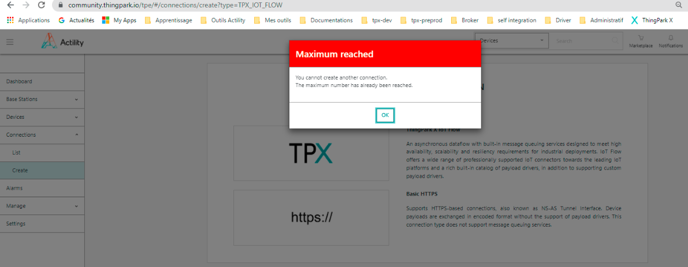

# Common error messages

If you're having trouble creating a connection, see below if the error is documented.

## Max connection limit reached

When using ThingPark Enterprise, you might encounter the following error after clicking on the create a new connection button.

If you encounter this error, it means that you have created the maximum authorized ammount of connections (5).

**Solution:** Search through your connections and delete the unused ones. Then, you should be able to create a connection.