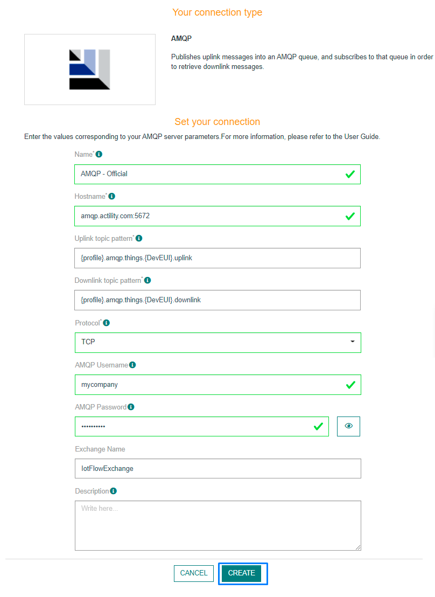
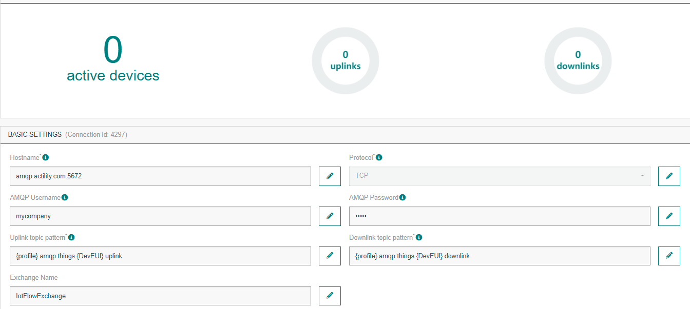
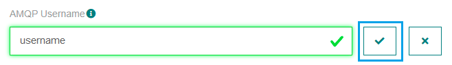

# CREATING AN AMQP CONNECTION

## Creating a Connection With API

The creation of a connection establishes a bidirectional messaging transport link between ThingPark X IoT Flow and the cloud provider. Events and commands from multiple Devices will be multiplexed over this messaging transport link.

To do this, you need to use the **Connections** group resource:

* `POST/connections` to create a new Connection instance
* `PUT/connections` to update a Connection instance
* `DELETE/connections` to delete a Connection instance

::: tip Note
We follow the REST-full API pattern, when updating configuration properties for a connection resource. Thus, you must also provide the whole configuration again.
:::

Example for creation of a new connection instance :

* AMQP connection with **TCP**

```json
POST /connections
{
    "connectorId": "actility-amqp-0.9.1-iot",
    "name": "Test AMQP (TCP) Connection",
    "configuration": {
        "uplinkTopicPattern": "{profile}.amqp.things.{DevEUI}.uplink",
        "downlinkTopicPattern": "{profile}.amqp.things.{DevEUI}.downlink",
        "hostName": "broker.preview.thingpark.com:5672",
        "protocol": "TCP",
        "username": "actility",
        "password": "actility",
        "exchangeName": "IotFlowExchange"
    }
}
```

* AMQP connection with **SSL**

```json
{
    "connectorId": "actility-amqp-0.9.1-iot",
    "name": "Test AMQP (SSL) Connection",
    "configuration": {
        "uplinkTopicPattern": "{profile}.amqp.things.{DevEUI}.uplink",
        "downlinkTopicPattern": "{profile}.amqp.things.{DevEUI}.downlink",
        "hostName": "broker.preview.thingpark.com:5671",
        "protocol": "SSL",
        "username": "actility",
        "password": "actility",
        "certificate": "--BEGIN CERTIFICATE--kCFGNqMDBA...QJvW3--END CERTIFICATE--",
        "privateKey": "--BEGIN RSA PRIVATE KEY--MIIEowIBAA...lOF5whZXzrHHACsWqAwermxHK7--END RSA PRIVATE KEY--",
        "exchangeName": "IotFlowExchange"
    }
}
```

The following table lists the properties applicable to a connection instance.

| JSON Field | Description |
| ------ | ----------- |
| ```connectorId``` | Must be set to actility-amqp-0.9.1-iot for AMQP platform. |
| ```uplinkTopicPattern``` | Defines a pattern of topic for the Uplink. |
| ```downlinkTopicPattern``` | Defines a pattern of topic for the Downlink. |
| ```hostName``` | The Hostname and Port of your AMQP server. Example: myhostname.com:8883. |
| ```protocol``` | Protocol to be used for your connection to the AMQP server. Can be set to TCP or SSL. |
| ```certificate``` | The client certificate file used to connect to your AMQP server. Only needed if protocol is set to SSL. |
| ```privateKey``` | The client private key file used to connect to your AMQP server. Only needed if protocol is set to SSL. |
| ```exchangeName``` | The exchange name e.g. amqp.topic |

::: warning Important note
All properties are not present in this example. You can check the rest of these properties in the [common parameters section](../../Getting_Started/Setting_Up_A_Connection_instance/About_connections.html#common-parameters).
:::

## Creating a Connection From UI

You must have deployed a AMQP server prior to connecting with the AMQP protocol-based application.

| UI Field | Description |
| ------ | ----------- |
| **Application Name** | Name of the application that you want to register (Editable). |
| **Hostname** | The Hostname and Port of your AMQP server. Example: myhostname.com:8883. (Editable) |
| **Uplink Topic Pattern** | Defines a pattern of topic for the Uplink. (Editable) |
| **Downlink Topic Pattern** | Defines a pattern of topic for the Downlink. (Editable) |
| **Protocol** | Choose between the SSL protocol or the TCP protocol. (Editable) |
| **Certificate** | The client certificate file used to connect to your AMQP server. (Editable) |
| **Private Key** | The client private key file used to connect to your AMQP server. (Editable) |
| **AMQP Username** | The username to access your AMQP server. (Editable) |
| **AMQP Password** | The password used to access your AMQP server. (Editable) |
| **Exchange Name** |The exchange name e.g. amqp.topic (Editable) |

1. Click Connections -> Create -> ThingPark X Iot Flow.


Then, a new page will open. Select the connection type : AMQP.


2. Fill in the form as in the example below and click on **Create**.

:::warning Warning
The form changes depending on the protocol selected: SSL or TCP.
:::



::: tip Note
Parameters marked with * are mandatory.
:::

* A notification appears on the upper right side of your screen to confirm that the application has been created.


4. After creating the application, you will be redirected to the application details.



**Changing the Settings after Creation**

You can change the settings parameters such as the email or the password after the creation of the AMQP application.

To do this, proceed as follows:

1. Select the AMQP application for which you want to change one or several parameters.

2. In the application information dashboard, click on the **Edit** button corresponding to the parameter you want to change.


3. Enter the new value, and click on the **Confirm** icon.



* The Confirmation window displays,


* A notification will inform you that the parameter is updated.


## Limitations

There are currently no known limitations to the AMQP connector.

## Displaying Information to Know if it Worked

You will need to install a tool such as [Service Bus Explorer](https://github.com/paolosalvatori/ServiceBusExplorer) in order to test the connection.

1. Download [Service Bus Explorer](https://github.com/paolosalvatori/ServiceBusExplorer) and extract the content in a folder.


2. Open the executable file.


3. A new window will pop up. Click on File -> Connect.


4. Fill up the form. Enter your connection string to create a new connection.


## Troubleshooting

As for now, there are no detected bugs.
