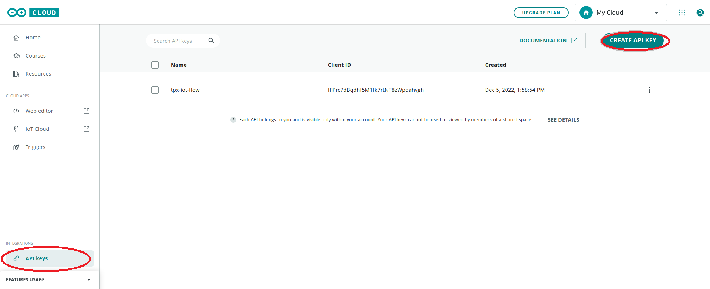
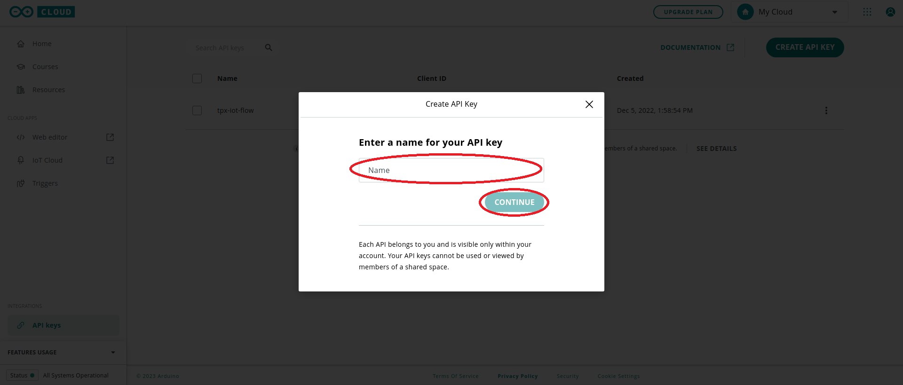

# CREATE AN API KEY IN ARDUINO CLOUD
1. On the Arduino Cloud portal main page click API keys -&gt; CREATE API KEY
   

2. Give a name to the API KEY to be created and click the CONTINUE button
   

# CREATING AN ARDUINO PRO CONNECTION

## Creating a Connection With UI
Not implemented yet.

## Creating a Connection With API
To do this, you need to use the **Connections** group resource:
*	`POST/connections` to create a new Connection instance
*	`PUT/connections` to update a Connection instance
*	`DELETE/connections` to delete a Connection instance

:::tip Note
We follow the REST-full API pattern, when updating configuration properties for a connection resource. Thus, you must also provide the whole configuration again.
:::

Example for creation of a new connection instance :
```json
POST /connections
{
   "connectorId": "actility-arduino-pro-iot",
   "name": "Test Arduino Pro Connection",
   "configuration": {
      "clientId": "IFPrc7dBqdhf5M1fk7rtNT8zWpqahygh",
      "clientSecret":"uXk9HDkUctqqZ8VFxG3g4LPtCpoCM5vHkyy5Dvm3Md7BSfpeSRflMqFR2hmpBHPs"
   }
}
```

The following table lists the properties applicable to a connection instance.

| Property                                 | Expected results                                                                                                                                                                                                |
|------------------------------------------|-----------------------------------------------------------------------------------------------------------------------------------------------------------------------------------------------------------------|
| ```connectorId```                        | Must be set to `actility-arduino-pro-iot`.                                                                                                                                                                      |
| ```configuration/clientId```             | The Client ID of the Arduino Cloud API Key that you have created.                                                                                                                                               |
| ```configuration/clientSecret```         | The Client Secret of the Arduino Cloud API Key that you have created.                                                                                                                                           |


:::warning Important note
All properties are not present in this example. You can check the rest of these properties in the [common parameters section](../../Getting%20started/Setting%20Up%20A%20Connection%20instance/About_connections#common-parameters).
:::

## Limitations


## Troubleshooting

