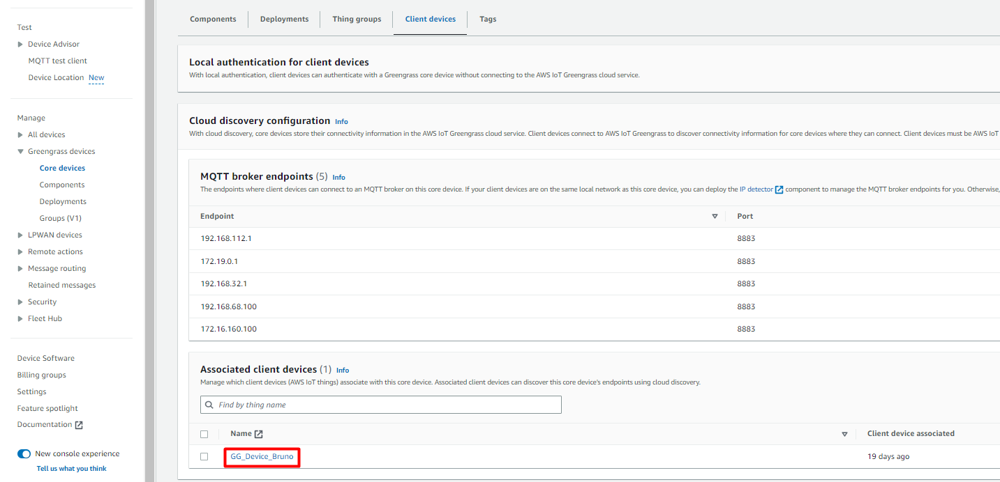
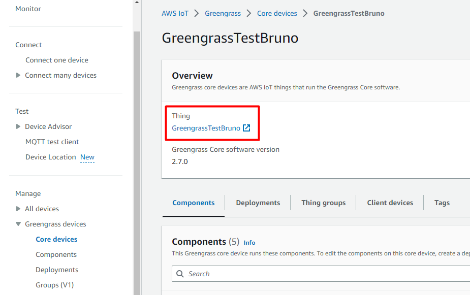

# CREATING AN AWS Greengrass with MQTT CONNECTION

The AWS Greengrass with MQTT connector requires an existing Greengrass device core already installed and configured upfront.
Please follow Greengrass installation instruction of this section [AWS Greengrass](/Connector/AWS_GG/). 

## Collecting Expected Informations

<a id="MQTTparameters">**Parameters required**</a>

| UI Field | Description |
| ------ | ----------- |
| **Certificate** | The client certificate of your Associated Client Device. |
| **Private Key** | The client Private Key file of your Associated Client Device. |
| **CA Certificate** | Trusted CA Certificate of your Core device. |
| **Client ID** | The client ID used to connect to your MQTT server. |
| **Protocol** | Fixed to SSL. |
| **Connection Timeout** | Fixed to 10000ms. |
| **Action Timeout** | Fixed to 10000ms. |

### Certificate + Private key
You need collect *Certificate* + *Private key* of the "Associated client device"


### CA Certificate
The CA certificate of your Core Device (represented by a Thing) must be retreive using the Greengrass discovery API.
The following example specifies a client device's certificates to authenticate a request to the Greengrass discovery API endpoint.

```
curl -i --cert 1a23bc4d56.cert.pem \
  --key 1a23bc4d56.private.key \
  https://greengrass-ats.iot.us-west-2.amazonaws.com:8443/greengrass/discover/thing/MyClientDevice1
```
If the request succeeds, this command outputs a response similar to the following example.

```json
{ "GGGroups": [ { "GGGroupId": "greengrassV2-coreDevice-MyGreengrassCore", "Cores": [ { "thingArn": "arn:aws:iot:us-west-2:123456789012:thing/MyGreengrassCore", "Connectivity": [ { "Id": "AUTOIP_192.168.1.4_1", "HostAddress": "192.168.1.5", "PortNumber": 8883, "Metadata": "" } ] } ], "CAs": [ "-----BEGIN CERTIFICATE-----\ncert-contents\n-----END CERTIFICATE-----\n" ] } ] }
```
The certificate returned in the response above is the CA of the Greengrass Core device.

### Client ID
The clientID of your MQTT connection should be the Thing's name of your core device.


## Attention points
- MQTT Credentials (username/password) should not be used. The authentication of the Thing will be done via Thing’s private key and certificate. 
- MQTT Client ID must be the Thing’s name that the connector represent.
- The thing that represents the connector must also have permission to perform the `greengrass:Discover` action.
- The default *ConnectionTimeout* and *ActionTimeout* settings of the MQTT Connector are too short for establishing a successful connection to AWS Greengrass Core device. They must be increased to 10 seconds.
