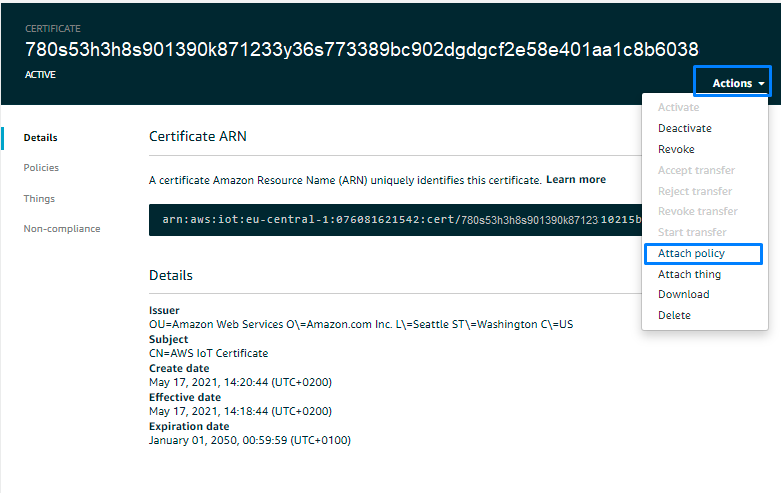
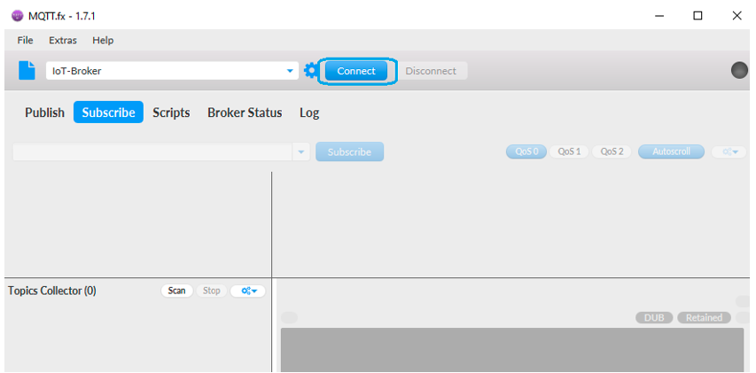

# CREATING AN AWS MQTT CONNECTION

The AWS with MQTT connector requires an existing MQTT Broker installed and configured upfront.

## Collecting Expected Informations

### Account prefix

1. Open the <a href="https://eu-central-1.console.aws.amazon.com/iot/home?region=eu-central-1#/dashboard" style="color:teal" >AWS IOT Dashboard</a>


2. In the sidebar, click on **Settings**:


3.	Copy the **accountPrefix** and **region** connector parameters (respectively ``d4g5d321sd465d-ats`` and ``eu-central-1`` in the example above).

::: tip Note
The ***Endpoint*** string has the following format ```accountPrefix.iot.region.amazonaws.com```. If the accountPrefix does not end in ``‘-ats’``, follow the instructions for setting up your [Amazon Trust Services (ATS) endpoint to avoid connection issues due to deprecated trust CAs.](https://aws.amazon.com/fr/blogs/iot/aws-iot-core-ats-endpoints/)
:::

### Region

You can retrieve the region in the AWS IoT Console by looking at the top right of your screen.


:::tip Note
You can learn more about the available regions <a href="https://docs.aws.amazon.com/fr_fr/AmazonRDS/latest/UserGuide/Concepts.RegionsAndAvailabilityZones.html" style="color:teal">here</a>.
:::

### CA certificate and policy

A certificate is required for the registration of the TLS connection protocol (MQTT over TLS v1.2 connection) and the Device.

1. Go to the dashboard and open the Certificates’ page.


2. Click **Create**.

3. In the Create a Certificate’s page, choose **One-click certificate creation (recommended)**.


4. Click **Create certificate**.

* A notification appears to confirm that the certificate has been created.


5. Once the certificate is created, you will be able to download the certificate file and the associated private key.


6. Click **Activate**.

* A notification appears to confirm that the certificate is activated.


7. Click **Attach a policy**.


* You will be redirect to the Add authorization to certificate’s page.


8. Click **Create new Policy**.

9. Enter the new policy's name.


10. Set the actions that you have previously defined in  [Access Key Id and Secret Access Key](/Connector/AWS/#access-key-id-and-secret-access-key)  
    Which are:

* iot:Publish
* iot:Subscribe
* iot:Connect
* iot:Receive


::: tip Note
More actions can be added if Device Shadows are used or iot:*. All these actions can include all of them (temperature / luminosity / humidity).
:::

11. Click on **Add Statements** if you need to add more.

12. Click **Create**.

* A notification appears to confirm that the policy is created.


13.	Go back to the Certificates’ page and select your newly created certificate.


14. Copy the **certifiedId** and put it in the connector’s properties as shown in [Creating a connection](/Connector/AWS/#creating-a-connection)
    That is:


15.	In the Actions’ menu click on Attach policy.



16. Select the policy that you previously created and click on **Attach**.


* A notification appears to confirm that the policy has been attached.


Here is an example of the minimum rights expected in the policy document:

```json
{
  "Version": "2012-10-17",
  "Statement": [
    {
      "Action": [
        "iot:Connect",
        "iot:Publish",
        "iot:Receive",
        "iot:Subscribe"
      ],
      "Resource": "arn:aws:iot:eu-west-1:621080083006:client/*",
      "Effect": "Allow"
    },
    {
      "Action": [
        "iot:Publish",
        "iot:Receive",
        "iot:Subscribe"
      ],
      "Resource": "arn:aws:iot:eu-west-1:621080083006:topic/lora/uplink",
      "Effect": "Allow"
    },
    {
      "Action": [
        "iot:Publish",
        "iot:Receive",
        "iot:Subscribe"
      ],
      "Resource": "arn:aws:iot:eu-west-1:621080083006:topic/lora/downlink",
      "Effect": "Allow"
    }
  ]
}
```

## Creating a Connection With API

MQTT over TLS v1.2 connection is the recommended protocol to use with MQTT Brokers.
You need to create the connection prior to creating the flow. For more information, see [Creating a Connection instance](#connectionCreation).
The creation of a connection establishes a link from ThingPark Wireless to the MQTT Broker that you want to associate a Device with. The link can be used to transport any Uplink regardless the DevEUI parameter.
To do this, you need to use the following endpoints:

+ ```POST/connections``` for creation
+ ```PUT/connections``` for modification
+ ```DELETE/connections``` for deletion

::: tip Note
When you update a configuration property on a connection, you must provide the whole configuration properties again.
:::

Example of the creation of a connection.

```json
    POST /connections
    
{
    "connectorId": "actility-mqtt-iot",
    "name": "Test AWS MQ MQTT (SSL) Connection",
    "configuration": {
        "description": "MQTT (SSL) connection test",
        "uplinkTopicPattern": "mqtt/things/{DevEUI}/uplink",
        "downlinkTopicPattern": "mqtt/things/{DevEUI}/downlink",
        "hostName": "b-6a3pom65-375p-0c13-8c99-ce3zg05cp137-1.mq.eu-central-1.amazonaws.com:8883",
        "protocol": "SSL",
        "username": "myusername",
        "password": "mypassword",
        "uplinkTimeValidity": "10m"
    }
}
```

The following table lists the expected results of the properties when applied.

| Property | Expected results |
| ------ | ----------- |
| ```connectorId```   | Must be set to ``actility-mqtt-iot`` for AWS IoT cloud platform. |
| ```configuration/uplinkTopicPattern``` | Defines a pattern of topic for the Uplink. |
| ```configuration/downlinkTopicPattern``` | Defines a pattern of topic for the Downlink. |
| ```configuration/hostName``` | Hostname/IP and port of your MQTT Broker. |
| ```configuration/protocol``` | Protocol to be used for the connection with your MQTT server, possible values are 'SSL' (MQTT over SSL), 'WSS' (MQTT over secure Web Sockets) or 'TCP' (MQTT over TCP without encryption). |
| ```configuration/username``` | Login to access your MQTT Broker.|
| ```configuration/trustedCaCertficate``` | Contents of the client CA certificate file (X.509 with .crt format only) used to connect to your MQTT server. Only required when your+ client certificate is not self-sign). |
| ```configuration/certificate``` | Contents of the client certificate file (X.509 with .crt format only) used to connect to your MQTT server. Only required when you are using double factor authentication (login/password + client certificate). |
| ```configuration/privateKey``` | Contents of the client private key file (PKCS#8 format only) used to connect to your MQTT server. Only required when you are using double factor authentication (login/password + client certificate). |
| ```configuration/connectionTimeout``` | Max time needed for establishing a connection. (Default=5000ms, max=10000ms) |
| ```configuration/actionTimeout``` | Max time available for each action like publishing a message or subscribe to a topic. (Default=1000ms, max = 10000ms) |

::: warning Important note
All properties are not present in this example. You can check the rest of these properties in the [common parameters section](../../../Getting_Started/Setting_Up_A_Connection_instance/About_connections.html#common-parameters).
:::

## Creating a Connection From UI

You must have deployed a MQTT server prior to connecting with the MQTT protocol-based application. The MQTT server must be accessible from your ThingPark Enterprise server.

You also need to know the parameters that are required to perform this task. To learn more, click [Parameters required for connecting to a MQTT application](#requiredParameters) below in this topic.

1. Click Applications -> Create -> View More Applications Type.


Then, a new page will open. Select the connection type : MQTT.


::: tip Note
The application creation form is the same for a JSON enriched document as for a JSON legacy document.
:::

2. Fill in the form as in the example below.


::: tip Note
Parameters marked with * are mandatory.

The Certificate and the Private Key are required for both SSL and WSS protocols. This does not apply to TCP.
:::

3. Click **Create**.

* A notification appears on the upper right side of your screen to confirm that the application has been created.


  
4. After creating the application, you will be redirected to the application details.


<a id="requiredParameters">**Parameters required for connecting to a MQTT application**</a>

The parameters are the following:

| UI Field | Description |
| ------ | ----------- |
| **Application Name** | Name of the application that you want to register (Editable). |
| **Uplink Topic Pattern** | Defines a pattern of topic for the Uplink.|
| **Downlink Topic Pattern** | Defines a pattern of topic for the Downlink.|
| **Host Name** | The hostname/IP and port of your MQTT server. For example, "myhostname.com:8883".|
| **Protocol** | Protocol to be used for your connection with your MQTT server. Choose among SSL, WSS and TCP.|
| **Username** | The username to access your MQTT server. |
| **Password** | The password to access your MQTT server. |`
| **CA Certificate** | Trusted CA certificate of your certificate. Required only if your MQTT rebroker needs it. |
| **Certificate** | <ul><li>The client certificate file (X.509 with .crt format only) used to connect to your MQTT server. Only required when you are using double factor authentication (login/password and client interface).</li></ul><ul><li>This parameter does not apply to TCP protocol.</li></ul>|
| **Private Key** | <ul><li>The client Private Key file (PKCS#8 format only) used to connect to your MQTT server. Only required when you are using double factor authentication (login/password and client interface).</li></ul><ul><li>This parameter does not apply to TCP protocol.</li></ul> |
| **Description** | Any useful information related to the application. |

## Limitations

There are currently no known limitations to the MQTT connector.

## Displaying Information to Know if it Worked

1. Download and install a MQTT client, for example [MQTT.fx](https://mqttfx.jensd.de/).
2. <a id="connectionCreation">**Create** a new connection and **connect** to the MQTT Broker using your configuration:</a>




3. Select the **Subscribe** tab, fill the uplink topic you want to monitor (that is, ``loopBackTool/mqtt/things/78AF580300000345/uplink``) and click Subscribe.


You should see incoming uplinks in the right part of the screen.

## Troubleshooting

[comment]: <> (<a name="troubleshooting"></a>)

### MQTT Broker so far

Probably, if your MQTT Broker is really far from the Actility platform, the connection could take time to be establish, the latency can be to high and a timeout could appear. These two parameters can help you :
**configuration/connectionTimeout**: Max time needed for establishing a connection. (Default=5s, max=10s) |
**configuration/actionTimeout**: Max time available for each action like publishing a message or subscribe to a topic. (Default=1s, max = 10s) |

### AWS MQ Broker tips

If you want use security rules on AWS MQ broker, you need to create a security template, as in the example below.

```json
{
  "Version": "2012-10-17",
  "Statement": [
    {
      "Action": [
        "iot:Connect"
      ],
      "Resource": "arn:aws:iot:eu-west-1:696969696969:client/*",
      "Effect": "Allow"
    },
    {
      "Action": [
        "iot:Publish",
        "iot:Receive"
      ],
      "Resource": "arn:aws:iot:eu-west-1:696969696969:topic/lora/uplink",
      "Effect": "Allow"
    },
    {
      "Action": [
        "iot:Publish",
        "iot:Receive"
      ],
      "Resource": "arn:aws:iot:eu-west-1:696969696969:topic/lora/downlink",
      "Effect": "Allow"
    },
    {
      "Action": [
        "iot:Subscribe"
      ],
      "Resource": "arn:aws:iot:eu-west-1:696969696969:topicfilter/lora/downlink",
      "Effect": "Allow"
    }
  ]
}
```
