# CREATING A MICROSOFT AZURE CONNECTION

This setup is intended to be a minimal setup example to get the Azure IoT Hub connector working.
The Azure IoT Hub connector requires the creation of an Azure IoT Hub account upfront. This account can be either a free or a paid account.
Check [Azure IoT Hub pricing](https://azure.microsoft.com/en-gb/pricing/details/iot-hub/) and [IoT Hub limits](https://docs.microsoft.com/en-us/azure/azure-resource-manager/management/azure-subscription-service-limits#iot-hub-limits) to decide which subscription fits your needs.
::: warning Important note
We recommend using a dedicated IoT-Hub per connection, please don't share it between multiples clients or disable downlinks (exclusive access required). <a href="#constraints">See Azure limitations.</a> 
:::

## Creating an IoT Hub Application Instance

**1.**	Go to the [Azure Portal](https://portal.azure.com/#home).

**2.** In the Web portal page that opens select ***Create a resource*** as displayed in the following screen.


**3.**	Search/select IoT Hub.


**4.**	Click ***Create***.

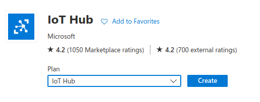

**5.**	Fill the form as the one shown below:


|**Resource**|**Definition**|
|-|-|
|**Subscription**|Subscription to use for your IoT hub.|
|**Resource Group**|New resource group or use an existing one.|
|**Region**|Region in which you want your hub to be located. Select the location closest to you|
|**IoT Hub Name**|Name for your IoT Hub. This name must be globally unique|

**6.** Click **Next: Networking**. Select the connectivity method and click **Next: Management**.


**7.** Fill the form like below depending on your choices and then click on **Next: Add-ons**.

**Note:** Make sure to enable the Shared access policy. 

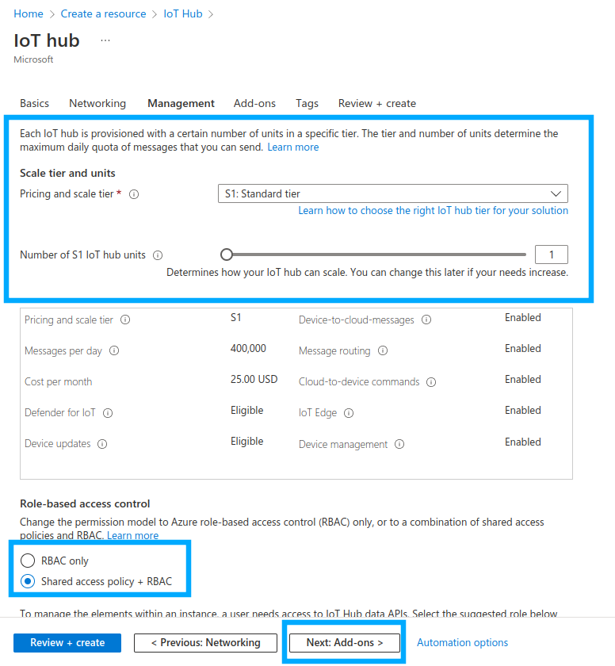

| Resource  | Definition  |
|---|---|
| **Pricing and scale tier** | Choose from several tiers depending on how many features you want and how many messages you send through your solution per day. |
| **IoT Hub units** | The number of messages allowed per unit per day depends on your hub's pricing tier. For example, if you want the IoT hub to support ingress of 700,000 messages, you choose two S1 tier units. |
| **Advanced/Device-to-cloud partitions** | This property relates the device-to-cloud messages to the number of simultaneous readers of the messages.  |

The number of units plays an important role in quotas and throttling.

### Example

|**Throttle**|**S1**|**S2**|**S3**|
|-|-|-|-|
|**Device-to-Cloud sends**|12 /sec/unit|120 /sec/unit|6,000 /sec/unit|
|**Number of messages per day**|400,000|6,000,000|300,000,000|

The number of devices depends on the subscriptions that you buy. For more information, see  [the pricing details](https://azure.microsoft.com/en-gb/pricing/details/iot-hub/).

This means that in order to reach a throughput of 300 uplinks/sec you need a minimum S1 subscription with 25 units (25 x 12 = 300).

The minimum D2C is 100 msg/sec, so even with S1 and 1 unit you can send 100 uplinks/sec. Starting with S1 and 9+ units, you can get above 100 msg/sec.

Another limitation is on the registry operation. Devices can be dynamically created on the first uplink they send to the Actility Azure connection. If there are many runtime create operations, it could take time to register the Devices.

For example, to register 10k Devices at runtime simultaneously, it can take 100 min using a S1 subscription with one unit (10,00/100) and 4 min on a S1 subscription with 25 units (10,000/(25*100)).

The following table shows the enforced throttles. Values refer to an individual hub.

| Throttle | S1  |  S2 |  S3 |
|---|---|---|---|
| Pricing and scale tier <div class="custom-block tip"><p class="custom-block-title">NOTE</p><p>This implies on individual or bulk import/export operations</p></div>| 1.67/sec/unit (100/min/unit)  | 1.67/sec/unit (100/min/unit)  | 83.33/sec/unit (5,000/min/unit)  |

**8.** Inside **Tags** tab, you can add any additional service provided by Microsoft if needed (not mandatory for Thingpark).

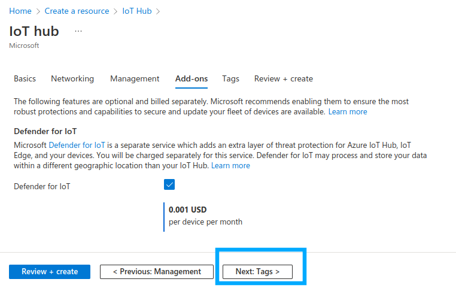

After choosing your services, click on **Next: Tags**.

**9.** You can add one or several tags. Then, click on **Next: Review + create**.

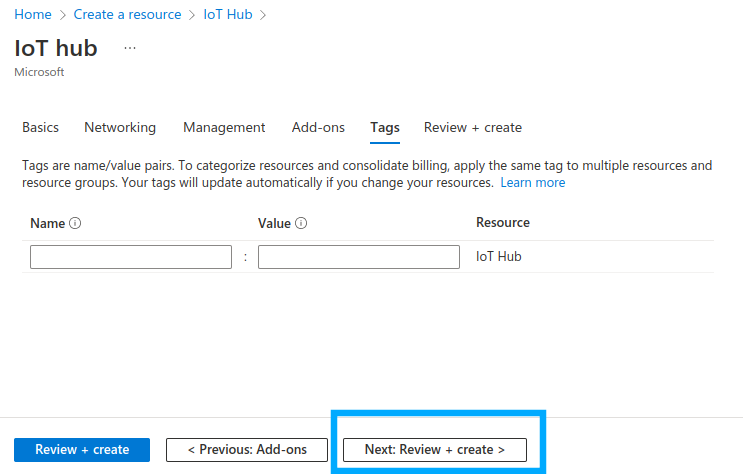

**10.** After reviewing the details, click on **Create**.

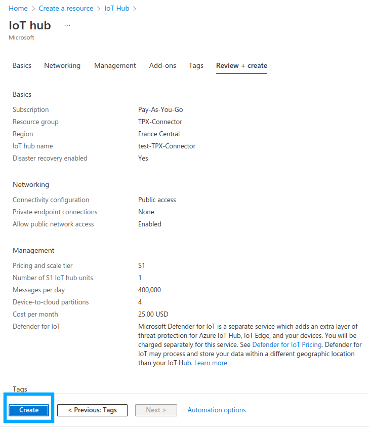

**11.** Wait until the Hub deployment is complete.

**12.** Click **Go to resources** in the screen that displays.

* The IoT Hub is created. You can see the details of your configuration as displays in the following screen.

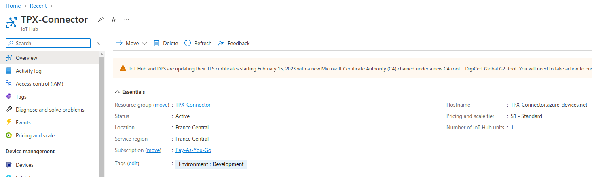

## Collecting Expected Information on Azure

### Parameters required

<a id="Parameters"></a>

| Parameter                       | Definition                                                                                                                                                                                                                                                                                                                                                                                                                                                                                                                                                                                                                                                                                                                                                                                                                                                                                                                                                                                                                                                                                                                                                                                                                                                                                                                                                                                                                                                                                                                                                                                                                                                                                                                                                                                                                                                                                                                                                                                                                                                                                                                                                                                                                                                                                                                                                                                                                                                                                                                                                                                                                                                                                           |
|---------------------------------|------------------------------------------------------------------------------------------------------------------------------------------------------------------------------------------------------------------------------------------------------------------------------------------------------------------------------------------------------------------------------------------------------------------------------------------------------------------------------------------------------------------------------------------------------------------------------------------------------------------------------------------------------------------------------------------------------------------------------------------------------------------------------------------------------------------------------------------------------------------------------------------------------------------------------------------------------------------------------------------------------------------------------------------------------------------------------------------------------------------------------------------------------------------------------------------------------------------------------------------------------------------------------------------------------------------------------------------------------------------------------------------------------------------------------------------------------------------------------------------------------------------------------------------------------------------------------------------------------------------------------------------------------------------------------------------------------------------------------------------------------------------------------------------------------------------------------------------------------------------------------------------------------------------------------------------------------------------------------------------------------------------------------------------------------------------------------------------------------------------------------------------------------------------------------------------------------------------------------------------------------------------------------------------------------------------------------------------------------------------------------------------------------------------------------------------------------------------------------------------------------------------------------------------------------------------------------------------------------------------------------------------------------------------------------------------------------|
| ```Application Name```          | Name of the application that you want to register (Editable).                                                                                                                                                                                                                                                                                                                                                                                                                                                                                                                                                                                                                                                                                                                                                                                                                                                                                                                                                                                                                                                                                                                                                                                                                                                                                                                                                                                                                                                                                                                                                                                                                                                                                                                                                                                                                                                                                                                                                                                                                                                                                                                                                                                                                                                                                                                                                                                                                                                                                                                                                                                                                                        |
| ```Content Type```              | The type of encoding used to report device data from ThingPark Enterprise to your Cloud application.<ul><li> JSON encoding is used to report uplink messages, that is from ThingPark Enterprise to the Cloud platform. The format depends on the content type configured in the TPE application: "JSON legacy document" or "JSON enriched document".</li><ul><li><b>JSON enriched document:</b> This format is set by default when Cloud applications are created up from ThingPark Enterprise 6.1 or newer. It is proposed by default in the ThingPark Enterprise user interface.</li><ul><li>When the JSON enriched document is used, ThingPark Enterprise sends the following reports to the Cloud application: uplink frame reports, Downlink Sent Indication reports, Location reports and Device Notification reports. To learn more, check the [documentation](https://docs.thingpark.com/thingpark-enterprise/Content/6.1-TPE-UG/TPE-LRC-AS-tunnel-interface-dev-guide.htm).</li><li>Decoded payloads are reported when available: <p><b>Note:</b> This only concerns uplink frame reports.</p> </li><ul><li>Raw encoded payload is reported in the “payload_hex” field (hexadecimal string).</li><li>Decoded payload is reported in the “payload” (object).<br><br /> <b>Note:</b> Payload decoding feature is supported for device models that have an associated payload driver in their device profiles: Abeeway, Adeunis, NKE/Watteco, DecentLab, Netvox, etc.. The list is growing very fast, contact your support team in case ThingPark does not yet have the proper driver for your device model. <br/><br></li></ul></ul><li><b>JSON legacy document:</b> This is the mode used before the released Thingpark Enterprise 6.1. For sake of backward compatibility, this mode is maintained for applications created before TPE upgrade to release 6.1. However, you can change to JSON enriched if you want to activate the payload decoding feature between TPE and Application Servers. Only uplink messages are transmitted to the Application Server. The payload is reported in raw encoded format, that is not decoded format as opposed to JSON enriched mode.</li></ul></ul></li>Downlink messages are sent by Cloud applications (AWS, MQTT, Azure, Watson and ThingWorx) and are therefore not impacted by the Content Type setting. For information, the downlink payload is submitted by the Application Server to ThingPark Enterprise. It can use raw encoded payload or decoded payload regardless the value of the Content Type." To learn more, click the <a href="https://docs.thingpark.com/thingpark-x/1.3/Overview/">ThingPark_X_IoT_Flow_User_Guide</a>.</ul> |
| ```Downlink Port```             | If downlink is supported and enabled, indicates which LoRaWAN® port should be used to send the downlink to the device.                                                                                                                                                                                                                                                                                                                                                                                                                                                                                                                                                                                                                                                                                                                                                                                                                                                                                                                                                                                                                                                                                                                                                                                                                                                                                                                                                                                                                                                                                                                                                                                                                                                                                                                                                                                                                                                                                                                                                                                                                                                                                                                                                                                                                                                                                                                                                                                                                                                                                                                                                                               |
| ```Host Name```                 | The Hostname of your Azure IoT Hub account. Example: myaccountname.azure-devices.net                                                                                                                                                                                                                                                                                                                                                                                                                                                                                                                                                                                                                                                                                                                                                                                                                                                                                                                                                                                                                                                                                                                                                                                                                                                                                                                                                                                                                                                                                                                                                                                                                                                                                                                                                                                                                                                                                                                                                                                                                                                                                                                                                                                                                                                                                                                                                                                                                                                                                                                                                                                                                 |
| ```Shared Access Policy Name``` | The shared Access Policy Name within the Azure IoT Hub account. Example: iothubowner.                                                                                                                                                                                                                                                                                                                                                                                                                                                                                                                                                                                                                                                                                                                                                                                                                                                                                                                                                                                                                                                                                                                                                                                                                                                                                                                                                                                                                                                                                                                                                                                                                                                                                                                                                                                                                                                                                                                                                                                                                                                                                                                                                                                                                                                                                                                                                                                                                                                                                                                                                                                                                |
| ```Primary key```               | A valid key for the selected access policy within the Azure IoT Hub account.                                                                                                                                                                                                                                                                                                                                                                                                                                                                                                                                                                                                                                                                                                                                                                                                                                                                                                                                                                                                                                                                                                                                                                                                                                                                                                                                                                                                                                                                                                                                                                                                                                                                                                                                                                                                                                                                                                                                                                                                                                                                                                                                                                                                                                                                                                                                                                                                                                                                                                                                                                                                                         |
| ```IoT Hub Tier```              | <ul><li>The selected IoT Hub Tier in your Azure IoT Hub account (mandatory and editable).</li><ul><li>The default value is “Free (1)”.</li><li>The possible values are "Free (F1)", "Basic level 1 (B1)", "Basic level 2 (B2)", "Basic level 3 (B3)", "Standard level 1 (S1)", "Standard level 2 (S2)" and "Standard level 3 (S3)"</li></ul></ul>                                                                                                                                                                                                                                                                                                                                                                                                                                                                                                                                                                                                                                                                                                                                                                                                                                                                                                                                                                                                                                                                                                                                                                                                                                                                                                                                                                                                                                                                                                                                                                                                                                                                                                                                                                                                                                                                                                                                                                                                                                                                                                                                                                                                                                                                                                                                                    |
| ```IoT Hub Units```             | <ul><li>The number of units associated with your Azure IoT Hub account. The Free IoT Hub account (mandatory and editable).</li><ul><li>The default value is 1.</li><li>F1: 1</li><li>B1/B2/S1/S2: [1..200]</li><li>B3/S3: [1..10]</li></ul><li>The Free IoT Hub Tier can have only 1 unit. A level 1 or 2 IoT Hub Tier can have up to 200 units. A level 3 IoT Hub Tier can have up to 10 units.</li></ul>                                                                                                                                                                                                                                                                                                                                                                                                                                                                                                                                                                                                                                                                                                                                                                                                                                                                                                                                                                                                                                                                                                                                                                                                                                                                                                                                                                                                                                                                                                                                                                                                                                                                                                                                                                                                                                                                                                                                                                                                                                                                                                                                                                                                                                                                                           |

For detailed information on Microsoft Azure IoT configuration and parameters, see the <a href="https://docs.microsoft.com/en-us/azure/iot-hub/">Azure iot hub documentation</a>.

**1.**	Login to the [Azure Portal](https://portal.azure.com/#home) and .

**2.**	On the main page you should see all the resources that you have created. This looks like the following screen.

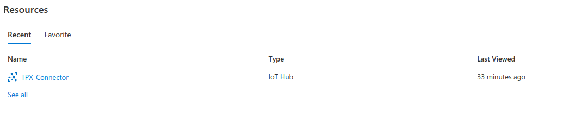

**3.**	Select the IoT Hub that you have created, that is **TPX-Connector** in the screenshot bel.

**4.**	On the Overview page you should see the **Hostname**, **Pricing and scale tier** and **Number of IoT Hub units**. This looks like the following screen:


**5.** Go to the “Shared access policies” page under "Security settings" in the panel to the left.
      You will find a list of already existing policies by default as shown below:

<b>Note:</b> Make sure that the "Connect using shared access policies" option is set to "Allow"

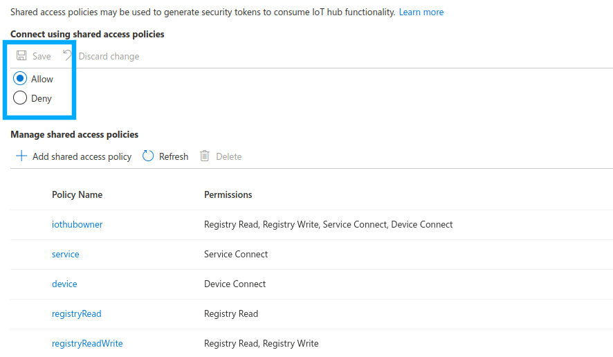

* Using an existing shared access policy.

    * Select **iothubowner** which is the **Shared Access Policy Name**.
    * A screen displaying the **iothubowner** shared strategy appears on the right side of your screen:
      You can now collect the **Primary key** or **Secondary key**.

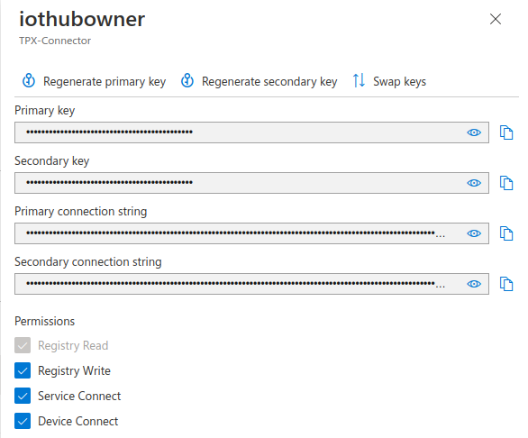

* Alternatively, you can create a new "Shared Access Policy".

    * Select **Add shared access policy**.

    * In a similar screen as in the previous procedure that displays, choose a name for the Shared strategy. Type **actility-policy** for example.

    * Ensure that the following permissions are allowed:

        * Registry read/write.

        * Device connect.

    * Ensure that the following permissions are allowed:

        * Your new strategy is displayed in the Strategy list.

    * Ensure that the following permissions are allowed:

        * In the screen that appears on the right side of your screen the Shared Access Policy displays the **sharedAccessKeyName and Primary/Secondary key**. You will apply these keys to set the connection. See <a href="#verifying-connection-successfull">Verifying that the connection is successful</a>.


## Creating a Connection From UI

Prior to connecting a Cloud application to a ThingPark Enterprise platform you need to be aware of the application provisioning constraints.&nbsp;To learn more, click <a href="#constraints">this topic</a>.

You must have an Azure IoT Hub account prior to connecting your Azure IoT Hub application.

You also need to know the parameters that are required to perform this task. To learn more, click  <a href="#Parameters" class="MCXref xref">Parameters required for connecting to an Microsoft Azure Cloud computing service (IoT Hub) application</a> in this topic.

**1.** On the panel to the right click on: Connections -> Create.

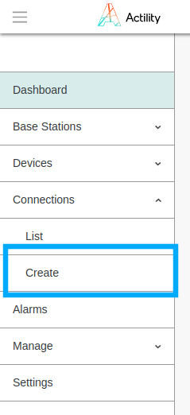


**2.** Choose ThingPark X IoT Flow as a type. 

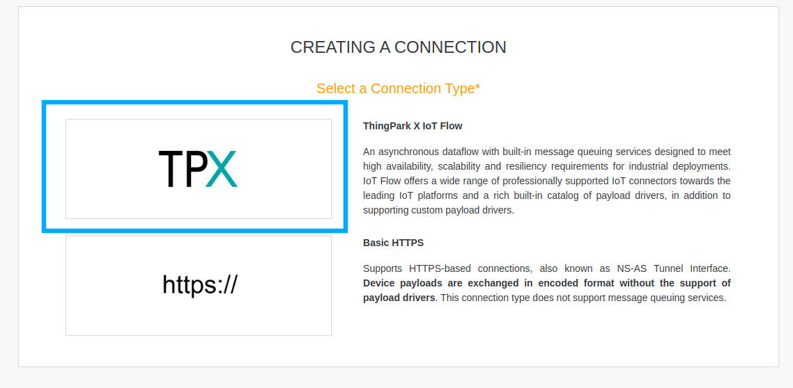

**3.** Choose "Azure IoT Hub" connection.

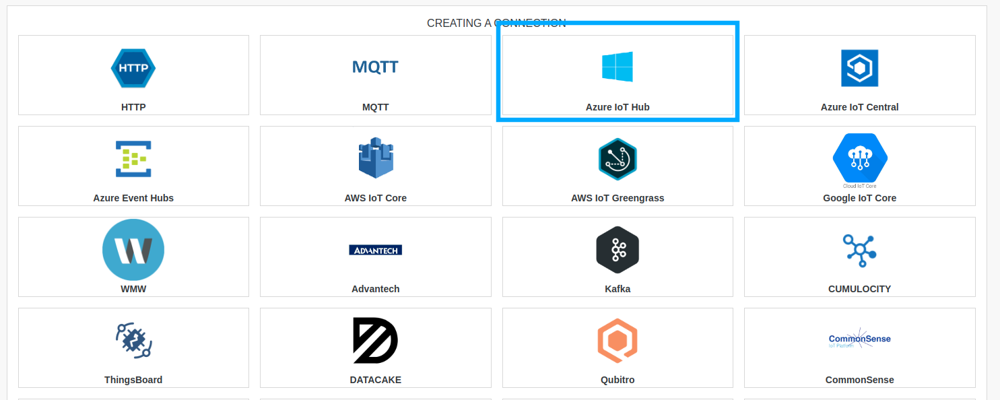

::: tip Note
The application creation form is the same for a JSON enriched document as for a JSON legacy document.
:::

**4.** Fill in the form as in the example below depending on the parameters set in your Azure application instance.

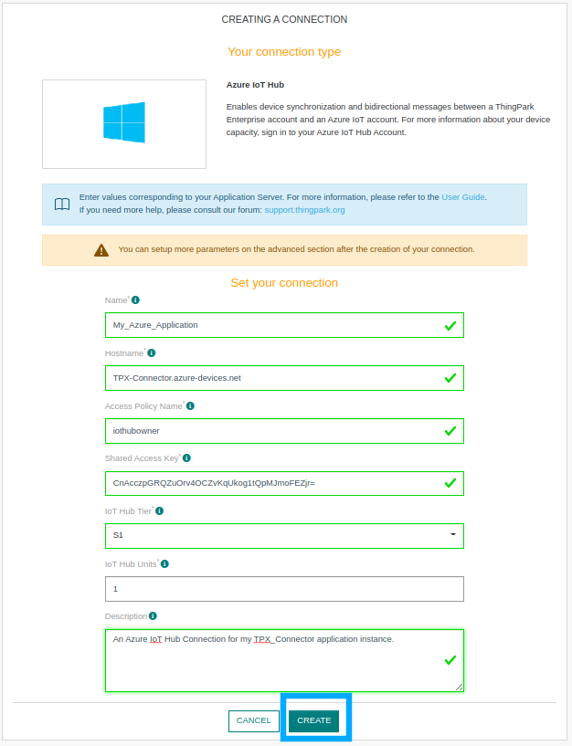

::: tip Note
Parameters marked with * are mandatory.
:::

**5.** Click on "Create".

* A notification appears on the upper right side of your screen to confirm that the application has been created.

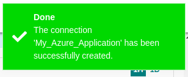

**6.** You will be redirected to the Connection information details.

## Creating a Connection With API

The Actility Azure connection uses AMQPS protocol.

You need to create the connection prior to creating the flow.


The creation of a connection establishes a link from ThingPark Wireless to the cloud provider that you want to associate a Device with. The link can be used to transport any Uplink regardless the DevEUI parameter.

::: tip Note
The DevEUI must be always in upper case.

Azure IoT Hub allows only **one** active connection per device.
:::


To do this, you need to use the following endpoints.
* `POST/connections` for creation
* `PUT/connections` for modification
* `DELETE/connections` for deletion

::: tip Note
When you update a configuration property on a connection, you must provide the whole configuration properties again.
:::

Example of the creation of a connection:

```json
POST /connections

{
    "connectorId": "actility-azure-iot",
    "name": "Azure Connection",
    "configuration": {
        "description": "Azure Datacenter",
        "hostName": "demo.azure-devices.net",
        "sharedAccessKeyName": "iothubowner",
        "sharedAccessKey": "ZNPDmKmLc36xgSG8LWMPiPZ9YR6ezaeUtiZGYImH4=",
        "iotHubTier": "S1",
        "iotHubUnits": 25
    }
}
```

The following table lists the expected results of the properties when applied:

| Property | Expected results                                           |
|---|------------------------------------------------------------|
| ``connectorId``  | Set to **actility-azure-iot**.                             |
| ``configuration/hostName``  | Defines the host of the Azure IoT Hub to use.              |
| ``configuration/sharedAccessKeyName``  | Shared Access Policy name for accessing the Azure IoT Hub. |
| ``configuration/sharedAccessKey``  | Primary or Secondery key for accessing the Azure IoT Hub.  |
| ``configuration/iotHubTier``  | Pricing and scale tier of the Azure IoT Hub.               |
| ``configuration/iotHubUnits``  | Number of IoT Hub units of the Azure IoT Hub.              |

::: warning Important note
Not all the properties are presented in this example. You can check the rest of these properties in the [common parameters section](../../Getting_Started/Setting_Up_A_Connection_instance/About_connections.html#common-parameters).
:::

##  Limitations

<a id="constraints"></a>

Currently, the Actility Azure connection supports up to 32768 devices if the downlinks are enabled and 65535 devices if downlinks are not enabled, all in the same IoT Hub.
This limitation is due to the maximum number of Device-to-cloud telemetries for uplinks and Cloud-to-device telemetries for downlinks that can be opened concurrently by the Azure SDK.

At start-up, all Devices in the selected IoT Hub will be listed and AMQP connections/links will be opened. We support only Device-to-cloud sends telemetry (D2C) for uplinks and Cloud-to-device sends (C2D) for downlinks.

Other Azure operations like File upload, Direct methods or Device Twin are not supported.  

All other limits are imposed by Azure based on the subscription and the number of units.  

To select the subscription that fits your case check the [IoT Hub limits](https://docs.microsoft.com/en-us/azure/azure-resource-manager/management/azure-subscription-service-limits#iot-hub-limits) documentation.  

The Device Identifier (``DevEUI``) must be in uppercase on the Azure IoT Hub side.  

In case you try to use the same IoT Hub (same hostname) at the same time while using multiple connections, those connections will collide on downstream links. (Azure allows only one active downstream link per device). 

A **Link errors** event will be stored in the Event table. Each connection will retry to acquire downstream links each 1 min, but the collision will happen until only one active connection per IoT Hub is left. We strongly recommend that you disable the downlink mechanism (set ``downlinkEnabled=false``).

Another downside of this collision is that upstream links will not be able to enforce proper rate limiter when sending uplinks. 

The reason is that  the rate limiter is not shared between connections and each connection will push uplinks at a maximum possible rate according to the IoT Hub subscription.

However, at some point it may exceed the global IoT Hub rate per minute and uplinks may start to be Rejected by Azure.

A way to avoid downstream links collision would be to set ``downlinkEnabled = false`` on most of the concurrent connections, and leave it set to true (default value) only on one connection. Thus, uplinks can be pushed with many connections, and downlinks can be received on one connection only.

In case of setting ``downlinkEnabled = false``, Azure Connection will not list any existing devices in the IoT Hub and will create lazy upstreams on first incoming uplink from a device.

##  Troubleshooting

[comment]: <> (<a id="troubleshooting"><a/>)

The following table lists the common error codes returned by Azure IoT Hub AMQP Broker:

| Error code | Error description | Comments |
| ---------- | ----------------- | -------- |
| ```amqp:internal-error```   | Another AMQP Client has opened a Receive Link | Device used by another AMQP client. The latter tries to solve this by closing the link to the device. <br /><br> Setting <code>downlinkEnabled = false</code> on the concurrent connections to same IoT Hub solves the issue <br /><br> Check ‘Link errors’ events in the events log. |
| ```amqp:not-allowed``` |  | Device used by another AMQP client, like the above error code |
| ```amqp:not-found```   |  | Device not found due to case sensitive device id or because it is not anymore on the IoT Hub. <br /><br>There is no action to perform. The device links will be closed and removed from the Azure Connection.<br /><br>IoT-Flow uses uppercase deviceEUI / device id. |
| ```amqp:internal-error```    | <code>Device Not Found ErrorCode:DeviceNotFound ...</code> | Device deleted manually from the Cloud side. Azure will close the device links after 1-2 minutes. <br><br>  There is no action to perform. The device links will be closed and removed from the Azure Connection. |
| ```amqp:link:detach-forced```    | Server Busy. Please retry operation | When Azure is overloaded, it will detach the device links. The device links will be retried automatically every 1 min. |
| ```amqp:resource-limit-exceeded```    | <code>Total number of messages on IotHub '...' exceeded the allocated quota. Max allowed message count : '...', current message count : '...'. Send and Receive operations are blocked for this hub until the next UTC day. Consider increasing the units for this hub to increase the quota ...</code> | When the daily quota of messages is reached, the Azure IoT Hub rejects new message exchange. The Azure connection will close. The supervisor will retry the connection based on reconnectStrategy. <br />However, until the next day this connection will not be able to re-open it successfully. If you need to send more messages until the next day, you need to manually increase the hub units from your IoT Hub Dashboard. Update the connection configuration with the new iotHubUnits number. |
| ```Device number limit exceeded```    | <code>Total number of devices IotHub '...' exceeded the maximum that can be allocated.</code>  | Maximum number of devices that can be provisioned are 32768 devices if the downlinks are enabled and 65535 devices if downlinks are not enabled. |
| ```IotHubQuotaExceeded```    | <code>Total number of messages on the IoT Hub exceeded the allocated quota. </code>  | Increase units for this hub to increase the quota.|

##  Verifying that the connection is successful

First, you need to collect your connection string from the Azure IoT Hub you created before.

**1.**	In the Welcome page choose the latest **IoT-Hub** resource that you have created.

**2.**	In the **Shared access policies** page, choose the latest policy that you have created.

**3.**	Copy the **IoT Hub connection string** of the primary key.

**Example** of connection string: ```HostName=<IoT Hub name>.azure-devices.net;SharedAccessKeyName=iothubowner;SharedAccessKey=<primary key>```

## Note: Certiticate Migration
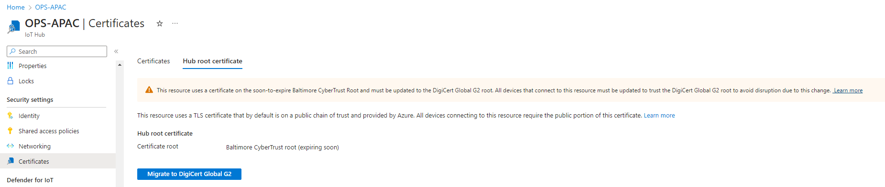

Azure IoT Hub use TLS certificates issued by the Baltimore CyberTrust Root, which expires in 2025. Starting in February 2023, all IoT hubs in the global Azure cloud will migrate to a new TLS certificate issued by the DigiCert Global Root G2.

Actility is aware of this and has dome some tests around this certification migration follow Azure recommendations.
Our connecter is compatible with the expected certificate.

### Using Azure IoT Explorer

**1.** Install the latest [Azure IoT Explorer](https://github.com/Azure/azure-iot-explorer/releases) according to your operating system: Select file with **.msi** extension for Windows, **.deb** extension for Linux.

**2.** Once application is installed, open it and click on **Add connection**.
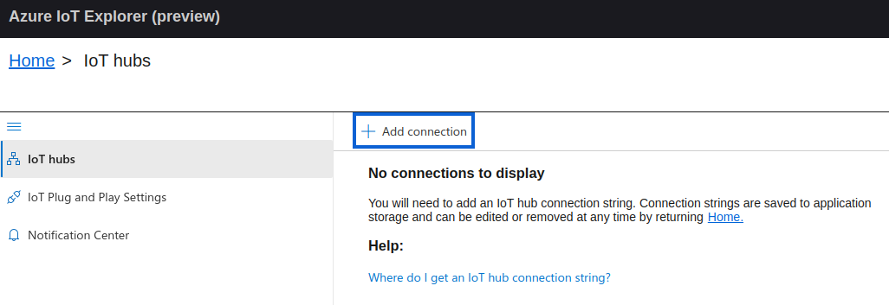

**3.** Enter **Connection string** of the **IoT Hub** you wish to connect to, and click on **Save**.

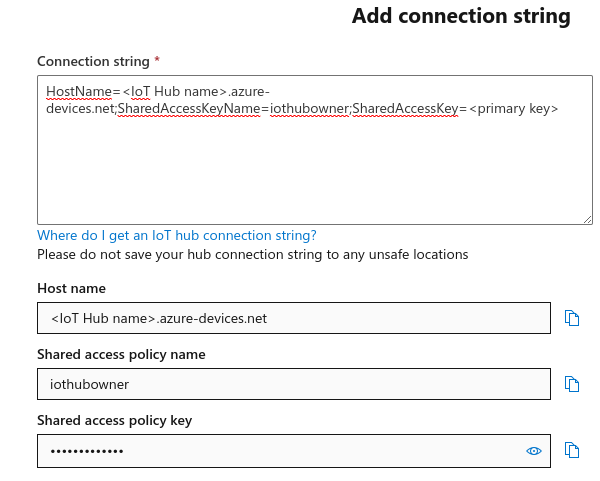

**4.** All your **devices** are now listed in **IoT Explorer**, you can click on a device ID to inspect it, and monitor telemetry.

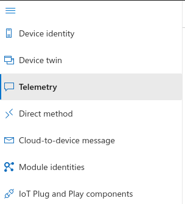


### Using Azure CLI
<a id="verifying-connection-successfull"></a>

**1.**	Install the latest [Azure CLI](https://docs.microsoft.com/en-us/cli/azure/install-azure-cli?view=azure-cli-latest).

**2.**	Install the [Azure IoT Extension for Azure CLI](https://github.com/Azure/azure-iot-cli-extension). Type:

```az extension add --name azure-iot```

**3.**	Run the following command to monitor Device events:

```az iot hub monitor-events -n {iothub_name} --login {iothub_connection_string} -d {device_id}```

#### Example

```az iot hub monitor-events -n iot-hub-tests --login HostName=iot-hub-tests.azure-devices.net;SharedAccessKeyName=iothubowner;SharedAccessKey=u8OCaO4nfJR0PAe8bHjMpKAzA3D0MDz9d8+pPwzMpaS= -d 17zp509311000493```

* You should see something like this:


