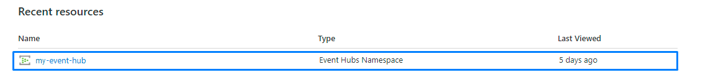
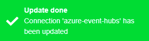

# CREATING AN AZURE EVENT HUBS CONNECTION

This setup is intended to be a minimal setup example to get the Azure Event Hubs connector working.
The Azure Event Hubs connector requires the creation of an Azure Event Hubs account upfront. This account can be either a free or a paid account.
Check [Azure Event Hubs pricing](https://azure.microsoft.com/fr-fr/pricing/details/event-hubs/) and [Event hubs limits](https://docs.microsoft.com/en-us/azure/event-hubs/event-hubs-quotas) to decide which subscription fits your needs.

## Collecting Expected Information

<a id="AZUREparam">**Parameters required**</a>

| UI Field | Description |
| ------ | ----------- |
| **Hostname** | The Hostname of your Azure Event hub account. Example: myaccountname.azure-devices.net. |
| **Shared access key** | The access key from your Azure Event hub. |
| **Shared access key name** | Name of the access key. |
| **Event Hub units** | The number of units associated with your Azure Event Hubs account. |

For detailed information on Microsoft Azure Event Hubs configuration and parameters, see the [Azure Event Hubs documentation](https://docs.microsoft.com/fr-fr/azure/event-hubs/)

1. Connect to the [Azure Portal](https://portal.azure.com/#home).

2. On the main page you should see all the resources that you have created. This looks like the following screen.



3. Select the Event Hubs that you have created, in this case **tpx-event-hubs**.

4. On the Overview page you should see the **Hostname** as well as other informations.


5. In the menu, click on the **Shared access policy** under the Settings section.


6. Select an existing access or create one. In this example, it is **RootManageSharedAccessKey** which is your **Shared access key name**.


7. A screen displays on the right side of your screen where you can copy the **Primary key** which is your **Shared access key**.


<!-- 8. <TODO> How to collect EventHubUnit. -->

### Port

When creating an Azure Event Hubs connection with the UI, you need to provide the **hostname** which is composed of the name and port used.

The port used changes depending on the protocol used. In this case, you must used the **9093** port because the protocol used is Kafka.

In our example, it means that our full hostname will be **my-event-hub.servicebus.windows.net:9093**.

| Protocol | Ports | Details |
| -------- | ----- | ------- |
| **Kafka** | 9093 | See [Use Event Hubs from Kafka applications](https://docs.microsoft.com/en-us/azure/event-hubs/event-hubs-for-kafka-ecosystem-overview) |

## Creating a Connection From UI

You must have an active AZURE account prior to creating an Azure Event Hubs connection in ThingPark.

You also need to know the parameters that are required to perform this task. To learn more, check [Parameters required for connecting to an Azure Event Hubs platform](#AZUREparam).

1. Click Connections -> Create -> ThingPark X Iot Flow.


Then, a new page will open. Select the connection type : Azure Event Hubs.


2. Fill in the form as in the example below and click on **Create**.


::: tip Note
Parameters marked with * are mandatory.
:::

* A notification appears on the upper right side of your screen to confirm that the application has been created.


4. After creating the application, you will be redirected to the application details.


**Changing the Settings after Creation**

You can change the settings parameters such as the email or the password after the creation of the Azure Event Hubs application.

To do this, proceed as follows:

1. Select the Azure Event Hubs application for which you want to change one or several parameters.

2. In the application information dashboard, click on the **Edit** button corresponding to the parameter you want to change.


3. Enter the new value, and click on the **Confirm** icon.


* The Confirmation window displays,


* A notification will inform you that the parameter is updated.


## Creating a Connection With API

The creation of a connection establishes a bidirectional messaging transport link between ThingPark X IoT Flow and the cloud provider. Events and commands from multiple Devices will be multiplexed over this messaging transport link.

To do this, you need to use the **Connections** group resource:

* `POST/connections` to create a new Connection instance
* `PUT/connections` to update a Connection instance
* `DELETE/connections` to delete a Connection instance

::: tip Note
We follow the REST-full API pattern, when updating configuration properties for a connection resource. Thus, you must also provide the whole configuration again.
:::

Example for creation of a new connection instance :

```json
POST /connections
{
    "connectorId": "actility-azure-event-hub",
    "name": "My Azure EventHub Connection",
    "configuration": {
        "hostName": "my-event-hub.servicebus.windows.net:9093",
        "sharedAccessKeyName": "RootManageSharedAccessKey",
        "sharedAccessKey": "cTvlsUYXgf....KNX/9f9xt+Jo=",
        "uplinkTopicPattern": "actility_uplink_topic",
        "downlinkTopicPattern": "actility_downlink_topic"
    }
}
```

| JSON Field | Description |
| ------ | ----------- |
| ```connectorId``` | Must be set to actility-azure-event-hub for Azure Event Hubs platform. |
| ```hostName``` | The Hostname of your Azure IoT Hub account. Example: myaccountname.azure-devices.net |
| ```sharedAccessKeyName``` | Name of the access key. |
| ```sharedAccessKey``` | The access key from your Azure hub. |
| ```uplinkTopicPattern``` | Defines a pattern of topic for the Uplink. |
| ```downlinkTopicPattern``` | Defines a pattern of topic for the Downlink. |
| ```eventHubUnits``` | The number of units associated with your Azure Event Hubs account. |

::: warning Important note
All properties are not present in this example. You can check the rest of these properties in the [common parameters section](../../Getting_Started/Setting_Up_A_Connection_instance/About_connections.html#common-parameters).
:::

## Limitations

See [here](https://docs.microsoft.com/en-us/azure/event-hubs/event-hubs-quotas) the documentation concerning Azure Event Hubs limitations.

## Troubleshooting

Please refer to the [documentation](https://docs.microsoft.com/en-us/azure/event-hubs/event-hubs-messaging-exceptions) for more informations.

### Consumer group limit

Event Hubs has a limit of 40 throughput units per Event Hub. When you attempt to create more, you receive a [QuotaExceededException](https://docs.microsoft.com/en-us/dotnet/api/microsoft.servicebus.messaging.quotaexceededexception?view=azure-dotnet).

:::tip Note
If you're having trouble configuring your Azure Event Hubs account, you can read the [frequently asked questions](https://docs.microsoft.com/en-us/azure/event-hubs/event-hubs-faq)
:::

### Connection uplink lost

Sometimes, the following error message can appear:

```
error - Connection uplink lost: Uplink lost: Error reading field 'auth_bytes': Bytes size -1 cannot be negative
```

This may indicate that you have written a wrong hostname, so you should check it to make sure there isn't any typo in it.

## Displaying information to know if it worked

In order to display the informations concerning your connection, you can use a Visual Studio Code extension or use the Azure Cli.

### Visual Studio Code

1. Open [Visual Studio Code](https://code.visualstudio.com/) and click on the extension menu.


2. Search for the Azure Event Hub Explorer extension and install it so you can test your connection.


3. Click on View -> Open a command palette.


4. Enter and select **EventHub: Select Event Hub**.


* You will need to select the right subscription. Select the one corresponding to your Uplink topic pattern. For this examplen, it is custo_uplink_hub.


5. Click again on View -> Open a command palette and select **EventHub: Start Monitoring Event Hub Message**.


6. You should see the upcomming messages in the output console.


