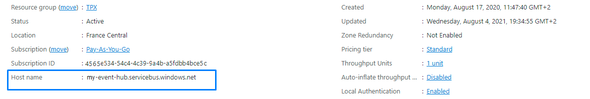
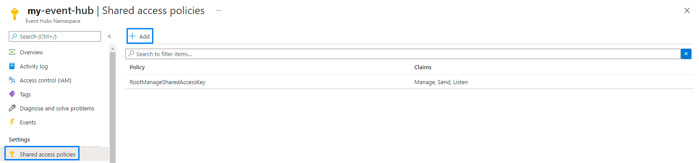
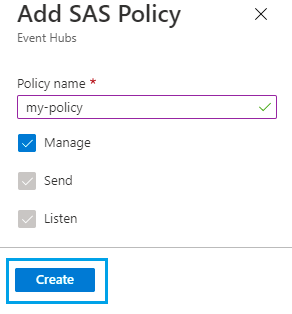
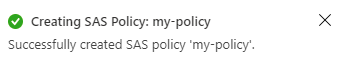
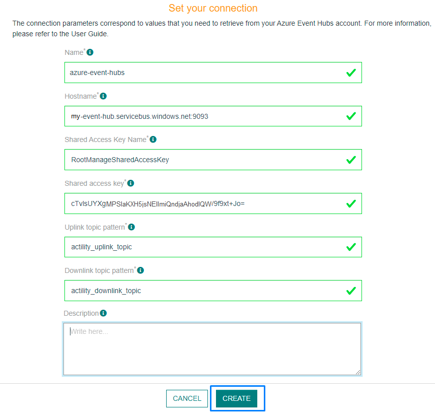

# CREATING AN AZURE EVENT HUBS CONNECTION

This setup is intended to be a minimal setup example to get the Azure Event Hubs connector working.
The Azure Event Hubs connector requires the creation of an Azure Event Hubs account upfront. This account can be either a free or a paid account.
Check [Azure Event Hubs pricing](https://azure.microsoft.com/fr-fr/pricing/details/event-hubs/) and [Event hubs limits](https://docs.microsoft.com/en-us/azure/event-hubs/event-hubs-quotas) to decide which subscription fits your needs.

## Collecting Expected Information

<a id="AZUREparam">**Parameters required**</a>

| UI Field | Description |
| ------ | ----------- |
| **Application Name** | Name of the application that you want to register (Editable). |
| **Hostname** | The Hostname of your Azure IoT Hub account. Example: myaccountname.azure-devices.net. (Editable) |
| **Shared Access Key Name** | Name of the access key. (Editable) |
| **Shared Access Key** | The access key from your Azure hub. (Editable) |
| **Uplink Topic pattern** | Defines a pattern of topic for the Uplink. (Editable) |
| **Downlink Topic pattern** | Defines a pattern of topic for the Downlink. (Editable) |
| **Description** | Any useful information to describe the connection. (Editable) |

For detailed information on Microsoft Azure Event Hubs configuration and parameters, see the [Azure Event Hubs documentation](https://docs.microsoft.com/fr-fr/azure/event-hubs/)

### Collecting the hostname and access keys

1. Connect to the [Azure Portal](https://portal.azure.com/#home).

2. On the main page you should see all the resources that you have created. This looks like the following screen.


3. Select the IoT Hub that you have created, in this case TPX-Connector.

4. On the Overview page you should see the **Hostname** as well as other informations.



5. In the menu, click on the **Shared access policy** under the Security section.


6. Select an existing access. In this example, it is iothubowner.


7. A screen displays on the right side of your screen where you can copy the **access keys** needed for the creation of the connection.


:::warning Warning
The following section helps you create a new access. Skip this part if you already have one and follow the section above.
:::

### Creating access

1. In the **shared access policy** section, click on **Add shared access policy**.



2. A window will open on the right side. Enter the name of the new policy, select the permissions and click **Add**. You must select at least the following permissions:

* Registry read
* Registry write
* Device connect



* A notification will appear on the upper right corner of your screen.



Your new policy has been created. Open it and make sure the access keys are generated.

### Collecting the uplink topic pattern and downlink topic pattern.

## Creating a Connection With API

The creation of a connection establishes a bidirectional messaging transport link between ThingPark X IoT Flow and the cloud provider. Events and commands from multiple Devices will be multiplexed over this messaging transport link.

To do this, you need to use the **Connections** group resource:

* `POST/connections` to create a new Connection instance
* `PUT/connections` to update a Connection instance
* `DELETE/connections` to delete a Connection instance

::: tip Note
We follow the REST-full API pattern, when updating configuration properties for a connection resource. Thus, you must also provide the whole configuration again.
:::

Example for creation of a new connection instance :

```json
POST /connections
{
    "connectorId": "actility-azure-event-hub",
    "name": "Test Azure EventHub Connection",
    "configuration": {
        "hostName": "tpx-event-hub.servicebus.windows.net:9093",
        "sharedAccessKeyName": "RootManageSharedAccessKey",
        "sharedAccessKey": "cTvlsUYXgfCNU7ngGPPmlYnqkdAhpdvKNX/9f9xt+Jo=",
        "uplinkTopicPattern": "dev_uplink_hub",
        "downlinkTopicPattern": "dev_downlink_hub"
    }
}
```

| JSON Field | Description |
| ------ | ----------- |
| ```connectorId``` | Must be set to actility-azure-event-hub for AZURE Event Hubs platform. |
| ```hostName``` | The Hostname of your Azure IoT Hub account. Example: myaccountname.azure-devices.net |
| ```sharedAccessKeyName``` | Name of the access key. |
| ```sharedAccessKey``` | The access key from your Azure hub. |
| ```uplinkTopicPattern``` | Defines a pattern of topic for the Uplink. |
| ```eventHubUnits``` | Number of units. |

::: warning Important note
All properties are not present in this example. You can check the rest of these properties in the [common parameters section](../../Getting_Started/Setting_Up_A_Connection_instance/About_connections.html#common-parameters).
:::

## Creating a Connection From UI

You must have an active AZURE account prior to creating a HERE connection in ThingPark.

You also need to know the parameters that are required to perform this task. To learn more, check [Parameters required for connecting to an Azure Event Hubs platform](#AZUREparam).

1. Click Connections -> Create -> ThingPark X Iot Flow.


Then, a new page will open. Select the connection type : Azure Event Hubs.


2. Fill in the form as in the example below and click on **Create**.



::: tip Note
Parameters marked with * are mandatory.
:::

* A notification appears on the upper right side of your screen to confirm that the application has been created.


4. After creating the application, you will be redirected to the application details.


**Changing the Settings after Creation**

You can change the settings parameters such as the email or the password after the creation of the Azure Event Hubs application.

To do this, proceed as follows:

1. Select the Azure Event Hubs application for which you want to change one or several parameters.

2. In the application information dashboard, click on the **Edit** button corresponding to the parameter you want to change.


3. Enter the new value, and click on the **Confirm** icon.


* The Confirmation window displays,


* A notification will inform you that the parameter is updated.


## Limitations

See [here](https://docs.microsoft.com/en-us/azure/event-hubs/event-hubs-quotas) the documentation concerning Azure Event Hubs limitations.

## Troubleshooting

Please refer to the [documentation](https://docs.microsoft.com/en-us/azure/event-hubs/event-hubs-messaging-exceptions) for more informations.

### Consumer group limit

Event Hubs has a limit of 20 consumer groups per Event Hub. When you attempt to create more, you receive a [QuotaExceededException](https://docs.microsoft.com/en-us/dotnet/api/microsoft.servicebus.messaging.quotaexceededexception?view=azure-dotnet).

:::tip Note
If you're having trouble configuring your Azure Event Hubs account, you can read the [frequently asked questions](https://docs.microsoft.com/en-us/azure/event-hubs/event-hubs-faq)
:::

## Displaying information to know if it worked

1. Install the [Azure Cli](https://docs.microsoft.com/en-us/cli/azure/install-azure-cli) if you don't have it installed already.

2. Open a new terminal and enter the following command:

```
az login
```

A window will pop-up asking you to connect to your account. Then, close the window.

* You should see a similar message in your terminal.


2. Install the Azure IoT Extension for Azure CLI with the following command:

```
    az 
```

:::tip Note
You can see all the Azure Event Hubs command [here](https://docs.microsoft.com/en-us/cli/azure/eventhubs/eventhub?view=azure-cli-latest)
:::
