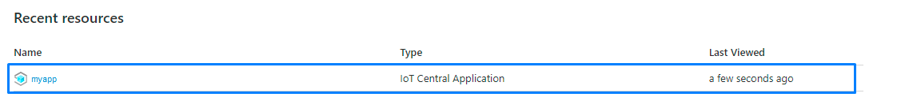
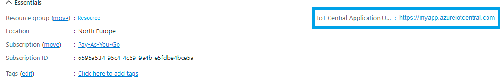
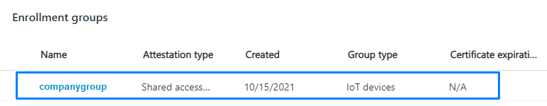
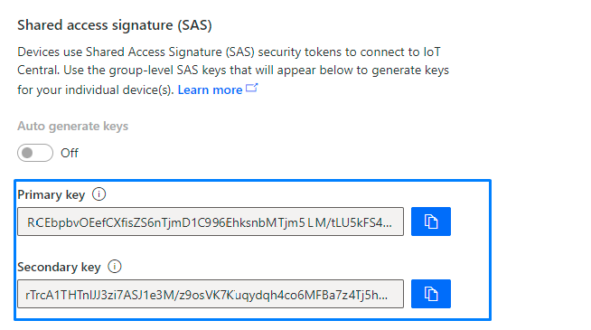
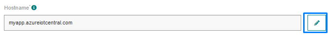
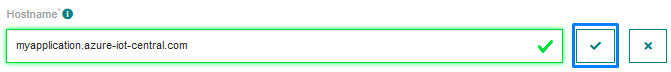
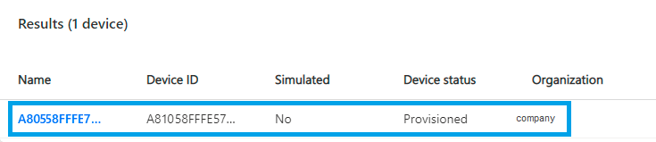

# CREATING AN AZURE IOT CENTRAL CONNECTION

This setup is intended to be a minimal setup example to get the Azure IoT Central connector working.
The Azure IoT Central connector requires the creation of an Azure account upfront. This account can be either a free or a paid account.
Check [Azure IoT Central pricing](https://azure.microsoft.com/fr-fr/pricing/details/iot-central/) and [Azure IoT Central limits](https://docs.microsoft.com/en-us/azure/iot-central/core/concepts-quotas-limits) to decide which subscription fits your needs.

## Collecting Expected Information

<a id="AZUREparam">**Parameters required**</a>

| UI Field | Description |
| ------ | ----------- |
| **Hostname** | The hostname of your Azure IoT Central account. |
| **Shared Access Key** | SAS security tokens are an attestation mechanism for devices to connect to IoT Central. Theses tokens are used to generate derived keys for your device(s). |
| **API Token** | Token generated by IoT Central used to access the IoT Central API. |
| **ID Scope** | The ID of the device model. IoT Central uses it to associate the device to its model. |

For detailed information on Microsoft Azure IoT Central configuration and parameters, see the [Azure IoT Central documentation](https://docs.microsoft.com/en-us/azure/iot-central/)

### Hostname

1. Connect to [Azure account](https://portal.azure.com/#home).

2. In the recent resources table, select your IoT Central Application resource.



3. On the Overview panel, you can see the IoT Central Application URL. This is your hostname, without the first https:// part.



* For this example, the hostname is **tpx.azureiotcentral.com**.

### API Token

1. Connect to your IoT Central Application. The URL is the one you retrieve when getting your hostname (in this case, https://tpx.azureiotcentral.com).

2. On the side menu, click on **Permissions** -> **Api Tokens**.


3. Click on **New** to create a new token.


4. Enter the new token's name and select its role. Click on **Generate**.


5. Copy the given token. Note that this is the only time you will have access to it.


### Shared Access Key

1. Inside your Azure IoT Central application, on the side menu, click on **Permissions** -> **Device Connection Groups**.


2. Select your group in the enrollment group.



3. Copy the **Primary key**.



### ID Scope

1. Inside your Azure IoT Central application, on the side menu, click on **Permissions** -> **Device Connection Groups**.


2. Copy your ID Scope.


:::warning Note
The shared access key, API token and ID scope all needs to be retrieved inside your Azure IoT Central application.
:::

## Creating a Connection From UI

You must have an active AZURE account prior to creating an Azure IoT Central connection in ThingPark.

You also need to know the parameters that are required to perform this task. To learn more, check [Parameters required for connecting to an Azure Event Hubs platform](#AZUREparam).

1. Click Connections -> Create -> ThingPark X Iot Flow.


Then, a new page will open. Select the connection type : Azure IoT Central.


2. Fill in the form as in the example below and click on **Create**.


::: tip Note
Parameters marked with * are mandatory.
:::

* A notification appears on the upper right side of your screen to confirm that the application has been created.


4. After creating the application, you will be redirected to the application details.


**Changing the Settings after Creation**

You can change the settings parameters such as the *Hostname* after the creation of the Azure IoT Central application.

To do this, proceed as follows:

1. Select the Azure IoT Central application for which you want to change one or several parameters.

2. In the application information dashboard, click on the **Edit** button corresponding to the parameter you want to change.



3. Enter the new value, and click on the **Confirm** icon.



* The Confirmation window displays,


* A notification will inform you that the parameter is updated.


## Creating a Connection With API

The creation of a connection establishes a bidirectional messaging transport link between ThingPark X IoT Flow and the cloud provider. Events and commands from multiple Devices will be multiplexed over this messaging transport link.

To do this, you need to use the **Connections** group resource:

* `POST/connections` to create a new Connection instance
* `PUT/connections` to update a Connection instance
* `DELETE/connections` to delete a Connection instance

::: tip Note
We follow the REST-full API pattern, when updating configuration properties for a connection resource. Thus, you must also provide the whole configuration again.
:::

Example for creation of a new connection instance :

```json
POST /connections
{
    "connectorId": "actility-azure-iot-central",
    "name": "Actility Azure IoT Central Connection",
    "configuration": {
        "hostName": "myapp.azureiotcentral.com",
        "sharedAccessKey": "WHUbetvvOEefCXpmlZS6nTjm42pi99EhksnbMJiu15OM/tOU7kvfh543verotu3DishQVJNKwfrLU8yAMXKP0/A==",
        "apiToken": "SharedAccessSignature sr=a5cd67a7-grx2-4T50-f271-d5h8741fd09UecZu=K0AVOYwrpXCFotKGR7WJ4fgucfRt7uw2ugfh5j89vi8%3D&skn=group-2&se=0967841647946",
        "idScope":"9en090CCDC0",
    }
}
```

| JSON Field | Description |
| ------ | ----------- |
| ```connectorId``` | Must be set to actility-azure-iot-central for the Azure IoT Central platform. |
| ```hostName``` | The hostname of your Azure IoT Central account. |
| ```sharedAccessKey``` | SAS security tokens are an attestation mechanism for devices to connect to IoT Central. Theses tokens are used to generate derived keys for your device(s). |
| ```apiToken``` | Token generated by IoT Central used to access the IoT Central API. |
| ```idScope``` | The ID of the device model. IoT Central uses it to associate the device to its model. |

::: warning Important note
All properties are not present in this example. You can check the rest of these properties in the [common parameters section](../../../Getting_Started/Setting_Up_A_Connection_instance/About_connections.html#common-parameters).
:::

## Limitations

You can check out the [Azure IoT Central limits](https://docs.microsoft.com/en-us/azure/iot-central/core/concepts-quotas-limits)

## Displaying information to know if it worked

You need to have an already existing Azure IoT Central Application prior to these steps.

1. Connect to your IoT Central Application.

2. Click on the **Device Groups** section and select one of your groups.

:::tip Note
Your group contain devices from the same model. Configure it so you can choose which data you want to expose.
:::


3. Select one of your device from this group.



4. You should be able to see the data in the **View** panel.


