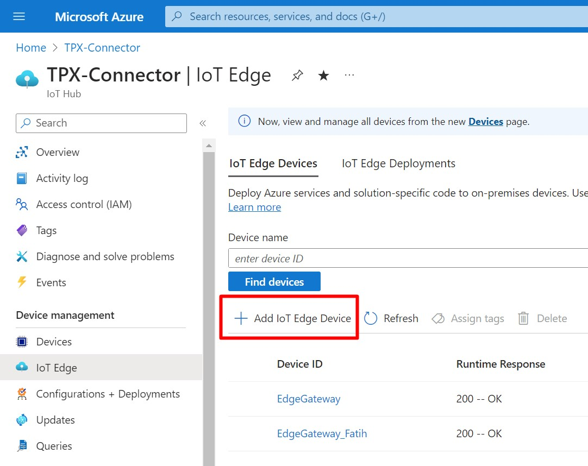
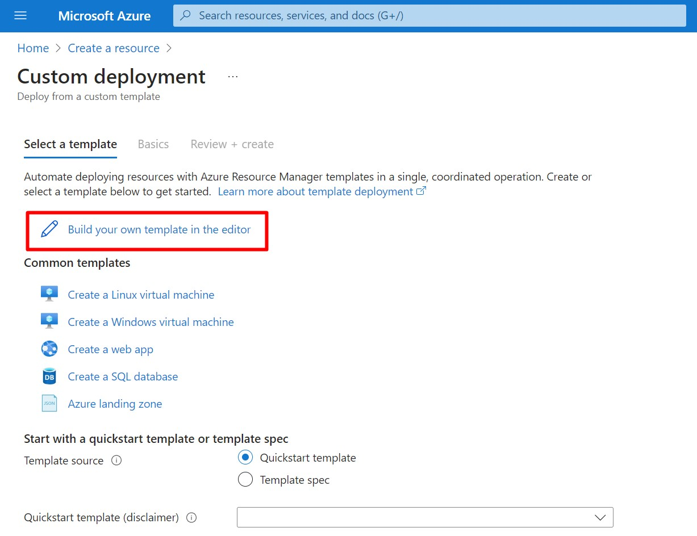
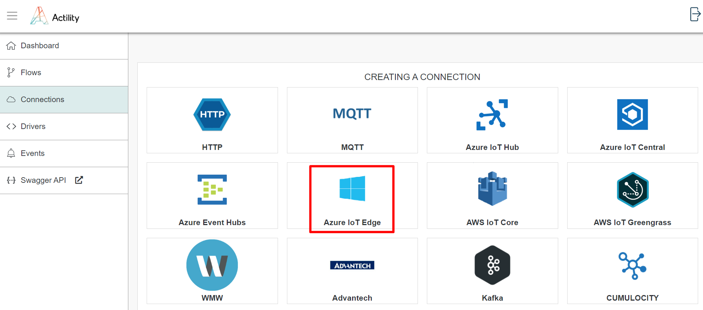
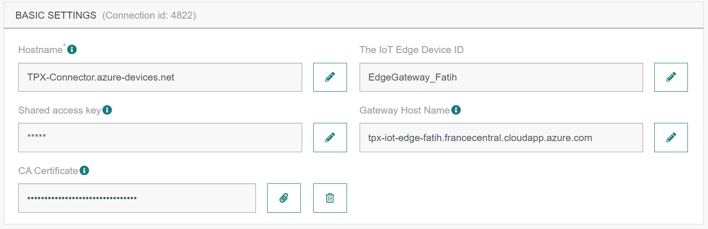

# SETTING UP AN IOT EDGE GATEWAY ON AZURE

1. On Azure IoT-Edge click Add IoT Edge Device.



2. Give a name to your IoT Edge Device, such as "Edge Gateway". Under Authentication type, ensure that Symmetric key is selected, and leave the Auto-generate keys box checked. Click the Save Button

3. Click on your newly created IoT Edge Device to open its properties. Copy the Primary Connection String and save it to a text file for later use.


4. At the top of the blade, click Set Modules. At the top of the Set module on device blade, click Routes.<br/>
**Add the following routes:**

| Name | Description                     |
|------|---------------------------------|
| **allMessagesToHub** | `FROM /messages/* INTO $upstream` |
| **allDownstreamToHub** | `FROM /messages/* WHERE NOT IS_DEFINED ($connectionModuleId) INTO $upstream` |                               |

At the bottom of the blade, click Review + create.


5. From Azure Home Main Page, select Create Resource -&gt; Template Deployment.


6. Select Build Your Own Template in the editor



7. Copy the following template into the editor. Click Save button. 

```json
{
  "$schema": "https://schema.management.azure.com/schemas/2019-04-01/deploymentTemplate.json#",
  "contentVersion": "1.0.0.0",
  "metadata": {
    "_generator": {
      "name": "bicep",
      "version": "0.4.451.19169",
      "templateHash": "12841244634154159240"
    }
  },
  "parameters": {
    "virtualMachineName": {
      "type": "string",
      "metadata": {
        "description": "The unique name for the VM."
      }
    },
    "deviceConnectionString": {
      "type": "string",
      "defaultValue": "",
      "metadata": {
        "description": "IoT Edge Device Connection String"
      }
    },
    "virtualMachineSize": {
      "type": "string",
      "defaultValue": "Standard_DS1_v2",
      "metadata": {
        "description": "VM size"
      }
    },
    "ubuntuOSVersion": {
      "type": "string",
      "defaultValue": "18.04-LTS",
      "metadata": {
        "description": "The Ubuntu version for the VM. This will pick a fully patched image of this given Ubuntu version."
      }
    },
    "adminUsername": {
      "type": "string",
      "metadata": {
        "description": "User name for the Virtual Machine."
      }
    },
    "authenticationType": {
      "type": "string",
      "defaultValue": "password",
      "metadata": {
        "description": "Type of authentication to use on the Virtual Machine. SSH key is recommended for production."
      },
      "allowedValues": [
        "sshPublicKey",
        "password"
      ]
    },
    "adminPasswordOrKey": {
      "type": "secureString",
      "metadata": {
        "description": "SSH Key or password for the Virtual Machine. SSH key is recommended."
      }
    },
    "allowSSH": {
      "type": "bool",
      "defaultValue": true,
      "metadata": {
        "description": "Allow SSH traffic through the firewall"
      }
    }
  },
  "functions": [],
  "variables": {
    "imagePublisher": "Canonical",
    "imageOffer": "UbuntuServer",
    "nicName_var": "[format('nic-{0}', parameters('virtualMachineName'))]",
    "vmName_var": "[parameters('virtualMachineName')]",
    "virtualNetworkName_var": "[format('vnet-{0}', parameters('virtualMachineName'))]",
    "publicIPAddressName_var": "[format('ip-{0}', parameters('virtualMachineName'))]",
    "addressPrefix": "10.0.0.0/16",
    "subnet1Name": "[format('subnet-{0}', parameters('virtualMachineName'))]",
    "subnet1Prefix": "10.0.0.0/24",
    "publicIPAddressType": "Dynamic",
    "vnetID": "[resourceId('Microsoft.Network/virtualNetworks', variables('virtualNetworkName_var'))]",
    "subnet1Ref": "[format('{0}/subnets/{1}', variables('vnetID'), variables('subnet1Name'))]",
    "linuxConfiguration": {
      "disablePasswordAuthentication": true,
      "ssh": {
        "publicKeys": [
          {
            "path": "[format('/home/{0}/.ssh/authorized_keys', parameters('adminUsername'))]",
            "keyData": "[parameters('adminPasswordOrKey')]"
          }
        ]
      }
    },
    "dcs": "[parameters('deviceConnectionString')]",
    "networkSecurityGroupName_var": "[format('nsg-{0}', parameters('virtualMachineName'))]",
    "sshRule": [
      {
        "name": "default-allow-22",
        "properties": {
          "priority": 1000,
          "access": "Allow",
          "direction": "Inbound",
          "destinationPortRange": "22",
          "protocol": "Tcp",
          "sourceAddressPrefix": "*",
          "sourcePortRange": "*",
          "destinationAddressPrefix": "*"
        }
      }
    ],
    "noRule": []
  },
  "resources": [
    {
      "type": "Microsoft.Network/publicIPAddresses",
      "apiVersion": "2015-06-15",
      "name": "[variables('publicIPAddressName_var')]",
      "location": "[resourceGroup().location]",
      "properties": {
        "publicIPAllocationMethod": "[variables('publicIPAddressType')]",
        "dnsSettings": {
          "domainNameLabel": "[parameters('virtualMachineName')]"
        }
      }
    },
    {
      "type": "Microsoft.Network/networkSecurityGroups",
      "apiVersion": "2019-08-01",
      "name": "[variables('networkSecurityGroupName_var')]",
      "location": "[resourceGroup().location]",
      "properties": {
        "securityRules": "[if(parameters('allowSSH'), variables('sshRule'), variables('noRule'))]"
      }
    },
    {
      "type": "Microsoft.Network/virtualNetworks",
      "apiVersion": "2015-06-15",
      "name": "[variables('virtualNetworkName_var')]",
      "location": "[resourceGroup().location]",
      "properties": {
        "addressSpace": {
          "addressPrefixes": [
            "[variables('addressPrefix')]"
          ]
        },
        "subnets": [
          {
            "name": "[variables('subnet1Name')]",
            "properties": {
              "addressPrefix": "[variables('subnet1Prefix')]",
              "networkSecurityGroup": {
                "id": "[resourceId('Microsoft.Network/networkSecurityGroups', variables('networkSecurityGroupName_var'))]"
              }
            }
          }
        ]
      },
      "dependsOn": [
        "[resourceId('Microsoft.Network/networkSecurityGroups', variables('networkSecurityGroupName_var'))]"
      ]
    },
    {
      "type": "Microsoft.Network/networkInterfaces",
      "apiVersion": "2015-06-15",
      "name": "[variables('nicName_var')]",
      "location": "[resourceGroup().location]",
      "properties": {
        "ipConfigurations": [
          {
            "name": "ipconfig1",
            "properties": {
              "privateIPAllocationMethod": "Dynamic",
              "publicIPAddress": {
                "id": "[resourceId('Microsoft.Network/publicIPAddresses', variables('publicIPAddressName_var'))]"
              },
              "subnet": {
                "id": "[variables('subnet1Ref')]"
              }
            }
          }
        ]
      },
      "dependsOn": [
        "[resourceId('Microsoft.Network/publicIPAddresses', variables('publicIPAddressName_var'))]",
        "[resourceId('Microsoft.Network/virtualNetworks', variables('virtualNetworkName_var'))]"
      ]
    },
    {
      "type": "Microsoft.Compute/virtualMachines",
      "apiVersion": "2016-04-30-preview",
      "name": "[variables('vmName_var')]",
      "location": "[resourceGroup().location]",
      "properties": {
        "hardwareProfile": {
          "vmSize": "[parameters('virtualMachineSize')]"
        },
        "osProfile": {
          "computerName": "[variables('vmName_var')]",
          "adminUsername": "[parameters('adminUsername')]",
          "adminPassword": "[parameters('adminPasswordOrKey')]",
          "customData": "[base64(format('#cloud-config\n\napt:\n  preserve_sources_list: true\n  sources:\n    msft.list:\n      source: \"deb https://packages.microsoft.com/ubuntu/18.04/multiarch/prod bionic main\"\n      key: |\n        -----BEGIN PGP PUBLIC KEY BLOCK-----\n        Version: GnuPG v1.4.7 (GNU/Linux)\n\n        mQENBFYxWIwBCADAKoZhZlJxGNGWzqV+1OG1xiQeoowKhssGAKvd+buXCGISZJwT\n        LXZqIcIiLP7pqdcZWtE9bSc7yBY2MalDp9Liu0KekywQ6VVX1T72NPf5Ev6x6DLV\n        7aVWsCzUAF+eb7DC9fPuFLEdxmOEYoPjzrQ7cCnSV4JQxAqhU4T6OjbvRazGl3ag\n        OeizPXmRljMtUUttHQZnRhtlzkmwIrUivbfFPD+fEoHJ1+uIdfOzZX8/oKHKLe2j\n        H632kvsNzJFlROVvGLYAk2WRcLu+RjjggixhwiB+Mu/A8Tf4V6b+YppS44q8EvVr\n        M+QvY7LNSOffSO6Slsy9oisGTdfE39nC7pVRABEBAAG0N01pY3Jvc29mdCAoUmVs\n        ZWFzZSBzaWduaW5nKSA8Z3Bnc2VjdXJpdHlAbWljcm9zb2Z0LmNvbT6JATUEEwEC\n        AB8FAlYxWIwCGwMGCwkIBwMCBBUCCAMDFgIBAh4BAheAAAoJEOs+lK2+EinPGpsH\n        /32vKy29Hg51H9dfFJMx0/a/F+5vKeCeVqimvyTM04C+XENNuSbYZ3eRPHGHFLqe\n        MNGxsfb7C7ZxEeW7J/vSzRgHxm7ZvESisUYRFq2sgkJ+HFERNrqfci45bdhmrUsy\n        7SWw9ybxdFOkuQoyKD3tBmiGfONQMlBaOMWdAsic965rvJsd5zYaZZFI1UwTkFXV\n        KJt3bp3Ngn1vEYXwijGTa+FXz6GLHueJwF0I7ug34DgUkAFvAs8Hacr2DRYxL5RJ\n        XdNgj4Jd2/g6T9InmWT0hASljur+dJnzNiNCkbn9KbX7J/qK1IbR8y560yRmFsU+\n        NdCFTW7wY0Fb1fWJ+/KTsC4=\n        =J6gs\n        -----END PGP PUBLIC KEY BLOCK-----\npackages:\n  - moby-cli\n  - moby-engine\nruncmd:\n  - dcs=\"{0}\"\n  - |\n      set -x\n      (\n        echo \"Device connection string: $dcs\"\n\n        # Wait for docker daemon to start\n        while [ $(ps -ef | grep -v grep | grep docker | wc -l) -le 0 ]; do\n          sleep 3\n        done\n\n        apt install aziot-identity-service\n        apt install aziot-edge\n\n        if [ ! -z $dcs ]; then\n          mkdir /etc/aziot\n          wget https://raw.githubusercontent.com/Azure/iotedge-vm-deploy/1.2.0/config.toml -O /etc/aziot/config.toml\n          sed -i \"s#\\(connection_string = \\).*#\\1\\\"$dcs\\\"#g\" /etc/aziot/config.toml\n\n          echo \"Setup certificates\"\n          mkdir /etc/gw-ssl\n          git clone https://github.com/Azure/iotedge.git /etc/gw-ssl/iotedge\n\n          mkdir /tmp/lab12\n          cp /etc/gw-ssl/iotedge/tools/CACertificates/*.cnf /tmp/lab12\n          cp /etc/gw-ssl/iotedge/tools/CACertificates/certGen.sh /tmp/lab12\n\n          echo \"Generate certs\"\n          chmod +x /tmp/lab12/certGen.sh\n          /tmp/lab12/certGen.sh create_root_and_intermediate\n          /tmp/lab12/certGen.sh create_edge_device_ca_certificate \"MyEdgeDeviceCA\"\n\n          echo \"wait for certs\"\n\n          echo \"Copy certs to Iot Edge folder\"\n          cp /tmp/lab12/certs/azure-iot-test-only.root.ca.cert.pem /etc/aziot\n          cp /tmp/lab12/certs/iot-edge-device-ca-MyEdgeDeviceCA-full-chain.cert.pem /etc/aziot\n          cp /tmp/lab12/private/iot-edge-device-ca-MyEdgeDeviceCA.key.pem /etc/aziot\n\n          chmod 666 /etc/aziot/azure-iot-test-only.root.ca.cert.pem\n          chmod 666 /etc/aziot/iot-edge-device-ca-MyEdgeDeviceCA-full-chain.cert.pem\n          chmod 666 /etc/aziot/iot-edge-device-ca-MyEdgeDeviceCA.key.pem\n\n          echo \"Update config file\"\n\n          echo \"\" >> /etc/aziot/config.toml\n          echo \"trust_bundle_cert = ''file:///etc/aziot/azure-iot-test-only.root.ca.cert.pem''\" >> /etc/aziot/config.toml\n          echo \"\" >> /etc/aziot/config.toml\n          echo \"[edge_ca]\" >> /etc/aziot/config.toml\n          echo \"cert = ''file:///etc/aziot/iot-edge-device-ca-MyEdgeDeviceCA-full-chain.cert.pem''\" >> /etc/aziot/config.toml\n          echo \"pk = ''file:///etc/aziot/iot-edge-device-ca-MyEdgeDeviceCA.key.pem''\" >> /etc/aziot/config.toml\n\n          chmod 755 /tmp/lab12\n          chmod 755 /tmp/lab12/certs\n          chmod 755 /tmp/lab12/private\n          chmod 666 /tmp/lab12/certs/*\n          chmod 666 /tmp/lab12/private/*\n\n          iotedge config apply -c /etc/aziot/config.toml\n        fi\n\n        apt install -y deviceupdate-agent\n        apt install -y deliveryoptimization-plugin-apt\n        systemctl restart adu-agent\n\n      ) &\n\n', variables('dcs')))]",
          "linuxConfiguration": "[if(equals(parameters('authenticationType'), 'password'), json('null'), variables('linuxConfiguration'))]"
        },
        "storageProfile": {
          "imageReference": {
            "publisher": "[variables('imagePublisher')]",
            "offer": "[variables('imageOffer')]",
            "sku": "[parameters('ubuntuOSVersion')]",
            "version": "latest"
          },
          "osDisk": {
            "createOption": "FromImage"
          }
        },
        "networkProfile": {
          "networkInterfaces": [
            {
              "id": "[resourceId('Microsoft.Network/networkInterfaces', variables('nicName_var'))]"
            }
          ]
        }
      },
      "dependsOn": [
        "[resourceId('Microsoft.Network/networkInterfaces', variables('nicName_var'))]"
      ]
    }
  ],
  "outputs": {
    "PublicFQDN": {
      "type": "string",
      "value": "[reference(resourceId('Microsoft.Network/publicIPAddresses', variables('publicIPAddressName_var'))).dnsSettings.fqdn]"
    },
    "PublicSSH": {
      "type": "string",
      "value": "[format('ssh {0}@{1}', reference(resourceId('Microsoft.Compute/virtualMachines', variables('vmName_var'))).osProfile.adminUsername, reference(resourceId('Microsoft.Network/publicIPAddresses', variables('publicIPAddressName_var'))).dnsSettings.fqdn)]"
    }
  }
}
```

8. The Custom deployment page will be displayed.

In the Device Connection String field, enter the IoT Edge device primary connection string value from step 3.

In the Virtual Machine Size field, ensure Standard_DS1_v2 is entered.

In the Ubuntu OS Version field, ensure that 18.04-LTS is entered.

In the Admin Username field, enter a username.

In the Authentication Type field, ensure Password is selected.

In the Admin Password Or Key field, enter the password you wish to use.

Note: You may want to create a record of your username and password in your text file. You will need to enter the password when you connect your SSH session.

In the Allow SSH field, ensure true is selected.

To validate the template, click Review and create.

If validation passes, click Create.


9. Once the template has completed, navigate to the Outputs pane, and then use your text editor to make a record of the following:

- Public FQDN
- Public SSH

10. On the Network security group blade, on the left-side menu under Settings, click Inbound security rules. At the top of the Inbound security rules pane, click Add.

    

    - On the Add inbound security rule pane, ensure Source is set to Any. This allows traffic from any source.

    - Under Destination, ensure Destination is set to Any. This ensures outgoing traffic can be routed to any location.

    - Under Destination port ranges, change the value to 8883. This is the port for the MQTT protocol.

    - Under Protocol, click TCP. MQTT uses TCP.

    - Under Action, ensure Allow is selected. As this rule is intended to allow outgoing traffic, Allow is selected.

    - Under Priority, a default value is supplied - in most cases this will be 1010 - it must be unique. Rules are processed in priority order; the lower the number, the higher the priority.

    - Under Name, change the value to MQTT

    - Leave all other settings at the default, and then click Add. This will define an inbound security rule that will allow communication for the MQTT protocol to the IoT Edge Gateway.

    

After the MQTT rule is added, to open ports for the AMQP and HTTPS communication protocols, add two more rules with the following values:

  | Destination Port Ranges | Protocol | Name  |
  |-------------------------|----------|-------|
  | 5671                    | TCP      | AMQP  |
  | 443                     | TCP      | HTTPS |

11. Connect to the VM using the public ssh command that you had taken note of at step 9. During the initial launch of the VM, a script was executed that configured IoT Edge. This script performed the following operations:    
    - Installed aziot-identity-service package
    - Installed aziot-edge package
    - Downloaded an initial version of config.toml (the config file for IoT Edge) to /etc/aziot/config.toml
    - Added the device connection string supplied when the ARM template was executed to /etc/aziot/config.toml
    - Cloned the Iot Edge git repository to /etc/gw-ssl/iotedge
    - Created a directory /tmp/lab12 and copied the IoT Edge gateway SSL test tools from /etc/gw-ssl/iotedge
    - Generated the test SSL certs in /tmp/lab12 and copied them to /etc/aziot
    - Added the certs to the /etc/aziot/config.toml
    - Applied the updated /etc/aziot/config.toml to the IoT Edge runtime
    
12. To determine the version of IoT Edge that was installed, enter the following command:

```
    iotedge --version
```

13. To view the IoT Edge configuration, enter the following command:

```
    cat /etc/aziot/config.toml
```
The output will be similar to

```
    hostname = "tpx-iot-edge.francecentral.cloudapp.azure.com"

    trust_bundle_cert = 'file:///etc/aziot/azure-iot-test-only.root.ca.cert.pem'

    [edge_ca]
    cert = 'file:///etc/aziot/iot-edge-device-identity-EdgeGateway-full-chain.cert.pem'
    pk = 'file:///etc/aziot/iot-edge-device-identity-EdgeGateway.key.pem'
    auto_generated_edge_ca_expiry_days = 180

    [provisioning]
    source = "manual"
    connection_string = "HostName=TPX-Connector.azure-devices.net;DeviceId=EdgeGateway;SharedAccessKey=FYXiZPTfkSmA1iiOPJ7/PXOc1ehHjR7B4efmSn2///I="
 
    [agent]
    name = "edgeAgent"
    type = "docker"
 
    [agent.config]
    image = "mcr.microsoft.com/azureiotedge-agent:1.2"
 
    [connect]
    workload_uri = "unix:///var/run/iotedge/workload.sock"
    management_uri = "unix:///var/run/iotedge/mgmt.sock"
 
    [listen]
    workload_uri = "fd://aziot-edged.workload.socket"
    management_uri = "fd://aziot-edged.mgmt.socket"
 
    [moby_runtime]
    uri = "unix:///var/run/docker.sock"
    network = "azure-iot-edge"

```

14. To ensure the IoT Edge daemon is running, enter the following command:

```
    sudo iotedge system status
```

This command will display output similar to:

```
   System services:
    aziot-edged             Running
    aziot-identityd         Running
    aziot-keyd              Running
    aziot-certd             Running
    aziot-tpmd              Ready

    Use 'iotedge system logs' to check for non-fatal errors.
    Use 'iotedge check' to diagnose connectivity and configuration issues.
```

15. To verify the IoT Edge runtime has connected, run the following command:

```
    sudo iotedge check
```
This runs a number of checks and displays the results. For this lab, ignore the Configuration checks warnings/errors. The Connectivity checks should succeed and be similar to:

```
    Configuration checks (aziot-identity-service)
---------------------------------------------
√ keyd configuration is well-formed - OK
√ certd configuration is well-formed - OK
√ tpmd configuration is well-formed - OK
√ identityd configuration is well-formed - OK
√ daemon configurations up-to-date with config.toml - OK
√ identityd config toml file specifies a valid hostname - OK
‼ aziot-identity-service package is up-to-date - Warning
    Installed aziot-identity-service package has version 1.4.1 but 1.4.6 is the latest stable version available.
    Please see https://aka.ms/aziot-update-runtime for update instructions.
√ host time is close to reference time - OK
√ preloaded certificates are valid - OK
√ keyd is running - OK
√ certd is running - OK
√ identityd is running - OK
√ read all preloaded certificates from the Certificates Service - OK
√ read all preloaded key pairs from the Keys Service - OK
√ check all EST server URLs utilize HTTPS - OK
√ ensure all preloaded certificates match preloaded private keys with the same ID - OK

Connectivity checks (aziot-identity-service)
--------------------------------------------
√ host can connect to and perform TLS handshake with iothub AMQP port - OK
√ host can connect to and perform TLS handshake with iothub HTTPS / WebSockets port - OK
√ host can connect to and perform TLS handshake with iothub MQTT port - OK

Configuration checks
--------------------
√ aziot-edged configuration is well-formed - OK
√ configuration up-to-date with config.toml - OK
√ container engine is installed and functional - OK
√ configuration has correct URIs for daemon mgmt endpoint - OK
‼ aziot-edge package is up-to-date - Warning
    Installed IoT Edge daemon has version 1.4.3 but 1.4.20 is the latest stable version available.
    Please see https://aka.ms/iotedge-update-runtime for update instructions.
√ container time is close to host time - OK
‼ DNS server - Warning
    Container engine is not configured with DNS server setting, which may impact connectivity to IoT Hub.
    Please see https://aka.ms/iotedge-prod-checklist-dns for best practices.
    You can ignore this warning if you are setting DNS server per module in the Edge deployment.
‼ production readiness: logs policy - Warning
    Container engine is not configured to rotate module logs which may cause it run out of disk space.
    Please see https://aka.ms/iotedge-prod-checklist-logs for best practices.
    You can ignore this warning if you are setting log policy per module in the Edge deployment.
‼ production readiness: Edge Agent's storage directory is persisted on the host filesystem - Warning
    The edgeAgent module is not configured to persist its /tmp/edgeAgent directory on the host filesystem.
    Data might be lost if the module is deleted or updated.
    Please see https://aka.ms/iotedge-storage-host for best practices.
‼ production readiness: Edge Hub's storage directory is persisted on the host filesystem - Warning
    The edgeHub module is not configured to persist its /tmp/edgeHub directory on the host filesystem.
    Data might be lost if the module is deleted or updated.
    Please see https://aka.ms/iotedge-storage-host for best practices.
√ Agent image is valid and can be pulled from upstream - OK
√ proxy settings are consistent in aziot-edged, aziot-identityd, moby daemon and config.toml - OK

Connectivity checks
-------------------
√ container on the default network can connect to upstream AMQP port - OK
√ container on the default network can connect to upstream HTTPS / WebSockets port - OK
√ container on the IoT Edge module network can connect to upstream AMQP port - OK
√ container on the IoT Edge module network can connect to upstream HTTPS / WebSockets port - OK
29 check(s) succeeded.
6 check(s) raised warnings. Re-run with --verbose for more details.
2 check(s) were skipped due to errors from other checks. Re-run with --verbose for more details.
```

16. Next, you need to "download" the azure-iot-test-only.root.ca.cert.pem certificate from the virtual machine to your local machine.

```
mkdir lab12
scp -r -p {username}@{FQDN}:/tmp/lab12 .
```
Note: Replace the `{username}` placeholder with the username of the admin user for the VM, and replace the `{FQDN}` placeholder with the fully qualified domain name for the VM


# CREATING AN AZURE IOT EDGE CONNECTION

## Creating a Connection from the UI

You must have downloaded the MyEdgeDeviceCA certificate from the Azure IoT Edge VM.

1. Click ADD CONNECTION from the UI.
   

   Then, a new page will open. Select the connection type : Azure IoT Edge

   

2. Fill in the form as in the example below.

    

:::tip Note
Parameters marked with * are mandatory.
:::
| UI Field | Description |
|-----|-----|
| **Name**                   | Name of your connection. |
| **Hostname**               | The Azure IoT-Hub name followed by ".azure-devices.net". |
| **Gateway HostName**       | The gateway hostname is declared in the IoT-Edge gateway device. It's referred to in the connection string of the downstream device. The gateway hostname needs to be resolvable to an IP address, either using DNS or a host file entry on the downstream device. |
| **The IoT Edge Device ID** | The IoT Edge Device ID. |
| **Shared access key**      | Primary Key of the IoT Edge Device. |
| **CA Certificate** | The MyEdgeDeviceCA Certificate that you downloaded from the Edge Device VM in Step 16. |

3. Click **Create**.

* A notification appears on the upper right side of your screen to confirm that the application has been created.
<div style={{textAlign:'center'}}></div>

4. After creating the application, you will be redirected to the application details.

## Basic settings
<div style={{textAlign:'center'}}></div>
| UI Field | Description |
|-------|-------|
| **Hostname** | The Azure IoT-Hub name followed by ".azure-devices.net". |
| **The IoT Edge Device ID** | The IoT Edge Device ID. |
| **Shared Access Key**      | Primary Key of the IoT Edge Device. |
| **Gateway HostName**       | The gateway hostname is declared in the IoT-Edge gateway device. It's referred to in the connection string of the downstream device. The gateway hostname needs to be resolvable to an IP address, either using DNS or a host file entry on the downstream device. |
| **CA Certificate**         | The MyEdgeDeviceCA Certificate that you downloaded from the Edge Device VM in Step 16. |

## Advanced settings
<div style={{textAlign: 'center'}}></div>
| UI Field | Description |
|-------|-------|
| **Downlink Enabled** | Define if the downstream is establish for support downlink. |
| **Uplink Validity** | If set with a value (for instance, 1m), uplinks older than the set validity, will not be sent to the cloud service, and an alarm event is saved in the events’ log. When connections have not started or have downtimes, uplinks are accumulating. Most of these uplinks expire before connections get up again. Examples: ```60m```, ```12h```, ```3d12h60m```|
| **Debug** | Option used for obtain more logs from your connection. The Debug mode is automatically switched off after 2 days. |

## Creating a Connection With API
You need to use the following endpoints:
+	```POST/connections``` for creation
+	```PUT/connections``` for modification
+	```DELETE/connections``` for deletion

:::tip Note
When you want to update a configuration property on a Connection, you must provide all configuration properties again.
:::

**Example of the creation of a Connection.**

```POST /connections```
```json    
{
  "connectorId": "actility-azure-iot-edge",
  "name": "Azure IoT-Edge Connection",
  "configuration": {
    "hostName": "TPX-Connector.azure-devices.net",
    "gatewayHostName": "iot-flow-edge.francecentral.cloudapp.azure.com",
    "deviceId": "EdgeGateway",
    "sharedAccessKey": "FYXiZPTfkSmA1iiOPJ7/PXOc1ehHjR7B4efmSn2///I=",
    "iotHubTier": "S1",
    "iotHubUnits": 1,
    "trustedCaCertificate": "-----BEGIN CERTIFICATE-----MIIFZTCCA02gAwIBAgICEAEwDQYJKoZIhvcNAQELBQAwNDEyMDAGA1UEAwwpQXp1cmVfSW9UX0h1Yl9JbnRlcm1lZGlhdGVfQ2VydF9UZXN0X09ubHkwHhcNMjMxMTEwMTM0NDU0WhcNMzcwNzE5MTM0NDU0WjAcMRowGAYDVQQDDBFNeUVkZ2VEZXZpY2VDQS5jYTCCAiIwDQYJKoZIhvcNAQEBBQADggIPADCCAgoCggIBAJrdwo0hp4Vfv2StDMg1dHExKRKSrUqQxeX1kdt0UzEXwROB4JXTlf1ElWjcNlXnO2+ivOIMKw6ioL59c9J4jM0Ad5A/f2rnxy9mRpMWtzkvEwZoFk9dAnKXSVz+OE9MKr27ZKNJNPv1T/LS2GGt3rCHL3SSmMaoCHAZnLbnFXqYZNE+wFWwfGQ3RMWQzTEVTF1wXoQ7oVr34WJjbc0Y+GbSRPjbHc8J2ZtgpB9kxuw4gAs/xjyr8BUdN8mPV5HXURzicS0QTqLK7U+AD2KAhdyXGnoqkucIMgxO7di+9NUM+OfMvSch/foGLv7867N5cS3lUOIIRsA3+AUduJlWpj+ZGyKR8Gjvha2xcI/PhKnWA/XX+1lEGBt9ZkE/gcoQu3NS+VJB55tGVZnkLL99vU7zh6Wi3nuZw5vHphgY5pVINvqctOMkYPLqDXaH4z+tZfhCA6+yD/ckmCo466c7evirz7d7wlJRJwxB7avhqCdvwUrZ7sKqhM59IcbsiRTXhXPVjFPdzG5ECq445+43IYIag0ASU58p8QcCjIZZt5FtFNZUD1scPw/s4r0q/l17n5Erww3edXFrCL/tzCmFTqJ61GyrghXtWigRkdQjqTt+j5ul93g07yf++A7gKKTNgD63nmpZpR9g+CuDViSEXdQAvVtvxaKmy0nZJ2K/GWK9AgMBAAGjgZgwgZUwHQYDVR0OBBYEFIAjSNtyO50DsBgFZpfh+WJkCcyBMFMGA1UdIwRMMEqAFFEvvu9W43GvVWCJ0+V5g5ZkX42EoS6kLDAqMSgwJgYDVQQDDB9BenVyZV9Jb1RfSHViX0NBX0NlcnRfVGVzdF9Pbmx5ggIQADAPBgNVHRMBAf8EBTADAQH/MA4GA1UdDwEB/wQEAwIBhjANBgkqhkiG9w0BAQsFAAOCAgEAQgN7PsKsYydPscrOwcLMy5j5qwuyOD2XEA/3Bjq/xmniWzT7xa5GpPzAYvsZHrgseuS6ERUWEJy5pnUbkFfVek+QO2xptNY6GZV+jfKeqVLET8NDo1T9GybczsaswVX7lxUDxBW/6lafYt77J6VY68TZtfcjBPtXS730TciLfaMSjC/Gt8v7BHL/QfRGBN9GRwkC7xgmZiZFogxtszAnQlr+1TlaaiF0oNg5GYTX3LnfWHBmqT4EbCDcrD/E7+uTtxyF9XGMqnb9Z14lb0Fh6vdRZ6TgRMg2gJXMF8MOOiVorCk4XA298Iu0f3oXhtWfZvQwxyZri0zGIgoTyazRg1Q6fCZ9CleEBjSq6LL0JRIzpZ8pUQe/WD4vXnz0aGdM6vnxBgZw9rbVpiYbpRzEMaWVC+J7JNMsdEhtMBwkw/3rTJ9QVWSv6Doa+blci1M2VFE2BYCvveoiiCvKxQV3AEkWeCqJEAEYSj+pD9JztRyJI2GMqkWumDv8lI8fF5DZqEx4nsWaz1S6OXHTAvCx4kmD3Gn/7lwHximvMakAA89D1tRQ+g3m1fWPV69/VUDHDCy1PCAjD8nWPLTXGragLfLK8wHWO+0QPftF9FaPI6d5HSINPdY6pFYcTlk5Qy5EBK/r7LdynODyhKC6XK3hUW2jarMmp6IR00+pbfaLDvw=-----END CERTIFICATE-----"
  }
}
```

:::warning Important note
All properties are not present in this example. You can check the rest of these properties in the [common parameters section](../../Getting%20started/Setting%20Up%20A%20Connection%20instance/About_connections#common-parameters).
:::

## Limitations

There are currently no known limitations to the Azure IoT Edge connector.
