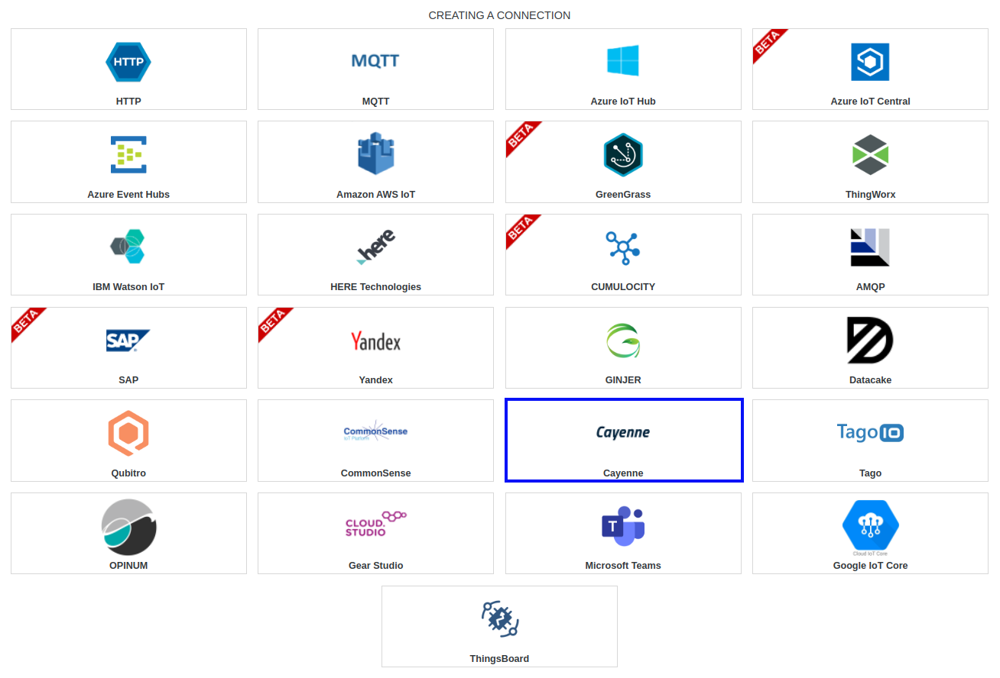
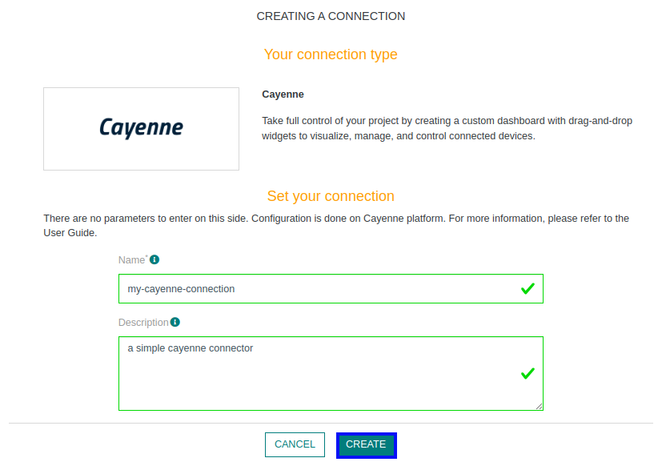
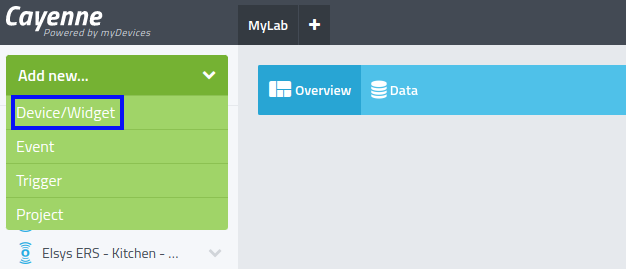
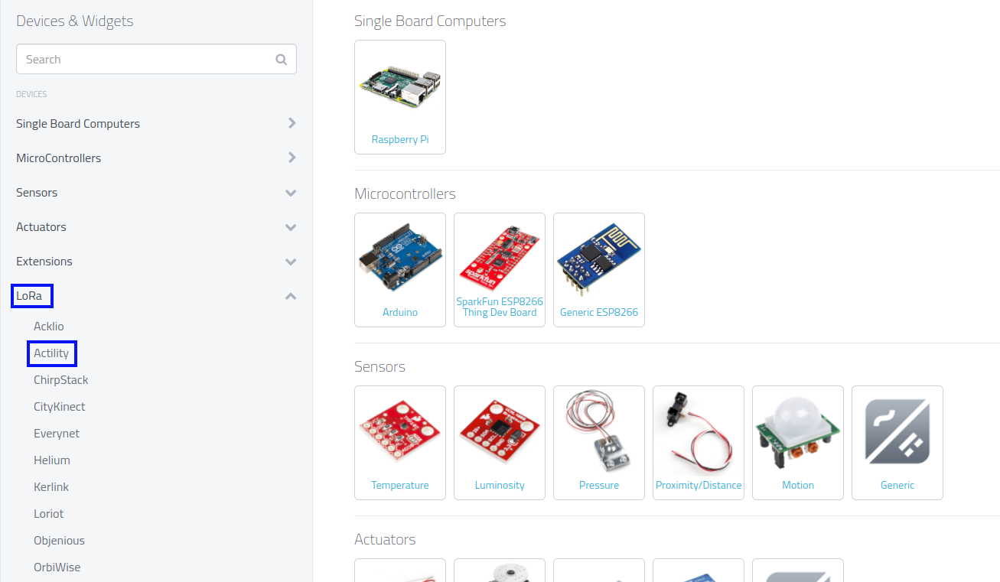
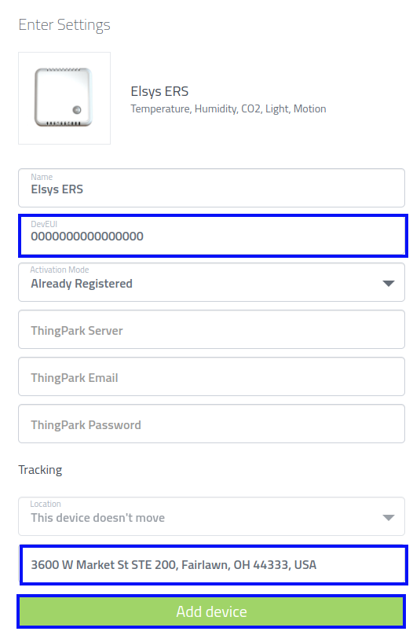
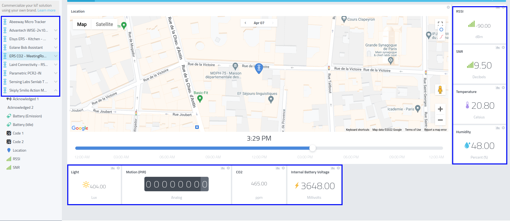

# CREATING A CAYENNE CONNECTION

## Collecting Expected Information

There is no expected information to collect.

## Creating a Connection With API

The creation of a connection establishes a unidirectional messaging transport link to the cloud provider.

To do this, you need to use the **Connections** group resource:
*	`POST/connections` to create a new Connection instance
*	`PUT/connections` to update a Connection instance
*	`DELETE/connections` to delete a Connection instance

::: tip Note
We follow the REST-full API pattern, when updating configuration properties for a connection resource. Thus, you must also provide the whole configuration again.
:::

Example for creation of a new connection instance :

```json
POST /connections
{
  "name":"Actility To Cayenne",
  "connectorId":"actility-http-iot",
  "configuration": {
    "destinationURL":"https://lora.mydevices.com/v1/networks/actility/uplink"
  },
  "brand":"CAYENNE"
}
```

The following table lists the properties applicable to a connection instance.

| Field | Description |
| ------ | ----------- |
| ```connectorId``` | Must be set to actility-http-iot for Cayenne platform. |
| ```configuration/destinationURL``` | Must be set to ``https://lora.mydevices.com/v1/networks/actility/uplink`` |
| ```brand``` | Must be set to ```CAYENNE```. |

::: warning Important note
All properties are not present in this example. You can check the rest of these properties in the [common parameters section](../../../Getting_Started/Setting_Up_A_Connection_instance/About_connections.html#common-parameters).
:::

## Creating a Connection With UI

1. Click Connections -> Create -> **ThingPark X IoT Flow**


2. Then, a new page will open. Select the connection type: **Cayenne**.


3. Fill in the form as in the example below and click on **Create**.


4. A notification appears on the upper right side of your screen to confirm that the application has been created.

5. After creating the application, you will be redirected to the connection details.

## Limitations

Limitations depends on Account Plan you own.

## Displaying information to know if it worked

1. Connect to your **Cayenne** account.

2. Click on **Add new...** and select **Device/Widget**.


3. Unroll **Lora** category, and select **Actility**.


4. You can then search for your device. Here, we will use **Elsys ERS** device.

5. Fill in the form, using the **DevEUI** of your device, and the address corresponding to his location.


6. Wait a few minutes for your device to send a message. If it worked, you'll be able to see data corresponding to it.



## Troubleshooting

As for now, there are no detected bugs.

* Cayenne documentation: [https://developers.mydevices.com/cayenne/docs/](https://developers.mydevices.com/cayenne/docs/)
