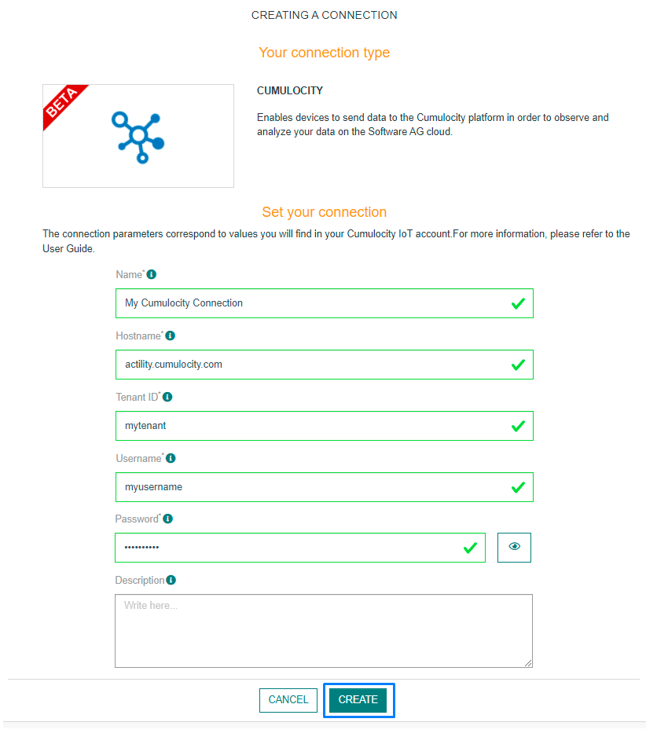
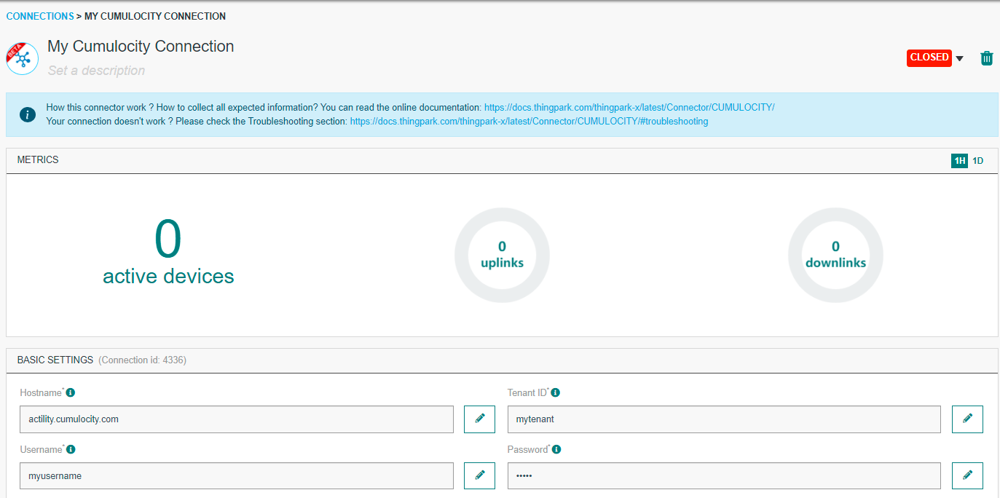
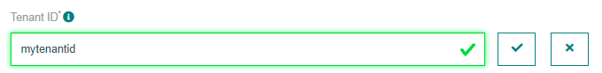
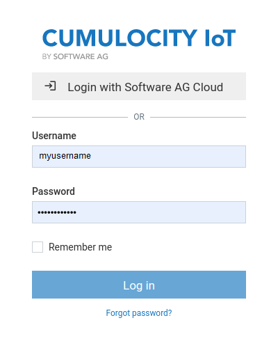

# CREATING A CUMULOCITY CONNECTION

## Creating a Connection With API

The creation of a connection establishes a bidirectional messaging transport link between ThingPark X IoT Flow and the cloud provider. Events and commands from multiple Devices will be multiplexed over this messaging transport link.

To do this, you need to use the **Connections** group resource:
*	`POST/connections` to create a new Connection instance
*	`PUT/connections` to update a Connection instance
*	`DELETE/connections` to delete a Connection instance

::: tip Note
We follow the REST-full API pattern, when updating configuration properties for a connection resource. Thus, you must also provide the whole configuration again.
:::

Example for creation of a new connection instance :

```json
POST /connections
{
  "connectorId": "actility-cumulocity-iot",
  "name": "Test Cumulocity Connection",
  "configuration": {
    "description": "Cumulocity connection test",
    "hostName": "tpx.eu-latest.cumulocity.com",
    "tenantId": "tpx",
    "username": "tpx-iot-flow",
    "password": "123456"
  }
}
```

The following table lists the properties applicable to a connection instance.

| Field | Description |
| ------ | ----------- |
| ```connectorId``` | Must be set to actility-cumulocity-iot for Cumulocity IoT cloud platform. |
| ```configuration``` | All the keys-value which represents the Cumulocity configuration |

::: warning Important note
Not all properties are present in this example. You can check the rest of these properties in the [common parameters section](../../Getting_Started/Setting_Up_A_Connection_instance/About_connections.html#common-parameters).
:::

## Creating a Connection From UI

You need to know the parameters that are required to perform this task. To learn more, check the [Parameters required for connecting to a Cumulocity platform](#CumulocityParameters) below in this topic.

1. Click Connections -> Create -> ThingPark X IoT Flow.


Then, a new page will open. Select the connection type : Cumulocity.


2. Fill in the form as in the example below and click on **Create**.



::: tip Note
Parameters marked with * are mandatory.
:::

* A notification appears on the upper right side of your screen to confirm that the application has been created.


4. After creating the application, you will be redirected to the application details.



**Changing the Settings after Creation**

You can change the settings parameters such as the Headers after the creation of the Cumulocity connection.

To do this, proceed as follows:

1. Select the Cumulocity application for which you want to change one or several parameters.

2. In the connection information dashboard, click on the **Edit** icon corresponding to the parameter you want to change.


3. Enter the new value, and click on the **Confirm** icon.



* The Confirmation window displays,


* A notification will inform you that the parameter is updated.


<a id="CumulocityParameters">**Parameters required for connecting to a Cumulocity platform**</a>

The parameters are the following:

| UI Field | Description |
| ------ | ----------- |
| **Name** | Name of the connection that you want to register (Editable). |
| **Host Name** | The hostname of your account on Cumulocity IoT cloud platform |
| **Tenant ID** | The tenant of your account on Cumulocity IoT cloud platform |
| **Username** | The username of your account on Cumulocity IoT cloud platform |
| **Password** | The password of your account on Cumulocity IoT cloud platform |
| **Description** | Description of the connection that you want to register (Editable). |

## Limitations

As for now, there is no known limitations to the Cumulocity connection.

## Displaying information to know if it worked

1. Go to [ThingPark Actility Enterprise](https://community.thingpark.io/tpe/#/login)

2. Go to the **Devices List** section, and click on the device you want to affect to your Cumulocity application.


3. When you are on the device's details page, click on **Add a connection**.


4. Select your Cumulocity connection and click on the **Confirm** icon.


* A notification appears to confirm that the application has been added to the device.


5. Go to the Cumulocity IoT Cloud Platform depends on the host name used and login. Here [Tpx EU Hostname](https://tpx.eu-latest.cumulocity.com/apps/devicemanagement) for our example.



6. Select Devices -> All devices. 


* You can then verify if your device is listed and the uplinks are correctly sent.

##  Troubleshooting

[comment]: <> (<a name="troubleshooting"></a>)
As for now, there are no detected bugs.
