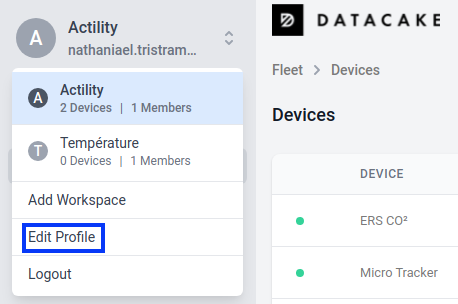
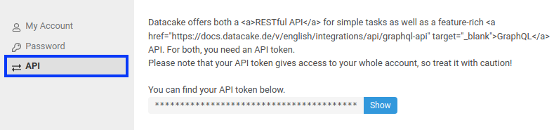
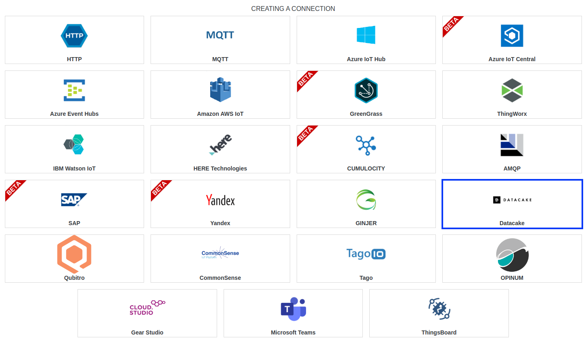
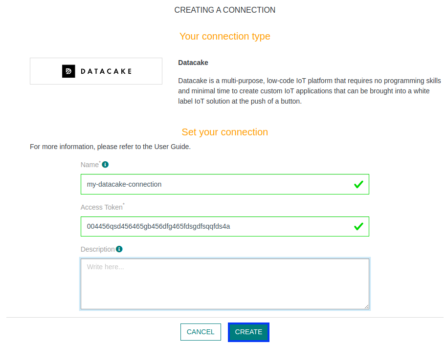
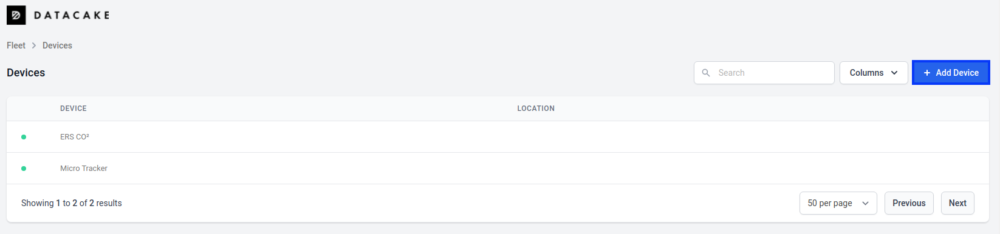
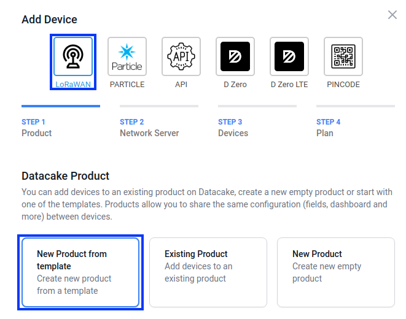
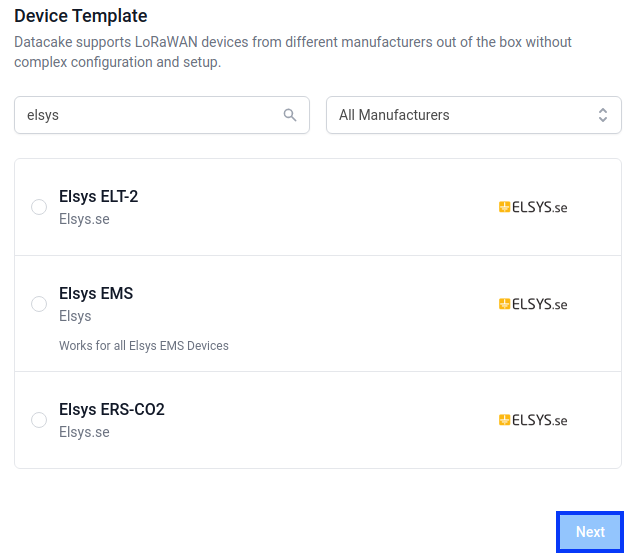
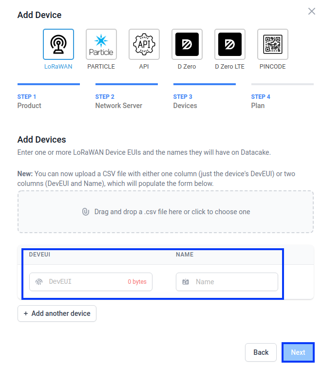
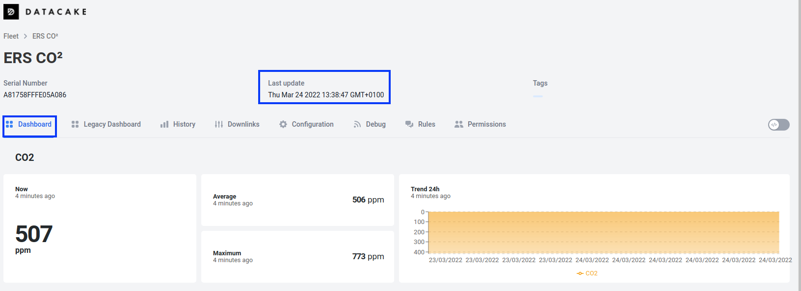

# CREATING A DATACAKE CONNECTION

## Collecting Expected Information

**Parameters required**

| Field | Description |
| ------ | ----------- |
| ```Access Token``` | Generated in your Datacake settings.|

### Generate Access Token

**Access Token** is a key that will offer you the possibility to authenticate you.

1. To get it, you must first go to your profile **settings**.


2. Then go to **API** section, and copy your **Access Token**


## Creating a Connection With API

The creation of a connection establishes a unidirectional messaging transport link to the cloud provider.

To do this, you need to use the **Connections** group resource:
*	`POST/connections` to create a new Connection instance
*	`PUT/connections` to update a Connection instance
*	`DELETE/connections` to delete a Connection instance


:::tip Note
We follow the REST-full API pattern, when updating configuration properties for a connection resource. Thus, you must also provide the whole configuration again.
:::

Example for creation of a new connection instance :

```json
POST /connections
{
  "name":"Actility To Datacake",
  "connectorId":"actility-http-iot",
  "configuration": {
      "destinationURL":"https://api.datacake.co/integrations/lorawan/actility",
      "headers": {
          "Authorization": "Token {YOUR-ACCESS-TOKEN}"
      }
  },
  "brand":"DATACAKE"
}
```

The following table lists the properties applicable to a connection instance.

| Field | Description |
| ------ | ----------- |
| ```connectorId``` | Must be set to actility-http-iot for Datacake platform. |
| ```configuration/headers/accessToken``` | Must be replaced by "Token " followed by your Access Token created in your datacake account. |
| ```brand``` | Must be set to ```DATACAKE```. |

:::warning Important note
All properties are not present in this example. You can check the rest of these properties in the [common parameters section](../../Getting%20started/Setting%20Up%20A%20Connection%20instance/About_connections#common-parameters).
:::

## Creating a Connection With UI

1. Click Connections -&gt; Create -&gt; **ThingPark X IoT Flow**


2. Then, a new page will open. Select the connection type: **Datacake**.


3. Fill in the form as in the example below and click on **Create**.


:::tip Note
Parameters marked with * are mandatory.
:::

4. A notification appears on the upper right side of your screen to confirm that the application has been created.

5. After creating the application, you will be redirected to the connection details.

## Limitations

Limitations depends on Account Plan you own.

## Displaying information to know if it worked
1. Connect to your **Datacake** account.

2. Press the **+ Add Device** button.


3. Choose **LoRaWAN**, and select **New Product from template** (You can create a **New product** if your device model doesn't appear, refer to this [link](https://docs.datacake.de/integrations/particle/decoding-payloads) to get more informations)


4. Select your device in the **Device Template** list bellow. And chose **Actility** for Network Server.


5. Fill in the **DEVEUI** and **NAME** fields. Then, go **Next** and chose your **Plan**.


6. After waiting a few minutes, you'll be able to see a dashboard for you device by clicking on it in your device list.


## Troubleshooting

As for now, there are no detected bugs.

* Datacake documentation: [https://docs.datacake.de/](https://docs.datacake.de/)
