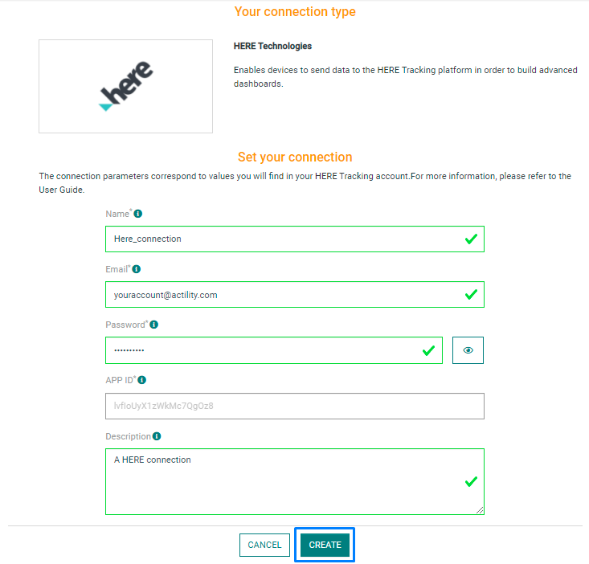
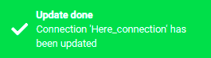

# CREATING A HERE CONNECTION

## Collecting Expected Information

<a id="HEREparameters">**Parameters required**</a>

| UI Field | Description |
| ------ | ----------- |
| **Email** | Email of the subscriber's HERE account. |
| **Password** | Password of the application that you want to register. |
| **APP ID** | Used to select a project on you have severals on your account. If empty, the first project will be used as default project. |

### Email &amp; Password

After you have created your HERE account, you need to retrieve the parameter values that will be required to configure the HERE connector.
The only parameters mandatory is the user's email used for the HERE account and your associated password.

### APP ID
Inside your [*HERE Admin Portal*](https://admin.tracking.here.com/#/), on the section *App IDs* you can create or found *App IDs* associated to one of your tracking project.


## Creating a Connection From UI

You must have an active HERE account prior to creating a HERE connection in ThingPark.

You also need to know the parameters that are required to perform this task. To learn more, check [Parameters required for connecting to a HERE platform](#HEREparameters).

1. Click Connections -&gt; Create -&gt; ThingPark X Iot Flow.


Then, a new page will open. Select the connection type : HERE Technologies.


2. Fill in the form as in the example below and click on **Create**.



:::tip Note
Parameters marked with * are mandatory.
:::

* A notification appears on the upper right side of your screen to confirm that the application has been created.


4. After creating the application, you will be redirected to the application details.


**Changing the Settings after Creation**

You can change the settings parameters such as the email or the password after the creation of the HERE application.

To do this, proceed as follows:

1. Select the Here application for which you want to change one or several parameters.

2. In the application information dashboard, click on the **Edit** button corresponding to the parameter you want to change.


3. Enter the new value, and click on the **Confirm** icon.

* The Confirmation window displays,


* A notification will inform you that the parameter is updated.



## Creating a Connection With API

The creation of a connection establishes a bidirectional messaging transport link between ThingPark X IoT Flow and the cloud provider. Events and commands from multiple Devices will be multiplexed over this messaging transport link.

To do this, you need to use the **Connections** group resource:

* `POST/connections` to create a new Connection instance
* `PUT/connections` to update a Connection instance
* `DELETE/connections` to delete a Connection instance

:::tip Note
We follow the REST-full API pattern, when updating configuration properties for a connection resource. Thus, you must also provide the whole configuration again.
:::

Example for creation of a new connection instance :

```json
POST /connections
{
    "connectorId": "actility-here-iot",
    "name": "My first HERE connection",
    "configuration": {
      "email": "yourHereAccount@actility.com",
      "password": "MyHerePassword",
      "appId": "ya5f66oj2vau1EGMvREK",
      "description": "My tracking project"
    }
}
```

The following table lists the properties applicable to a connection instance.

| JSON Field | Description |
| ------ | ----------- |
| ```connectorId``` | Must be set to actility-here-iot for HERE platform. |
| ```email``` | Email of the subscriber's HERE account. |
| ```password``` | Password of the application that you want to register. |
| ```appId``` | The Application ID defining the project used (blank = first project as default) |

:::warning Important note
All properties are not present in this example. You can check the rest of these properties in the [common parameters section](../../Getting%20started/Setting%20Up%20A%20Connection%20instance/About_connections#common-parameters).
:::

## Limitations

There are currently no known limitations to the HERE connector.

## Displaying information to know if it worked

1. Connect to your HERE Admin Portal account.


2. Check if you are subscribed to the right project.
      


3. Connect to your HERE tracking Web App account and go to the **Workspace** section.


4. You can now verify the list of your devices or add more.


## Troubleshooting

[comment]: &lt;&gt; (<a id="troubleshooting"></a>)

As for now, there are no detected bugs.
