# CREATING A HTTP CONNECTION
The creation of a connection establishes a bidirectional messaging transport link between ThingPark X IoT Flow and your application server. Events and commands from multiple Devices will be multiplexed over this messaging transport link.

## Creating a Connection From UI

You need to know the parameters that are required to perform this task. To learn more, check the [Parameters required for connecting to a HTTP platform](#HTTPparameters) below in this topic.

1. Click Connections -&gt; Create -&gt; ThingPark X Iot Flow.


Then, a new page will open. Select the connection type : HTTP.

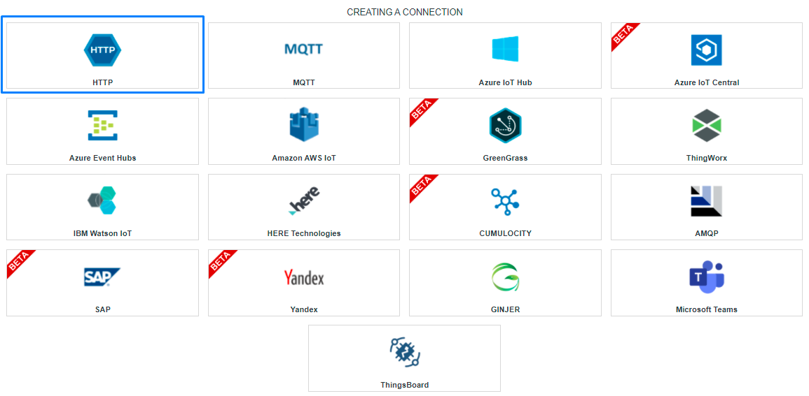

2. Fill in the form as in the example below and click on **Create**.

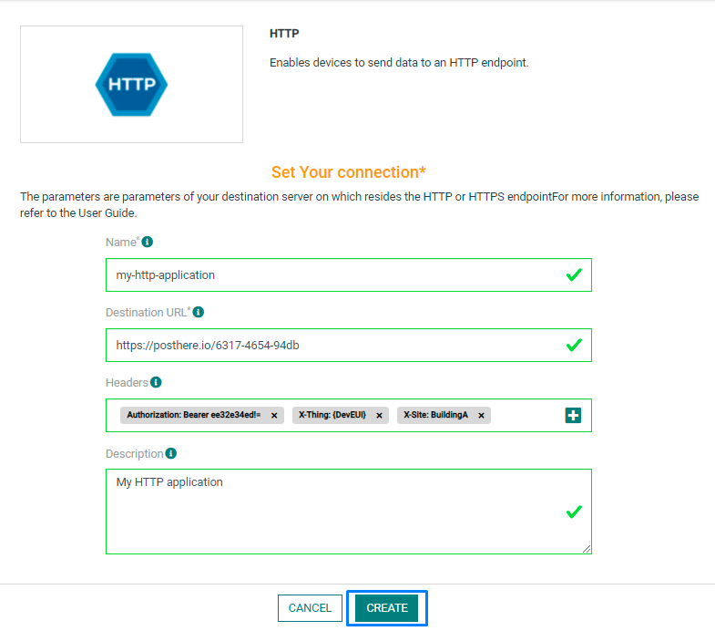

:::tip Note
Parameters marked with * are mandatory.
:::

* A notification appears on the upper right side of your screen to confirm that the application has been created.

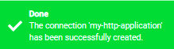

4. After creating the application, you will be redirected to the application details.

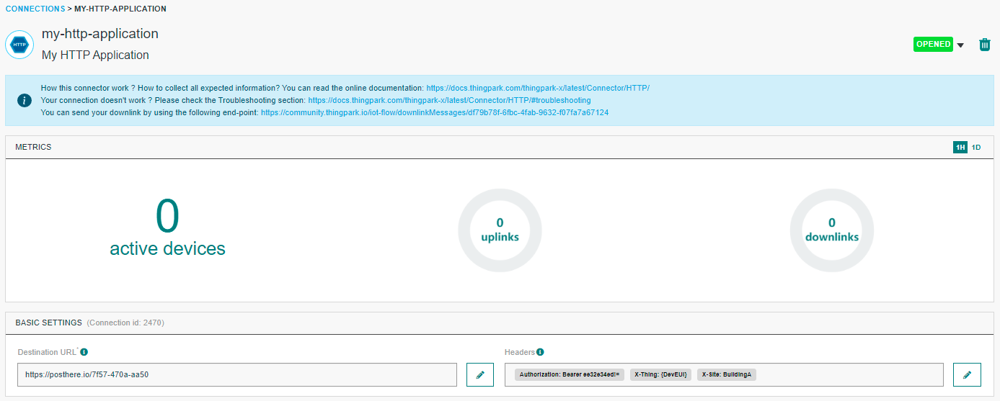

**Changing the Settings after Creation**

You can change the settings parameters such as the destination URL or the Headers after the creation of the HTTP application.

To do this, proceed as follows:

1. Select the HTTP application for which you want to change one or several parameters.

2. In the application information dashboard, click on the **Edit** icon corresponding to the parameter you want to change.

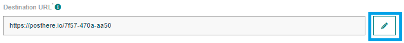

3. Enter the new value, and click on the **Confirm** icon.

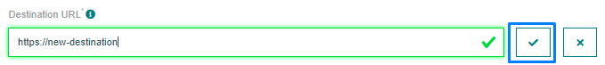

* The Confirmation window displays,

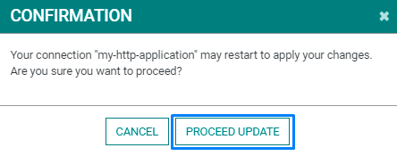

* A notification will inform you that the parameter is updated.

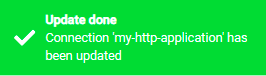

<a id="HTTPparameters">**Parameters required for connecting to a HTTP platform**</a>

The parameters are the following:

| UI Field | Description |
| ------ | ----------- |
| **Application Name** | Name of the application that you want to register. |
| **Destination URL** | The destination URL of your HTTP application. |
| **Headers** | All the keys-value which represents the HTTP headers. |
| **Description** | Description of the application that you want to register. |
| **Tunnel Interface Authentication Key** | TIAK is a 32-hexadecimal digits key generated with a high entropy that is associated with the connection to secure the upstream. |
| **Basic HTTP compliance** | Use this option if your application server is only compliant with [Basic HTTPS connection](https://docs.thingpark.com/thingpark-enterprise/7.3/docs/user-guide-tpe/manage-connections/create-basic-https-connection) |
| **Send Raw Decoded Format** | With this option, only the decoded part of the message is sent. [See decoded payload only](../../../Message/Uplink_Message/#decoded-payload-only) |
| **Strict Mode** | Define the behavior of the connection when the application server refuse a message. [Option details](#strict-mode-option)|
| **Uplink Validity** | Define the maximum delay allowed for transmit a message. After this delay, the message is dropped. |
| **Debug Mode** | Reserved for troubleshooting, this option should be used for obtain more communication informations. This option is automatically deactivated after two days. |

## Strict mode option
If StrictMode is disabled, all unaccepted messages by the application server (Return code different than 2xx) are lost without any retry. If the application server is not reachable, the connection is CLOSED and the connection retry strategy is applied. See [common parameters section](../../Getting%20started/Setting%20Up%20A%20Connection%20instance/About_connections#common-parameters)

If StrictMode is enabled, when the application server reject a message (Return code different than 2xx) or the application server is not reachable, the connection is CLOSED and the connection retry strategy is applied. See [common parameters section](../../Getting%20started/Setting%20Up%20A%20Connection%20instance/About_connections#common-parameters)

## Proxy option
When creating an HTTP connection, you can configure a proxy.
This option is available only on OCP version of Thingpark (Standalone version).

```json
proxy: {
  "hostname": "https://mycompany/", 
  "username": "myusername", 
  "password": "mypassword"
}
```

| Property | Description |
| -------- | ----------- |
| **Hostname** | The hostname of the proxy server. |
| **Username** | Credential used to connect to the server. |
| **Password** | Credential used to connect to the server. |

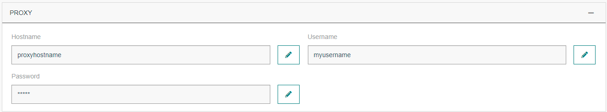

## Creating a Connection With API

To do this, you need to use the **Connections** group resource:

* `POST/connections` to create a new Connection instance
* `PUT/connections` to update a Connection instance
* `DELETE/connections` to delete a Connection instance

:::tip Note
We follow the REST-full API pattern, when updating configuration properties for a connection resource. Thus, you must also provide the whole configuration again.
:::

Example for creation of a new connection instance :

```json
POST /connections
{
  "connectorId": "actility-http-iot",
  "name": "Test HTTP Connection",
  "configuration": {
    "headers": {
      "Authorization": "Bearer eg89a53sx!=",
      "X-Thing": "{DevEUI}",
      "X-Site": "BuildingA"
    },
    "destinationURL": "https://posthere.io/4b29-45f6-94tc",
    "lrcCompliance": true,
		"downlinkAsId": "TWA_199983788.1972.AS",
		"downlinkAsKey": "9311e22d7d44fc52215b0dc154aa1d22",
		"downlinkPort": "1"
  }
}
```

The following table lists the properties applicable to a connection instance.

| Field | Description |
| ------ | ----------- |
| ```connectorId``` | Must be set to actility-http-iot for AWS IoT cloud platform. |
| ```Headers``` | All the keys-value which represents the HTTP headers |
| ```destinationURL``` | Destination URL should contain http:// or https:// protocol |

:::warning Important note
All properties are not present in this example. You can check the rest of these properties in the [common parameters section](../../Getting%20started/Setting%20Up%20A%20Connection%20instance/About_connections#common-parameters).
:::


## Limitations

As for now, there is no known limitations to the HTTP connection.

## Displaying information to know if it worked

1. Go to [ThingPark Actility Enterprise](https://community.thingpark.io/tpe/#/login)

2. Go to the **Devices List** section, and click on the device you want to affect to your HTTP application.

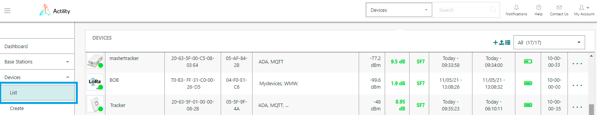

3. When you are on the device's details page, click on **Add an application**.

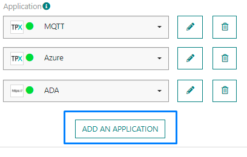

4. Select your HTTP application and click on the **Confirm** icon.

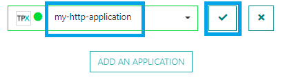

* A notification appears to confirm that the application has been added to the device.


2. Go to the destination URL. For the application above, this is **https://posthere.io/6317-4654-94db**

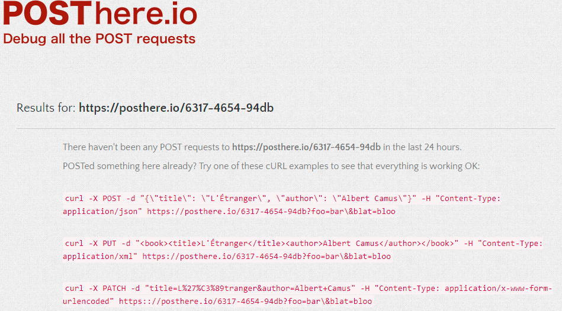

* You can then verify if the uplinks are correctly sent.

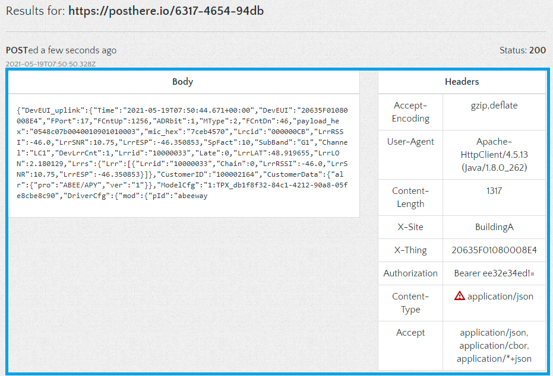

## Sending a downlink

On each uplink message, a URL is provide on the field 'downlinkURL'. You can use this URL in order to **POST** a downlink message.
Follow <a href="https://docs.thingpark.com/thingpark-x/latest/Message/Downlink_Message/#original-message">this documentation</a> to know the expected message format of a downlink.

## Troubleshooting

[comment]: &lt;&gt; (<a name="troubleshooting"></a>)
As for now, there are no detected bugs.
