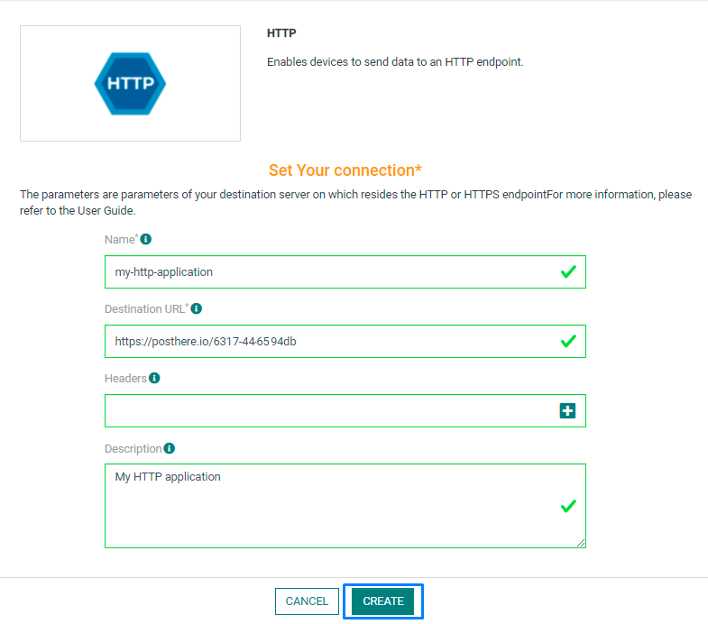
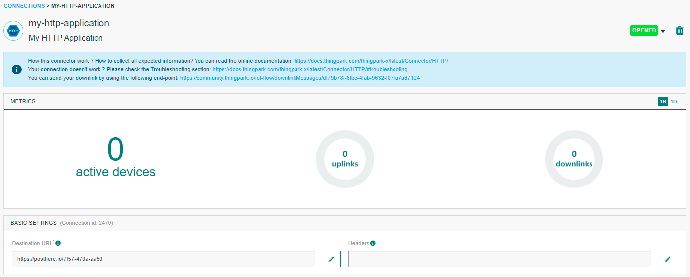
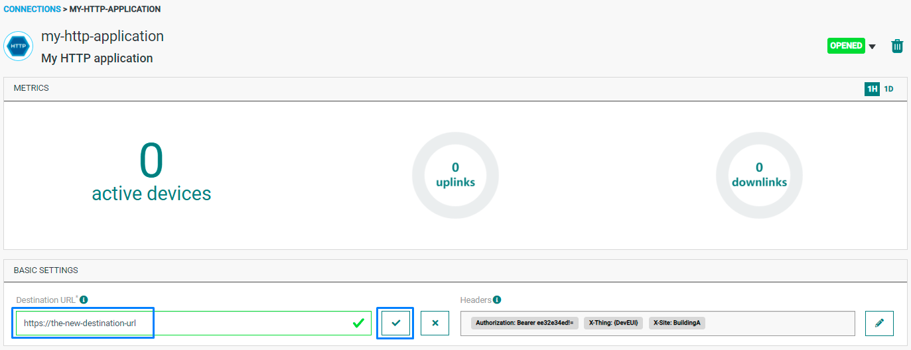
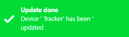
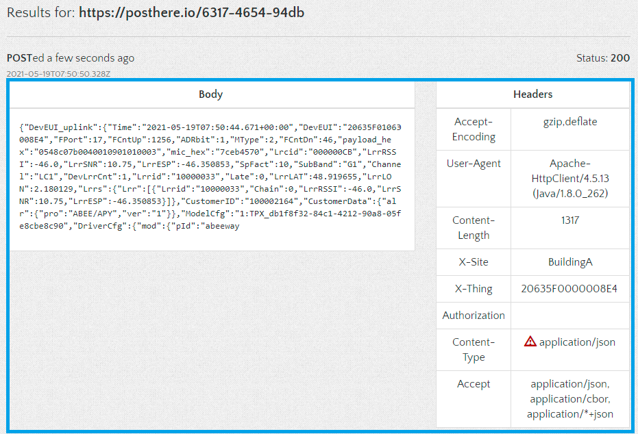

# CREATING A HTTP CONNECTION

## Creating a Connection With API

The creation of a connection establishes a bidirectional messaging transport link between ThingPark X IoT Flow and the cloud provider. Events and commands from multiple Devices will be multiplexed over this messaging transport link.

To do this, you need to use the **Connections** group resource:
*	`POST/connections` to create a new Connection instance
*	`PUT/connections` to update a Connection instance
*	`DELETE/connections` to delete a Connection instance

::: tip Note
We follow the REST-full API pattern, when updating configuration properties for a connection resource. Thus, you must also provide the whole configuration again.
:::

Example for creation of a new connection instance :

```json
POST /connections
{
  "connectorId": "actility-http-iot",
  "name": "Test HTTP Connection",
  "configuration": {
    "headers": {
      "Authorization": "Bearer ee32e34ed!=",
      "X-Thing": "{DevEUI}",
      "X-Site": "BuildingA"
    },
    "destinationURL": "https://posthere.io/4b19-48f6-94cc"
  }
}
```

The following table lists the properties applicable to a connection instance.

| Field | Description |
| ------ | ----------- |
| ```connectorId``` | Must be set to actility-http-iot for AWS IoT cloud platform. |
| ```Headers``` | All the keys-value which represents the HTTP headers |
| ```destinationURL``` | Destination URL should contain http:// or https:// protocol |
| ```blamePeriod``` | Integer, in seconds. If no value is given, its default value is 30. |

::: warning Important note
All properties are not present in this example. You can check the rest of these properties in the [common parameters section](../../Getting_Started/Setting_Up_A_Connection_instance/About_connections.html#common-parameters).
:::

## Creating a Connection From UI

You need to know the parameters that are required to perform this task. To learn more, check the [Parameters required for connecting to a HTTP platform](#HTTPparameters) below in this topic.

1. Click Applications -> Create -> View More Applications Type.


Then, a new page will open. Select the connection type : HTTP.


2. Fill in the form as in the example below and click on **Create**.



::: tip Note
Parameters marked with * are mandatory.
:::

* A notification appears on the upper right side of your screen to confirm that the application has been created.


4. After creating the application, you will be redirected to the application details.



**Changing the Settings after Creation**

You can change the settings parameters such as the destination URL or the Headers after the creation of the HTTP application.

To do this, proceed as follows:

1. Select the HTTP application for which you want to change one or several parameters.

2. In the application information dashboard, click on the **Edit** icon corresponding to the parameter you want to change.


3. Enter the new value, and click on the **Confirm** icon.



* The Confirmation window displays,


* A notification will inform you that the parameter is updated.


<a id="HTTPparameters">**Parameters required for connecting to a HTTP platform**</a>

The parameters are the following:

| UI Field | Description |
| ------ | ----------- |
| **Application Name** | Name of the application that you want to register (Editable). |
| **Destination URL** | The destination URL of your HTTP application (Editable). |
| **Headers** | All the keys-value which represents the HTTP headers (Editable). |
| **Description** | Description of the application that you want to register (Editable). |

## Limitations

As for now, there is no known limitations to the HTTP connection.

## Displaying information to know if it worked

1. Go to [ThingPark Actility Enterprise](https://community.thingpark.io/tpe/#/login)

2. Go to the **Devices List** section, and click on the device you want to affect to your HTTP application.


3. When you are on the device's details page, click on **Add an application**.


4. Select your HTTP application and click on the **Confirm** icon.


* A notification appears to confirm that the application has been added to the device.



2.	Go to the destination URL. For the application above, this is **https://posthere.io/6317-4654-94db**


* You can then verify if the uplinks are correctly sent.



##  Troubleshooting

[comment]: <> (<a name="troubleshooting"></a>)
As for now, there are no detected bugs.
