# CREATING AN IBM WATSON CONNECTION

This setup is intended to be a minimal setup example to get the Watson IoT connector working.
The Watson IoT connector requires the creation of an [IBM Cloud account](https://cloud.ibm.com/) upfront.

## Collecting Expected Information

### First time generating all informations

Follow these steps in order to generate all the informations you need.

Go to the [IBM Watson IoT Dashboard](https://myibm.ibm.com/dashboard/)

1.	Click the **Devices** link in the left menu, then click on the **Device Types** section, and then click on the **Add Device Type** button.

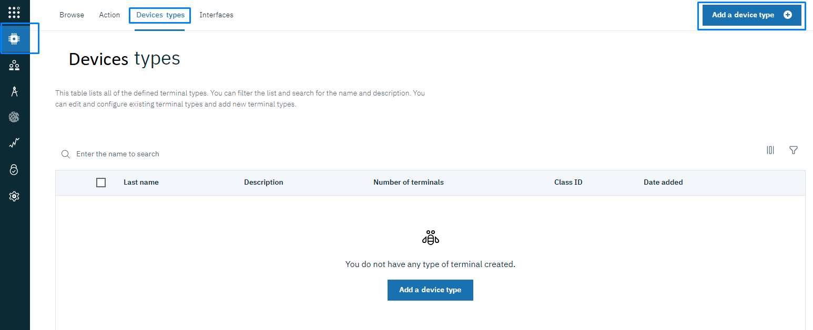

2. First, create the Gateway type: fill the Name value, click Next.

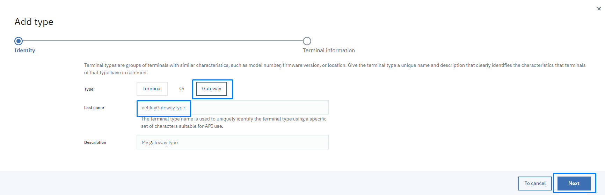

3. Click **Done** to create the gateway Type.

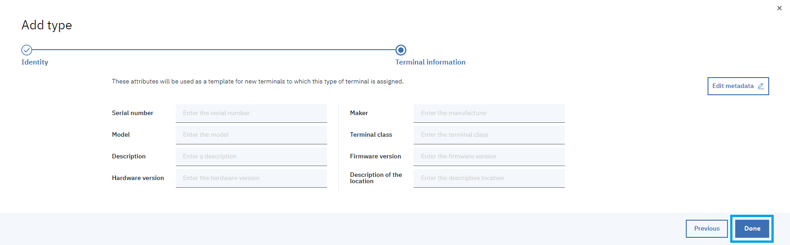

3. Repeat the same action to create the Device type.


Mettre un tip note warning be sure to copy these infos or else you will have to regenerate them

### Organization ID

Go to the IBM Watson Iot Platform's dashboard page. You should see the Organization ID in the top right corner.

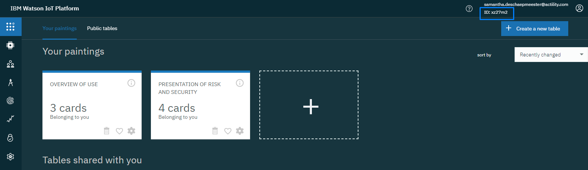

### API Key

On the Watson dashboard right corner or in the url you can find the orgId value:
https://936ou1.internetofthings.ibmcloud.com/dashboard/devices/browse

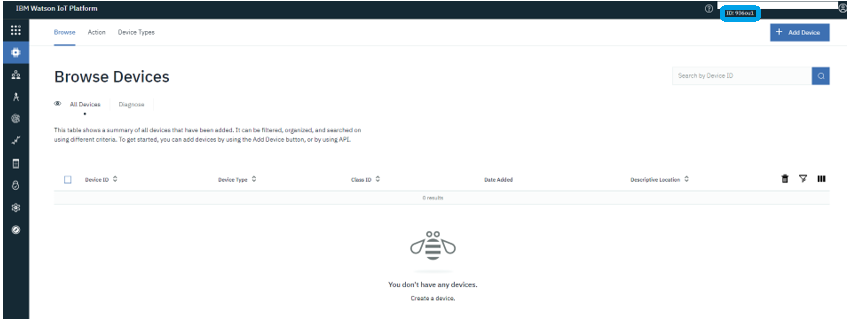

1.	Click the **Devices** link in the left menu, then click on the **Device Types** section, and then click on the **Add Device Type** button.


2.	Create first the Gateway type: fill the Name value, click **Next** and on the next page click **Done**.

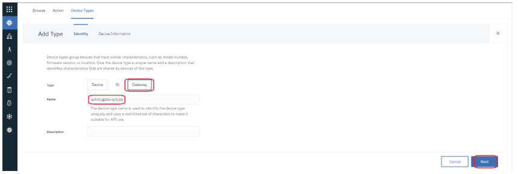

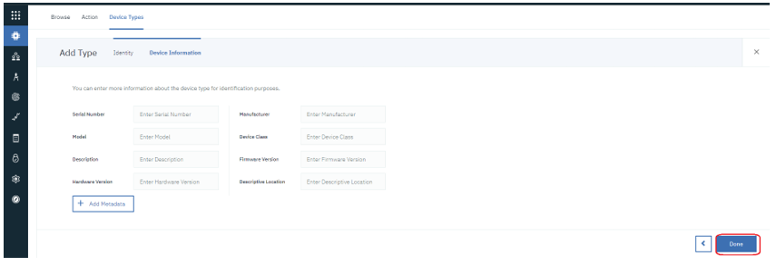

3.	Repeat the same action for creating the Device type.

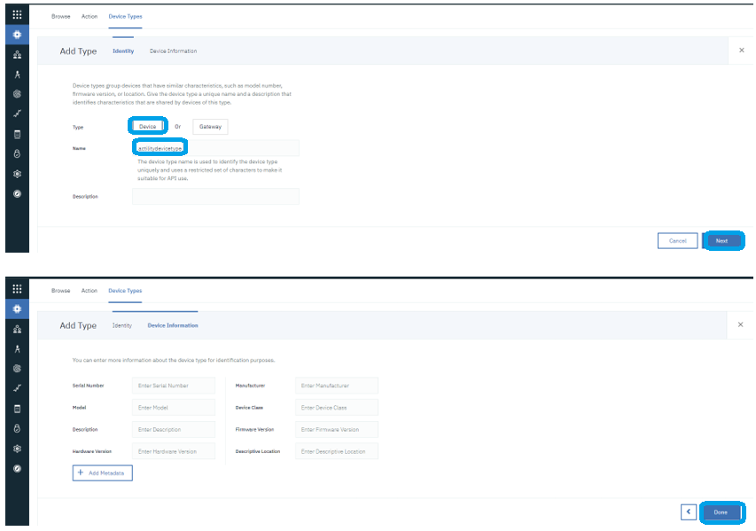

4.	On the **Device Types** list you should see the newly created Device types:

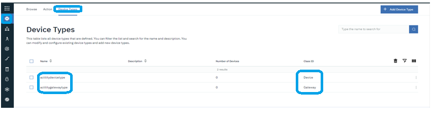

5.	Create now a Gateway. Go to **Device** and click **Add Device**:

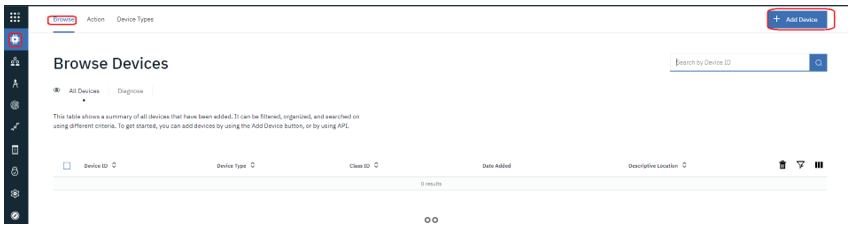

6.	On **Identity** tab select the gateway type previously created, fill the gateway id and click **Next**.

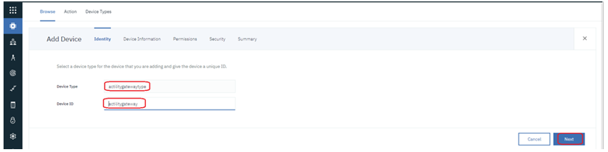

7.	On the **Device information** tab click **Next**.

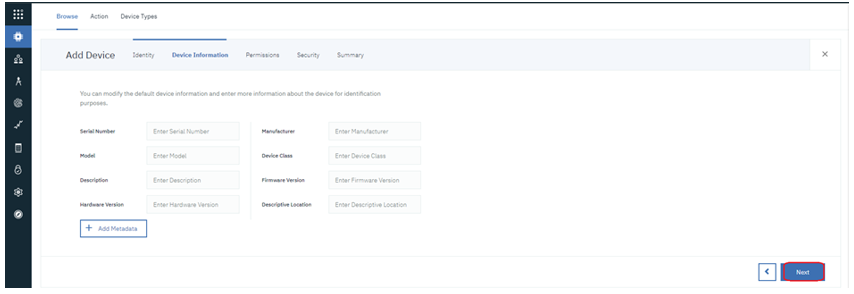

8.	On the **Permissions** tab select **Privileged Gateway** and click Next (read [this](https://developer.ibm.com/technologies/iot/) to understand the difference between Standard and Privileged Gateway):

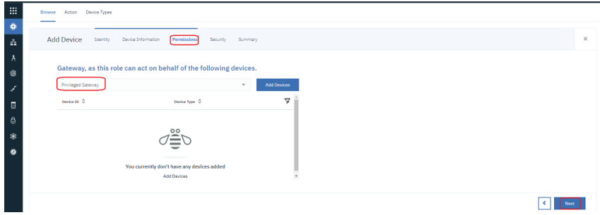

9.	On the **Security** tab leave Authentication Token empty to let Watson auto-generate one for you and click **Next**.

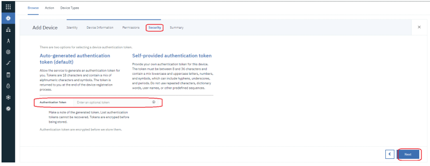

10.	On **Summary** tab click **Done**.

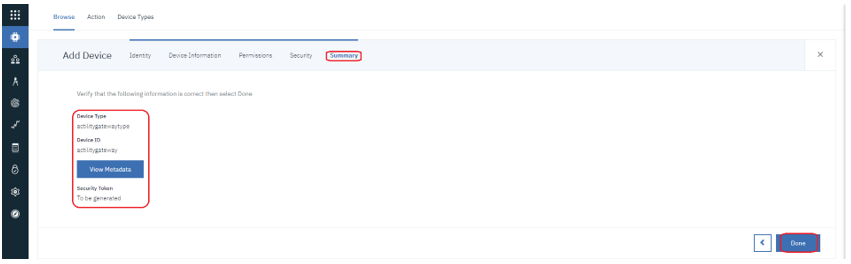

11.	On the final page you have the Organization ID and all gateway info required for the connection configuration:
+	Organization ID is the **orgId**
+	Device ID is the **gatewayId**
+	Device Type is the **gatewayType**
+	Authentication Token is the **gatewayToken**.
     Copy and save this token because generated Authentication tokens are non-recoverable.

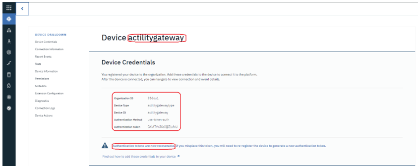


12.	After this we need to create an API Key/token to be used for listing/registering devices under the gateway Device that we created.
13.	Select **Apps** from the left menu and click **Generate API Key**.

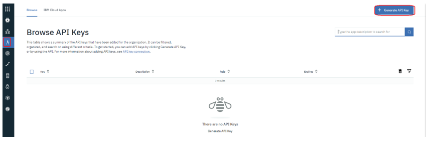

14.	On the **Information** tab select a desired API Key Expiration date and click **Next**:

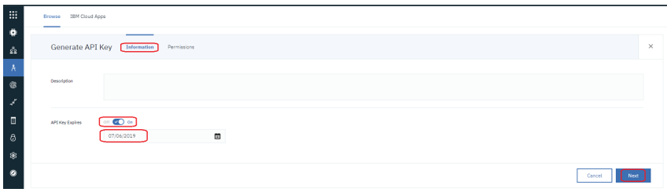

15.	On the **Permissions** tab, select **Standard Application** Role and click **Generate Key**:

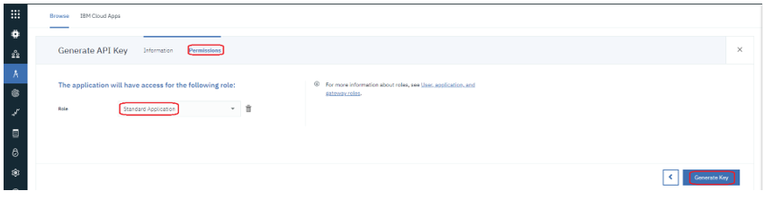


16.	On the final page you get the generated API Key/Token need it for connection configuration:
+	API Key is the **apiKey**
+	Authentication Token is the **apiToken**.
     Copy and save this token because generated Authentication tokens are non-recoverable.

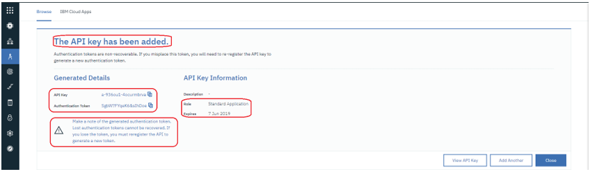

## Creating an IBM Watson IoT Platform
1.	To create an IBM Watson IoT Platform go to [IBM Cloud Dashboard](https://cloud.ibm.com/) and select **Create resource**.

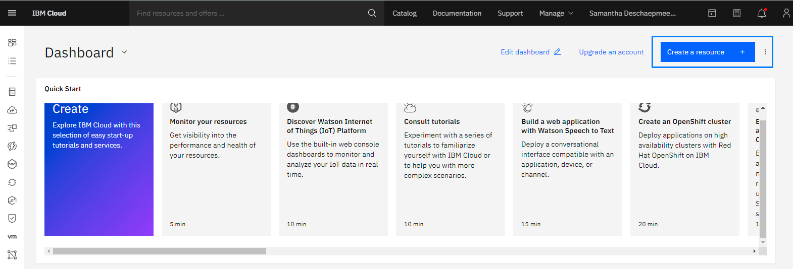

2.	Select **Internet Of Things** Platform:

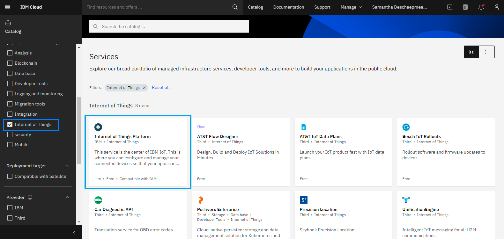

3. Select the region to deploy the application

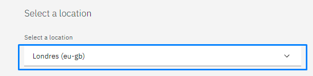

4. Select the pricing plan. For a demo, the Lite/free plan should be ok. For production select a paid plan that fits your needs.

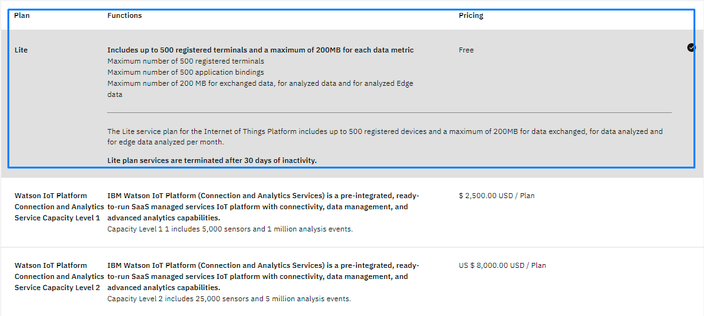

5. Fill in the service name, select the region to deploy and create the organization/space if needed. After filling the form, click **Create**.

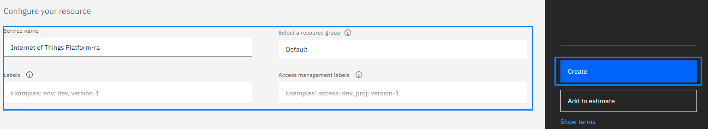


6.	Finally, on the next screen, click **Launch** to start the IoT Platform:

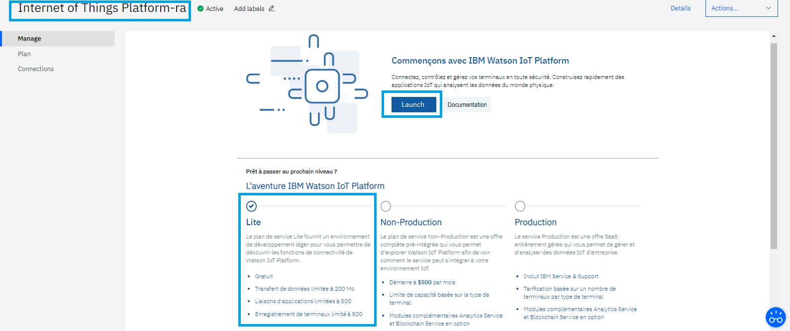

* You will be redirected to the newly created IBM Watson IoT Platform dashboard. Do not forget to copy the organization ID.

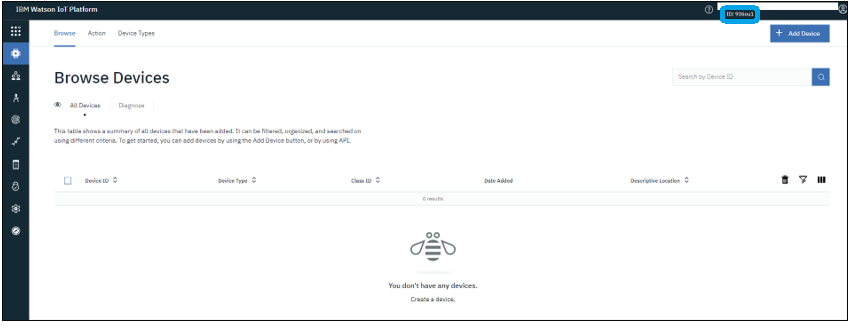

## Creating a Connection With API

MQTT over TLS is the protocol used by Watson.
You need to create the connection prior to creating the flow.
The creation of a connection establishes a link from ThingPark Wireless to the cloud provider that you want to associate a Device with. The link can be used to transport any Uplink regardless the DevEUI parameter.
To do this, you need to use the following endpoints:
+	```POST/connections``` for creation
+	```PUT/connections``` for modification
+	```DELETE/connections``` for deletion

::: tip Note
When you update a configuration property on a connection, you must provide the whole configuration properties again.
:::

Example of the creation of a connection.

```json
    POST /connections

{
  "connectorId": "actility-watson-iot",
  "name": "Watson Demo Connection",
  "configuration": {
    "description": "Watson Datacenter",
    "orgId": "936ou1",
    "deviceType": "actilitydevicetype",
    "gatewayType": "actilitygatewaytype",
    "gatewayId": "actilitygateway",
    "gatewayToken": "GXvfTVxJXoI@Z(ufxU",
    "apiKey": "a-936ou1-4ocurmbrva",
    "apiToken": "SgbW?FYqeK6&sIhDoe"
  }
}
```

The following table lists the expected results of the properties when applied:

| Property | Expected results |
| ------| -----------|
| ```connectorId```   | Set to ```actility-watson-iot``` |
| ```configuration/orgId``` | Organization id of the Watson IoT account. |
| ```configuration/gatewayId```    | Id of the Watson IoT gateway used by the connector. |
| ```configuration/gatewayType``` | Watson IoT gateway type of the Watson IoT gateway used by the connector. |
| ```configuration/gatewayToken``` | Authentication token of the Watson IoT gateway used by the connector. |
| ```configuration/deviceType``` | 	Watson IoT Device type to be associated with the Devices processed by the connector. |
| ```configuration/apiKey``` | API Key of the Watson IoT application to be associated with the connector. |
| ```configuration/apiToken``` | Authentication Token of the Watson IoT application to be associated with the connector. |

::: warning Important note
All properties are not present in this example. You can check the rest of these properties in the [common parameters section](../../Getting_Started/Setting_Up_A_Connection_instance/About_connections.html#common-parameters).
:::

## Creating a Connection From UI

1. Click Applications -> Create -> View More Applications Type.


Then, a new page will open. Select the connection type : IBM Watson IoT.

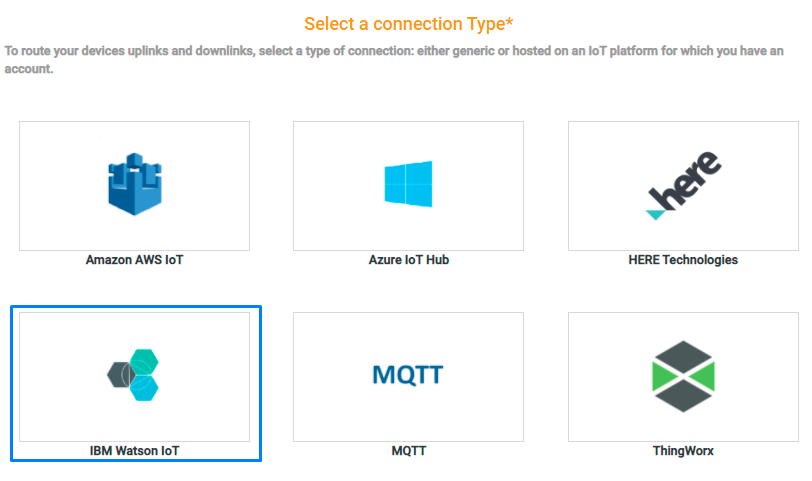

2. Fill in the form as in the example below and click on **Create**.

## Limitations
Look on Watson IoT Platform [Quotas](https://www.ibm.com/support/knowledgecenter/en/SSQP8H/iot/platform/reference/quotas.html) for choosing a Watson plan that suits your needs.
We recommend that you use the Standard plan for production and the lite plan for testing purposes.

## Displaying Information to Know if it Worked
1.	Go to the Watson dashboard and select **Device** from the left menu.
2.	Select the Device that you want to monitor and go to **Recent Events** tab and wait for uplinks to be displayed.
      You should see something like this:

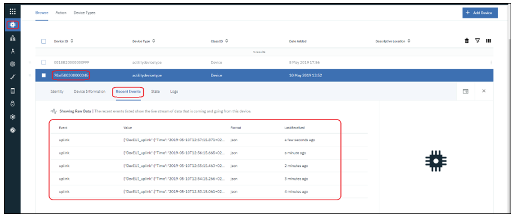

##  Troubleshooting

[comment]: <> (<a name="troubleshooting"></a>)

As for now, there are no detected bugs.

[comment]: <> (<hyvor></hyvor>)
