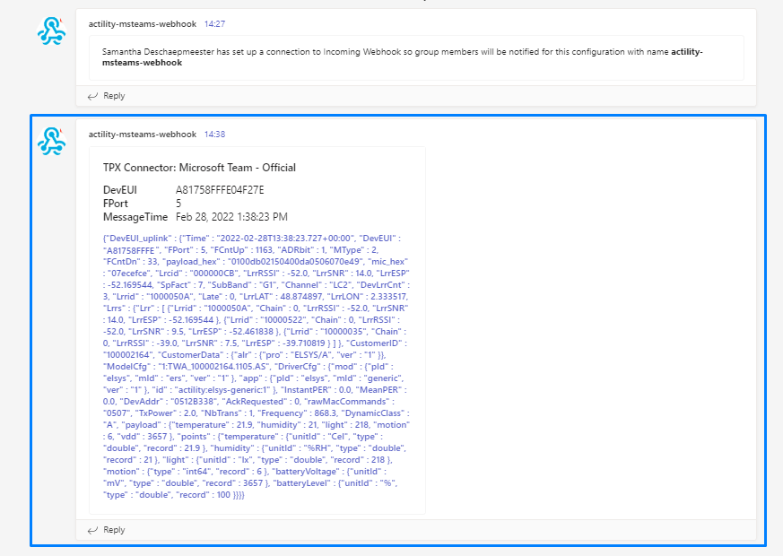

# CREATING A MICROSOFT TEAMS CONNECTION

This setup is intended to be a minimal setup example to get the Microsoft Teams connector working.

## Collecting Expected Information

<a id="TEAMSparam">**Parameters required**</a>

| UI Field | Description |
| ------ | ----------- |
| **Application Name** | Name of the application that you want to register (Editable). |
| **Webhook URL** | Defines the destination in a Microsoft Teams channel, private or not (Editable). |
| **Description** | Any useful information to describe the connection. (Editable) |

### Webhook URL

Follow these steps to retrieve the webhook URL.

1. Open your Microsoft Teams application. Click on **Teams**.


2. Click on the three dots (...) next to the team you want to add your channel in. Click on **Add a new channel**.


3. Add a name for your channel and its privacy then click on **Create**.


4. Click on the three dots (...) at the top right corner. Select **Connectors**.


5. Select **Incomming Webhook**.


6. Add a name for your webhook and click on **Create**.


7. Enter your webhook connection name. Copy the displayed Webhook URL and click on **Done**.


8. A message will show up in the chat indicating that you've successfully created the webhook.


## Creating a Connection With API

The creation of a connection establishes a bidirectional messaging transport link between ThingPark X IoT Flow and the cloud provider. Events and commands from multiple Devices will be multiplexed over this messaging transport link.

To do this, you need to use the **Connections** group resource:

* `POST/connections` to create a new Connection instance
* `PUT/connections` to update a Connection instance
* `DELETE/connections` to delete a Connection instance

:::tip Note
We follow the REST-full API pattern, when updating configuration properties for a connection resource. Thus, you must also provide the whole configuration again.
:::

Example for creation of a new connection instance :

```json
POST /connections
{
    "connectorId": "actility-microsoft-teams",
    "name": "Actility Teams uplinks",
    "configuration": {
        "destinationUrl": "https://actilitysa.webhook.office.com/webhooku5/58q02d40-2s1e-45e3-9c53-c8c2hy1fd1"
    }
}
```

| JSON Field | Description |
| ------ | ----------- |
| ```connectorId``` | Must be set to ```actility-microsoft-teams``` for the Microsoft Teams platform. |
| ```destinationUrl``` | Defines the destination in a Microsoft Teams channel, private or not. |

:::warning Important note
All properties are not present in this example. You can check the rest of these properties in the [common parameters section](../../../Getting_Started/Setting_Up_A_Connection_instance/About_connections.html#common-parameters).
:::

## Creating a Connection From UI

You must have an active Microsoft Teams account prior to creating a Microsoft Teams connection in ThingPark.

You also need to know the parameters that are required to perform this task. To learn more, check the <a href="#TEAMSparam">Parameters required for connecting to a Microsoft Teams platform</a> section.

1. Click on **Connections** -&gt; **Create** -&gt; **ThingPark X Iot Flow**.


Then, a new page will open. Select the connection type : **Microsoft Teams**.


2. Fill in the form as in the example below and click on **Create**.


:::tip Note
Parameters marked with * are mandatory.
:::

* A notification appears on the upper right side of your screen to confirm that the application has been created.


4. After creating the application, you will be redirected to the application details.


**Changing the Settings after Creation**

You can change the settings parameters such as the Webhook URL after the creation of the Microsoft Teams application.

To do this, proceed as follows:

1. Select the Microsoft Teams application for which you want to change one or several parameters.

2. In the application information dashboard, click on the **Edit** button corresponding to the parameter you want to change.


3. Enter the new value, and click on the **Confirm** icon.


* The Confirmation window displays,


* A notification will inform you that the parameter is updated.


## Limitations

You can check the <a href="https://docs.microsoft.com/en-us/microsoftteams/limits-specifications-teams">Limits and specifications for Microsoft Teams</a> for more informations.

## Troubleshooting

There are currently no detected bugs yet.

## Displaying information to know if it worked

In order to display the informations concerning your connection, select your Microsoft Teams channel in which you configured your webhook.

* You should see the upcoming messages in the chat.


