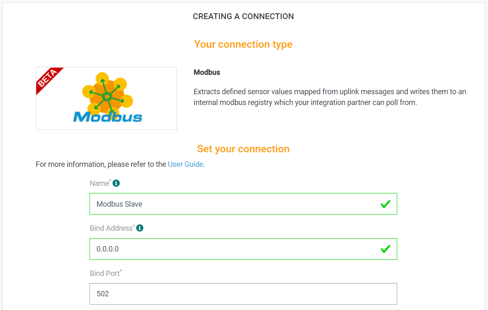
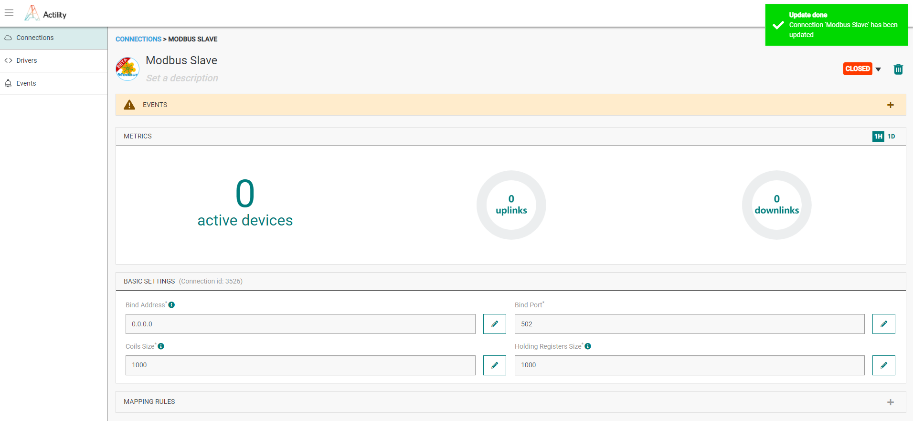
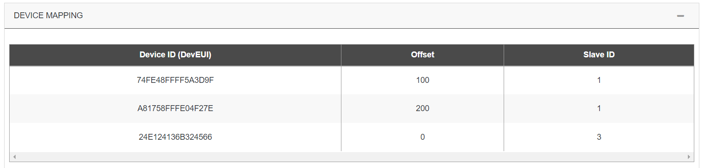

# CREATING A MODBUS CONNECTION
The creation of a connection establishes a unidirectional (uplink) messaging transport link between ThingPark X IoT Flow and an embedded MODBUS slave. Values that come from your devices are mapped to MODBUS register values with the required mapping. The partners can connect to the MODBUS slave and poll the written registry values via their own MODBUS slave implementations.

Two ways for publishing a value to a register : 
1. Direct mapping : A pointer to a data is mapped to a register address of a slave ID.
2. Templated mapping : A type of device (Eg. Milesight AM103) is mapped to a range of adresse. Another set of rules do the mapping between a device and a slaveID.

## Creating a Connection From UI

You need to know the parameters that are required to perform this task. To learn more, check the [Parameters required for connecting to an MODBUS platform](#MODBUSparameters) below in this topic.

1. Click Connections -> Create -> ThingPark X IoT Flow.


Then, a new page will open. Select the connection type : MODBUS.


2. Fill in the form as in the example below and click on **Create**.



::: tip Note
Parameters marked with * are mandatory.
:::

* A notification appears on the upper right side of your screen to confirm that the application has been created.


4. After creating the application, you will be redirected to the application details.


**Changing the Settings after Creation**

You can change settings parameters such as the destination URL or the Headers after the creation of the MODBUS application.

To do this, proceed as follows:

1. Select the MODBUS application for which you want to change one or several parameters.

2. In the application information dashboard, click on the **Edit** icon corresponding to the parameter you want to change.


3. Enter the new value, and click on the **Confirm** icon.

[comment]: # (The image link below is better replaced with a new screenshot later because the current layout in application UI has some problems )


* The Confirmation window displays,


* A notification will inform you that the parameter is updated.



### Direct Mapping Rules
This first way is very strict but you can control each address allocation.
Each rule mapped a data value of a device to a particular register of a slaveID.


### Templated Rules
This second way can be used with the direct mapping rules. It's more dynamic, the mapping is based on driver output.
1. You need do the relation of a datapath available on the output of a specific driver to a register.


2. You need map a device to slaveID and can use also add an offset for using more space area.


On examples above, if devices 74FE48FFFF5A3D9F and A81758FFFE04F27E are `Advantech Wise 1`, the part of the registry can contain: 
|Device|Data|Register|SlaveID|
| -- | -- | -- | -- |
|74FE48FFFF5A3D9F|/LrrESP|108|1|
|A81758FFFE04F27E|/LrrESP|208|1|
|24E124136B324566|/LrrESP|8|3|
|74FE48FFFF5A3D9F|/payload/Device/BatteryVolt|116|1|
|A81758FFFE04F27E|/payload/Device/BatteryVolt|216|1|

Even if 24E124136B324566 is not an `Advantech Wise 1`, some datas can be extracted if protocol ID used is a star.

# Remark on data types
::: tip Note on Coils
MODBUS coils are registers that hold boolean (true/false) values. So if coilsSize property is set to 1000, this means we can hold 1000 discrete true/false values inside the registry.
:::
Actility MODBUS connector currently supports the following data types which are mapped from an uplink JSON field to one of the data types listed below:
| Data type | Description |
| --------- | ----------- |
| **BOOLEAN** | A single true/false value that is written to a MODBUS coil. The address of the coil that the value will be read from or written to must be specified in the mapping rules configuration property. |
| **INTEGER UNSIGNED (16BITS)** | A 16 bit unsigned INTEGER value that is written to a MODBUS holding register.|
| **INTEGER SIGNED (16BITS)** | A 16 bit signed INTEGER value that is written to a MODBUS holding register.|
| **INTEGER UNSIGNED (32BITS)** | A 16 bit unsigned INTEGER value that is written to a MODBUS holding register.|
| **INTEGER SIGNED (32BITS)** | A 16 bit signed INTEGER value that is written to a MODBUS holding register.|
| **FLOAT** | A 16 bit half precision floating point value that is written to a MODBUS holding register.|
| **DOUBLE** | A 32 bit precision floating point value that is written to a MODBUS holding register.|

::: tip Note on holding registers
MODBUS holding registers are 16 bit length registers that can hold arbitrary values. For example, a single MODBUS holding register can hold one of the following values:
- A 16 bit signed int value
- A 16 bit unsigned int value
- A 16 bit half precision float value
For storing other data types, we need to use multiple registers. How the data is written and read is completely dependent on the implementation.
:::

## Creating a connection with API

To do this, you need to use the **Connections** group resource:

* `POST/connections` to create a new Connection instance
* `PUT/connections` to update a Connection instance
* `DELETE/connections` to delete a Connection instance

::: tip Note
We follow the REST-full API pattern, when updating configuration properties for a connection resource. Thus, you must also provide the whole configuration again.
:::

Example for creation of a new connection instance :

```json
POST /connections
{
	"connectorId": "actility-modbus-iot",
	"name": "Modbus Slave",
	"configuration": {
		"bindAddress": "0.0.0.0",
		"bindPort": 502,
		"coilsSize": 1000,
		"holdingRegistersSize": 1000,
		"mappingRules": [
			{
				"devEUI": "0025CA0A00007E45",
				"data": "/payload/TempHumi/SenVal",
				"register": 100,
				"type": "INTEGER",
				"slaveId": 1
			},
			{
				"devEUI": "0025CA0A00007E45",
				"data": "/LrrSNR",
				"register": 100,
				"type": "FLOAT",
				"slaveId": 1
			},
			{
				"devEUI": "0025CA0A00007E45",
				"data": "/wrongField",
				"register": 120,
				"type": "BOOLEAN",
				"slaveId": 4
			},
			{
				"devEUI": "0025CA0A00007E45",
				"data": "/LrrESP",
				"register": 140,
				"type": "FLOAT",
				"slaveId": 3
			},
			{
				"devEUI": "0025CA0A00007E45",
				"data": "/Late",
				"register": 160,
				"type": "BOOLEAN",
				"slaveId": 3
			}
		],
		"mappingTemplatedRules": {
			"templatingRules": [
				{
					"data": "/DevEUI_uplink/LrrRSSI",
					"protocolId": "*",
					"register": 0,
					"type": "FLOAT"
				},
				{
					"data": "/LrrSNR",
					"protocolId": "*",
					"register": 4,
					"type": "FLOAT"
				},
				{
					"data": "/LrrESP",
					"protocolId": "*",
					"register": 8,
					"type": "FLOAT"
				},
				{
					"data": "/payload/TempHumi/SenVal",
					"protocolId": "advantec:wise:1",
					"register": 12,
					"type": "INTEGER"
				},
				{
					"data": "/payload/Device/BatteryVolt",
					"protocolId": "advantec:wise:1",
					"register": 16,
					"type": "INTEGER"
				},
				{
					"data": "/payload/Accelerometer/X-Axis/Peakmg",
					"protocolId": "advantec:wise:1",
					"register": 20,
					"type": "FLOAT"
				},
				{
					"data": "/payload/Accelerometer/Y-Axis/Peakmg",
					"protocolId": "advantec:wise:1",
					"register": 24,
					"type": "FLOAT"
				},
				{
					"data": "/payload/Accelerometer/Z-Axis/Peakmg",
					"protocolId": "advantec:wise:1",
					"register": 28,
					"type": "FLOAT"
				},
				{
					"tag": [
						"Abeeway",
						"nke"
					],
					"data": "/payload/Accelerometer/Z-Axis/Peakmg",
					"register": 30,
					"type": "FLOAT"
				}
			],
			"deviceToSlaveIds": [
				{
					"deviceEUI": "74FE48FFFF5A3D9F",
					"offset": 100,
					"slaveId": 1
				},
				{
					"deviceEUI": "A81758FFFE04F27E",
					"offset": 200,
					"slaveId": 1
				},
				{
					"deviceEUI": "24E124136B324566",
					"offset": 0,
					"slaveId": 3
				}
			]
		}
	}
}
```

The following table lists properties of a connection instance.

| Field | Description |
| -- | -- |
| ```connectorId``` | Must be set to `actility-modbus-iot`. |
| ```bindAddress``` | The IP address on which the embedded MODBUS slave will bind on in case the server has multiple network interfaces. |
| ```bindPort``` | The port on which the embedded MODBUS slave will be listening on. Only port range from ``502`` to ``507`` are allowed. |
| ```coilsSize``` | The number of MODBUS coils (coils hold boolean true/false values) in the registry. |
| ```holdingRegistersSize``` | The number of MODBUS holding registers (each register holds a 16 bit value) in the registry. |
| ```mappingRules``` | Is an array of rules which describes the mapping between the incoming uplink JSON payload and how it will be represented in the MODBUS registry. |
| ```mappingTemplatedRules/deviceToSlaveIds``` | Is an array of rules which describes the mapping between a data path of a driver and a base address registry. |
| ```mappingTemplatedRules/templatingRules``` | Is an array of rules which describes the mapping between a device and a final MODBUS registry. |

::: warning Important note
All properties are not present in this example. You can check the rest of these properties in the [common parameters section](../../Getting_Started/Setting_Up_A_Connection_instance/About_connections.html#common-parameters).
:::

## Limitations

When the coils size or inputRegistersSize properties of the MODBUS connector is changed, the existing MODBUS registry is wiped out
and a new MODBUS registry is created. Thus, all the existing values inside the registry will be lost.

## Displaying information to know if it worked

1. Send the following uplink packet

 ```json
{
  "DevEUI_uplink": {
    "Time": "2021-10-28T17:04:09.387+00:00",
    "DevEUI": "A30958FFFE05A175",
    "FPort": 5,
    "FCntUp": 69725,
    "ADRbit": 1,
    "MType": 2,
    "FCntDn": 8733,
    "payload_hex": "0100df022904002b0500070e4e",
    "mic_hex": "aadbf8dd",
    "Lrcid": "000000CB",
    "LrrRSSI": -42.0,
    "LrrSNR": 9.25,
    "LrrESP": -42.48772,
    "SpFact": 7,
    "SubBand": "G1",
    "Channel": "LC2",
    "DevLrrCnt": 2,
    "Lrrid": "10000035",
    "Late": 0,
    "Lrrs": {
      "Lrr": [
        {
          "Lrrid": "10000035",
          "Chain": 0,
          "LrrRSSI": -42.0,
          "LrrSNR": 9.25,
          "LrrESP": -42.48772
        },
        {
          "Lrrid": "100001F7",
          "Chain": 0,
          "LrrRSSI": -32.0,
          "LrrSNR": 7.5,
          "LrrESP": -32.710819
        }
      ]
    },
    "CustomerID": "100002164",
    "CustomerData": {
      "alr": {
        "pro": "ELSYS/A",
        "ver": "1"
      }
    },
    "ModelCfg": "1:TWA_100002164.1105.AS",
    "DriverCfg": {
      "mod": {
        "pId": "elsys",
        "mId": "ers",
        "ver": "1"
      },
      "app": {
        "pId": "elsys",
        "mId": "generic",
        "ver": "1"
      }
    },
    "InstantPER": 0.0,
    "MeanPER": 1.1E-5,
    "DevAddr": "0512B338",
    "AckRequested": 0,
    "rawMacCommands": "",
    "TxPower": 2.0,
    "NbTrans": 1,
    "Frequency": 867.3,
    "DynamicClass": "A",
    "payload": {
      "temperature": 19.4,
      "humidity": 46,
      "light": 43,
      "motion": 0,
      "vdd": 3662
    },
    "points": {
      "temperature": {
        "unitId": "Cel",
        "type": "double",
        "record": 19.4
      },
      "humidity": {
        "unitId": "%RH",
        "type": "double",
        "record": 46
      },
      "light": {
        "unitId": "lx",
        "type": "double",
        "record": 43
      },
      "co2Level": {
        "unitId": "ppm",
        "type": "double",
        "record": 43
      },
      "batteryVoltage": {
        "unitId": "mV",
        "type": "double",
        "record": 3662
      },
      "batteryLevel": {
        "unitId": "%",
        "type": "double",
        "record": 101.72
      }
    }
  }
}
 ```

2. Download and unzip the latest release of [Modbus Mechanic](https://github.com/SciFiDryer/ModbusMechanic/#latest-release). 

3. Execute the ModbusMechanic.jar file by double clicking on it inside the extracted ModbusMechanic folder. You should see the GUI shown in the picture below;


4. Fill in the IP and Port values according to your MODBUS connector configuration. Set the SlaveNoe value to 1. Selec the Read Holding Registers (0x03)
command from the dropdown.


5. Enter the register number as 100 and Data value type as Float. Click on Transmit Packet button.
You should see the response value as 19.4


6. Enter the register number as 80 and Data value type as Unsigned Int16. Click on Transmit Packet button.
You should see the response value as 46.


## Troubleshooting
As for now, there are no detected bugs or constraints.