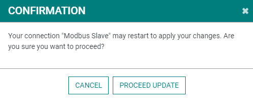

# CREATING A MODBUS CONNECTION

## Creating a connection with API

The creation of a connection establishes a unidirectional (uplink) messaging transport link between ThingPark X IoT Flow and an embedded MODBUS slave. Values that come from your devices are mapped to MODBUS register values with the required mapping. The partners can connect to the MODBUS slave and poll the written registry values via their own MODBUS slave implementations.

To do this, you need to use the **Connections** group resource:
*	`POST/connections` to create a new Connection instance
*	`PUT/connections` to update a Connection instance
*	`DELETE/connections` to delete a Connection instance


::: tip Note
We follow the REST-full API pattern, when updating configuration properties for a connection resource. Thus, you must also provide the whole configuration again.
:::

Example for creation of a new connection instance :

```json
POST /connections
{
    "connectorId": "actility-modbus-iot",
    "name": "Modbus Slave",
    "configuration": {
      "bindAddress": "127.0.0.1",
      "bindPort": 502,
      "coilsSize": 1000,
      "holdingRegistersSize": 1000,
      "mappingRules": [
        {
          "devEUI": "A81758FFFE05A086",
          "data": "/temperature",
          "register": 100,
          "type": "FLOAT"
        },
        {
          "devEUI": "A81758FFFE05A086",
          "data": "/humidity",
          "register": 80,
          "type": "INTEGER"
        }
      ]
    }
}
```

The following table lists properties of a connection instance.

| Field | Description |
| ------ | ----------- |
| ```connectorId``` | Must be set to `actility-modbus-iot`. |
| ```bindAddress``` | The IP address on which the embedded MODBUS slave will bind on in case the server has multiple network interfaces. |
| ```bindPort``` | The port on which the embedded MODBUS slave will be listening on. Only port range from 502 to 507 are allowed. |
| ```coilsSize``` | The number of MODBUS coils (coils hold boolean true/false values) in the registry. |
| ```holdingRegistersSize``` | The number of MODBUS holding registers (each register holds a 16 bit value) in the registry. |
| ```mappingRules``` | Is an array of rules which describes the mapping between the incoming uplink JSON payload and how it will be represented in the MODBUS registry. |

::: tip Note on Coils
MODBUS coils are registers that hold boolean (true/false) values. So if coilsSize property is set to 1000, this means we can hold 1000 discrete true/false values inside the registry.
:::

::: tip Note on holdsing registers
MODBUS holdsing registers are 16 bit length registers that can hold arbitrary values. For example, a single MODBUS holding register can hold one of the following values:
- A 16 bit short value
- A 16 bit unsigned int value
- A 16 bit half precision float value
For storing other data types, we need to use multiple registers. How the data is written and read is completely dependent on the implementation.
:::

Actility MODBUS connector currently supports the following data types which are mapped from an uplink JSON field to one of the data types listed below:
- BOOLEAN: A single true/false value that is written to a MODBUS coil. The address of the coil that the value will be read from or written to must be specified in the mapping rules configuration property.
- INTEGER: A 16 bit signed INTEGER value that is written to a MODBUS holding register. The address of the holding register that the value will be read from or written to must be specified in the mapping rules configuration property.
- FLOAT: A 16 bit half precision floating point value that is written to a MODBUS holding register. The address of the holding register that the value will be read from or written to must be specified in the mapping rules configuration property.
- WORD: A 16 bit signed INTEGER value that is written to a MODBUS holding register. The address of the holding register that the value will be read from or written to must be specified in the mapping rules configuration property.
- DWORD: A 32 bit signed INTEGER value that is written to a MODBUS holding register. The starting address of the holding register that the value will be read from or written to must be specified in the mapping rules configuration property.
Since the value is 32 bits, it will occupy 2 consecutive MODBUS holding registers.

::: warning Important note
All properties are not present in this example. You can check the rest of these properties in the [common parameters section](../../Getting_Started/Setting_Up_A_Connection_instance/About_connections.html#common-parameters).
:::

## Creating a Connection From UI

You need to know the parameters that are required to perform this task. To learn more, check the [Parameters required for connecting to an MODBUS platform](#MODBUSparameters) below in this topic.

1. Click Connections -> Create -> ThingPark X IoT Flow.


Then, a new page will open. Select the connection type : MODBUS.


2. Fill in the form as in the example below and click on **Create**.


::: tip Note
Parameters marked with * are mandatory.
:::

* A notification appears on the upper right side of your screen to confirm that the application has been created.


4. After creating the application, you will be redirected to the application details.


**Changing the Settings after Creation**

You can change the settings parameters such as the destination URL or the Headers after the creation of the MODBUS application.

To do this, proceed as follows:

1. Select the MODBUS application for which you want to change one or several parameters.

2. In the application information dashboard, click on the **Edit** icon corresponding to the parameter you want to change.


3. Enter the new value, and click on the **Confirm** icon.

[comment]: # (The image link below is better replaced with a new screenshot later because the current layout in application UI has some problems )


* The Confirmation window displays,



* A notification will inform you that the parameter is updated.


<a id="MODBUSparameters">**Parameters required for connecting to an MODBUS platform**</a>

The parameters are the following:

| Field | Description |
| ------ | ----------- |
| ```name``` | Name of the application that you want to register (Editable). |
| ```bindPort``` | The port on which the embedded MODBUS slave will be listening on |
| ```coilsSize``` | The number of MODBUS coils (coils hold boolean true/false values) in the registry|
| ```holdingRegistersSize``` | The number of MODBUS holding registers (each register holds a 16 bit value) in the registry|
| ```mappingRules``` | Is an array of rules which describes the mapping between the incoming uplink JSON payload and how it will be represented in the MODBUS registry|
| ```description``` | Description of the application that you want to register (Editable). |

## Limitations

When the coils size or inputRegistersSize properties of the MODBUS connector is changed, the existing MODBUS registry is wiped out
and a new MODBUS registry is created. Thus, all the existing values inside the registry will be lost.

## Displaying information to know if it worked

1. Send the following uplink packet to tpx flow

 ```json
{
    "DevEUI_uplink": {
    "Time": "2021-11-17T22:43:11.508+00:00",
    "DevEUI": "A81758FFFE05A086",
    "FPort": 5,
    "FCntUp": 42435,
    "ADRbit": 1,
    "MType": 2,
    "FCntDn": 3789,
    "payload_hex": "0100c0022c04000005000601eb070e48",
    "mic_hex": "c5b05fbc",
    "Lrcid": "000000CB",
    "LrrRSSI": -63.0,
    "LrrSNR": 9.5,
    "LrrESP": -63.461838,
    "SpFact": 7,
    "SubBand": "G2",
    "Channel": "LC4",
    "DevLrrCnt": 2,
    "Lrrid": "10000035",
    "Late": 0,
    "Lrrs": {
        "Lrr": [
        {
        "Lrrid": "10000035",
        "Chain": 0,
        "LrrRSSI": -63.0,
        "LrrSNR": 9.5,
        "LrrESP": -63.461838
        },
        {
        "Lrrid": "100001F7",
        "Chain": 0,
        "LrrRSSI": -52.0,
        "LrrSNR": 8.75,
        "LrrESP": -52.543648
        }
        ]
    },
    "CustomerID": "100002164",
    "CustomerData": {
        "alr": {
        "pro": "ELSYS/A",
        "ver": "1"
        }
    },
    "ModelCfg": "1:TWA_100002164.1105.AS",
    "DriverCfg": {
        "mod": {
            "pId": "elsys",
            "mId": "ers",
            "ver": "1"
        },
        "app": {
            "pId": "elsys",
            "mId": "generic",
            "ver": "1"
        },
        "id": "actility:elsys-generic:1"
    },
    "InstantPER": 0.0,
    "MeanPER": 0.016031,
    "DevAddr": "04114328",
    "AckRequested": 0,
    "rawMacCommands": "",
    "TxPower": 2.0,
    "NbTrans": 1,
    "Frequency": 867.7,
    "DynamicClass": "A",
    "payload": {
        "temperature": 19.4,
        "humidity": 46,
        "light": 0,
        "motion": 0,
        "co2": 491,
        "vdd": 3656
    },
    "points": {
        "temperature": {
        "unitId": "Cel",
        "type": "double",
        "record": 19.4
    },
    "humidity": {
        "unitId": "%RH",
        "type": "double",
        "record": 46
    },
    "light": {
        "unitId": "lx",
        "type": "double",
        "record": 0
    },
    "motion": {
        "type": "int64",
        "record": 0
    },
    "co2Level": {
        "unitId": "ppm",
        "type": "double",
        "record": 491
    },
    "batteryVoltage": {
        "unitId": "mV",
        "type": "double",
        "record": 3656
    },
    "batteryLevel": {
        "unitId": "%",
        "type": "double",
        "record": 101.56
    }
    }
    }
}
 ```

2. Download and install a MODBUS master, for example [Modbus Mechanic](https://github.com/SciFiDryer/ModbusMechanic).

2. Download the latest release [ModbusMechanic.v2.0.zip](https://github.com/SciFiDryer/ModbusMechanic/releases/download/v2.0/ModbusMechanic.v2.0.zip)
and extract the zip file.

3. Execute the ModbusMechanic.jar file by double clicking on it inside the extracted ModbusMechanic folder. You should see the GUI shown in the picture below;


4. Fill in the IP and Port values according to your MODBUS connector configuration. Set the SlaveNoe value to 1. Selec the Read Holding Registers (0x03)
command from the dropdown.


5. Enter the register number as 100 and Data value type as Float. Click on Transmit Packet button.
You should see the response value as 19.4


6. Enter the register number as 80 and Data value type as Unsigned Int16. Click on Transmit Packet button.
You should see the response value as 46.


## Troubleshooting

[comment]: <> (<a name="troubleshooting"></a>)
As for now, there are no detected bugs.

[comment]: <> (<hyvor></hyvor>)
