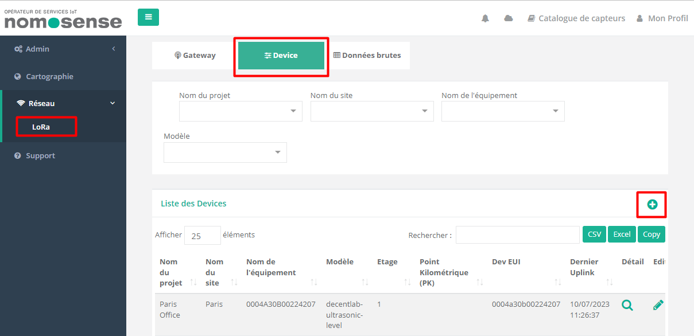

# CREATING A NOMOSENSE CONNECTION

## Collecting Expected Information

**Parameters required**

| Field | Description |
| ------ | ----------- |
| ```Application Name``` | Name of the application that you want to register. |
| ```Nomosense Key``` | The key generated in your Nomosense account. |

### Nomosense key

The Nomosense Key is an **API key** generated on your Nomosense account.
Follow these [Nomosense documentation](https://docs.nomosense.com/get-started/devices#configuring-connectivity) on connectivity part.


## Creating a Connection With UI

1. Click Applications -&gt; Create -&gt; View More Applications Type.


Then, a new page will open. Select the connection type: **Nomosense**.


2. Fill in the form as in the example below and click on **Create**.


:::tip Note
Parameters marked with * are mandatory.
:::

* A notification appears on the upper right side of your screen to confirm that the application has been created.


4. After creating the application, you will be redirected to the application details.


**Changing the Settings after Creation**

You can change the settings parameters such as the application name or the Nomosense key.

To do this, proceed as follows:

1. Select the NOMOSENSE application for which you want to change one or several parameters.

2. In the application information dashboard, click on the **Edit** button corresponding to the parameter you want to change.


3. Enter the new value and click on the **Confirm** icon.

* The Confirmation window displays,


A notification will inform you that the parameter is updated.


## Creating a Connection With API

The creation of a connection establishes a unidirectional messaging transport link to Nomosense.
To do this, you need to use the **Connections** group resource:

* `POST/connections` to create a new Connection instance
* `PUT/connections` to update a Connection instance
* `DELETE/connections` to delete a Connection instance

:::tip Note
We follow the REST-full API pattern, when updating configuration properties for a connection resource. Thus, you must also provide the whole configuration again.
:::

Example for creation of a new connection instance :

```json
POST /connections
{
  "name":"Actility To Nomosense",
  "connectorId":"actility-http-iot",
  "configuration": {
      "description": "My first Nomosense connection.",
      "destinationURL":"https://iot.nomosense.com/api/lora/message/actility-tpe?apikey={API KEY}"
  },
  "brand":"NOMOSENSE"
}
```

The following table lists the properties applicable to a connection instance.

| Field | Description |
| ------ | ----------- |
| ```connectorId``` | Must be set to actility-http-iot for NOMOSENSE platform. |
| ```configuration/description``` | Description of the application. |
| ```configuration/destinationURL``` | Must be set to **https://iot.nomosense.com/api/lora/message/actility-tpe?apikey={API KEY}**. |
| ```brand``` | Must be set to ```NOMOSENSE```. |

:::warning Important note
All properties are not present in this example. You can check the rest of these properties in the [common parameters section](../../../Getting_Started/Setting_Up_A_Connection_instance/About_connections.html#common-parameters).
:::

## Displaying information to know if it worked

1.	Connect to your [NOMOSENSE account](https://iot.nomosense.com/login).

2. Go to the **Network/Lora** section, select the **Device** tab and click on the plus to add a new device.



3. After a while, on list of devices, you must check the last uplink date column to know if uplinks are well received.


## Downlink support
The downlink way is not managed by Nomosense, but you can send your own downlink directly using the downlinkURL.


## Limitations

There are currently no known limitations to the NOMOSENSE connector, except downlink.

## Troubleshooting

As for now, there are no detected bugs.
