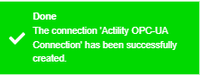
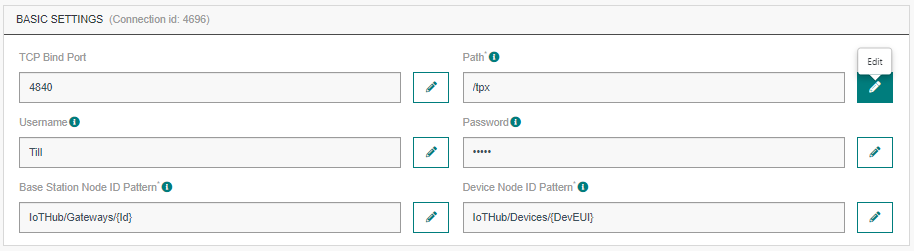
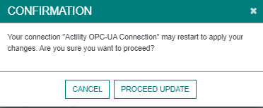

# CREATING AN OPC-UA CONNECTION

::: tip Note
The OPC-UA connector is available only on Thingpark Entreprise OCP version
:::

The creation of a connection establishes a unidirectional from your devices and gateways to an embedded OPC-UA server.
Uplinks from devices are decoded and automatically mapped to OPC-UA namespace node values, gateways statistics are also exposed to this embedded OPC-UA server.
You can connect to the embedded OPC-UA server and query the namespace node values via their own OPC-UA client implementations.

This OPC-UA server contain a discovery mechanism. It's good practice to provide a discovery-specific endpoint with no security.
It's required practice if all regular endpoints have security configured. Usage of the "/discovery" suffix is defined by OPC UA Part 6:
```Each OPC UA Server Application implements the Discovery Service Set. If the OPC UA Server requires a different address for this Endpoint it shall create the address by appending the path "/discovery" to its base address.```

## Creating a Connection From UI

You need to know parameters required to perform this task. To learn more, check the [Parameters required for connecting to an OPC-UA platform](#OPCUAparameters) below in this topic.

1. Click Connections -> Create -> ThingPark X IoT Flow.


Then, a new page will open. Select the connection type : OPCUA.


2. Fill in the form as in the example below and click on **Create**.


::: tip Note
Parameters marked with * are mandatory.
:::

* A notification appears on the upper right side of your screen to confirm that the application has been created.



4. After creating the application, you will be redirected to the application details.


**Changing the Settings after Creation**
You can change the settings parameters such as the destination URL or the Headers after the creation of the OPCUA application.

To do this, proceed as follows:

1. Select the OPC-UA application for which you want to change one or several parameters.

2. In the application information dashboard, click on the **Edit** icon corresponding to the parameter you want to change.



3. Enter the new value, and click on the **Confirm** icon.


* The Confirmation window displays,



* A notification will inform you that the parameter is updated.


<a id="OPCUAparameters">**Parameters required for connecting for an OPC-UA platform**</a>

The parameters are the following:

| Field | Description |
| ------ | ----------- |
| ```bindAddress``` | The IP address on which the embedded OPC-UA server will bind on in case the server has multiple network interfaces. |
| ```domainName``` | Domain name representing the OPC-UA server for the connector. If not sure, give the same IP than the bindAddress. |
| ```discoveryPath``` | Represent the endpointUrl for the discovery feature of OCP-UA server. The value /discovery still recommanded by default.|
| ```tcpBindPort``` | The port on which the embedded OPC-UA server listens to for the TCP transport profile (4840 to 4845 allowed) |
| ```path``` | The baseURI for accessing embedded the OPC-UA server. |
| ```username``` | Username used for basic authentication to the OPC-UA server. |
| ```password``` | Password used for basic authentication to the OPC-UA server. |

## Creating a Connection With API

To do this, you need to use the **Connections** group resource:

* `POST/connections` to create a new Connection instance
* `PUT/connections` to update a Connection instance
* `DELETE/connections` to delete a Connection instance

::: tip Note
We follow the REST-full API pattern, when updating configuration properties for a connection resource. Thus, you must also provide the whole configuration again.
:::

Example for creation of a new connection instance :

```json
POST /connections
{
    "connectorId": "actility-opcua-iot",
    "name": "Actility OPC-UA Connection",
    "configuration": {
      "bindAddress": "0.0.0.0",
      "domainName": "opcua.company.com",
      "discoveryPath": "/discovery",
      "tcpBindPort": 4840,
      "path": "/tpx",
      "username": "Till",
      "password": "Lindemann"
    }
}
```

The following table lists the properties applicable to a connection instance.

| Field | Description |
| ------ | ----------- |
| ```bindAddress``` | The IP address on which the embedded OPC-UA server will bind on in case the server has multiple network interfaces. |
| ```domainName``` | Domain name representing the OPC-UA server for the connector. If not sure, give the same IP than the bindAddress. |
| ```discoveryPath``` | Represent the endpointUrl for the discovery feature of OCP-UA server. The value /discovery still recommanded by default.|
| ```tcpBindPort``` | The port on which the embedded OPC-UA server listens to for the TCP transport profile (4840 to 4845 allowed) |
| ```path``` | The baseURI for accessing embedded the OPC-UA server. |
| ```username``` | Username used for basic authentication to the OPC-UA server. |
| ```password``` | Password used for basic authentication to the OPC-UA server. |

::: warning Important note
All properties are not present in this example. You can check the rest of these properties in the [common parameters section](../../Getting_Started/Setting_Up_A_Connection_instance/About_connections.html#common-parameters).
:::

## Limitations

If any one of the bindAddress, domainName or tcpBindPort properties do change, the existing OPC-Ua namespace has to be
wiped out and re-created. Thus, all the existing values inside the namespace will be lost.
TCP port range is limited from 4840 to 4845.

## Displaying information to know if it worked

1. Download and install an OPC-UA client, for example [UA-Expert](https://www.unified-automation.com/downloads/opc-ua-clients.html).

2. Go to the **Devices List** section, and click on the device you want to affect to your OPC-UA application.


3. When you are on the device's details page, click on **Add an application**.


4. Select your OPC-UA application and click on the **Confirm** icon.

* A notification appears to confirm that the application has been added to the device.


5. Connect to the embedded OPC-UA namespace via the OPC-UA client you downloaded from the configured address


* You can then browse the contents of the embedded OPC-UA namespace to verify whether the namespace is updated/populated according the the defined DevEUIs and mapping rules configuration of your connection.


## Structure of the OPC-UA Namespace

OPC-UA namespace is organized into a folder hierarchy. The top (root) folder of the namespace is named IoTHub;


Under the IotHub folder, there are two folders called Devices and Gateways.

- Devices folder holds the devices that have received uplink packets.
- Gateways folder holds the base stations.

### Devices Folder

When a device receives an uplink packet first time, a folder with that deviceEui name is created under the Devices.


When you expand a device subfolder, you can see the device attributes listed;


When you click on an attribute, you can see the type and value of the attribute (and many other information not specified here) from the Attributes tab on the right panel of your OPC-UA client.


### Gateways Folder

A scheduled job periodically runs to collect the base stations and creates folders corresponding to the id of each base station.


When you expand a Gateway subfolder, you can see the base station attributes listed;


When you click on an attribute, you can see the type and value of the attribute (and many other information not specified here) from the Attributes tab on the right panel of your OPC-UA client.

