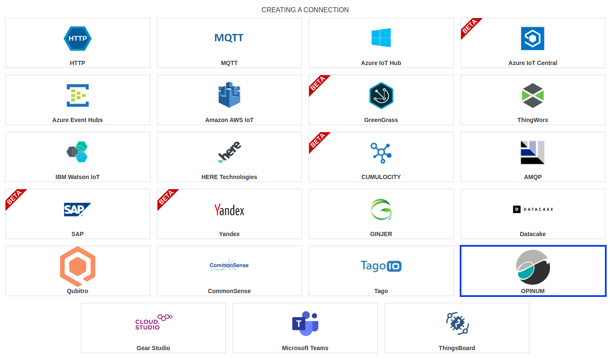
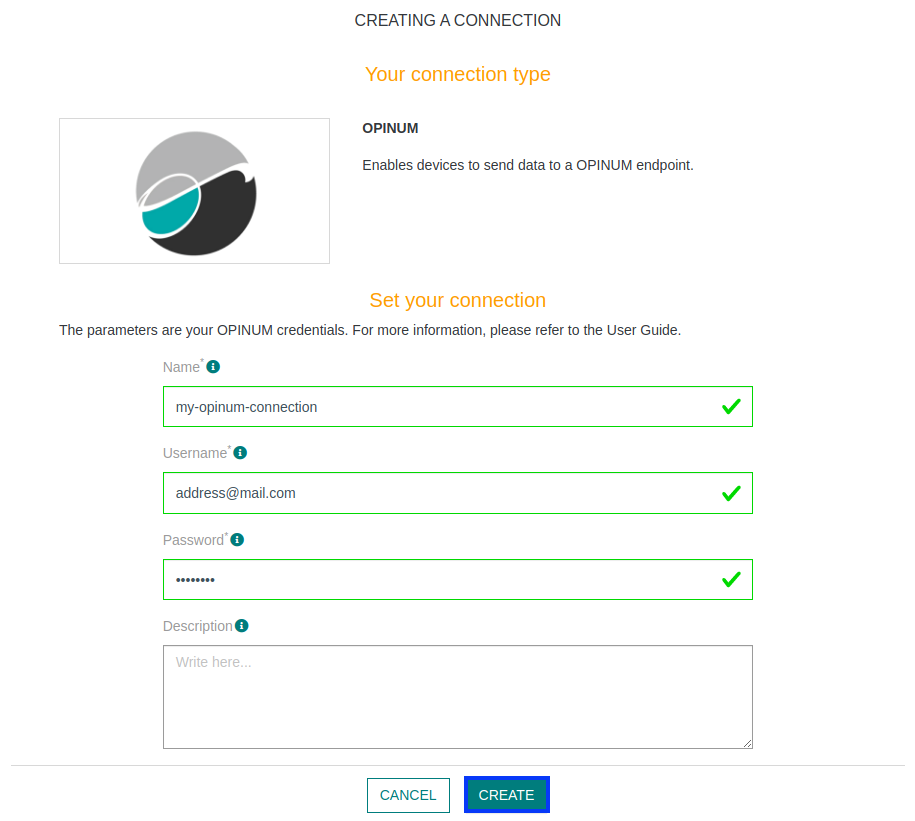
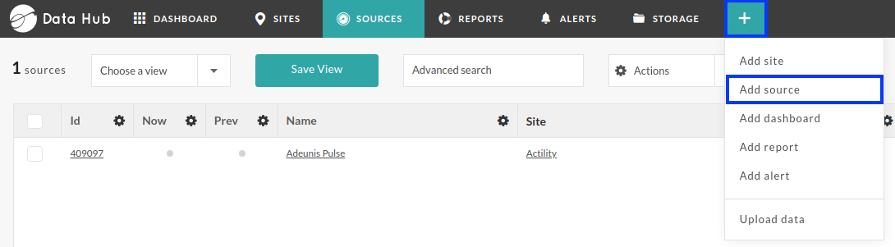
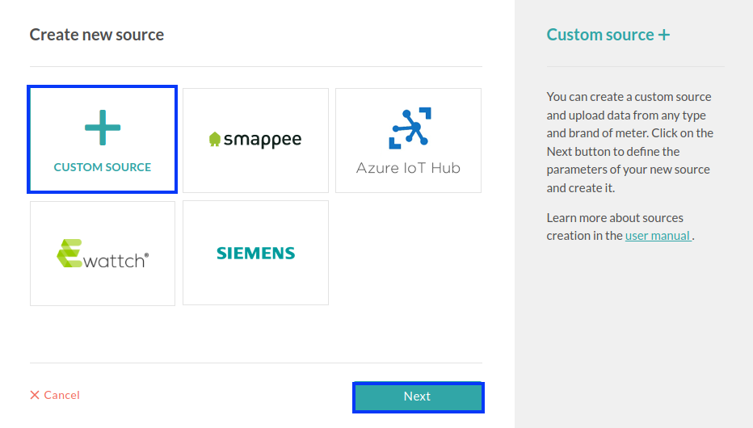
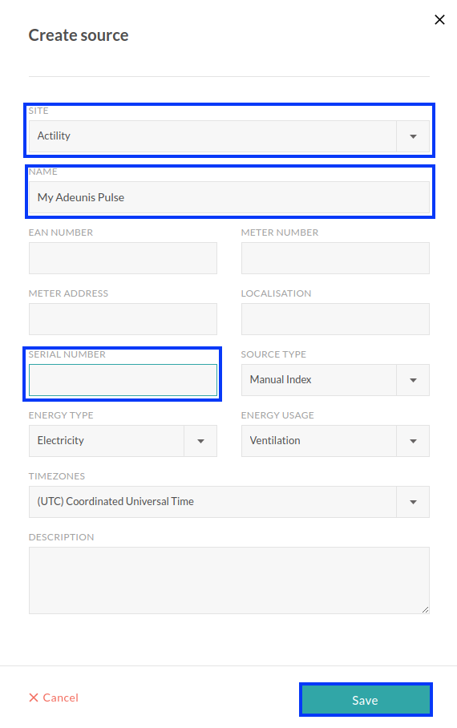
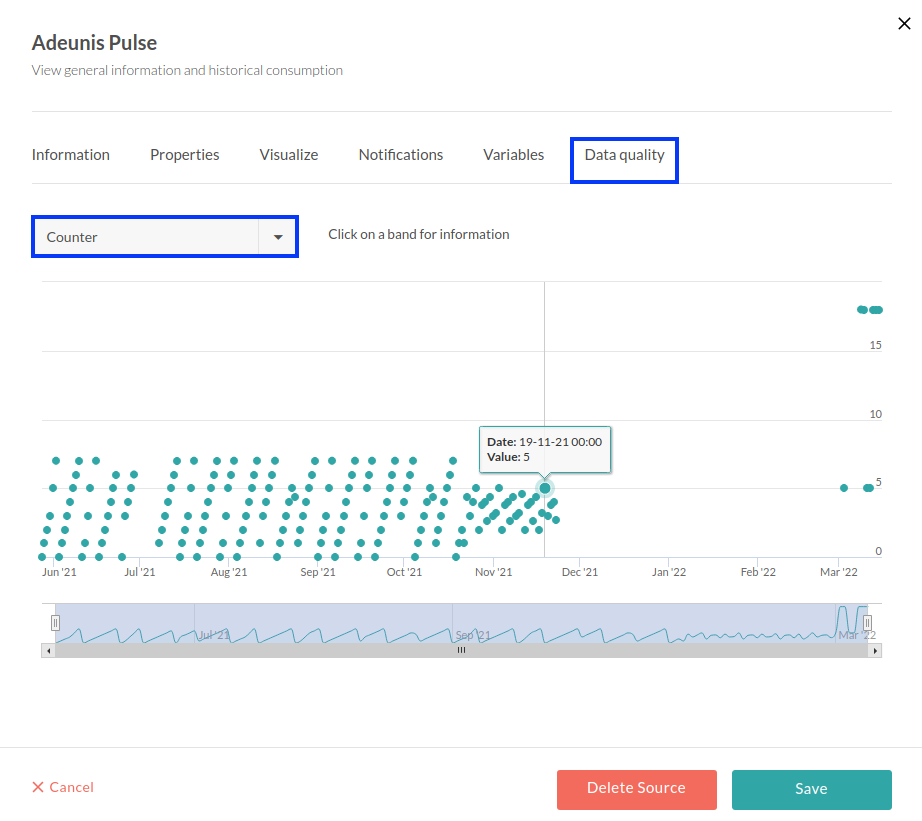

# CREATING A OPINUM CONNECTION

## Collecting Expected Information

**Parameters required**

| Field | Description |
| ------ | ----------- |
| ```Username``` | Your Opinum datahub username |
| ```Password``` | Your Opinum datahub password |

These two fields are credentials used during Opinum Data Hub connection.

## Creating a Connection With API

The creation of a connection establishes a unidirectional messaging transport link to the cloud provider.

To do this, you need to use the **Connections** group resource:
*	`POST/connections` to create a new Connection instance
*	`PUT/connections` to update a Connection instance
*	`DELETE/connections` to delete a Connection instance


:::tip Note
We follow the REST-full API pattern, when updating configuration properties for a connection resource. Thus, you must also provide the whole configuration again.
:::

Example for creation of a new connection instance :

```json
POST /connections
{
  "name":"Actility To Opinum",
  "connectorId":"actility-http-iot",
  "configuration": {
      "username":"email@address.com",
      "password":"myPassword123"
  },
  "brand":"OPINUM"
}
```

The following table lists the properties applicable to a connection instance.

| Field | Description |
| ------ | ----------- |
| ```connectorId``` | Must be set to actility-http-iot for Opinum platform. |
| ```configuration/username``` | Must be replaced by your Opinum datahub username. |
| ```configuration/password``` | Must be replaced by your Opinum datahub password. |
| ```brand``` | Must be set to ```OPINUM```. |

:::warning Important note
All properties are not present in this example. You can check the rest of these properties in the [common parameters section](../../../Getting_Started/Setting_Up_A_Connection_instance/About_connections.html#common-parameters).
:::

## Creating a Connection With UI

:::warning
As for now, **Adeunis Pulse**  is the only compliant device with Opinum.
:::

1. Click Connections -> Create -> **ThingPark X IoT Flow**


2. Then, a new page will open. Select the connection type: **Opinum**.


3. Fill in the form as in the example below and click on **Create**.


:::tip Note
Parameters marked with * are mandatory.
:::

4. A notification appears on the upper right side of your screen to confirm that the application has been created.

5. After creating the application, you will be redirected to the connection details.

## Limitations

Limitations depends on Account Plan you own.

## Displaying information to know if it worked

1.	Connect to your **Opinum** account.

2.	Click the **More** button, and select **Add source**.



3. Select **Custom Source**, and press **Next** button


4. Fill the form. **SITE**, **NAME** and **SERIAL NUMBER** are mandatory. **SERIAL NUMBER** corresponds to your device **EUI**.


5. Now wait a few minutes to your device to send a message.

6. Finally, go to your device informations section, then, navigate to **Data quality** section, to see if data is available.


## Troubleshooting

As for now, there are no detected bugs.

* Opinum documentation: [https://docs.opinum.com/](https://docs.opinum.com/)
