# CREATING A SPLUNK CLOUD CONNECTION

## Creating a Connection from the UI
1. Click ADD CONNECTION from the UI.
   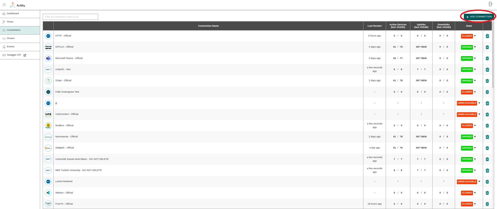
   
   Then, a new page will open. Select the connection type : Splunk

   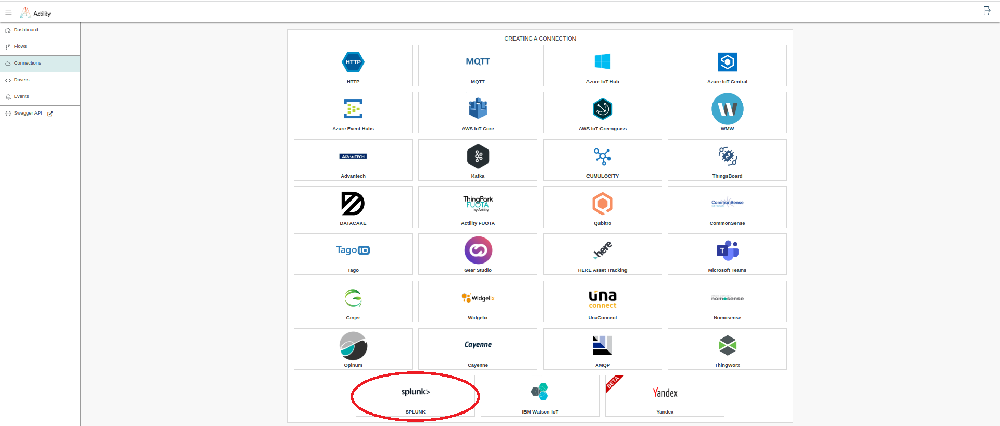 

   ::: tip Note
   The application creation form is the same for a JSON enriched document as for a JSON legacy document.
   :::

2. Fill in the form as in the example below.

   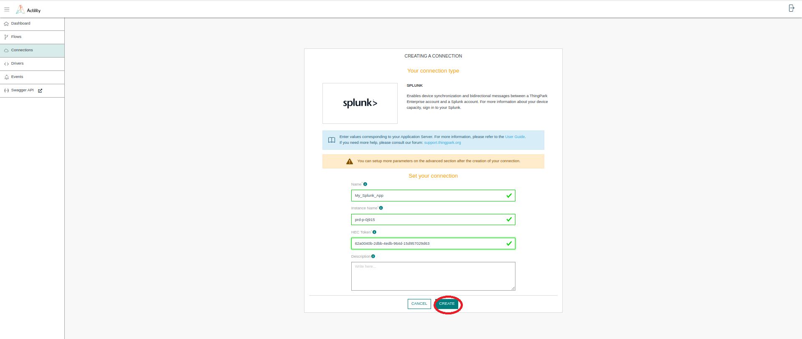

::: tip Note
Parameters marked with * are mandatory.
:::

3. Click **Create**.

* A notification appears on the upper right side of your screen to confirm that the application has been created.


4. After creating the application, you will be redirected to the application details.

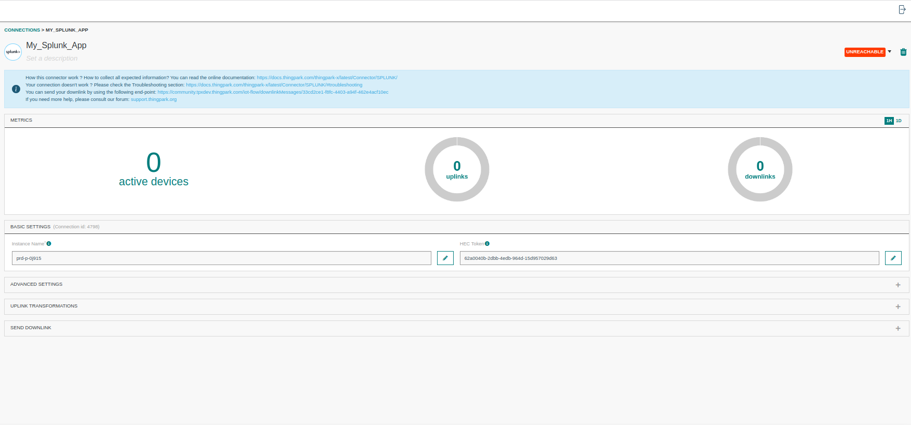

<a id="requiredParameters">**Parameters required for connecting to a Splunk application**</a>

The parameters are the following:

| UI Field                   | Description |
|----------------------------|  |
| **Instance Name**          | The splunk cloud instance name. |
| **HEC Token**              | The HTTP Event Collector Token generated in the Splunk Cloud platform.|

## Creating a Connection With API
You need to create a SPLUNK Connector instance (Connection) before you can associate it to device(s). For more information, see [Creating a Connection instance](#connectionCreation).
The creation of a Connection establishes a link from ThingPark IoT Flow to the MQTT Broker. The link can be used to publish Uplink and related metadata information for any device associated to this instance of MQTT Connector, but will also publish messages that may have been redirected from other Connectors.

To do this, you need to use the following endpoints:
+	```POST/connections``` for creation
+	```PUT/connections``` for modification
+	```DELETE/connections``` for deletion

::: tip Note
When you want to update a configuration property on a Connection, you must provide all configuration properties again.
:::

Example of the creation of a Connection.


```json
    POST /connections

  {
   "connectorId": "actility-splunk-iot",
   "name": "Test Splunk Connection",
   "configuration": {
      "instanceName": "prd-p-rfi0r",
      "hecToken": "7f434de6-5a89-41a7-b7e7-0bff81fb1a80"
    }
  }
```

The following table lists the expected results of the properties when applied.

| Property                                | Expected results                                            |
|-----------------------------------------|-------------------------------------------------------------|
| ```connectorId```                       | Must be set to actility-mqtt-iot for Splunk cloud platform. |
| ```configuration/instanceName```        | The splunk cloud instance name                              |
| ```configuration/hecToken```            | The HTTP Event Collector Token                              |


::: warning Important note
All properties are not present in this example. You can check the rest of these properties in the [common parameters section](../../Getting_Started/Setting_Up_A_Connection_instance/About_connections.html#common-parameters).
:::

## Limitations

There are currently no known limitations to the SPLUNK connector.

## How to test the SPLUNK Connection

1. Set up a new Splunk Cloud account from https://www.splunk.com/en_us/download/splunk-cloud/cloud-trial.html.

2. Login to your Splunk Cloud instance with the sent verification Email. Your splunk cloud instance name will be part of your splunk cloud login url. (For eg: instance name = "prd-p-rfi0r" for https://prd-p-rfi0r.splunkcloud.com).

3. Click Settings > Add Data.

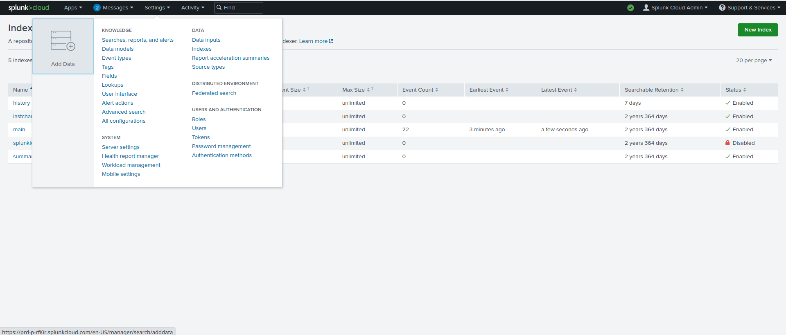

4. Click Monitor.

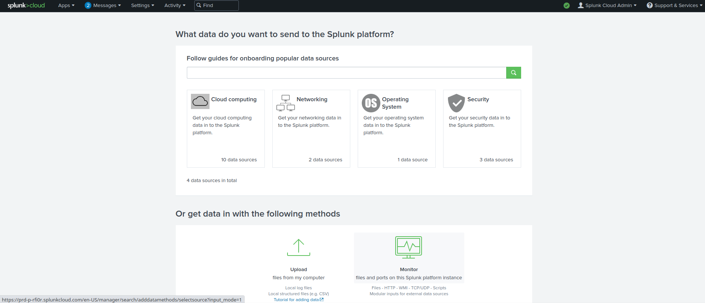

5. Click HTTP Event Collector.

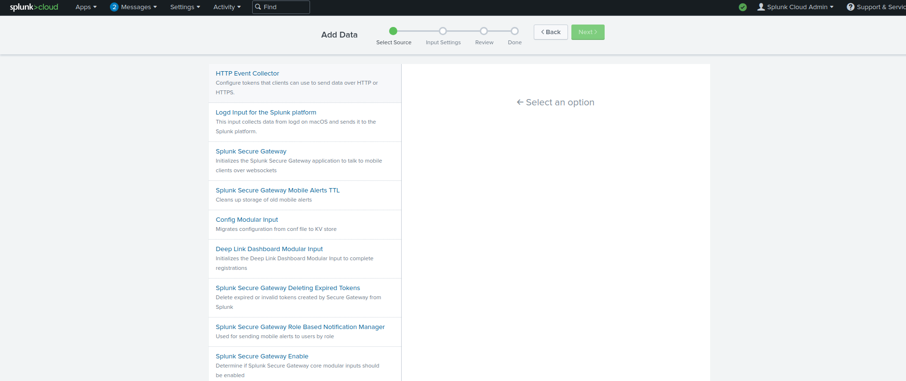

6. In the Name field, enter a name for the token.

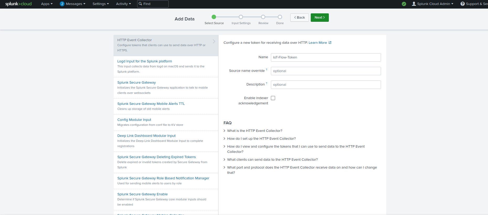

7. Select the index(es) that you want the HTTP Collector Events to be stored in. Select the Source Type as Structured -> _json. Click REVIEW. 

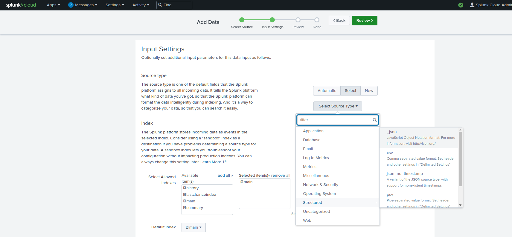

8. The created HEC Token can be modified or viewed from Settings -> Data Inputs. The token value must be provided as the 'configuration/hecToken' value in IoT-Flow SPLUNK Connector settings.

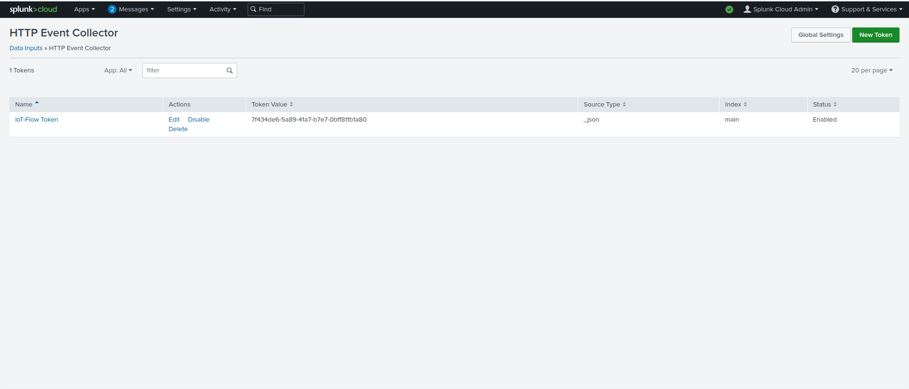

9. You can verify that your splunk cloud HTTP Event Collector has received uplinks from Iot-Flow by checking Settings -> Indexes. The index that you configured your HEC to store the collected events will have its EventCount increased as it receives uplinks from IoT-Flow.

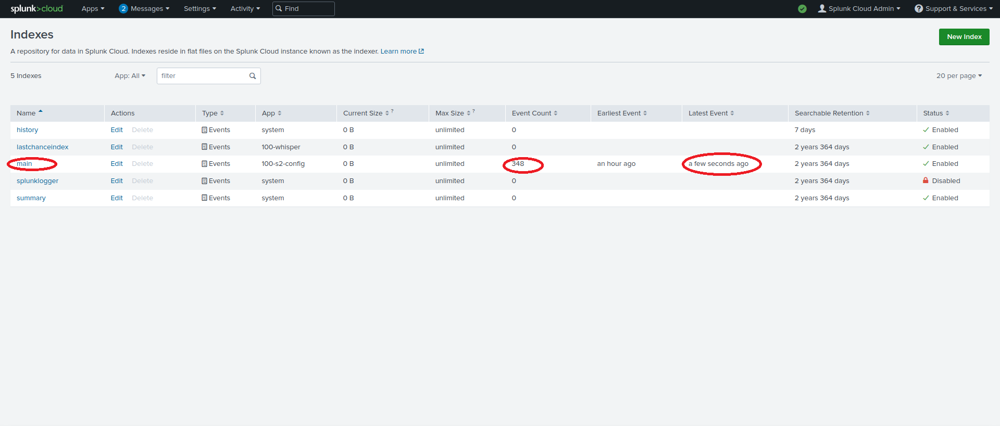