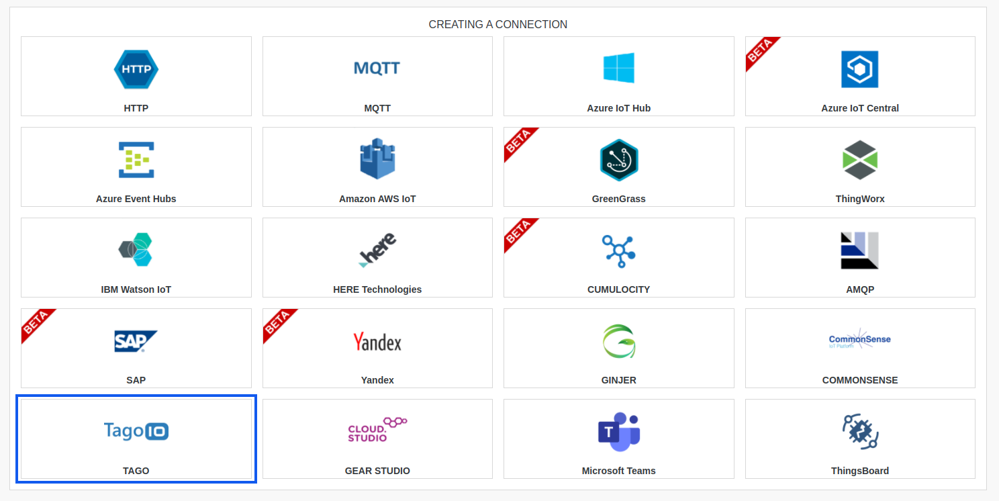
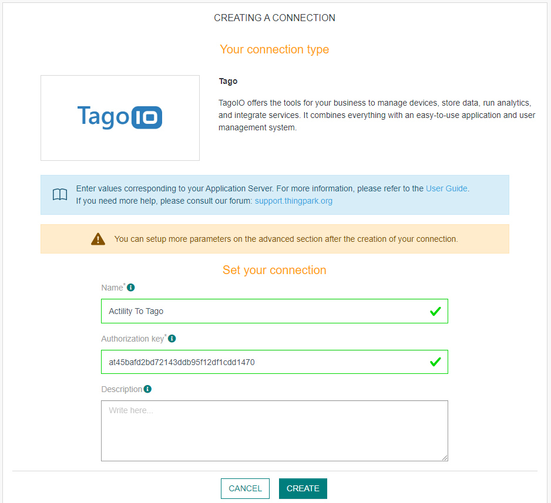
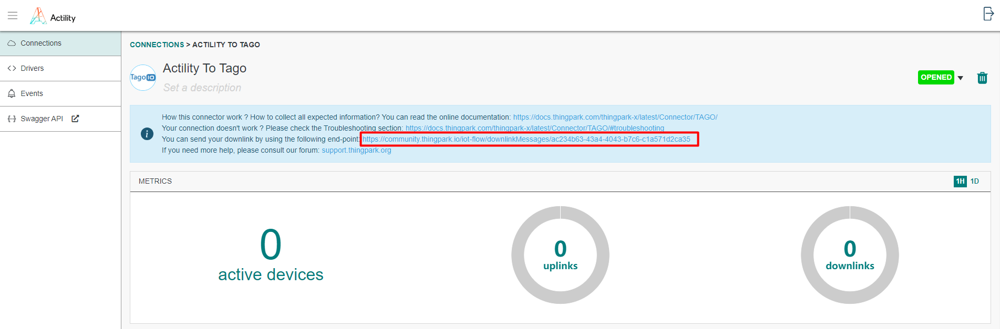
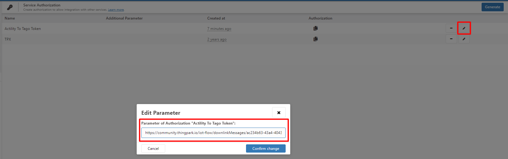

# CREATING A TAGO CONNECTION

## Collecting Expected Information

**Parameters required**

| Field | Description |
| ------ | ----------- |
| ```Authorization``` | The key generated [here](https://admin.tago.io/devices/authorization).|

### Generate Authorization

The **Authorization** is a key generated in [TAGO](https://admin.tago.io/).
Follow these steps to generate a new **Authorization** in your TAGO admin interface:

1. Open this [link](https://admin.tago.io/). Go to the **Devices** section, and **Authorization** in the top right corner.


2. You can now copy your **Authorization** key, by clicking the **Copy** button.


## Creating a Connection With API

The creation of a connection establishes a unidirectional messaging transport link to the cloud provider.

To do this, you need to use the **Connections** group resource:
*	`POST/connections` to create a new Connection instance
*	`PUT/connections` to update a Connection instance
*	`DELETE/connections` to delete a Connection instance


::: tip Note
We follow the REST-full API pattern, when updating configuration properties for a connection resource. Thus, you must also provide the whole configuration again.
:::

Example for creation of a new connection instance :

```json
POST /connections
{
  "name":"Actility To Tago",
  "connectorId":"actility-http-iot",
  "configuration": {
      "destinationURL":"https://actility.middleware.tago.io/uplink?authorization={YOUR-AUTHORIZATION}"
  },
  "brand":"TAGO"
}
```

The following table lists the properties applicable to a connection instance.

| Field | Description |
| ------ | ----------- |
| ```connectorId``` | Must be set to actility-http-iot for Tago platform. |
| ```configuration/destinationURL/authorization``` | Must be replaced by your Authorization Token (refer to [this section](#authorization)). |
| ```brand``` | Must be set to ```TAGO```. |

::: warning Important note
All properties are not present in this example. You can check the rest of these properties in the [common parameters section](../../../Getting_Started/Setting_Up_A_Connection_instance/About_connections.html#common-parameters).
:::

## Creating a Connection With UI

1. Click Connections -> Create -> **ThingPark X IoT Flow**


2. Then, a new page will open. Select the connection type: **Tago**.



3. Fill in the form as in the example below and click on **Create**.



::: tip Note
Parameters marked with * are mandatory.
:::

4. A notification appears on the upper right side of your screen to confirm that the application has been created.

5. After creating the application, you will be redirected to the connection details.

6. Once you are redirected on connection UI, copy the downlink URL that is on the blue panel.



7. Paste this downlink URL on the Tago Authorization section (click on the pen button).



## Limitations

Limitations depends on Account Plan you own (refer to this [link](https://docs.tago.io/en/articles/114-account-plans)).

## Displaying information to know if it worked

1.	Connect to your [TAGO account](https://admin.tago.io/).

2.	Go to **Devices** section and click the **"+ Add Device"** button to create a new **Device**.


3.  Choose **LoRaWan Actility** in the scrolling menu, and look for the **Device** model you want to add.


4.  Fill in the form, with the **Device name** and the **Device EUI** (find **Device EUI** at https://yourdomain.com/tpe/#/devices/list)


5.  Wait a few minutes, to see if you get an **input** from your **Device** (see exemple bellow).


You can also create dashboard to see live uplinks.


## Sending a downlink
1.	Dashboard + Analysis Method:
The most common method is to utilize a combination of a Dashboard and an Analysis. This allows you to send downlink commands to devices directly from the Dashboard interface. You can find detailed instructions on how to set up this method in our documentation here: [Downlinks Using Dashboards](https://help.tago.io/portal/en/kb/articles/221-downlinks-using-dashboards).

2.	Device Configuration Parameters:
Another quick method is by using the Device Configuration Parameters feature in TagoIO. This allows you to define specific parameters that can be sent as downlink commands to your devices. You can find step-by-step instructions on how to implement this method in our documentation here: [Downlink for LoRaWAN](https://help.tago.io/portal/en/kb/articles/220-downlink-for-lorawan).

## Troubleshooting

As for now, there are no detected bugs.

* Tago documentation: [https://help.tago.io/portal/en/kb/tagoio](https://help.tago.io/portal/en/kb/tagoio)
