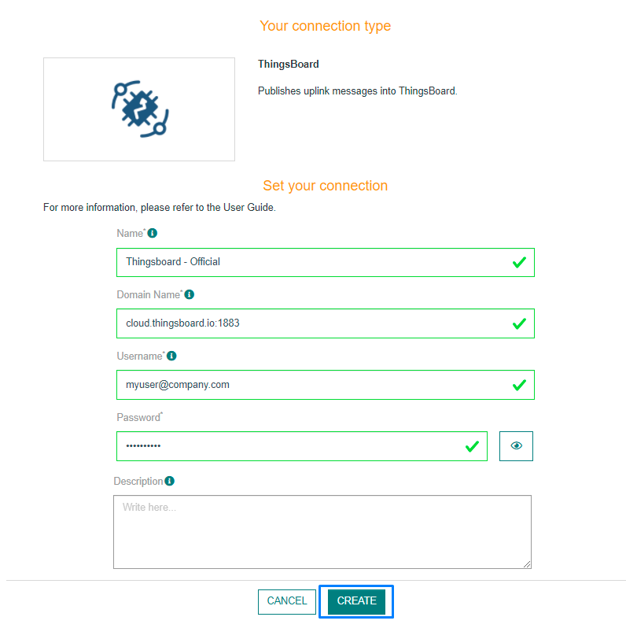
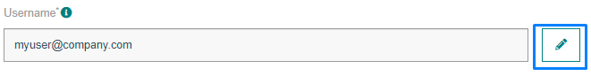
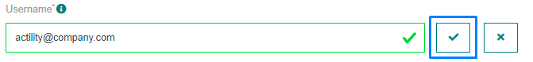

# CREATING A THINGSBOARD CONNECTION

## Collecting Expected Information

<a id="THINGSBOARDparameters">**Parameters required**</a>

| UI Field | Description |
| ------ | ----------- |
| **Domain Name** | The domain name of your Thingsboard account. Example: myhostname.com:8883. |
| **Username** | The email of your Thingsboard account. |
| **Password** | The password used to connect to your Thingsboard account. |

### Domain name

1. Connect to the <a href="https://thingsboard.cloud/login">Thingsboard platform</a>.

2. In the Home page, click on the **Domain** section.


3. If you don't have one already, click on **Register domain**


4. Enter your domain name and click on **Register**.

* Your domain name should appear here.


## Creating a Connection With API

The creation of a connection establishes a bidirectional messaging transport link between ThingPark X IoT Flow and the cloud provider. Events and commands from multiple Devices will be multiplexed over this messaging transport link.

To do this, you need to use the **Connections** group resource:

* `POST/connections` to create a new Connection instance
* `PUT/connections` to update a Connection instance
* `DELETE/connections` to delete a Connection instance

::: tip Note
We follow the REST-full API pattern, when updating configuration properties for a connection resource. Thus, you must also provide the whole configuration again.
:::

Example for creation of a new connection instance :

```json
POST /connections
{
    "connectorId": "actility-thingsboard-iot",
    "name": "Actility ThingsBoard (TCP) Connection",
    "configuration": {
        "hostName" : "thingsboard.cloud:443",
        "username" : "tpx-iot-flow@actility.com",
        "password" : "HelloWorld"
    }
}
```

The following table lists the properties applicable to a connection instance.

| JSON Field | Description |
| ------ | ----------- |
| ```connectorId``` | Must be set to ``actility-thingsboard-iot`` for THINGSBOARD platform. |
| ```hostName``` | The domain name of your thingsboard account. Example: cloud.thingsboard.io:1883 |
| ```username``` | The email of your Thingsboard account. |
| ```password``` | The password used to connect to your Thingsboard account. |

::: warning Important note
All properties are not present in this example. You can check the rest of these properties in the [common parameters section](../../../Getting_Started/Setting_Up_A_Connection_instance/About_connections.html#common-parameters).
:::

## Creating a Connection From UI

You must have an active THINGSBOARD account prior to creating a THINGSBOARD connection in ThingPark.

You also need to know the parameters that are required to perform this task. To learn more, check [Parameters required for connecting to a THINGSBOARD platform](#THINGSBOARDparameters).

1. Click Connections -> Create -> ThingPark X Iot Flow.


Then, a new page will open. Select the connection type : THINGSBOARD.


2. Fill in the form as in the example below and click on **Create**.



::: tip Note
Parameters marked with * are mandatory.
:::

* A notification appears on the upper right side of your screen to confirm that the application has been created.

4. After creating the application, you will be redirected to the application details.


**Changing the Settings after Creation**

You can change the settings parameters such as the domain name, username or password after the creation of the THINGSBOARD application.

To do this, proceed as follows:

1. Select the THINGSBOARD application for which you want to change one or several parameters.

2. In the application information dashboard, click on the **Edit** button corresponding to the parameter you want to change.



3. Enter the new value, and click on the **Confirm** icon.



* The Confirmation window displays,


* A notification will inform you that the parameter is updated.


## Limitations

There are currently no known limitations to the THINGSBOARD connector.

## Displaying information to know if it worked

1. Connect to the <a href="https://thingsboard.cloud/login">Thingsboard platform</a>.

2. In the Home page, select the **Dashboard** section.

3. Customize your dashboard to display the correct device's informations.

## Troubleshooting

As for now, there are no detected bugs.
