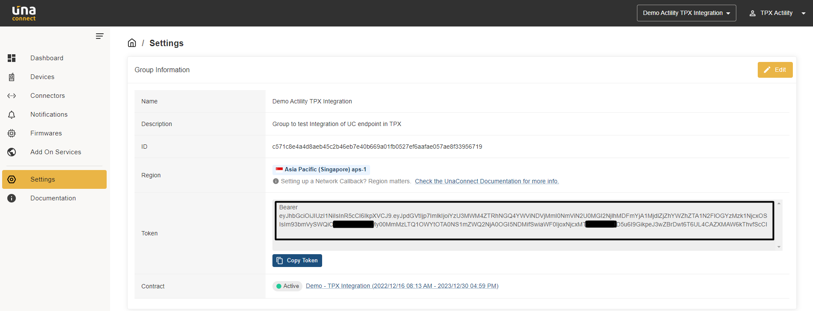
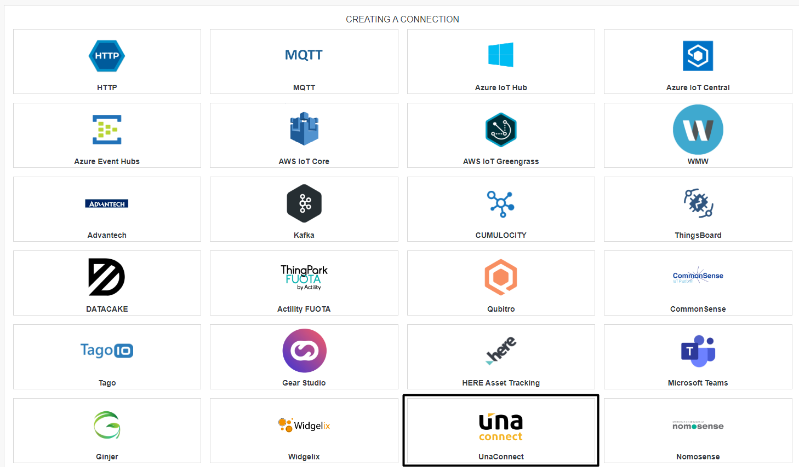
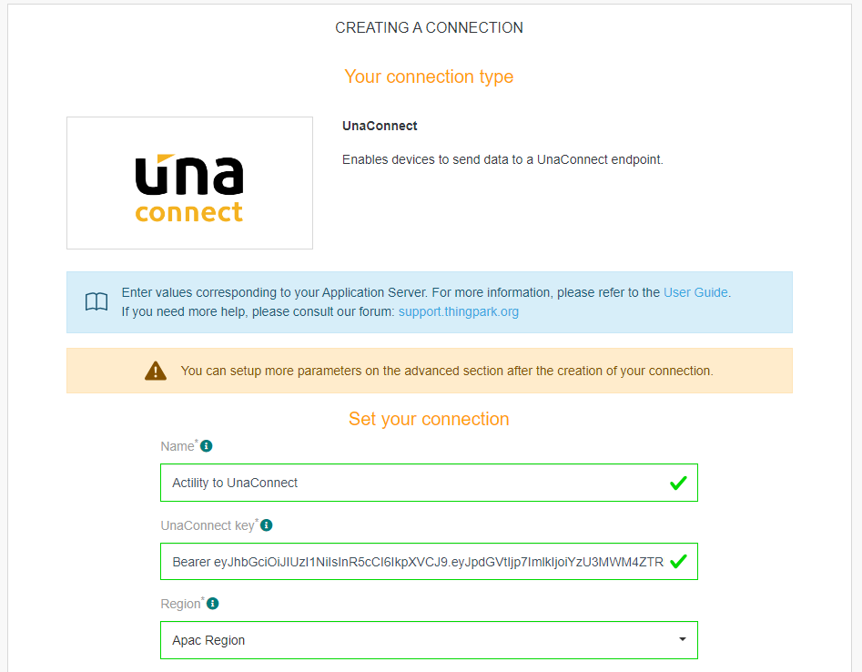
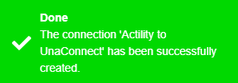
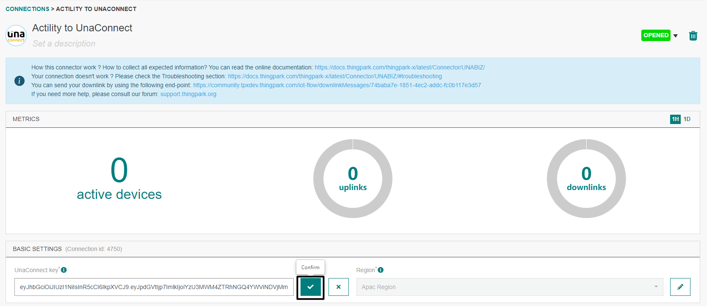
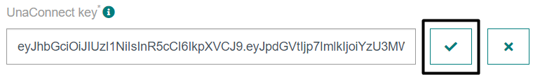
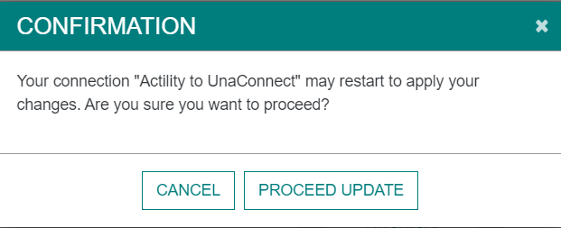
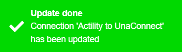

# CREATING A UNACONNECT CONNECTION

## Collecting Expected Information

**Parameters required**

| Field | Description |
| ------ | ----------- |
| ```Application Name``` | Name of the application that you want to register (Editable). |
| ```UnaConnect Key``` | The key generated in the device configuration used in your Unaconnect account (Editable). |
| ```Region``` | Apac Region or Europe Region. |

### Unaconnect key

The Unaconnect Key is the **Token** available on your Settings. WARNING, If you use the copy button and paste, don't forget to remove the prefix "Bearer" at the begin.
The Region is also indicated on this Settings part.


## Creating a Connection With UI

1. Click Applications -&gt; Create -&gt; View More Applications Type.


Then, a new page will open. Select the connection type: **UnaConnect**.



2. Fill in the form as in the example below and click on **Create**.



:::tip Note
Parameters marked with * are mandatory.
:::

* A notification appears on the upper right side of your screen to confirm that the application has been created.



4. After creating the application, you will be redirected to the application details.



**Changing the Settings after Creation**

You can change the settings parameters such as the application name or the Unaconnect key.

To do this, proceed as follows:

1. Select the UNACONNECT application for which you want to change one or several parameters.

2. In the application information dashboard, click on the **Edit** button corresponding to the parameter you want to change.



3. Enter the new value and click on the **Confirm** icon.

* The Confirmation window displays,



A notification will inform you that the parameter is updated.



## Creating a Connection With API

The creation of a connection establishes a unidirectional messaging transport link to Unaconnect.
To do this, you need to use the **Connections** group resource:

* `POST/connections` to create a new Connection instance
* `PUT/connections` to update a Connection instance
* `DELETE/connections` to delete a Connection instance

:::tip Note
We follow the REST-full API pattern, when updating configuration properties for a connection resource. Thus, you must also provide the whole configuration again.
:::

Example for creation of a new connection instance :

```json
POST /connections
{
  "name":"Actility To UnaConnect",
  "connectorId":"actility-http-iot",
  "configuration": {
    "headers" : {
      "authorization" : "Bearer <token>"
    },
    "destinationURL":"https://network.unaconnect.io/actility/data"
  },
  "brand":"UNABIZ"
}
```

The following table lists the properties applicable to a connection instance.

| Field | Description |
| ------ | ----------- |
| ```connectorId``` | Must be set to actility-http-iot for UNACONNECT platform. |
| ```configuration/description``` | Description of the application. |
| ```configuration/destinationURL``` | For ASIA Region : Must be set to **https://network.unaconnect.io/actility/data**. For Europ Region : Must be set to **https://euw-1.network.unaconnect.io/actility/data**.|
| ```configuration/headers``` | Set of key-values. The only obligatory key is Authorization, which needs your Access Token as a value. |
| ```brand``` | Must be set to ```UNABIZ```. |

:::warning Important note
All properties are not present in this example. You can check the rest of these properties in the [common parameters section](../../Getting%20started/Setting%20Up%20A%20Connection%20instance/About_connections#common-parameters).
:::

## Displaying information to know if it worked
:::warning Important note
We are not able to check if the link work as expected, please contact UnaBiz support.
:::

## Limitations
No downlink supported.

## Troubleshooting
As for now, there are no detected bugs.
