# CREATING A WIDGELIX CONNECTION

## Collecting Expected Information

**Parameters required**

| Field | Description |
| ------ | ----------- |
| ```Application Name``` | Name of the application that you want to register (Editable). |
| ```Widgelix Key``` | The key generated in the device configuration used in your Widgelix account (Editable). |

### Widgelix key

The Widgelix Key is the **Access Token** generated on the connectivity associated to a device.
Follow these [Widgelix documentation](https://docs.widgelix.com/get-started/devices#configuring-connectivity) on connectivity part.

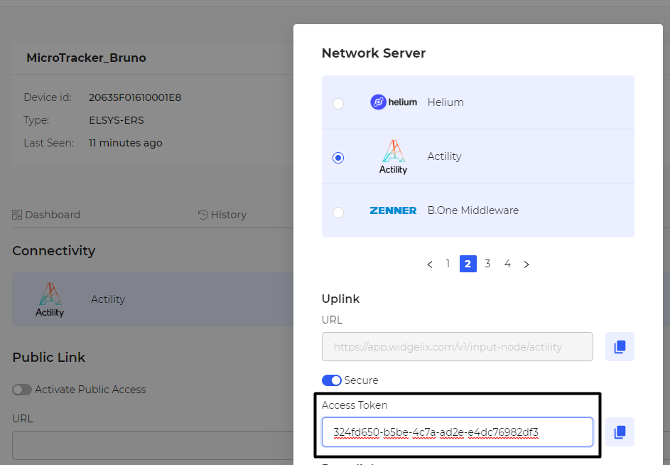

## Creating a Connection With UI

1. Click Applications -> Create -> View More Applications Type.


Then, a new page will open. Select the connection type: **Widgelix**.

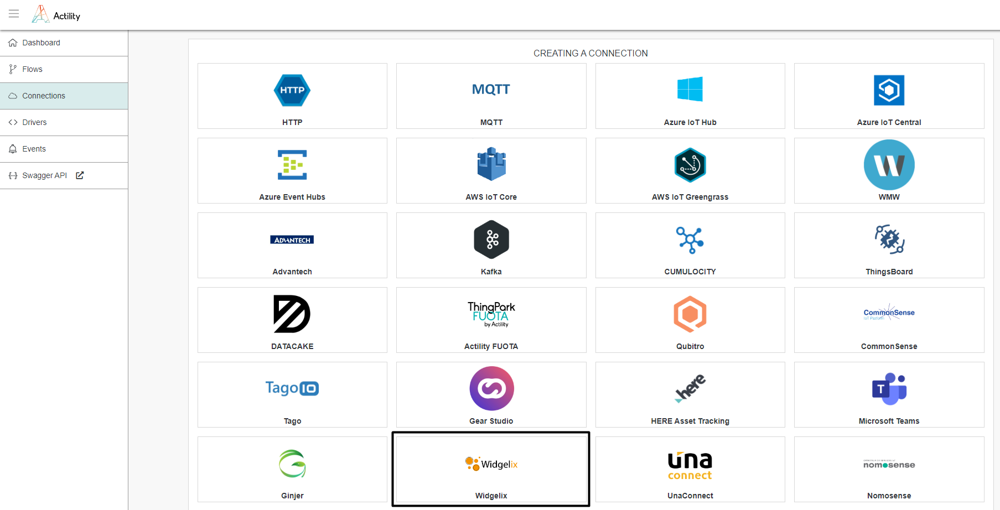

2. Fill in the form as in the example below and click on **Create**.

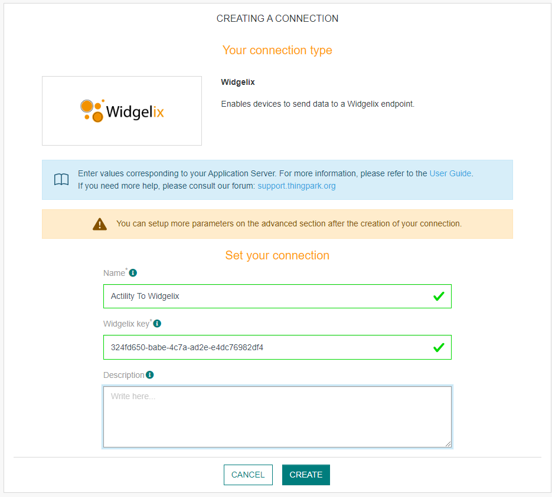

::: tip Note
Parameters marked with * are mandatory.
:::

* A notification appears on the upper right side of your screen to confirm that the application has been created.

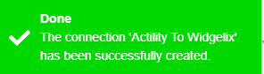

4. After creating the application, you will be redirected to the application details.

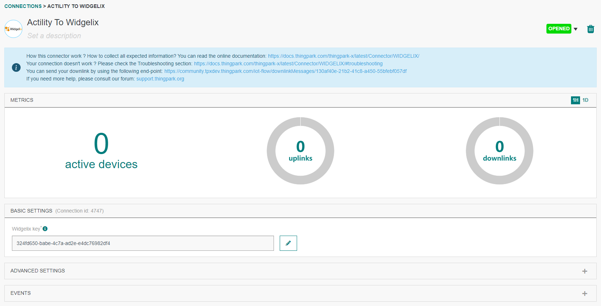

**Changing the Settings after Creation**

You can change the settings parameters such as the application name or the Widgelix key.

To do this, proceed as follows:

1. Select the WIDGELIX application for which you want to change one or several parameters.

2. In the application information dashboard, click on the **Edit** button corresponding to the parameter you want to change.

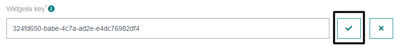

3. Enter the new value and click on the **Confirm** icon.

* The Confirmation window displays,

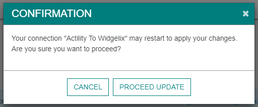

A notification will inform you that the parameter is updated.

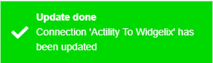

## Creating a Connection With API

The creation of a connection establishes a unidirectional messaging transport link to Widgelix.
To do this, you need to use the **Connections** group resource:

* `POST/connections` to create a new Connection instance
* `PUT/connections` to update a Connection instance
* `DELETE/connections` to delete a Connection instance

::: tip Note
We follow the REST-full API pattern, when updating configuration properties for a connection resource. Thus, you must also provide the whole configuration again.
:::

Example for creation of a new connection instance :

```json
POST /connections
{
  "name":"Actility To Widgelix",
  "connectorId":"actility-http-iot",
  "configuration": {
      "description": "My first Widgelix connection.",
      "destinationURL":"https://app.widgelix.com/v1/input-node/actility",
      "headers":{
        "Authorization": "Bearer {access-token}"
    }
  }, 
  "brand":"WIDGELIX"
}
```

The following table lists the properties applicable to a connection instance.

| Field | Description |
| ------ | ----------- |
| ```connectorId``` | Must be set to actility-http-iot for WIDGELIX platform. |
| ```configuration/description``` | Description of the application. |
| ```configuration/destinationURL``` | Must be set to **https://app.widgelix.com/v1/input-node/actility**. |
| ```configuration/headers``` | Set of key-values. The only obligatory key is Authorization, which needs your Access Token as a value. |
| ```brand``` | Must be set to ```WIDGELIX```. |

::: warning Important note
All properties are not present in this example. You can check the rest of these properties in the [common parameters section](../../Getting_Started/Setting_Up_A_Connection_instance/About_connections.html#common-parameters).
:::

## Displaying information to know if it worked

1.	Connect to your [WIDGELIX account](https://app.widgelix.com/).

2.	Go to the **Device Types** section and create the type of your device. See [Widgelix documentation](https://docs.widgelix.com/get-started/device-types) for details.

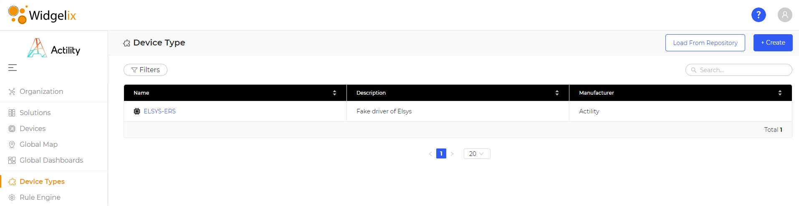

3. Go to the **Devices** section and click on a device you want to monitor.

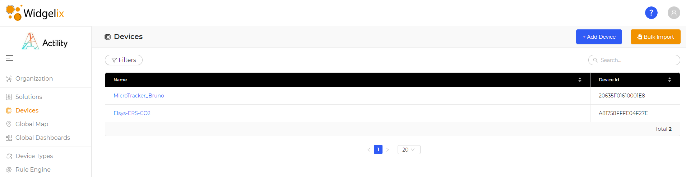

3. Go to the **Settings** tab, on the Report section, select a field and extract a report. An excel report should contact data.

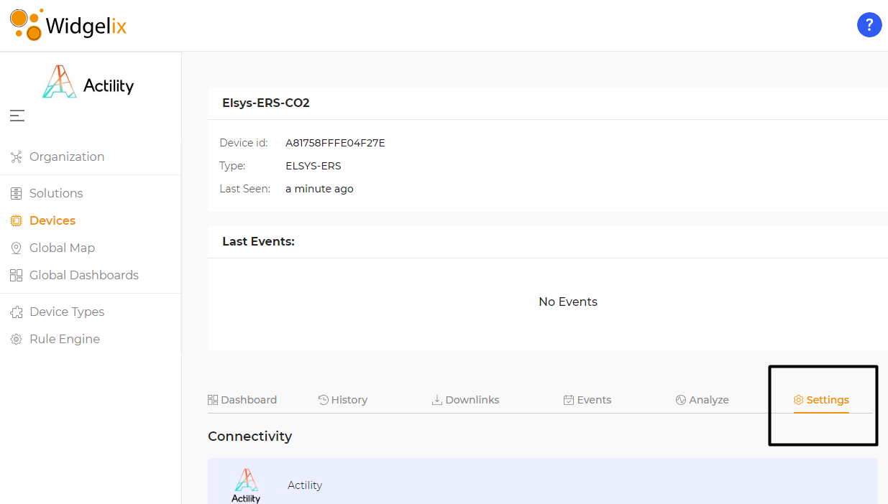
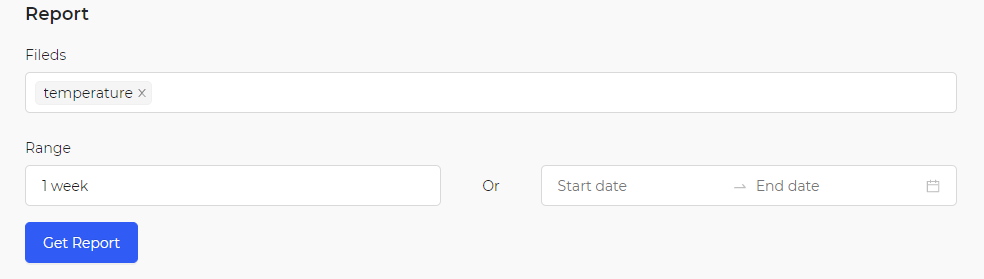

* You can now see the upcoming messages.

## Downlink support
The downlink way is managed by Widgelix and need be setup on the Connectivity setup of a device.
The expected URL is available on IoT-Flow on the top of the connection.
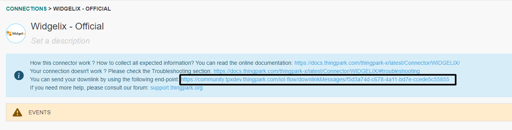
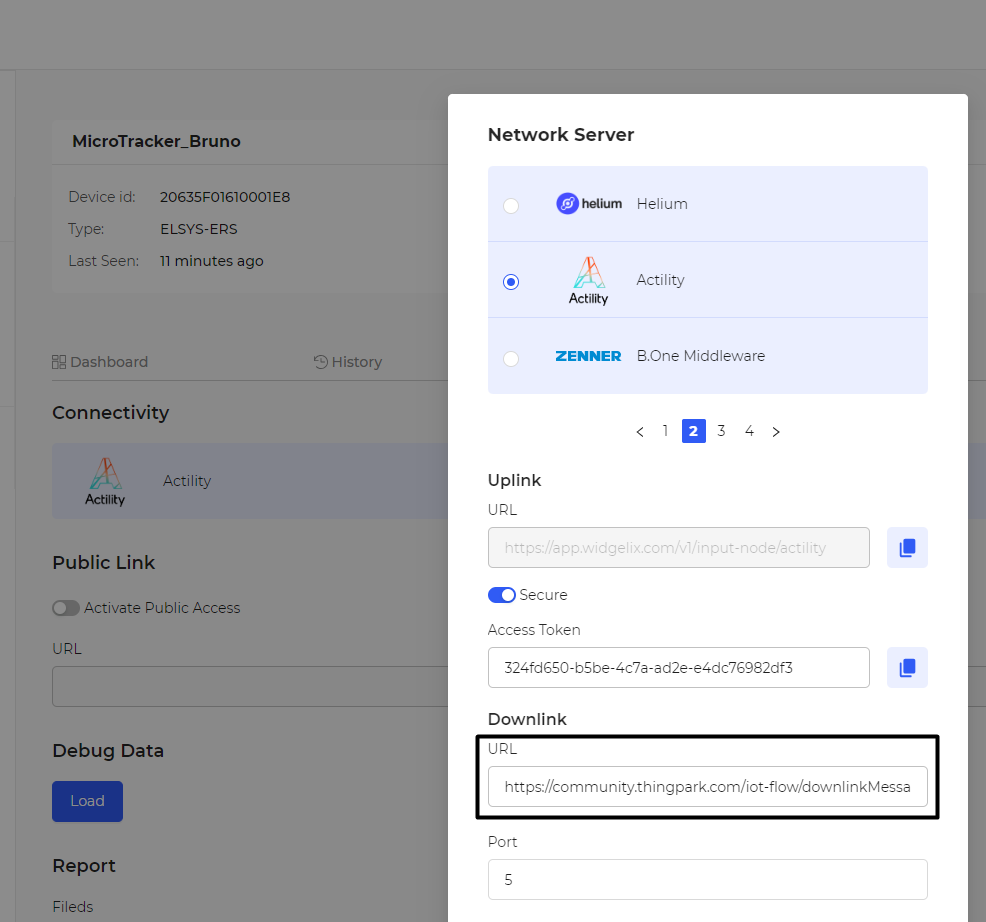

## Limitations

There are currently no known limitations to the WIDGELIX connector.

## Troubleshooting

As for now, there are no detected bugs.