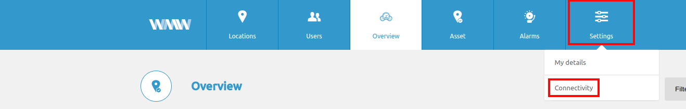
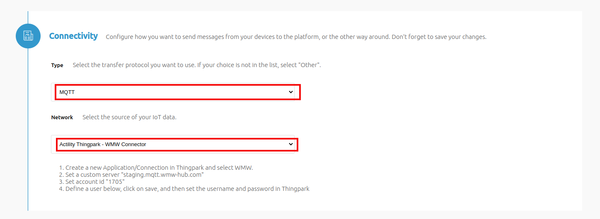
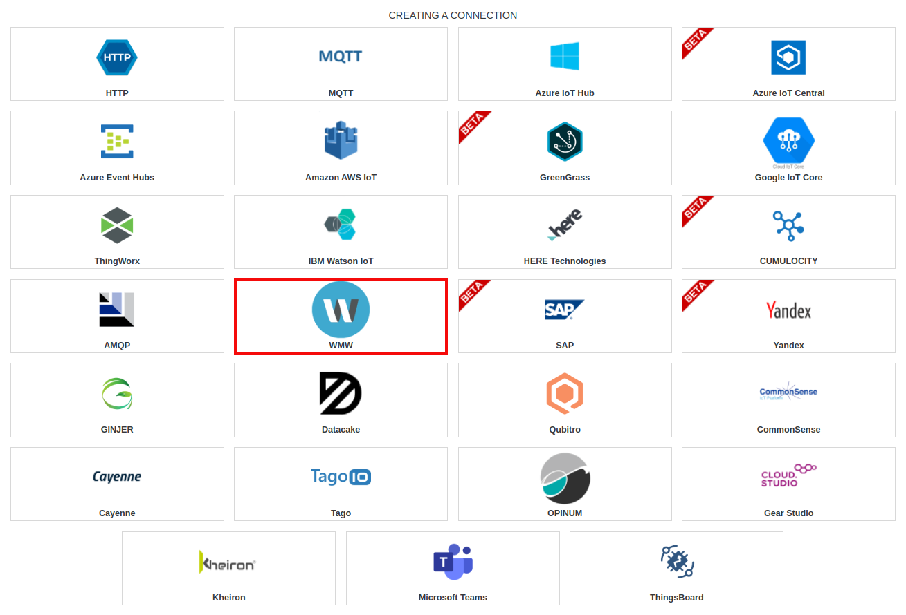
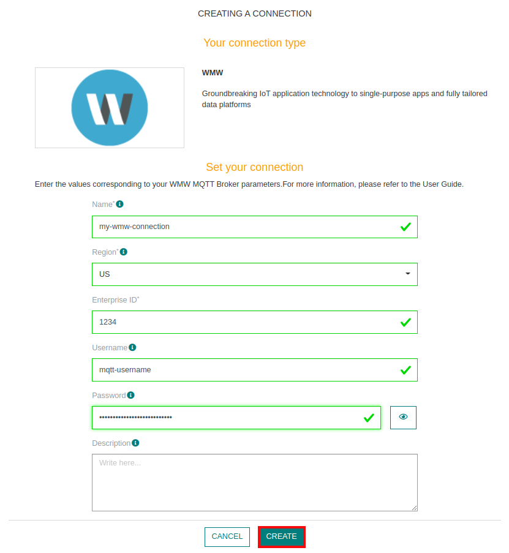
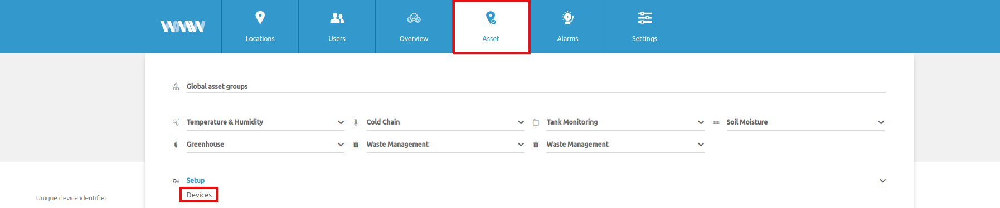
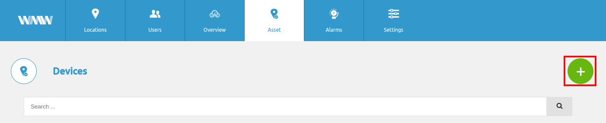
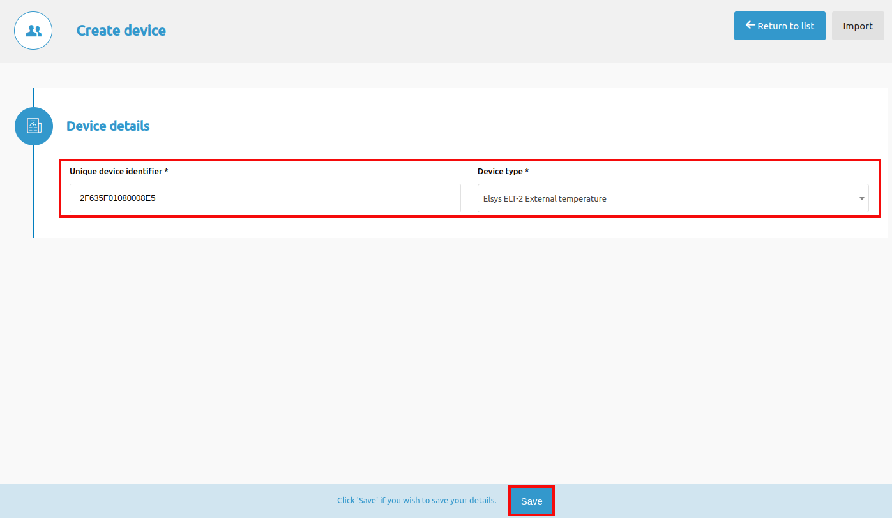
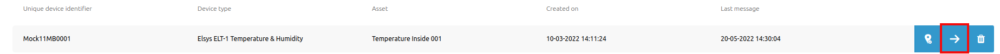
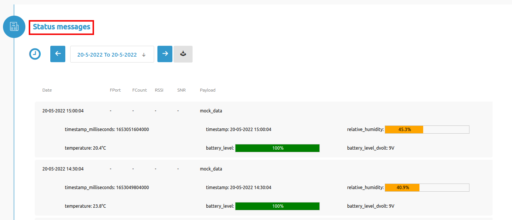

# CREATING A WMW CONNECTION

## Collecting Expected Information

**Parameters required**

| Field | Description |
| ------ | ----------- |
| ```Region``` | WMW instance region |
| ```Custome Hostname``` | Only for private WMW instance when chosing "Custom" in Region field |
| ```Entreprise ID``` | Your WMW Entreprise ID |
| ```Username``` | Your MQTT Username |
| ```Password``` | Your MQTT Password |


All of these informations can be found in your WMW connectivity settings



you'll be able to find your region, entreprise ID in **Connectivity** section



MQTT users can be created in **MQTT users** section


## Creating a Connection With API

The creation of a connection establishes a unidirectional messaging transport link to the cloud provider.

To do this, you need to use the **Connections** group resource:
*	`POST/connections` to create a new Connection instance
*	`PUT/connections` to update a Connection instance
*	`DELETE/connections` to delete a Connection instance


::: tip Note
We follow the REST-full API pattern, when updating configuration properties for a connection resource. Thus, you must also provide the whole configuration again.
:::

Example for creation of a new connection instance :

```json
POST /connections
{
  "name":"Actility To WMW",
  "connectorId":"actility-mqtt-iot",
  "configuration": {
      "hostName": "my.hostname.com:8883",
      "protocol": "SSL",
      "username":"mqtt-username",
      "password":"mqtt-password",
      "uplinkTopicPattern": "uplink_1234",
      "downlinkTopicPattern": "downlink_1234",
  },
  "brand":"WMW"
}
```

The following table lists the properties applicable to a connection instance.

| Field | Description |
| ------ | ----------- |
| ```connectorId``` | Must be set to actility-mqtt-iot for WMW platform. |
| ```configuration/hostName``` | Must be set to your WMW MQTT broker region (refers to [this section](#collecting-expected-information)) |
| ```configuration/protocol``` | Must be to SSL. |
| ```configuration/username``` | Must be replaced by your WMW MQTT Username. |
| ```configuration/password``` | Must be replaced by your WMW MQTT Password. |
| ```configuration/uplinkTopicPattern``` | Must be replaced ```uplink_{your_enterprise_id}``` |
| ```configuration/downlinkTopicPattern``` | Must be replaced ```downlink_{your_enterprise_id}``` |
| ```brand``` | Must be set to ```WMW```. |

::: warning Important note
All properties are not present in this example. You can check the rest of these properties in the [common parameters section](../../../Getting_Started/Setting_Up_A_Connection_instance/About_connections.html#common-parameters).
:::

## Creating a Connection With UI

1. Click Connections -> Create -> **ThingPark X IoT Flow**


2. Then, a new page will open. Select the connection type: **WMW**.


3. Fill in the form as in the example below and click on **Create**.


::: tip Note
Parameters marked with * are mandatory.
:::

4. A notification appears on the upper right side of your screen to confirm that the application has been created.

5. After creating the application, you will be redirected to the connection details.

## Limitations

As for now, there are no known limitations.

## Displaying information to know if it worked

1. Connect to your **WMW** instance.

2. Go to **Asset** -> **Setup** -> **Devices**.


3. Select **+** button to add a new device.


4. Fill in the form with your device **DevEUI** and his model. And click **Save**


5. Your device will now appear in the list.


6. In the **Status messages** you should be able to see messages


## Troubleshooting

As for now, there are no detected bugs.
