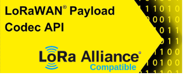
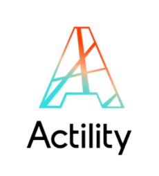
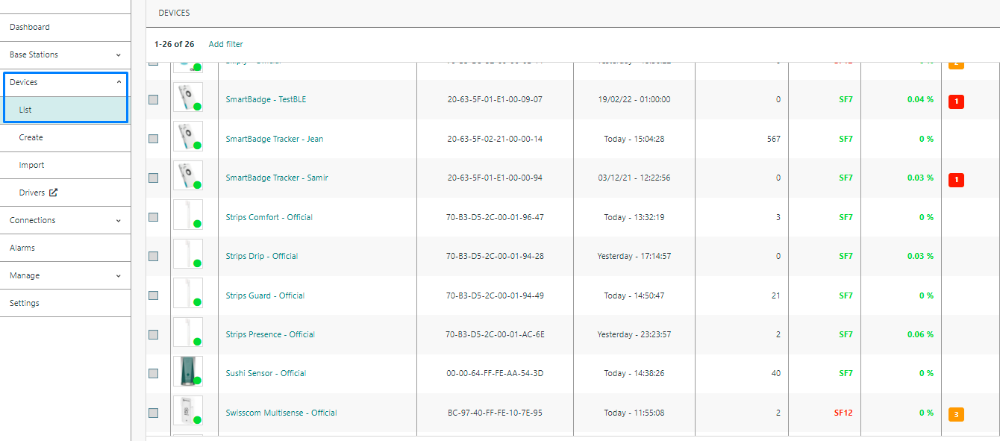
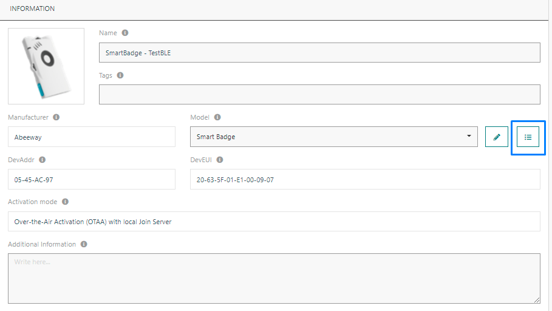
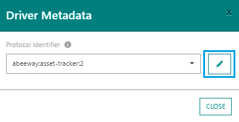
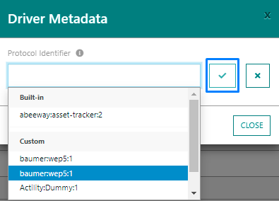

# DRIVERS

## Overview

There are currently two types of drivers:

* Custom drivers
* Branded drivers

::: tip Note
Actility drivers are compatible with the [LoRa Alliance Standard Codec API](https://resources.lora-alliance.org/document/ts013-1-0-0-payload-codec-api) published by the LoRa Alliance technical Committee.
:::



::: tip Note
[Actility Public Device Catalog](https://github.com/actility/device-catalog) repo is provided for the device makers to add/maintain directly their own drivers.
:::




The ThingPark X  team is working every day to expand our list of professionally supported Encoding/Decoding drivers, and also provides compatible API adapters for all community drivers.

Codecs provide JSON decoding for binary uplink messages, as well as JSON to binary encoding for commands.

All available driver’s types can be displayed by retrieving the driver’s collection resource using `GET/drivers`.

An example of results is given below:

``` json
GET /drivers
 [
   {
    "id": "actility:auto:1",
    "producerId": "actility",
    "moduleId": "auto",
    "version": "1",
    "application": {
      "producerId": "actility",
      "moduleId": "auto",
      "version": "1"
    },
    "models": []
  },
  {
    "id": "actility:adeunis-field-test:1",
    "producerId": "actility",
    "moduleId": "adeunis-field-test",
    "version": "1.0.0",
    "application": {
      "producerId": "adeunis",
      "moduleId": "field-test",
      "version": "1"
    },
    "models": [
      {
        "producerId": "adeunis",
        "moduleId": "field-test",
        "version": "1"
      }
    ]
  },
]
```

* In order to submit your device models and drivers to the shared library, please visit the public [**Device Catalog**](https://github.com/actility/device-catalog) and follow the instructions (it is highly recommended to start by a template). 
* Instructions for developing drivers can be found also at [**IoT Flow Driver Developer Guide**](https://github.com/actility/device-catalog/tree/main/template/sample-vendor/drivers).
* To use drivers, please refer to the section [Setting up an IoT Flow Instance](../Getting_Started/Setting_Up_An_IoT_Flow_Instance/#flow-matcher)


## How to assign a driver to a device

Follow these steps to learn how to link a driver to a device:

1. Connect to ThingPark Enterprise. Click on the **Devices** section and select your device.



2. Inside the device's information card, click on the **Show driver metadata** button, next to the **Model** field.



3. Click on the **Edit** button to select one of the available drivers.



* You should see all the available driver. Select a built-in or a custom driver and click on the confirm icon.




