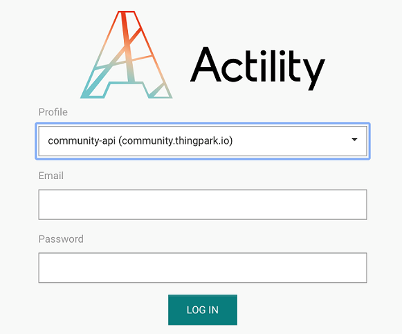
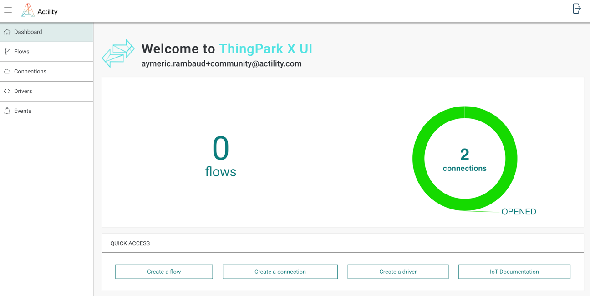

# Direct Access

To access ThingPark X IoT Flow User Interface,

1.	Go to the TP X login page. The URL is ***https://(yourdomain)/tpx/login*** where ***(yourdomain)*** is the base URL of the ThingPark Platform you’re using.
      
2.	Log In using your subscriber credentials.

3.	If not set automatically, complete  your ThingPark Platform profile ID : This information will be provided by the operator of the your platform.

    

After a successful login, you’ll be automatically redirected to the TP X IoT Flow dashboard : 

