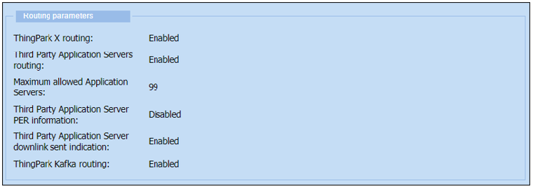
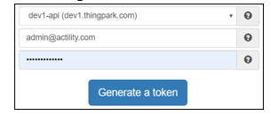
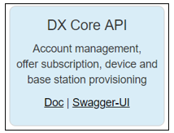
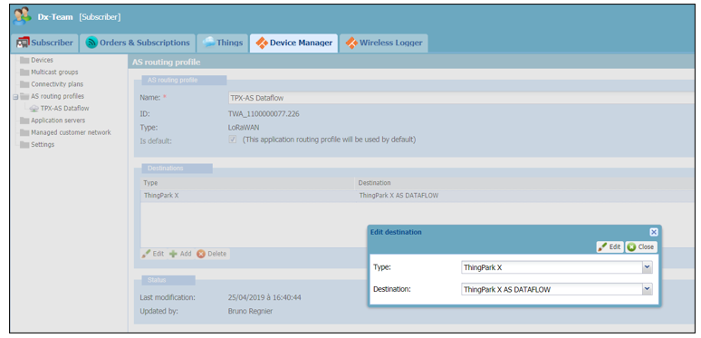
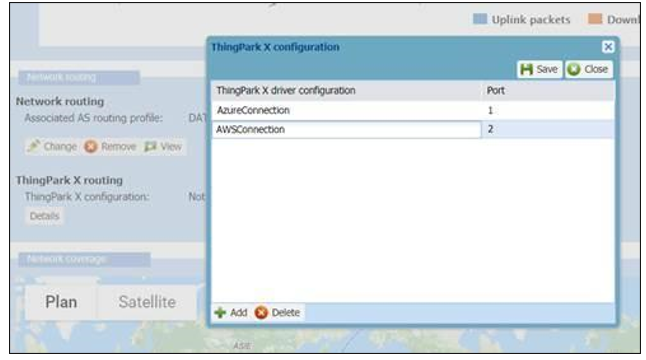
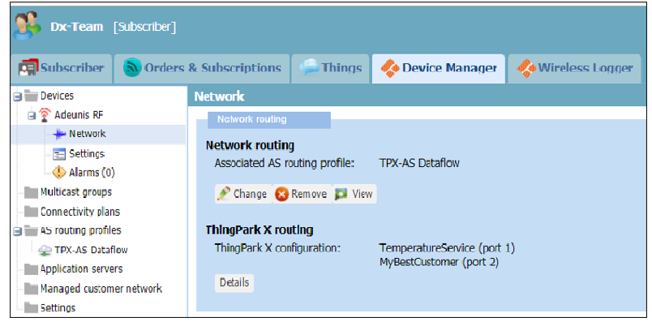

# Associating ThingPark Wireless devices with ThingPark X IoT Flow

:::warning Important note
This step is not required for ThingPark Enteprise users.
:::


You can associate a ThingPark Wireless Device with the ThingPark X Routing functionality a:

1.	By using ThingPark Wireless UI outlined in [Device Setup using the ThingPark Wireless GUI](../Setting_Up_An_IoT_Flow_Instance/).
2.	By using DX-Core API as described in [Using DX-Core API](../Setting_Up_An_IoT_Flow_Instance/).

## Connectivity Plan verification

To be associated with a ThingPark X IoT Flow, a ThingPark Wireless Device need to have a compatible “Connectivity Plan”.
More specifically, you need to check that the “ThingPark X Routing” functionality is enabled for the connectivity plans associated to the Devices you want to associate with the ThingPark X IoT Flow platform.

In order to check if your Connectivity Plan is well configured, do the following steps:

*	Go to the Device Manager in the ThingPark Wireless platform.
*	Select the connectivity plan used by the Device.
*	Check the section named “Routing parameters”.



ThingPark X routing and ThingPark Kafka routing must be enabled. If it is not the case, contact your administrator. He/She need follow the steps indicated in annex for a setup of your connectivity Plan.

## Device Setup

:::tip Note
The device EUI must be always in upper case.
:::

## Using DX-Core API

You can create or update a Device and perform the whole part of the connector setup procedure automatically by using the DX-core API. 
The DX REST API is accessible from [https://dx-api.thingpark.com/getstarted/#/](https://dx-api.thingpark.com/getstarted/#/)
Fill in your subscriber credentials and generate a Token:



Go to the Dx-Core section: 



The following example shows how to create a Device.
In order to use a Device with ThingPark X IoT Flow :
* ```processingStrategyId``` must be equal to IOT_FLOW. 
*	```dataflowTags```


```json
POST https://dx-api.thingpark.com/core/latest/api/devices
{
  "name": "My ThingPark X Device",
  "EUI": "0018A20000099904",
  "processingStrategyId": "IOT_FLOW",
  "dataflowTags": [
    "TemperatureService",
    "MyBestCustomer"
  ],
  "activationType": "OTAA",
  "deviceProfileId": "ADRF/DemonstratorA.1_EU",
  "applicationEUI": "70B3D53260666003",
  "applicationKey": "258DB54023EA7FE3D55085F7351737D0"
}
```
The full documentation regarding the DX REST API is accessible from the following URL:

[https://dx-api.thingpark.com/platform/](https://dx-api.thingpark.com/platform/)

The documentation specific to Dx-Core functionality is available from the following URL:

[https://dx-api.thingpark.com/core/latest/doc/index.html#device-creation](https://dx-api.thingpark.com/core/latest/doc/index.html#device-creation)

### Device Setup Using the ThingPark Wireless GUI

To prepare a Device for use with ThingPark X IoT Flow using the ThingPark Wireless GUI proceed as follows:
1.	Go to the Device Manager tool.
2.	Set the AS Routing Profile to ***ThingPark X AS IOT FLOW***, which is the preset application server for the ThingPark X platform, as shown in the following screen capture.




3.	You may also want to set some « tags » for use by ThingPark X IoT Flow specifically for a given Device.
These tags are used to trigger specific processing by ThingPark X IoT Flow, such as filtering. For more information, see [UplinkMessage Format](../../Message/Uplink_Message_with_Decoded_payload/).
Use the “ThingPark X configuration” panel, as illustrated below.



4.	Finally, double check the Device routing settings: ‘Associated routing profile’ must be set to “TPX-AS IoT Flow”. 




