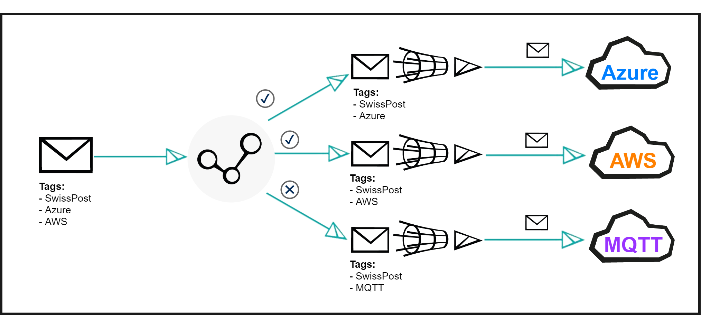
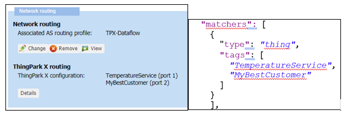

# Setting Up An IoT Flow instance

A new IoT Flow instance needs to be associated with at least one connection resource.
Therefore, create at least one connection resource before creating a new IoT Flow resource (see [Setting up a Connection instance](../Setting_Up_A_Connection_instance/Creating_a_connection_instance_using_the_API.html)).

To create your new IoT Flow resource, fill in the following parameters:

*	the id of the connector type (like ``actility-aws-iot``)
*	the id of the connection resource instance you will be using for the new IoT Flow resource.

Optionally, you can define a driver id to use for encoding/decoding payloads.
In order to use drivers, you must set a value to the ``id`` property in the ``driver`` object value on the associated Flow object.
You have two options.


*	If the value is set to `actility:auto:1` , IoT Flow will look for the ``DriverCfg field``  inside our message to encode/decode the content.
If the ``DriverCfg`` section is not defined inside our uplink message, no encoding/decoding is done.
*	Alternatively, you can specify a static driver id to force the use of a specific driver. You can find drivers’ ids in the field ``id`` of objects ``driver``.

If the driver id is not set (or does not exist in our base), it means encoding/decoding is disabled.

You can follow this example to create your connection:

```json
POST /flows
 
{
  "name": "Test Flow",
  "description": "This is a flow of test",
  "driver": {
"id": "actility:auto:1"
  },
  "matchers": [
    {
      "type": "thing",
      "tags": [
        "TemperatureService",
        "SwissPostDeviceService"
      ]
    },
    {
	"type": "key",
	"key": "lora:0018b20000000b20"
    }
    ],
  "connectors": [
    {
      "id": "actility-aws-iot",
      "connectionId": "1",
      "uplinkTimeValidity": "72h"
    }
  ]
}

```

## Flow Matcher

A matcher can be used to filter a subset of messages within the flow of Uplink messages.
If your network generates thousands of Uplink messages and you only want to send a specific subset of Uplinks to a Cloud, you can specify a matcher filter, which will inspect the tags associated with each uplink.

For example, if you want to send only uplink events with tag “TemperatureService” to your IoT cloud platform:

* Choose a name for the new tag e.g. “TemperatureService” and associate this tag with all Devices which Uplinks you want to be selected by the Matcher filter.
* If the Device contains all tags of the flow matcher, all uplinks from this Device are sent to the associated cloud. The Device can contain more tags than the flow matcher. However, it must contain at least all tags from the flow matcher.

You can apply multiple matchers. Multiple matchers use OR logic when filtering messages (mather1 OR mather2 OR … ), and inside each matcher AND logic is applied (for instance, the tag mather user tag1 AND tag2 AND .. logic).



```json
"matchers": [
    {
      "type": "thing",
      "tags": [
        "TemperatureService",
        "MyBestCustomer"
      ]
    },
    {
	"type": "key",
	"key": "lora:0018b20000000b20"
    }
]
```

These tags that you created in the Flow must match the Devices’ tags that you set in ThingPark Wireless. Matching is case unsensitive.

In the following screenshot you can check that tag “TemperatureService” is set in the “Network routing” configuration panel of the Device, and matches exactly (case unsensitive), the one set in the matcher configuration on the right.



## Uplink Validity

In some specific situation, it might happen that the communication between your Device and the cloud platform is lost.
Depending on the duration of such outage, it might not be relevant to send all sensor data sent during the outage to the IoT cloud platform.   
If this applies to your application, you can check the uplink validity prior to sending the uplink messages to the connection.

Inside your flow configuration, in the connectors section, you can find a property named uplinkTimeValidity:

```json
"connectors": [
    {
      "id": "actility-aws-iot",
      "connectionId": "1",
      "uplinkTimeValidity": "72h"
    }
  ]
```

In that example, if an Uplink is older than 72 hours, it will not be sent to the cloud service when the connection recovers and an alarm event is saved in the events’ log.
The uplink age is computed as the difference between the 2 following timestamps 

* Time of arrival of the message in IoT flow process. 
* Time of emission of the message from the LoRaWAN® Base Station.


