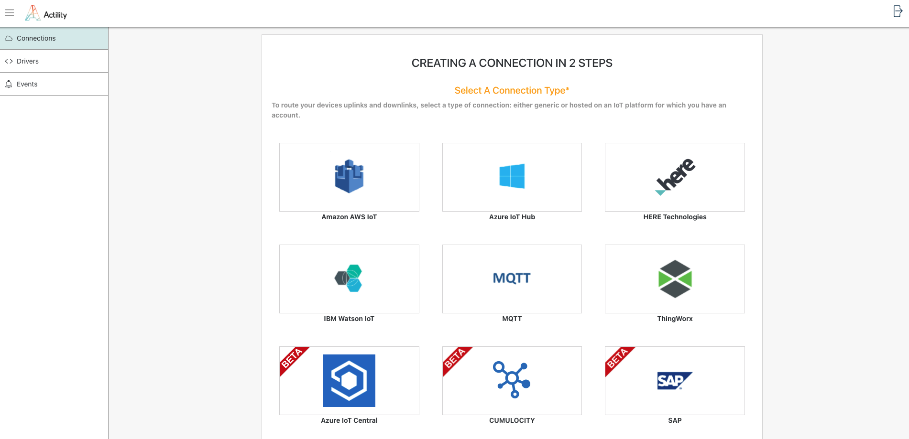
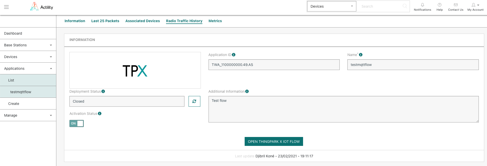
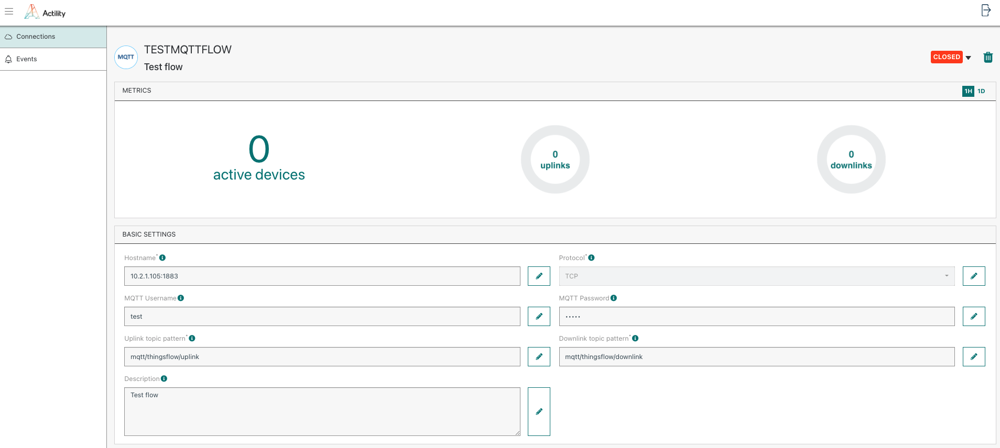

# From ThingPark Enterprise
ThingPark X IoT Flow UI is accessible from ThingPark Enterprise admin console in order to provide ThingPark Enterprise users with extended capabilities:
* Create a new TPE application based on the extended lost of connectors.
* Modify an application that has been created with the TP X UI.
* Test IoT Flow drivers and create custom drivers.

In all 3 cases, ThingPark Enterprise user is redirected to ThingPark X IoT Flow UI and automatically logged in.

## Create a new application with ThingPark X IoT Flow UI.
From ThingPark Enterprise **Application > Create** menu, ThingPark X IoT Flow UI can be accessed by clicking on «View More Application Types» .

The user is automatically redirected to the connection creation screen of ThingPark  X IoT Flow UI.

## Modify an application with ThingPark X IoT Flow UI.
From ThingPark Enterprise **Application > List** menu, select an application with the ThingPark X logo.

In the application detailed view, click on «Open ThingPark X IoT Flow» to access TP X IoT Flow UI.

The user is automatically redirected to the connection detailed view of of the selected application in ThingPark  X IoT Flow UI.

[comment]: <> (<hyvor></hyvor>)
