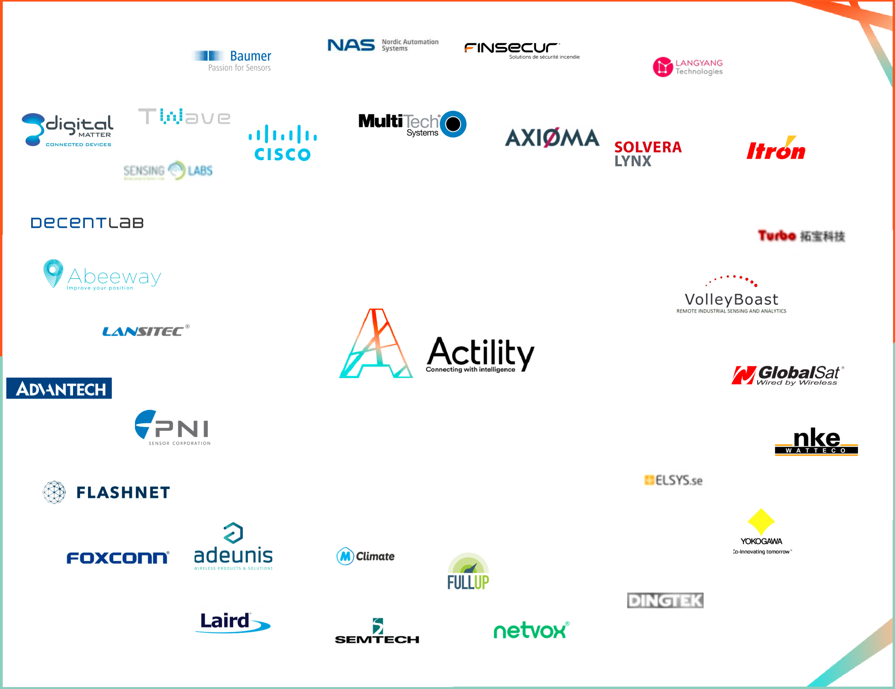
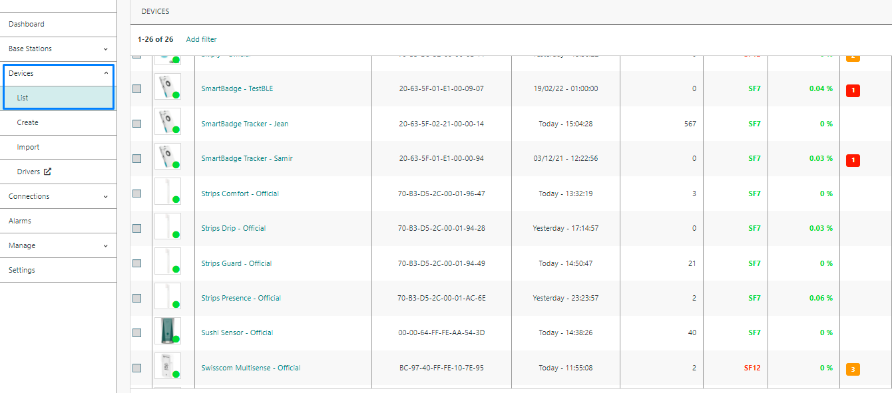
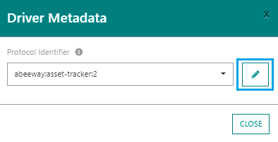

# DRIVER AND CODEC API

::: tip Note
The ThingPark X  team is working every day to expand our list of professionally supported Coding/Decoding (CoDec) drivers, and also provides compatible API adapters for all community developed drivers in the ChirpStack and TTN ecosystems.
:::

CoDecs provide JSON decoding for binary uplink messages, as well as JSON to binary encoding for commands.

Actility is also leading the ongoing standardization of the CoDec driver API work at LoRa Alliance technical committee, and more and more device suppliers are maintaining their own drivers.

All available driver’s types can be displayed by retrieving the driver’s collection resource using `GET/drivers`.

An example of results is given below:

``` json
GET /drivers
 [
   {
    "id": "actility:auto:1",
    "producerId": "actility",
    "moduleId": "auto",
    "version": "1",
    "application": {
      "producerId": "actility",
      "moduleId": "auto",
      "version": "1"
    },
    "models": []
  },
  {
    "id": "actility:adeunis-field-test:1",
    "producerId": "actility",
    "moduleId": "adeunis-field-test",
    "version": "1.0.0",
    "application": {
      "producerId": "adeunis",
      "moduleId": "field-test",
      "version": "1"
    },
    "models": [
      {
        "producerId": "adeunis",
        "moduleId": "field-test",
        "version": "1"
      }
    ]
  },
]
```

* In order to submit your device and driver to the shared library, please register to the [**ThingPark Ignite program**](https://community.thingpark.org/index.php/thingpark-ignite-program/) and [**submit your code**](https://community.thingpark.org/index.php/submit-your-thingpark-x-driver/)

* To use drivers, please refer to the section [Setting up an IoT Flow Instance](../Setting_Up_An_IoT_Flow_Instance/#flow-matcher)
* To build your driver, please refer to [**Actility GitHub Drivers**](https://github.com/actility/thingpark-iot-flow-js-driver/)

## Supported drivers

See below the list of supported drivers:

| driverId                        | producerId | moduleId             | name                           | version |
| ------------------------------- | ---------- | -------------------- | ------------------------------ | ------- |
| abeeway:asset-tracker:3         | abeeway    | asset-tracker        | asset-tracker-3.1.2.tgz        | 3.1.2   |
| actility:adeunis-analog:1       | actility   | adeunis-analog       | adeunis-analog-1.1.4.tgz       | 1.1.4   |
| actility:adeunis-comfort:1      | actility   | adeunis-comfort      | adeunis-comfort-1.1.4.tgz      | 1.1.4   |
| actility:adeunis-delta-p:1      | actility   | adeunis-delta-p      | adeunis-delta-p-1.1.4.tgz      | 1.1.4   |
| actility:adeunis-dry-contacts:1 | actility   | adeunis-dry-contacts | adeunis-dry-contacts-1.1.4.tgz | 1.1.4   |
| actility:adeunis-field-test:1   | actility   | adeunis-field-test   | adeunis-field-test-1.1.4.tgz   | 1.1.4   |
| actility:adeunis-modbus:1       | actility   | adeunis-modbus       | adeunis-modbus-1.1.4.tgz       | 1.1.4   |
| actility:adeunis-modbus2:1      | actility   | adeunis-modbus2      | adeunis-modbus2-1.1.4.tgz      | 1.1.4   |
| actility:adeunis-motion:1       | actility   | adeunis-motion       | adeunis-motion-1.1.4.tgz       | 1.1.4   |
| actility:adeunis-motion2:1      | actility   | adeunis-motion2      | adeunis-motion2-1.1.4.tgz      | 1.1.4   |
| actility:adeunis-pulse2:1       | actility   | adeunis-pulse2       | adeunis-pulse2-1.1.4.tgz       | 1.1.4   |
| actility:adeunis-pulse3:1       | actility   | adeunis-pulse3       | adeunis-pulse3-1.1.4.tgz       | 1.1.4   |
| actility:adeunis-temp2:1        | actility   | adeunis-temp2        | adeunis-temp2-1.1.4.tgz        | 1.1.4   |
| actility:adeunis-temp3:1        | actility   | adeunis-temp3        | adeunis-temp3-1.1.4.tgz        | 1.1.4   |
| actility:adeunis-tic:1          | actility   | adeunis-tic          | adeunis-tic-1.1.4.tgz          | 1.1.4   |
| actility:ascoel-cm:1            | actility   | ascoel-cm            | ascoel-cm-1.0.0.tgz            | 1.0.0   |
| actility:ascoel-co2th:1         | actility   | ascoel-co2th         | ascoel-co2th-1.0.0.tgz         | 1.0.0   |
| actility:ascoel-ir:1            | actility   | ascoel-ir            | ascoel-ir-1.0.0.tgz            | 1.0.0   |
| actility:ascoel-pb:1            | actility   | ascoel-pb            | ascoel-pb-1.0.0.tgz            | 1.0.0   |
| actility:cisco-netvox:1         | actility   | cisco-netvox         | cisco-netvox-1.0.0.tgz         | 1.0.0   |
| actility:dl-5tm:1               | actility   | dl-5tm               | dl-5tm-1.1.3.tgz               | 1.1.3   |
| actility:dl-atm22:1             | actility   | dl-atm22             |                                | 1.1.3   |
| actility:dl-atm41:1             | actility   | dl-atm41             | dl-atm41-1.1.3.tgz             | 1.1.3   |
| actility:dl-ctd10:1             | actility   | dl-ctd10             | dl-ctd10-1.1.3.tgz             | 1.1.3   |
| actility:dl-ds18:1              | actility   | dl-ds18              | dl-ds18-1.1.3.tgz              | 1.1.3   |
| actility:dl-iam:1               | actility   | dl-iam               | dl-iam-1.1.3.tgz               | 1.1.3   |
| actility:dl-itst:1              | actility   | dl-itst              | dl-itst-1.1.3.tgz              | 1.1.3   |
| actility:dl-kl66:1              | actility   | dl-kl66              | dl-kl66-1.1.3.tgz              | 1.1.3   |
| actility:dl-lp8p:1              | actility   | dl-lp8p              | dl-lp8p-1.1.3.tgz              | 1.1.3   |
| actility:dl-mbx:1               | actility   | dl-mbx               | dl-mbx-1.1.3.tgz               | 1.1.3   |
| actility:dl-pr21:1              | actility   | dl-pr21              | dl-pr21-1.1.3.tgz              | 1.1.3   |
| actility:dl-pr26:1              | actility   | dl-pr26              | dl-pr26-1.1.3.tgz              | 1.1.3   |
| actility:dl-pr36:1              | actility   | dl-pr36              | dl-pr36-1.1.3.tgz              | 1.1.3   |
| actility:dl-pr36ctd:1           | actility   | dl-pr36ctd           | dl-pr36ctd-1.1.3.tgz           | 1.1.3   |
| actility:dl-sht21:1             | actility   | dl-sht21             | dl-sht21-1.1.3.tgz             | 1.1.3   |
| actility:dl-sht35:1             | actility   | dl-sht35             | dl-sht35-1.1.3.tgz             | 1.1.3   |
| actility:dl-smtp:1              | actility   | dl-smtp              | dl-smtp-1.1.3.tgz              | 1.1.3   |
| actility:dl-tbrg:1              | actility   | dl-tbrg              | dl-tbrg-1.1.3.tgz              | 1.1.3   |
| actility:dl-trs11:1             | actility   | dl-trs11             | dl-trs11-1.1.3.tgz             | 1.1.3   |
| actility:dl-trs12:1             | actility   | dl-trs12             | dl-trs12-1.1.3.tgz             | 1.1.3   |
| actility:dl-trs21:1             | actility   | dl-trs21             | dl-trs21-1.1.3.tgz             | 1.1.3   |
| actility:elsys-generic:1        | actility   | elsys-generic        | elsys-generic-1.0.1.tgz        | 1.0.1   |
| actility:eolane-bob:1           | actility   | eolane-bob           | eolane-bob-1.0.4.tgz           | 1.0.4   |
| actility:globalsat-lt-100:1     | actility   | globalsat-lt-100     | globalsat-lt-100-1.0.1.tgz     | 1.0.1   |
| actility:globalsat-lt-501:1     | actility   | globalsat-lt-501     | globalsat-lt-501-1.0.1.tgz     | 1.0.1   |
| actility:globalsat-th:1         | actility   | globalsat-th         | globalsat-th-1.0.1.tgz         | 1.0.1   |
| actility:netvox-lorawan:1       | actility   | netvox-lorawan       | netvox-lorawan-1.0.2.tgz       | 1.0.2   |
| actility:nke-zcl:1              | actility   | nke-zcl              | nke-zcl-1.1.0.tgz              | 1.1.0   |
| actility:ontology-database:1    | actility   | ontology-database    | ontology-database-1.2.3.tgz    | 1.2.3   |
| senlab: a:2                      | senlab     | a                    | a-2.5.1.tgz                    | 2.5.1   |
| senlab: d:2                      | senlab     | d                    | d-2.5.1.tgz                    | 2.5.1   |
| senlab: h:2                      | senlab     | h                    | h-2.5.1.tgz                    | 2.5.1   |
| senlab: m:2                      | senlab     | m                    | m-2.5.1.tgz                    | 2.5.1   |
| senlab: o:2                      | senlab     | o                    | o-2.5.1.tgz                    | 2.5.1   |
| senlab: p:2                      | senlab     | p                    | p-2.5.1.tgz                    | 2.5.1   |
| senlab: t:2                      | senlab     | t                    | t-2.5.1.tgz                    | 2.5.1   |
## Supported devices

As for now, a large amount of devices is supported from more than 30 differents device manufacturer.



## Add a driver to a device

Follow these steps to learn how to link a driver to a device:

1. Connect to ThingPark Enterprise. Click on the **Devices** section and select your device.



2. Inside the device's informations card, click on the **Show driver metadata** button, next to the **Model** field.


3. Click on the **Edit** button to select one of the available drivers.



* You should see all the available driver. Select a built-in or a custom driver and click on the confirm icon.


