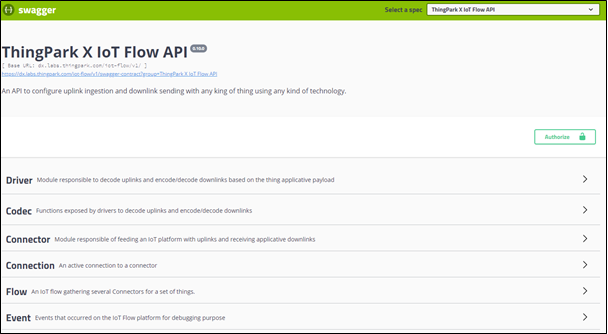

# Getting started with the ThingPark X IoT Flow API

## API Structure

The ThingPark X IoT Flow API exposes 6 resources:

* DRIVER
* CODEC
* CONNECTOR
* CONNECTION
* FLOW
* EVENT

The following table gives a definition of each Group of API:

<html>
<table>
    <thead>
        <tr>
            <th>
                <strong>Resource</strong>
            </th> 
            <th>
                <strong>Description</strong>
            </th>
        </tr>
    </thead> 
    <tbody>
        <tr>
            <td><strong>Driver</strong></td> 
            <td>This resource contains a set of endpoints that describes available drivers.</td>
        </tr>
        <tr>
            <td><strong>Codec</strong></td> 
            <td>This resource contains a set of endpoints used to manually encode/decode payloads.</td>
        </tr>
        <tr>
            <td><strong>Connector</strong></td> 
            <td>This resource contains a set of endpoints which describe available connectors (AWS Amazon, Microsoft Azure and MQTT)</td>
        </tr> 
        <tr>
            <td><strong>Connection</strong></td> 
            <td>This resource contains a set of endpoints used to manage your connection to an IoT cloud platform, as well as state and metrics statistics from your connection can be collected here.</td>
        </tr> 
        <tr>
            <td><strong>Flow</strong></td> 
            <td>This resource contains a set of endpoints used to manage the relationship between a set of Devices and a set of connections.</td>
        </tr> 
        <tr>
            <td><strong>Event</strong></td>
                <td>This resource can be used to retrieve events : 
                    <ul>
                        <li>Events which occurred during a specified time range.</li> 
                        <li>Events of a connection, if it has been stopped or restarted.</li>
                        <li>Errors occurring during the IoT Flow setup or execution.</li> 
                    </ul>
                </td>
            </tr>
    </tbody>
</table>
</html>

## Authentication Process

To start using the API, you need to be authenticated on the DX API framework, using standard OAuth2. 
Each request is verified for authentication using [https://dx-api.thingpark.com/admin/latest/swagger-ui.html](https://dx-api.thingpark.com/admin/latest/swagger-ui.html)
Full API documentation can be found here:[Dx-Admin documentation](https://dx-api.thingpark.com/admin/latest/doc/index.html)

## Getting Started Using the REST API with the Swagger UI

Swagger is a tool which allows to use any API documented with a Swagger signature without coding.
There are two environments which you can use to develop your Web-service application:

* 	The Qualification environment
* 	The Production environment

The Qualification environment should be used to develop and debug the Webservices.
In this environment, you may use beta versions of API which are more recent than “Latest” (the most recent production version). ThingPark SaaS customers are notified by email when new beta and pre-production versions of DX are released.
In order to test them, you must explicitly set the new API version (“latest” is switched to the new API only at the end of the Beta/Preprod validation period).

The Production environment should be used only for stable applications and point to “latest” API version. The URL of the production environment depends of your instance name : 

* [https://greenfield.thingpark.com/iot-flow/v1/swagger-ui.html](https://greenfield.thingpark.com/iot-flow/v1/swagger-ui.html)
* [https://iot.thingpark.com/iot-flow/v1/swagger-ui.html](https://iot.thingpark.com/iot-flow/v1/swagger-ui.html)
* [https://diffuseiot.thingpark.com/iot-flow/v1/swagger-ui.html](https://diffuseiot.thingpark.com/iot-flow/v1/swagger-ui.html)

The Qualification environment is available using this URL:

* [https://preview.thingpark.com/iot-flow/v1/swagger-ui.html](https://preview.thingpark.com/iot-flow/v1/swagger-ui.html)

The following screen is an example of the SWAGGER UI.

1. Browse [https://dx.labs.thingpark.com/iot-flow/v1/swagger-ui.html](https://dx.labs.thingpark.com/iot-flow/v1/swagger-ui.html)

2. Get an authorization token prior to using an endpoint.  
To do so, click **Authorize** and fill in your credentials.   
Your Client_Id field must contain the name of ThingPark platform instance and your login.  
Example : `fuota-labs-api/john.doe@actility.com`

[comment]: <> (<hyvor></hyvor>)
