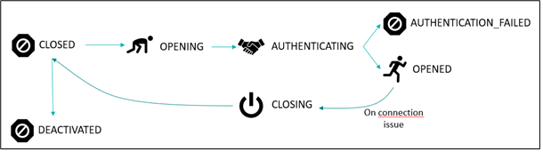

# About connections

## Common Parameters

[comment]: <> (<a name="common-parameters"></a>)

The following table lists the properties that are applicable to all connections.

| Property | Configuration value |
| -------- | ------------------- |
| ```active``` (optional, default = true) | <ul><li>Defines if you enable or not your connection.</li><li>When set to false and if previously active, the connection is stopped under 1mn.</li></ul>|
| ```connectorId``` (mandatory) | Defines the type of connector that you choose.E.g.: ```actility-aws-iot``` or ```actility-azure-iot``` |
| ```name``` (mandatory) | Name of the connection. Used for information only. |
| ```alarms``` (optional) | Defines alarms on low rate flow. For more information, see the section below. |
| ```configuration``` (mandatory) | <ul><li>Defines all specific parameters of a connection.</li><li>All properties available are defined for each connector. For more information, see the related chapters in this document.</li></ul>|
| ```configuration/description``` (optional) | Description text for the configuration (optional) |
| ```configuration/createDevices``` (optional) | <ul><li>When set to true, the connection should try to register on-the-fly devices on the cloud on the first uplink sent (if not yet created).</li><li>If this is not wanted/allowed (devices are already created on the cloud), set the value to false.</li><li>Default value is true.</li></ul>If it is found on the Cloud side, it is used. If it is not found on the Cloud side and createDevices is set to false, and error event is logged, and the uplink is skipped.|
| ```configuration/sendMetadata``` (optional) | <ul><li>For backward compatibility with tpdx-dataflow you can set sendMetadata to true to remove ‘DevEUI_uplink’ root node from uplinks.</li><li>**Only uplink messages are received, downlink acknowledge are filtered.**</li><li>Default value in tpx-flow is false.</li></ul> |
| ```configuration/sendRawDecodedFormat``` (optional, default = false) | If sendMetadata is set to false (default value) and sendRawDecodedFormat is set to true, the uplink sent to the cloud contains only ‘payload’ field content. In case ‘payload’ is not present, full uplink msg body is sent. Default values is false, so that full uplink msg body is sent. |
| ```configuration/uplinkTimeValidity``` (optional)| <ul><li>If set with a value (for instance, 1m), uplinks older than the set validity, will not be sent to the cloud service, and an alarm event is saved in the events’ log.</li><li>When connections have not started or have downtimes, uplinks are accumulating. Most of these uplinks expire before connections get up again.</li><li>No default value.</li></ul>|
| ```configuration/downlinkEnabled``` | <ul><li>When set to true, the connection should use downstream.</li><li>Default value is true.</li><li>If set to false, it will disable downstream.</li></ul> |
| ```configuration/downlinkAsId``` | In cases where downlinks need authentication, set the AS_ID value to downlinkAsId. |
| ```configuration/downlinkAsKey``` | In cases where downlinks need authentication, set the AS_KEY value to downlinkAsKey. |
| ```configuration/downlinkPort``` | In cases where downlinks messages don’t specify a downlink port, set the default port to downlinkPort. |
| ```configuration/reconnectStrategy```  (optional, default = NORMAL) | Reconnect strategy to use when a connection is unable to get to OPENED state in time. Possible values are: CALM <ul><li>Each 10mn for 12 hour</li><li>Each hour for 1 day</li><li>Set the connection to CLOSED</li></ul> NORMAL <ul><li>Each 5mn for 1 hour</li><li>Each hour for 1 day</li><li>Each day without limitation of time</li></ul> AGGRESSIVE <ul><li>Each 3mn for 3 hour</li><li>Each 30mn for 1 week</li><li>Each hour without limitation of time</li><li>Automatic restart, if no uplink has been detected during more than one hour.</li></ul>|

## Pattern expression

On connection configuration, some fields like `uplinkTopicPattern` accept JsonPath expression. Eg: `/mqtt/{DevEUI}/uplink`
`{DevEUI}`expression could point to every field you want on your uplink message.
Examples :
* `mqtt/thing/{DevEUI}/uplink`
* `mqtt/thing/{DevEUI}/{FPort}/uplink`
* `iot/devices/{DevEUI}/tags/{CustomerData.tags[0]}`

## Configuring the Low Message Rate Alarm

ThingPark X IoT Flow has a built-in functionality to detect unusually low uplink message rates processed by the connector towards the IoT cloud platform. This rate is set by connection and not for a specific Device. You can set up one or several low message rate alarms by specifying the following parameters:
* A recurring time window for which the minimum message rate will be checked.
* The minimum uplink message rate expected during this time window for the connector instance.
  For example, your Devices send on average 1 message per hour, and you have a pool of 20 Devices associated with this connector via ThingPark X IoT Flow. Therefore, you expect 20 messages per hour during open hours through the connector instance. You believe that the average rate of uplinks per hour should never get below 15 messages per hour during open hours, and you configure an alarm as in the example below:
* If during off hours the rate is lower than 15 messages per minute, no alarm is raised.
* If during open hours the rate gets lower than 15 messages per minute, a low-level uplink message rate alarm event is raised and added to the event log.

```json
"alarms": [
    {
      "startTime": "2019-01-31T09:00:00+01:00",
      "endTime": "2019-01-31T18:00:00+01:00",
      "timezone": "Europe/Paris",
      "recurrence": [
        {
        "frequency": "weekly",
        "byDays": ["monday", "tuesday", "wednesday", "thursday", "friday"]
        }
      ],
      "uplinkRateMinPerHour": 15,
      "message": "Low rate during business day..."
    }
  ]
```
:::tip Note
ThingPark Wireless also has a message rate alarm functionality per Device, which is configured per Device profile. This functionality generates alarms in ThingPark Wireless Device Manager tool and APIs. The ThingPark X low message rate alarm functionality is completely independent and accessed via TPX IoT Flow API.
:::


## Connection states
The state of a connection is provided by the connection object. An action does not change immediately the state of a connection due to the asynchronous architecture. When you start a connection, the connection can remain on CLOSED state during a short period before changing to OPENING. It is a normal behavior. Depending on the cloud connector, a connection can take time to be in a stable state.
Connection states are depicted in the following table.

|**Connection state**|**Property**|
|-|-|
|**OPENING**|The connection is currently opening.|
|**OPENED**|The connection is up and running.|
|**CLOSED**|The connection is currently closing.|
|**AUTHENTICATING**|The connection is currently authenticating.|
|**AUTHENTICATION_FAILED**|The authentication has failed.|
|**UNREACHABLE**|The bridge that hosts the connection is unreachable; none of the connection information can be retried.|
|**DEACTIVATED**|The connection is currently authenticating.|
|**AUTHENTICATING**|The connection is deactivated.|

The corresponding workflow is illustrated In the following graphic:



[comment]: <> (# Select your connectors)

[comment]: <> (Multiple connectors are available in ThingPark X IoT Flow. All available)

[comment]: <> (```connector``` types can be displayed by retrieving the connectors collection resource: ```GET/connectors```.)

[comment]: <> (An example of results is given:)

[comment]: <> (```json)

[comment]: <> (GET /connectors)

[comment]: <> ( [)

[comment]: <> (  {)

[comment]: <> (    "id": "actility-aws-iot",)

[comment]: <> (    "producerId": "actility",)

[comment]: <> (    "moduleId": "aws-iot",)

[comment]: <> (    "version": "2.0.0",)

[comment]: <> (    "description": "Actility AWS Connector",)

[comment]: <> (    "connection": {)

[comment]: <> (      "configurationSchema": {)

[comment]: <> (        "id": "urn:jsonschema:com:actility:tpx:flow:core:domain:connection:aws:AwsConfig",)

[comment]: <> (        "properties": {)

[comment]: <> (          "description": {)

[comment]: <> (            "type": "string")

[comment]: <> (          },)

[comment]: <> (          "createDevices": {)

[comment]: <> (            "type": "boolean")

[comment]: <> (          },)

[comment]: <> (        })

[comment]: <> (      })

[comment]: <> (    },)

[comment]: <> (    "flow": {})

[comment]: <> (  })

[comment]: <> (```)

[comment]: <> (The `id` of the connector must be used to create a new connection instance using this type of connector.)

[comment]: <> (In release 1.1.x, the available connector types are the following:)

[comment]: <> (```)

[comment]: <> (actility-aws-iot)

[comment]: <> (actility-azure-iot)

[comment]: <> (actility-mqtt-iot)

[comment]: <> (actility-watson-iot)

[comment]: <> (actility-thingworx-iot)

[comment]: <> (```)
