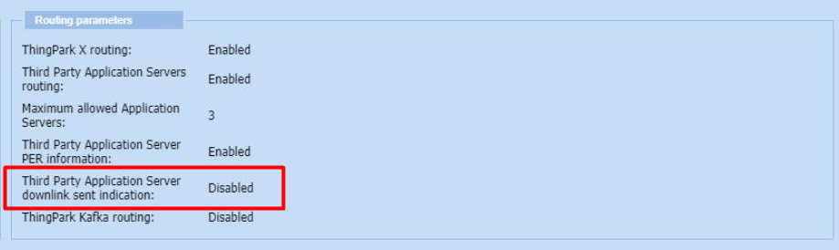
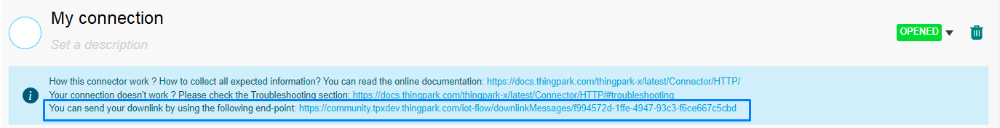
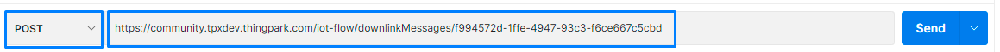
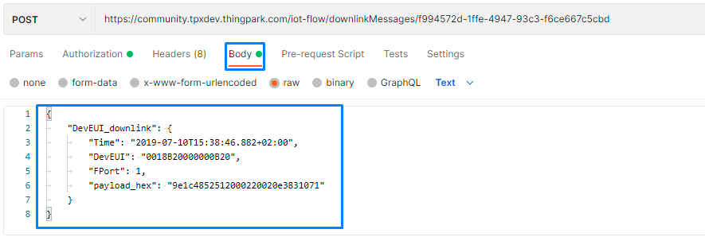
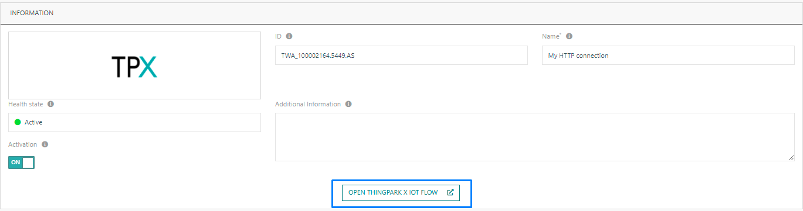
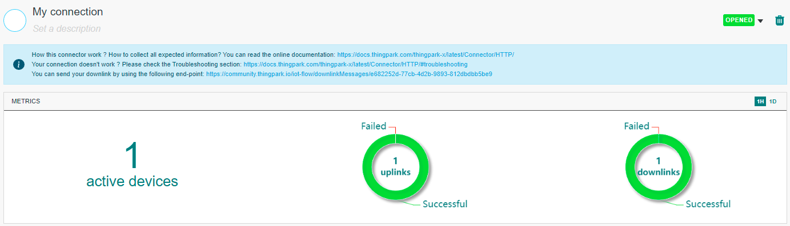

# Downlink Message

## <a id="messages">Original message</a>

The following Downlink message must be used by all connections from IoT cloud platforms to ThingPark X IoT Flow, regardless of their types.

```json
{
    "DevEUI_downlink": {
        "Time": "2019-07-10T15:38:46.882+02:00",
        "DevEUI": "0018B20000000B20",
        "FPort": 1,
        "payload_hex": "9e1c4852512000220020e3831071"
    }
}
```

The following Downlink message also includes optional fields.

```json
{
    "DevEUI_downlink": {
        "Time": "2019-07-10T15:38:46.882+02:00",
        "DevEUI": "0018B20000000B20",
        "FPort": 1,
        "AS_ID": "TWA_199983788.1972.AS",
        "AS_KEY": "9311e22d7d44fc52215b0dc154aa1d22",
        "payload": {
            "DownMessageType": "SET_PARAMETER",
            "ParameterName": "TRANSMIT_STRAT",
            "TransmitStrat": "DOUBLE_FIXED",
            "AckToken": 1
        },
        "Confirmed": "1",
        "ValidityTime": "2019-07-10T16:38:46.882+02:00",
        "FlushDownlinkQueue": "1",
        "DriverCfg": {
            "app": {
                "pId": "abeeway",
                "mId": "asset-tracker",
                "ver": "1"
            }
        }
    }
}
```

::: warning Important note
There must be the payload field or the hex-payload field, but not both in the same message.
:::

| Field | Description |
| ------ | ----------- |
| ```Time``` | ISO 8601 time of the request. Time is mandatory when the Application server authentication has been activated in the AS Profile. In this case the LRC will verify the time deviation between the generation and the reception of the request. The deviation must be lower than Max Time Deviation defined in the AS Profile. <br/><br/> Syntax: STRING (ISO date/time). |
| ```DevEUI```   | Target device IEEE EUI64 in hexadecimal format (representing 8 octets). <br/><br/> Syntax: STRING (Hexadecimal representation). |
| ```FPort``` | Target port (in decimal format). <br/><br/>Syntax: NUMBER (Unsigned integer: 1..224). |
| ```payload_hex``` | The hexadecimal payload. <ul><li>The hexadecimal payload will be encrypted by the LRC cluster if the FCntDn parameter is absent, and if the LRC has been configured with an AppSKey for the specified LoRaWAN® port.</li><li>Otherwise, the payload must be encrypted by the Application Server according to the LoRaWAN® specification, and the FCntDn parameter must be present.<ul><li> The Application Server encryption uses the downlink counter, which is why the FCntDn query parameter is required in this case. </li></ul></li></ul><br/>Syntax:  STRING (Hexadecimal representation). <div class="custom-block warning"><p class="custom-block-title">IMPORTANT</p><p>This field must not appear if there is already the **payload** field.</p></div>|
| ```payload``` | The payload is the decoded payload_hex. <br/><br/> Syntax:  STRING. <div class="custom-block warning"><p class="custom-block-title">IMPORTANT</p><p>This field must not appear if there is already the **payload_hex** field.</p></div> |
| ```FCntDn``` | The LoRaWAN® Downlink Counter value is used to encrypt the payload. This query parameter is needed only if the Application server (not the LRC) encrypts the payload. If present, FCntDn will be copied in the LoRaWAN® header field FCnt, and the encrypted payload will be copied as-is to the LoRaWAN® downlink frame by the LRC. <br/><br/> Only applicable to LoRaWAN® 1.0. <br/><br/>  Syntax: NUMBER (32 bits unsigned integer). |
| ```AFCntDn``` | The LoRaWAN® Applicative Downlink Counter value is used to encrypt the payload. This query parameter is needed only if the Application server (not the LRC) encrypts the payload. If present, AFCntDn will be copied in the LoRaWAN® header field FCnt, and the encrypted payload will be copied as-is to the LoRaWAN® downlink frame by the LRC. <br/><br/> Only applicable to LoRaWAN® 1.1. <br/><br/> Syntax: NUMBER (32 bits unsigned integer). |
| ```Confirmed``` | A value of Confirmed=0 requests transmission of an UNCONFIRMED downlink frame. A value of Confirmed=1 requests transmission of a CONFIRMED downlink frame. Default value is Confirmed=0 (UNCONFIRMED). Support of Confirmed frame transmission is subject to Connectivity plan feature flag ackedDownlinkFrame. If the Confirmed flag is set on the HTTP POST and the device is associated with a Connectivity plan where the ackedDownlinkFrame feature flag is set, the downlink packet is processed. Otherwise the processing is aborted, and a specific error code is returned to the AS in the HTTP response. <br/><br/> When targeting a multicast device, only unconfirmed frame is supported. <br/><br/> Syntax: NUMBER (Unsigned integer: 0..1). |
| ```FlushDownlinkQueue``` | Empties the device AS downlink queue of the device (Boolean). <br/><br/> When this parameter is set to FlushDownlinkQueue=1, the AS requests the LRC to purge the AS downlink queue of the device prior to add the downlink payload transported by this HTTP POST. <br/><br/> Syntax: NUMBER (Unsigned integer: 0..1). |
| ```ValidityTime``` | Associates the AS downlink payload with an expiration date (ISO 8601 timestamp or Duration in seconds) in the device AS downlink queue. <br/><br/> If the AS downlink payload has not yet been sent to the device, the AS downlink payload will be discarded by the LRC when the expiration date is reached. <br/><br/> Syntax: STRING (ISO date/time) or NUMBER (Unsigned integer). |
| ```AS_ID``` | Application Server ID, as provisioned in the AS Profile. AS_ID is mandatory if the Application server authentication has been activated in the AS Profile. In this case, the LRC will check that the Application Server is authorized to send downlink command to the device. <br/><br/> Syntax: STRING. |
| ```AS_KEY``` | Application Server Key. <br/><br/> Syntax: STRING. |
| ```Token``` | Security token to sign the downlink frame. Token is mandatory when the Application server authentication has been activated in the AS Profile. <br/><br/> Syntax: STRING (256 bits hexadecimal). |
| ```CorrelationID``` | 64 bits ID used to correlate the downlink frame with the associated downlink frame sent report or multicast summary reports. When this parameter is provided, it is sent back in the associated downlink frame sent report for unicast downlink frame or in the associated multicast summary reports for multicast downlink frame. <br/><br/> Syntax: STRING (64 bits hexadecimal). |
| ```RetryIneligibleGateways``` | When set to 1 or not provided, non eligible gateways (GPS out of sync for Class B, gateway down for Class B/C…) are retried during each retransmission attempt. <br/><br/> When set to 0, non eligible gateways are excluded at the beginning of the multicast campaign and not retried during each retransmission attempt. <br/><br/> This parameter is only applicable to multicast downlink transmission. <br/><br/> Syntax: NUMBER (Unsigned integer: 0..1). |

::: warning Important Note
For more informations, please refer to the [full documentation](https://oss-api.thingpark.com/tpw/7.3/Core-Network/lrc-as-tunnel-lorawan/documentation-tunnel-lrc-to-as-lorawan.html#/), check the only endpoint documentation, you can found example and description of all fields.
:::

## Downlink Sent Message

If you ask a confirmation when you send a downlink, you should receive the following message.

```json
{
    "DevEUI_downlink_Sent": {
        "Time": "2019-08-22T16:48:02.000+02:00",
        "DevEUI": "0018B20000000D48",
        "FPort": 1,
        "FCntDn": 47,
        "FCntUp": 39,
        "Lrcid": "0000000F",
        "SpFact": 7,
        "SubBand": "G1",
        "Channel": "LC2",
        "Lrrid": "FF0106DE",
        "DeliveryStatus": 0,
        "DeliveryFailedCause1": "B0",
        "DeliveryFailedCause2": "00",
        "DeliveryFailedCause3": "00",
        "CustomerID": "199983788",
        "CustomerData": {
            "alr": {
                "pro": "ADRF/DEMO",
                "ver": "2"
            }
        },
        "TransmissionSlot": 1,
        "Frequency": 868.3
    }
}
```

::: warning TPW users, please be sure that your connectivityPlan options allow it. :::

:::

| Property | Description |
| -------- | ----------- |
| ```Time``` | LRR Timestamp for the packet. Syntax: STRING (ISO date/time) |
| ```DevEUI``` | Device unique ID. Syntax: STRING (Hexadecimal representation) |
| ```FPort``` | LoRaWAN® FPort used by the device for this packet. Only set if present in the uplink packet. Syntax: NUMBER (Unsigned integer: 0..224) |
| ```FCntDn``` | The downlink counter to be used for the next downlink frame. If the downlink queue contains at least one payload encrypted by <ul><li>**AS:**<ul><li>The reported counter is the highest downlink counter in the downlink queue + 1</li></ul></li><li>**Else:**<ul><li>The reported counter is the last downlink counter used by the LRC to transmit a downlink + 1</li></ul></li></ul> Only applicable to LoRaWAN® 1.0. Syntax: NUMBER (32 bits unsigned integer) |
| ```FCntUp``` | The uplink counter for this packet. Syntax: NUMBER (32 bits unsigned integer) |
| ```Lrcid``` | ID of the LRC that processed the packet. Syntax: STRING (Hexadecimal representation) |
| ```SpFact``` | SF used by the device. Syntax: NUMBER (Unsigned integer: 7..12) |
| ```SubBand``` | Sub-band used by the device. Syntax: STRING |
| ```Channel``` | LC used by the device. Syntax: STRING ("LC0".."LC255") |
| ```Lrrid``` | The ID of the LRR that received the packet with the best SNR. This LRR is flagged as "best LRR". Syntax: STRING (Hexadecimal representation) |
| ```DeliveryStatus``` | RF transmission status:<ul><li>**1:** Downlink frame was sent over the air (either on RX1 or RX2). This means that the downlink frame was transmitted over the air by the LRR. But the downlink frame may not have been received by the device.</li><li>**0:** Downlink frame was not sent over the air (neither on RX1 nor RX2). The downlink frame is not retransmitted by the network server. Accordingly, the downlink frame will have to be reinitiated by the Application Server.</li></ul>Syntax: NUMBER (Unsigned integer: 0..1) |
| ```DeliveryFailedCause1``` | The over the air delivery error cause for RX1 downlink slot.<ul><li>**Class A device:** Transmission slot busy on RX1: <ul><li>A0: "Radio stopped"</li><li>A1: "Downlink radio stopped"</li><li>A3: "Radio busy"</li><li>A4: "Listen before talk"</li><li>A5: "Radio board error"</li></ul></li><li>**Class A device:** Received too late for RX1:<ul><li>B0: "Too late for RX1" </li></ul></li><li>**Class A device:** LRC selects RX2:<ul><li>C0: "LRC selected RX2"</li></ul></li><li>**Class A device:** DC or Gateway constraint on RX1:<ul><li>D0: "Duty cycle constraint detected by LRR"</li><li>DA: "Duty cycle constraint detected by LRC"</li><li>DB: "Max dwell time constraint detected by the LRC"</li><li>DE: "DC not allowed by the peering operator"</li></ul></li></ul>DeliveryFailedCause1 is set to 00 when no error occurs on RX1. Syntax: STRING (Hexadecimal representation) |
| ```DeliveryFailedCause2``` | The over the air delivery error cause for RX2 downlink slot.<ul><li>**Class A device:** Transmission slot busy on RX2:	<ul>	<li>A0: "Radio stopped"</li>	<li>A1: "Downlink radio stopped"</li>	<li>A3: "Radio busy"</li><li>A4: "Listen before talk"</li>	<li>A5: "Radio board error"</li>	</ul></li><li>**Class A device:** Received too late for RX2:<ul><li>B0: "Too late for RX2" </li></ul></li><li>**Class A device:** DC or Gateway constraint on RX2:	<ul>	<li>DA: "Duty cycle constraint detected by LRC"</li>	<li>DB: "Max dwell time constraint detected by the LRC"</li>	<li>DE: "DC not allowed by the peering operator"</li>	</ul></li><li>Class C device: Frame expired before transmission:	<ul>	<li>E0: "Max delay for Class C" (60 seconds)</li>	</ul></li></ul>DeliveryFailedCause2 is set to 00 when no error occurs on RX2. Syntax: STRING (Hexadecimal representation) |
| ```DeliveryFailedCause3``` | The over the air delivery error cause for downlink ping slot.<ul>	<li>**Class B device: Transmission slot busy on ping slot:**		<ul>			<li>A0: "Radio stopped"</li><li>A1: "Downlink radio stopped"</li><li>A2: "Ping slot not available"</li><li>A3: "Radio busy"</li>			<li>A4: "Listen before talk"</li><li>A5: "Radio board error"</li></ul></li><li>**Class B device: Received too late for ping slot:**	<ul><li>B0: "Too late for ping slot"</li>		</ul>		</li>		<li>**Class B device: DC or Gateway constraint on ping slot:**		<ul>			<li>D0: "Duty cycle constraint detected by LRR"</li>			<li>DA: "Duty cycle constraint detected by LRC"</li>			<li>DB: "Max dwell time constraint detected by the LRC"</li>			<li>DC: "No GPS-synchronized LRR detected by the LRC"</li>			<li>DD: "No LRR connected detected by the LRC"</li>			<li>DF: "Wrong NetID"</li>		</ul>		</li></ul>DeliveryFailedCause3 is set to 00 when no error occurs on ping slot.Syntax: STRING (Hexadecimal representation) |
| ```CustomerID``` | Customer ID associated to the ThingPark Enterprise account. Syntax: STRING |
| ```CustomerData``` | JSON customer data set by provisioning:<ul>	<li>"loc": administrative location (OPTIONAL)		<ul><li>"lat" (latitude) and "lon" (longitude) subattributes.</li></ul>	</li><li>"alr": application layer (OPTIONAL)<ul><li>"pro" (product) and "ver" (version) subattributes.</li></ul></li></ul>XML Syntax: STRING. JSON Syntax: OBJECT |
| ```TransmissionSlot``` | Slot used for downlink frame transmission: 0 (Unknown), 1 (RX1), 2 (RX2) or 3 (Ping Slot). Syntax: NUMBER (Unsigned integer: 0..3) |
| ```Frequency``` | Frequency in MHz of the radio channel used to receive the frame. Syntax: NUMBER (Float) |

::: warning Important Note
For more informations, please refer to the [full documentation](https://oss-api.thingpark.com/tpw/7.3/Core-Network/lrc-as-tunnel-lorawan/documentation-tunnel-lrc-to-as-lorawan.html#/), check the only endpoint documentation, you can found example and description of all fields.
:::

## Downlink Rejected Message

In case the downlink is rejected, you should receive the following message.

```json
{
    "DevEUI_downlink_Rejected": {
        "Time": "2019-08-22T16:48:02.000+02:00",
        "DevEUI": "0018B20000000D48",
        "FPort": 1,
        "DeliveryStatus": 350,
        "DownlinkRejectionCause": "Downlink counter value already used. Expected=1238",
        "CustomerID": "199983788"
    }
}
```

| Property | Description |
| -------- | ----------- |
| ```Time``` | LRR Timestamp for the packet. Syntax: STRING (ISO date/time) |
| ```DevEUI``` | Device unique ID. Syntax: STRING (Hexadecimal representation) |
| ```FPort``` | LoRaWAN® FPort used by the device for this packet. Only set if present in the uplink packet. Syntax: NUMBER (Unsigned integer: 0..224) |
| ```DeliveryStatus``` | RF transmission status:<ul><li>**1:** Downlink frame was sent over the air (either on RX1 or RX2). This means that the downlink frame was transmitted over the air by the LRR. But the downlink frame may not have been received by the device.</li><li>**0:** Downlink frame was not sent over the air (neither on RX1 nor RX2). The downlink frame is not retransmitted by the network server. Accordingly, the downlink frame will have to be reinitiated by the Application Server.</li></ul>Syntax: NUMBER (Unsigned integer: 0..1) |
| ```DownlinkRejectionCause``` | Cause of rejection. |
| ```CustomerID``` | Customer ID associated to the ThingPark Enterprise account. Syntax: STRING |

::: warning Important Note
For more informations, please refer to the [full documentation](https://oss-api.thingpark.com/tpw/7.3/Core-Network/lrc-as-tunnel-lorawan/documentation-tunnel-lrc-to-as-lorawan.html#/), check the only endpoint documentation, you can found example and description of all fields.
:::

## Sending a Downlink

1. Open your connection in Thingpark X.

2. Copy the URL inside the banner saying "You can send your downlink by using the following end-point".



3. Open a new Postman window. Create a new empty request.

4. Select **POST** as the request type, and paste the downlink URL inside the URL bar.



5. Click on the **Body** section and paste the downlink body. Then, click on **Send**.



6. Go back to your connection. Click on **Open ThingPark X IoT Flow**.



* You should be able to see if the downlink is successful.



:::tip Note
For more information about the downlink's content, please refer to the <a href="#messages">section above.</a>
:::

### Payload must be provided encrypted

If you see this message :
```"DownlinkRejectionCause" : "Payload must be provided encrypted with the downlink counter value"```
You need provide the ```FcntDn``` field on your downlink.
