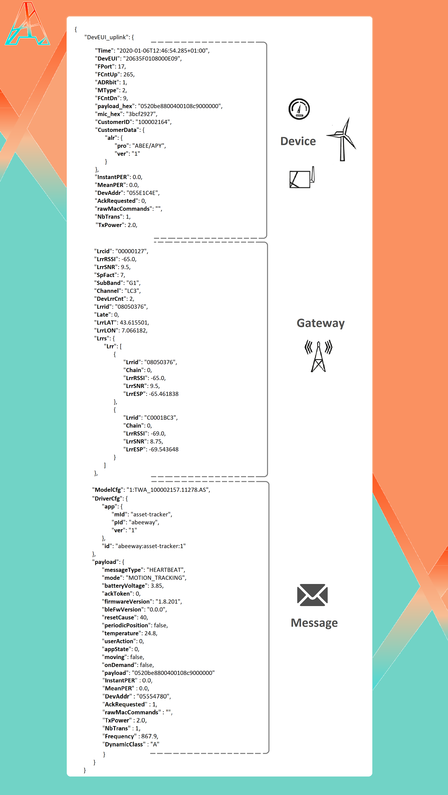

# UPLINK MESSAGE

## Message structure

* All Uplink (UL) and Downlink (DL) messages use JSON format.

* All datetimes use the ISO8601 format.

Multiple parameters set on the connection configuration can impact the output format (For instance, sendRawDecodedFormat).

See below an uplink example:



## Original message

The following Uplink message is sent by all connections from ThingPark X IoT Flow to any IoT cloud platform (regardless of connector type).

``` json
{
  "DevEUI_uplink": {
    "Time": "2018-10-03T15:38:46.882+02:00",
    "DevEUI": "0018B20000000B20",
    "FPort": "1",
    "FCntUp": "1174",
    "ADRbit": "1",
    "MType": "4",
    "FCntDn": "1229",
    "payload_hex": "9e1c4852512000220020e3831071",
    "mic_hex": "cfffc70f",
    "Lrcid": "00000206",
    "LrrRSSI": "-80.000000",
    "LrrSNR": "7.000000",
    "SpFact": "7",
    "SubBand": "G2",
    "Channel": "LC6",
    "DevLrrCnt": "1",
    "Lrrid": "004A18E3",
    "Late": "0",
    "LrrLAT": "45.851032",
    "LrrLON": "1.266230",
    "Lrrs": {
      "Lrr": [
        {
          "Lrrid": "004A18E3",
          "Chain": "0",
          "LrrRSSI": "-80.000000",
          "LrrSNR": "7.000000",
          "LrrESP": "-80.790100"
        }
      ]
    },
    "CustomerID": "1100000077",
    "CustomerData": {
      "alr": {
        "pro": "ADRF/DEMO",
        "ver": "2"
      }
    },
    "ModelCfg": "1:TemperatureService, 2:SwissPostDevice",
    "DevAddr": "05CB0AE8",
    "TxPower": 7.000000,
    "NbTrans": 1
  }
}
```

| Properties | Description |
| ---------- | ----------- |
| ```Time``` | Time when the message is send |
| ```DevEUI``` | Id of the device which send the message |
| ```FPort``` | Port used by the device |
| ```FCntUp``` | Uplink frame counter. Used to know if the device lost any frame. |
| ```ADRbit``` | ADRBit set by the device. ADRbit is not filled in the document, if not set in the uplink frame. Syntax: NUMBER (Unsigned integer: 0..1) |
| ```MType``` | LoRaWAN® MType of the packet. Syntax: NUMBER (Unsigned integer: 0..7) |
| ```FCntDn``` | Downlink frame counter. Used to know if the device lost any frame. |
| ```payload_hex``` | Message in its crypted format. |
| ```mic_hex``` | MIC in hexadecimal ASCII format. Syntax: STRING (Hexadecimal representation) |
| ```CustomerID``` | Id of the customer |
| ```CustomerData``` | JSON customer data set by provisioning: <ul><li>"loc": administrative location (OPTIONAL)<ul><li>"lat" (latitude) and "lon" (longitude) sub-attributes.</li></ul></li><li>"alr": application layer (OPTIONAL)<ul><li>"pro" (product) and "ver" (version) sub-attributes</li></ul></li>XML Syntax: STRING. JSON Syntax: OBJECT</ul> |
| ```InstantPER``` | Instant PER (Packet Error Rate). The instant PER is computed from a sliding window of last packets. Syntax: NUMBER (Float) |
| ```MeanPER``` | Mean PER (Packet Error Rate). Syntax: NUMBER (Float) |
| ```DevAddr``` | Device DevAddr. Syntax: STRING (Hexadecimal representation) |
| ```AckRequested``` | ACK requested indicator (Boolean). Syntax: NUMBER (Unsigned integer: 0..1) |
| ```rawMacCommands``` | Hexadecimal ASCII dump of the LoRaWAN® MAC option or LoRaWAN® MAC payload (port=0). Syntax: STRING (Hexadecimal representation) |
| ```NbTrans``` | The number of transmissions for each uplink message requested by the LRC, according to ADR algorithm and validated by the device through a LinkADRAns MAC command. If no LinkADRAns have been yet validated by the device, NbTrans = 1. Syntax: NUMBER (Unsigned Integer) |
| ```TxPower``` | The transmission power of the device (in dBm), computed by the LRC based on ADR algorithm and validated by the device through a  LinkADRAns. If no LinkADRAns have been yet validated by the device, the device  boot parameter is used instead.  Syntax: NUMBER (Float) |


### Gateway properties

| Properties | Description |
| ---------- | ----------- |
| ```Lrcid``` | ID of the LRC that processed the packet. Syntax: STRING (Hexadecimal representation) |
| ```LrrRSSI``` | Gateway's signal strengh (including disturbance).  |
| ```LrrSNR``` | Gateway's signal to noise ratio. (min: -20, max: 19). The higher the number is, the purest the signal is.|
| ```SpFact``` | Spreading factor used by the device. It's the transmission speed on air. (min: 7, max: 12). |
| ```SubBand``` | Sub-band used by the device. Syntax: STRING |
| ```Channel``` | Channel used by the gateway to send the packet. |
| ```DevLrrCnt``` | Frame counter of the gateway. <- a verifier si c'est en relation avec fcntup |
| ```Lrrid``` | Id of the gateway used to send the packet.  |
| ```Late``` | Indicates if the packet was queued by the LRR. Late is always filled. <ul><li>0 means that the packet was not queued by the LRR.</li><li>1 means that the packet was queued (the LRR queues packets when the connection between the LRR and the LRC is temporarily out of service).</li></ul> Syntax: NUMBER (Unsigned integer: 0..1) |
| ```LrrLAT``` | Latitude of the gateway |
| ```LrrLON``` | Longitude of the gateway |
| ```Lrrs``` | List of associated gateways |

::: warning Important note
The following properties are particular to the driver:
* ```ModelCfg```
* ```DriverCfg```
* ```messageType```
* ```mode```
* ```batteryVoltage```
* ```ackToken```
* ```firmwareVersion```
* ```bleFwVersion```
* ```resetCause```
* ```periodicPosition```
* ```userAction```
* ```appState```
* ```onDemand```
:::


## Decoded message

When using a driver, the hexadecimal payload is decoded. The following message include this decoded payload.

```json
    {
        "DevEUI_uplink": {
            "Time": "2020-01-06T12:46:54.285+01:00",
            "DevEUI": "20635F0108000E09",
            "FPort": 17,
            "FCntUp": 265,
            "ADRbit": 1,
            "MType": 2,
            "FCntDn": 9,
            "payload_hex": "0520be8800400108c9000000",
            "mic_hex": "3bcf2927",
            "Lrcid": "00000127",
            "LrrRSSI": -65.0,
            "LrrSNR": 9.5,
            "SpFact": 7,
            "SubBand": "G1",
            "Channel": "LC3",
            "DevLrrCnt": 2,
            "Lrrid": "08050376",
            "Late": 0,
            "LrrLAT": 43.615501,
            "LrrLON": 7.066182,
            "Lrrs": {
                "Lrr": [
                    {
                        "Lrrid": "08050376",
                        "Chain": 0,
                        "LrrRSSI": -65.0,
                        "LrrSNR": 9.5,
                        "LrrESP": -65.461838
                    },
                    {
                        "Lrrid": "C0001BC3",
                        "Chain": 0,
                        "LrrRSSI": -69.0,
                        "LrrSNR": 8.75,
                        "LrrESP": -69.543648
                    }
                ]
            },
            "CustomerID": "100002164",
            "CustomerData": {
                "alr": {
                    "pro": "ABEE/APY",
                    "ver": "1"
                }
            },
            "ModelCfg": "1:TWA_100002157.11278.AS",
            "DriverCfg": {
                "app": {
                    "mId": "asset-tracker",
                    "pId": "abeeway",
                    "ver": "1"
                },
                "id": "abeeway:asset-tracker:1"
            },
            "payload": {
                "messageType": "HEARTBEAT",
                "mode": "MOTION_TRACKING",
                "batteryVoltage": 3.85,
                "ackToken": 0,
                "firmwareVersion": "1.8.201",
                "bleFwVersion": "0.0.0",
                "resetCause": 40,
                "periodicPosition": false,
                "temperature": 24.8,
                "userAction": 0,
                "appState": 0,
                "moving": false,
                "onDemand": false,
                "payload": "0520be8800400108c9000000",
                "InstantPER": 0.0,
                "MeanPER": 0.0,
                "DevAddr": "055E1C4E",
                "AckRequested": 0,
                "rawMacCommands": "",
                "TxPower": 2.0,
                "NbTrans": 1,
                "Frequency": 867.9,
                "DynamicClass": "A"
            }
        }
    }
```

## Decoded payload only

When using a driver, the hexadecimal payload is decoded, and the result is inserted on the message in the field “payload”.

You can have this decoded message on two cases :

Your flow ```driver/id``` is set to ```“actility:auto:1”``` and your device driver model is set.

You have defined explicitly the use of a ```driver/id``` on your flow.

```json
{
	"DevEUI_uplink": {
		"Time": "2020-01-06T12:46:54.285+01:00",
		"DevEUI": "20635F0108000E09",
		"FPort": 17,
		"FCntUp": 265,
		"ADRbit": 1,
		"MType": 2,
		"FCntDn": 9,
		"payload_hex": "0520be8800400108c9000000",
		"mic_hex": "3bcf2927",
		"Lrcid": "00000127",
		"LrrRSSI": -65.0,
		"LrrSNR": 9.5,
		"SpFact": 7,
		"SubBand": "G1",
		"Channel": "LC3",
		"DevLrrCnt": 2,
		"Lrrid": "08050376",
		"Late": 0,
		"LrrLAT": 43.615501,
		"LrrLON": 7.066182,
		"Lrrs": {
			"Lrr": [
				{
					"Lrrid": "08050376",
					"Chain": 0,
					"LrrRSSI": -65.0,
					"LrrSNR": 9.5,
					"LrrESP": -65.461838
				},
				{
					"Lrrid": "C0001BC3",
					"Chain": 0,
					"LrrRSSI": -69.0,
					"LrrSNR": 8.75,
					"LrrESP": -69.543648
				}
			]
		},
		"CustomerID": "1100000077",
		"CustomerData": {
			"alr": {
				"pro": "ABEE/APY",
				"ver": "1"
			}
		},
		"ModelCfg": "1:TWA_100002157.11278.AS",
		"InstantPER": 0.0,
		"MeanPER": 0.0,
		"DevAddr": "055E1C4E",
		"AckRequested": 0,
		"rawMacCommands": "",
		"TxPower": 2.0,
		"NbTrans": 1,
		"DriverCfg": {
			"app": {
				"mId": "asset-tracker",
				"pId": "abeeway",
				"ver": "1"
			},
			"id": "abeeway:asset-tracker:1"
		},
		"payload": {
			"messageType": "HEARTBEAT",
			"mode": "MOTION_TRACKING",
			"batteryVoltage": 3.85,
			"ackToken": 0,
			"firmwareVersion": "1.8.201",
			"bleFwVersion": "0.0.0",
			"resetCause": 40,
			"periodicPosition": false,
			"temperature": 24.8,
			"userAction": 0,
			"appState": 0,
			"moving": false,
			"onDemand": false,
			"payload": "0520be8800400108c9000000"
		}
	}
}
```

## Legacy format

When you expect the receive the legacy format (Dx-Dataflow product), on your connection configuration, you need to set the parameter ```sendMetadata=true```.

```
{
    "Time": "2020-01-06T12:46:54.285+01:00",
    "DevEUI": "20635F0108000E09",
    "FPort": 17,
    "FCntUp": 265,
    "ADRbit": 1,
    "MType": 2,
    "FCntDn": 9,
    "payload_hex": "0520be8800400108c9000000",
    "mic_hex": "3bcf2927",
    "Lrcid": "00000127",
    "LrrRSSI": -65.0,
    "LrrSNR": 9.5,
    "SpFact": 7,
    "SubBand": "G1",
    "Channel": "LC3",
    "DevLrrCnt": 2,
    "Lrrid": "08050376",
    "Late": 0,
    "LrrLAT": 43.615501,
    "LrrLON": 7.066182,
    "Lrrs": {
        "Lrr": [
            {
                "Lrrid": "08050376",
                "Chain": 0,
                "LrrRSSI": -65.0,
                "LrrSNR": 9.5,
                "LrrESP": -65.461838
            },
            {
                "Lrrid": "C0001BC3",
                "Chain": 0,
                "LrrRSSI": -69.0,
                "LrrSNR": 8.75,
                "LrrESP": -69.543648
            }
        ]
    },
    "CustomerID": "100002164",
    "CustomerData": {
        "alr": {
            "pro": "ABEE/APY",
            "ver": "1"
        }
    },
    "ModelCfg": "1:TWA_100002157.11278.AS",
    "DriverCfg": {
        "app": {
            "mId": "asset-tracker",
            "pId": "abeeway",
            "ver": "1"
        },
        "id": "abeeway:asset-tracker:1"
    },
    "payload": {
        "messageType": "HEARTBEAT",
        "mode": "MOTION_TRACKING",
        "batteryVoltage": 3.85,
        "ackToken": 0,
        "firmwareVersion": "1.8.201",
        "bleFwVersion": "0.0.0",
        "resetCause": 40,
        "periodicPosition": false,
        "temperature": 24.8,
        "userAction": 0,
        "appState": 0,
        "moving": false,
        "onDemand": false,
        "payload": "0520be8800400108c9000000",
        "InstantPER": 0.0,
        "MeanPER": 0.0,
        "DevAddr": "055E1C4E",
        "AckRequested": 0,
        "rawMacCommands": "",
        "TxPower": 2.0,
        "NbTrans": 1,
        "Frequency": 867.9,
        "DynamicClass": "A"
    }
}
```