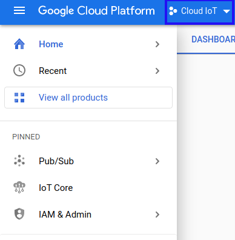
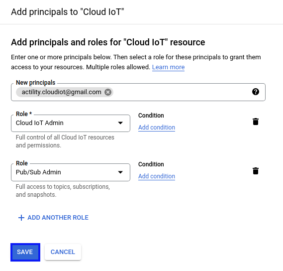
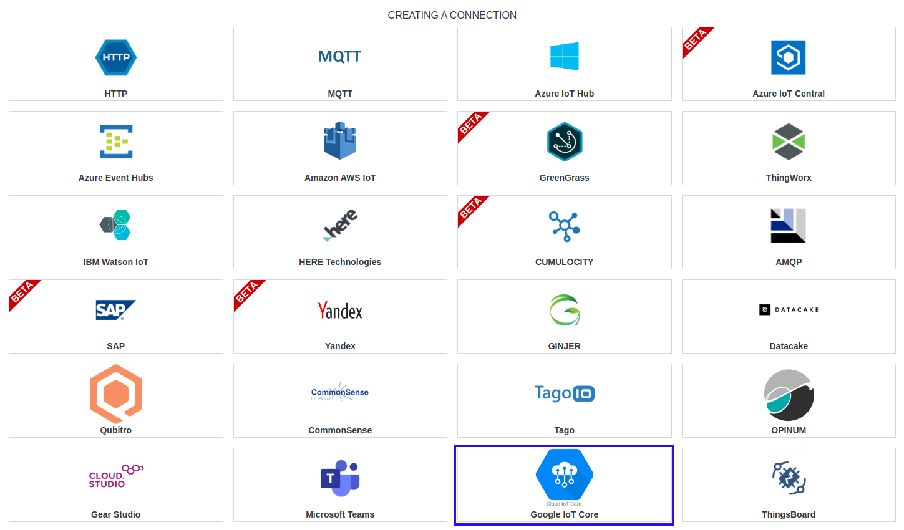
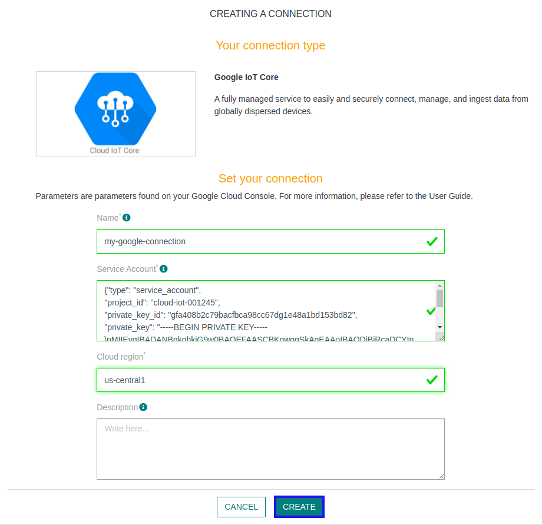
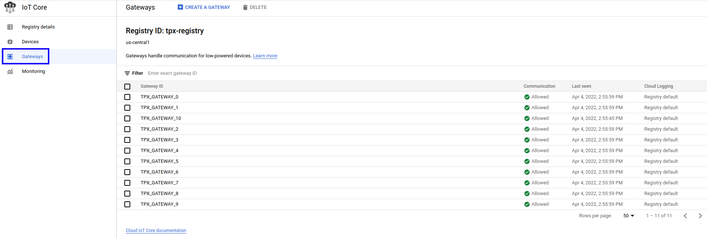
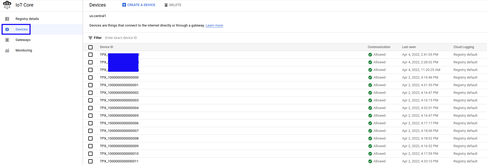

# CREATING A GOOGLE IOT CORE CONNECTION

## Collecting Expected Information

**Parameters required**

| Field | Description |
| ------ | ----------- |
| ```Service Account``` | JSON file that identify you.|
| ```Cloud Region``` | Region on which reside your project |

### Generate Service Account

1. Connect to your [Google Cloud Platform](https://console.cloud.google.com/home), and select your project.


2. Search for **Service Accounts** product, and click on it.


3. Click on **ADD**.

4. Fill in the form. **Principals** corresponds to your **Google Address Email**. For roles, you need to set **Cloud IoT Admin** and **Pub/Sub Admin**.


5. You can now copy you Service Accounts JSON file.

### Choose Cloud Region

As for now, there is 3 Cloud Region available:
* us-central1
* europe-west1
* asia-east1

## Creating a Connection With API

The creation of a connection establishes a unidirectional messaging transport link to the cloud provider.

To do this, you need to use the **Connections** group resource:
*	`POST/connections` to create a new Connection instance
*	`PUT/connections` to update a Connection instance
*	`DELETE/connections` to delete a Connection instance


::: tip Note
We follow the REST-full API pattern, when updating configuration properties for a connection resource. Thus, you must also provide the whole configuration again.
:::

Example for creation of a new connection instance :

```json
POST /connections
{
  "name":"Actility To Google",
  "connectorId":"actility-google-iot",
  "configuration": {
      "serviceAccount": {your json file},
      "cloudRegion": "us-central1"
  },
}
```

The following table lists the properties applicable to a connection instance.

| Field | Description |
| ------ | ----------- |
| ```connectorId``` | Must be set to actility-google-iot for Google IoT Core platform. |
| ```configuration/serviceAccount``` | Must be replaced by your Service account file. |
| ```configuration/cloudRegion``` | Must be replaced by your Registry cloud region. |

::: warning Important note
All properties are not present in this example. You can check the rest of these properties in the [common parameters section](../../Getting_Started/Setting_Up_A_Connection_instance/About_connections.html#common-parameters).
:::

## Creating a Connection With UI

1. Click Connections -> Create -> **ThingPark X IoT Flow**


2. Then, a new page will open. Select the connection type: **Google IoT Core**.


3. Fill in the form as in the example below and click on **Create**.


::: tip Note
Parameters marked with * are mandatory.
:::

4. A notification appears on the upper right side of your screen to confirm that the application has been created.

5. After creating the application, you will be redirected to the connection details.

## Limitations

Limitations depends on Account Plan you own.

## Displaying information to know if it worked

1. Go to your registries list, a **tpx-registry** registry should appear.


2. If you have linked devices to your Google IoT Core connection in ThingPark, you will see multiple devices or gateways
depending on the number of devices you have linked to your Google IoT Core connection.

#### Gateways


#### Devices

Devices are named using **TPX_** prefix followed by the **device EUI**.
## Troubleshooting

As for now, there are no detected bugs.

* Google IoT Core documentation: [https://cloud.google.com/iot-core/docs/](https://cloud.google.com/iot-core/docs/)
