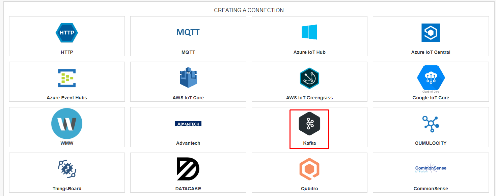
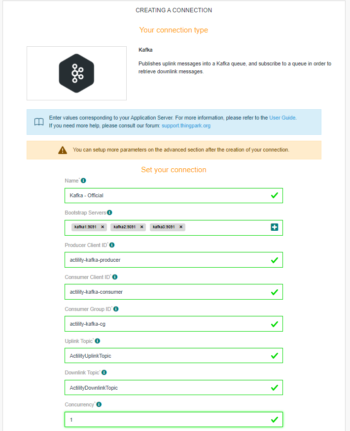

# CREATING AN KAFKA CONNECTION

## Creating a Connection From UI

You must have deployed a Kafka server prior to connecting with the Kafka protocol-based application.

| UI Field | Description |
| ------ | ----------- |
| **Bootstrap Servers** | The list of Kafka brokers to connect to. Example: kafka.actility.com:5672. |
| **Producer Client ID** | The client ID to use when connecting to the Kafka cluster for publications. |
| **Consumer Client ID** | The client ID to use when connecting to the Kafka cluster for consumming. |
| **Consumer Group ID** | The consumer group ID to use when connecting to the Kafka cluster for consumming. |
| **Uplink Topic** | The topic to publish messages to. This topic should already exist on broker. |
| **Downlink Topic** | The topic to subscribre incoming messages to. This topic should already exist on broker. |
| **Concurrency** | The number of consumers to use when subscribing to topics.  |

1. Click Connections -> Create -> ThingPark X Iot Flow.


Then, a new page will open. Select the connection type : Kafka.



2. Fill in the form as in the example below and click on **Create**.

:::warning Warning
Topics used should already be created on Kafka broker.
:::



::: tip Note
Parameters marked with * are mandatory.
:::

* A notification appears on the upper right side of your screen to confirm that the application has been created.


4. After creating the application, you will be redirected to the application details.


## Creating a Connection With API

The creation of a connection establishes a bidirectional messaging transport link between ThingPark X IoT Flow and the broker.

To do this, you need to use the **Connections** group resource:

* `POST/connections` to create a new Connection instance
* `PUT/connections` to update a Connection instance
* `DELETE/connections` to delete a Connection instance

::: tip Note
We follow the REST-full API pattern, when updating configuration properties for a connection resource. Thus, you must also provide the whole configuration again.
:::

Example for creation of a new connection instance :

```json
POST /connections
{
    "connectorId":"actility-kafka-iot",
    "name":"Kafka - Official",
    "configuration":{
        "bootstrapServers": "kafka1:9091,kafka2:9091,kafka3:9091",
        "producerClientId": "actility-kafka-producer",
        "consumerClientId": "actility-kafka-consumer",
        "consumerGroupId": "actility-kafka-cg",
        "uplinkTopic": "ActilityUplinkTopic",
        "downlinkTopic": "ActilityDownlinkTopic",
        "concurrency": 1
    }
}
```

The following table lists the properties applicable to a connection instance.

| JSON Field | Description |
| ------ | ----------- |
| ```connectorId``` | Must be set to actility-kafka-iot for Kafka platform. |
| ```bootstrapServers``` | The list of Kafka brokers to connect to. Example: kafka.actility.com:5672. |
| ```producerClientId``` | The client ID to use when connecting to the Kafka cluster for publications. |
| ```consumerClientId``` | The client ID to use when connecting to the Kafka cluster for consumming. |
| ```consumerGroupId``` | The consumer group ID to use when connecting to the Kafka cluster for consumming. |
| ```uplinkTopic``` | The topic to publish messages to. This topic should already exist on broker. |
| ```downlinkTopic``` | The topic to subscribre incoming messages to. This topic should already exist on broker. |
| ```concurrency``` | The number of consumers to use when subscribing to topics.  |

::: warning Important note
All properties are not present in this example. You can check the rest of these properties in the [common parameters section](../../Getting_Started/Setting_Up_A_Connection_instance/About_connections.html#common-parameters).
:::

## Displaying Information to Know if it Worked

1. Open your favorite tool to check if the connector listen the downlink topic.


## Limitations

There are currently no known limitations to the Kafka connector.

## Troubleshooting

As for now, there are no detected bugs.
