# CREATING A THINGWORX CONNECTION

This setup is intended to be a minimal setup example to get the ThingWorx connector working.

The ThingWorx IoT connector requires that the ThingWorx Platform is installed and configured upfront.

## Creating a Connection with API

WebSocket Secure (WSS) over TLS v1.2 connection is the recommended protocol by ThingWorx and is mandatory.

You need to create the connection prior to creating the flow.

The creation of a connection establishes a link from ThingPark Wireless to the cloud provider that you want to associate a Device with. The link can be used to transport any Uplink regardless the DevEUI parameter.

To do this, you need to use the following endpoints:

+ ```POST/connections``` for creation
+ ```PUT/connections``` for modification
+ ```DELETE/connections``` for deletion

::: tip Note
When you update a configuration property on a connection, you must provide the whole configuration properties again.
:::

Example of the creation of a connection

```json
    POST /connections
    {
        "connectorId": "actility-thingworx-iot",
        "name": "Actility ThingWorx Connection",
        "configuration": 
        {
            "description": "ThingWorx Datacenter",
            "hostName": "127.0.0.1:8443",
            "applicationKey": "0d820ccd-4683-4f6d-0j87-3f6c0cf23ehd",
            "thingTemplateName": "actilityThingTemplateSF"
        }
    }
```

The following table lists the expected results of properties when applied.

| Property | Expected results |
| -------- | ---------------- |
| ```connectorId```   | Set to ```actility-thingworx-iot``` |
| ```configuration/hostName``` | Defines the host:port of the ThingWorx Platform to use. Note Ensure that platform has SSL/TLS enabled |
| ```configuration/applicationKey``` | Secret access key for accessing the ThingWorx Platform. Required for building the WSS over TLS v1.2 connections. |
| ```configuration/thingTemplateName``` | ThingWorx ThingTemplate to be associated with the Things processed by the connector. |
| ```configuration/pipeCount``` | The pipe count is the number of web sockets that the client opens. The default value of 1 suffices in most applications. Limited to 255. |

::: warning Important note
All properties are not present in this example. You can check the rest of these properties in the [common parameters section](../../Getting_Started/Setting_Up_A_Connection_instance/About_connections.html#common-parameters).
:::

## Creating a Connection with UI

You need to know the parameters that are required to perform this task. To learn more, check the [Parameters required for connecting to a THINGWORX platform](#THINGWORXparameters) below in this topic.

Click Connections -> Create -> ThingPark X IoT Flow.


Then, a new page will open. Select the connection type : **Thingworx**.

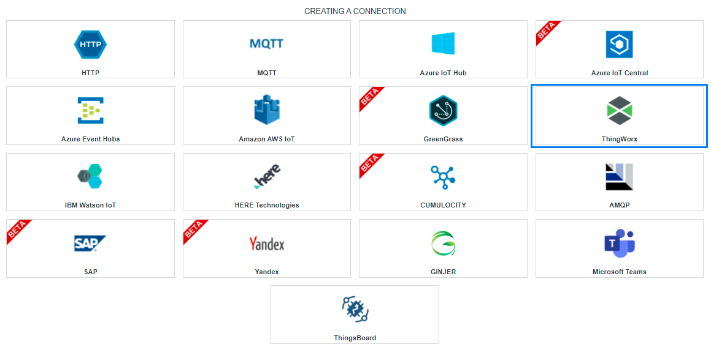

2. Fill in the form as in the example below and click on **Create**.

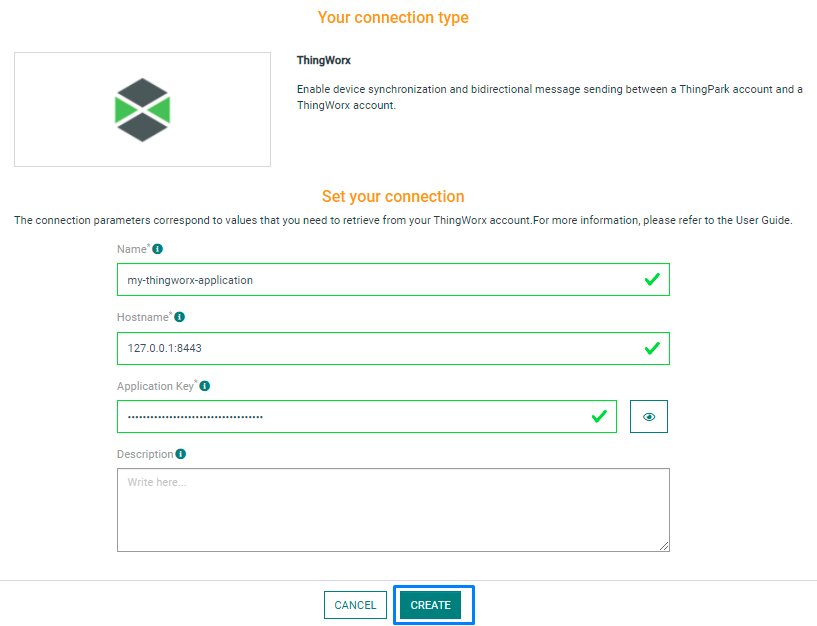

::: tip Note
Parameters marked with * are mandatory.
:::

* A notification appears on the upper right side of your screen to confirm that the application has been created.

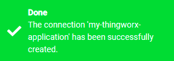

4. After creating the application, you will be redirected to the application details.

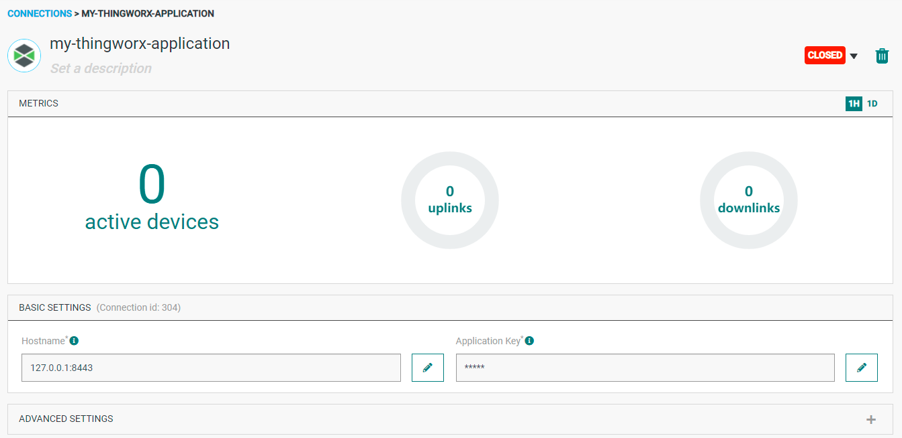

### Changing the Settings after Creation

To do this, proceed as follows:

1. Select the Thingworx application for which you want to change one or several parameters.

2. In the application information dashboard, click on the **Edit** button corresponding to the parameter you want to change.

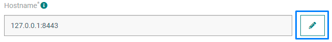

3. Enter the new value, and click on the **Confirm** icon.

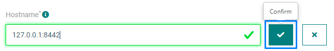

* The Confirmation window displays,

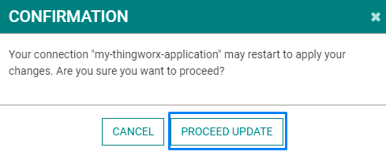

* A notification will inform you that the parameter is updated.

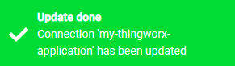

## <h3 name="THINGWORXparameters">Parameters required for THINGWORX platform</h3>

The parameters are the following:

| UI Field | Description |
| ------ | ----------- |
| **Application Name** | Name of the application that you want to register (Editable). |
| **Hostname** | The Hostname/ IP (within or without port) of the Thingworx platform. Example: myhostname.com:port (Editable). |
| **Application Key** | Secret access key for accessing the ThingWorx platform (Editable). |
| **Description** | Description of the application (Editable). |

## Collecting Expected Information on ThingWorx

###  Setup

This setup is intended to be a minimal setup example to get the ThingWorx connector working. 

###  Prerequisites

The ThingWorx connector is intended to be connected to the ThingWorx Foundation service. This service can be either provided by ThingWorx as a SaaS service or hosted on local premises.

###  Configuration

After enabling the ThingWorx service, an **application key** must be retrieved, and **Actility Thing Templates** must be imported.

### Application key retrieval

We recommend that you create a new user or use an existing one that is different from the Administrator user.

1.	Login to ThingWorx Composer as Administrator ```(https://<host>:<port>/Thingworx/Composer/index.html)``` and click the Users' link in the 'Security' section of the menu. Click **New** to add a new user.

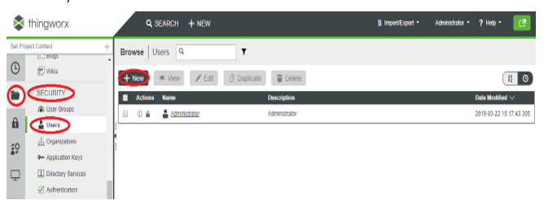

2.	On the **General Information** tab fill username, password and make sure **Enabled** is checked and click **Save**.

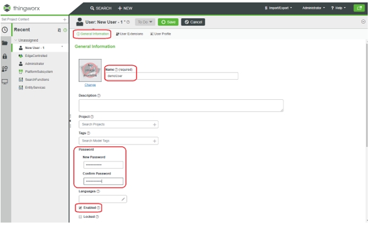

3.	Click the **Application Keys** link in the **Security** section of the menu and click **New** to create an application key for the newly created user.

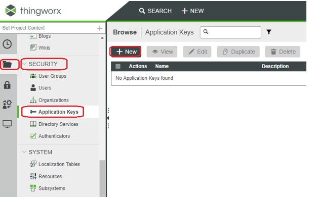

4.	Set key **Name**, select **Username Reference** and set an **Expiration Date** in the future. and then click **Save**.

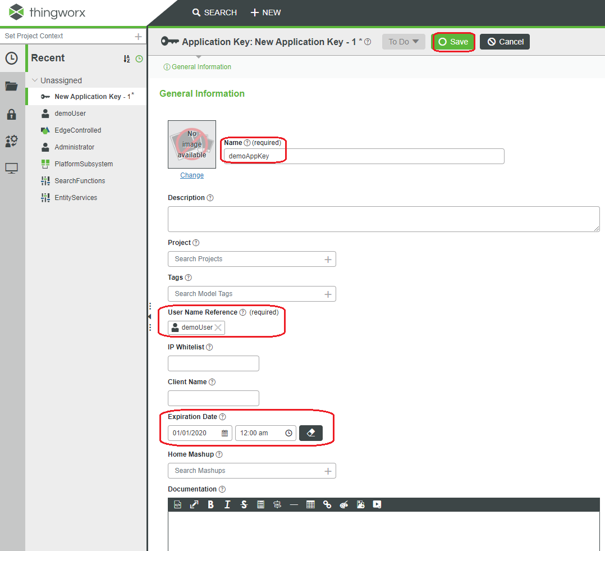

5.	After you click **Save**, a **Key ID** is generated. Copy it to use it in Actility Flow Connection configuration.

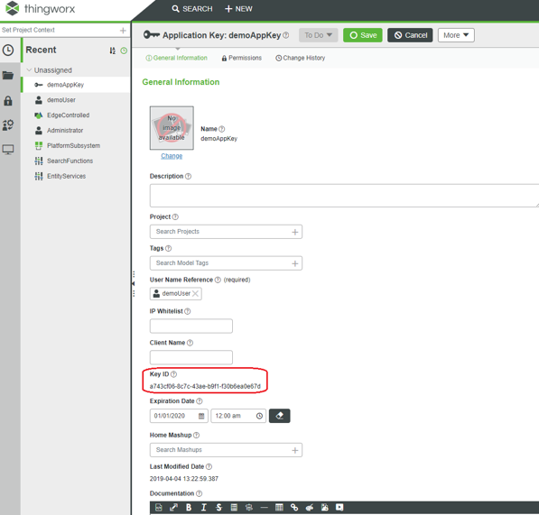

###  Permissions setup

1.	Click on the **Collections** link in the **Permissions** section of the menu, select **Things** and **Thing Templates** and click **Edit Permissions**.

 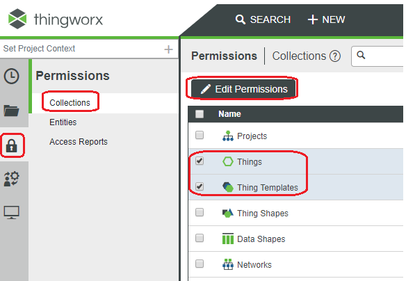

2.	On the **Visibility** Tab, select **Composer** organization and click **Save**.
 
 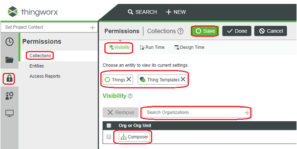

3.	On the **Design Time** tab, select the user and check at least **Create** and **Read** permission and click **Save**.
 
 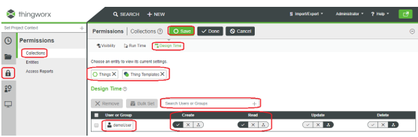

4.	Click on the **Entities** link in the **Permissions** section of the menu, search/select **EntityServices** and click **Edit Permissions**.

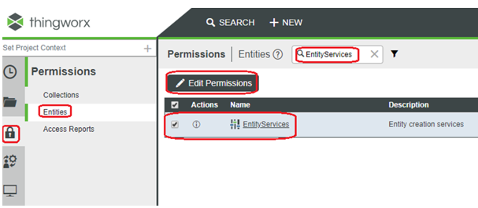

5.	On the **Visibility** Tab select **Composer** organization and click **Save**.
 
 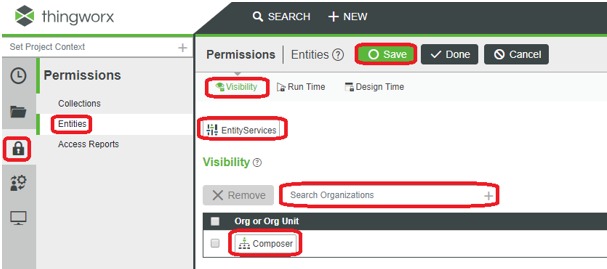

6.	On the **Run Time** tab add **CreateThing**, **CreateThingTemplate** and **GetEntityList**  services and allow the created user to execute them and click Save. In this way the Actility Connection that will use the application key will be able to create initial ThingTemplate (if it is missing) and to create Things (if they are missing) on the ThingWorx Platform.

 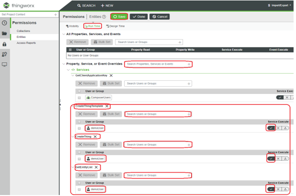

7.	In the **Access Reports** link in the **Permissions** section of the menu you can check that the user has access to those services.
 
 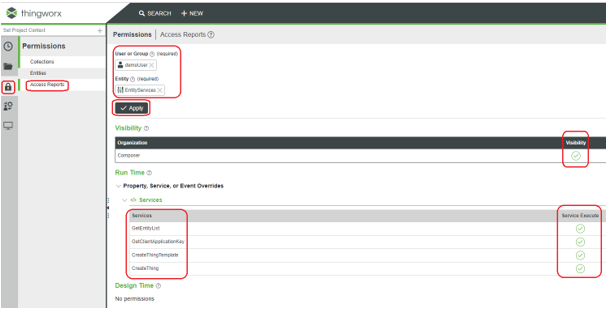

8.	Now you can login with the newly created user in the ThingWorx Composer and use the application key (Key ID) inside the Actility Connection configuration.

## How to send a downlink

On each device, a property named **downlink** can be send with a json message in order to send a downlink to Actility device.
```json
{
    "DevEUI_downlink": {
        "Time": "2019-07-10T15:38:46.882+02:00",
        "DevEUI": "0018B20000000B20",
        "FPort": 1,
        "payload_hex": "9e1c4852512000220020e3831071"
    }
}
```
For more informations, you can see [downlink message section](../../Message/Downlink_Message/#original-message).

## Limitations

This connector is limited to 10K devices.

## Displaying Information to Know if it Worked

1.	Go to the ThingWorx Composer dashboard and select the Device you want to monitor.

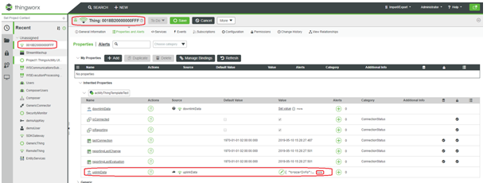

2.	Click **more** to see the latest uplink data:

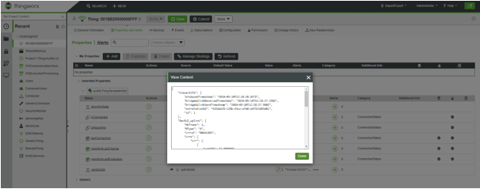

## Troubleshooting

### Last wins issue

[comment]: <> (<a name="troubleshooting"></a>)

If you see this error on events :

```json
Unable to restart connection THINGWORX with id 289: Could not bind things: Error trying to process message: Binding failed, see server log for more information V1BindMessage [header=V1MessageHeader [messageType=10, requestId=21794, endpointId=-1, sessionId=-1, flags=0], gatewayName=null, gatewayType=null, names=[AlertHistoryStream, AlwaysOnReporting, AnalyticsResultStorage, AnalyticsUploadStorage, AnomalyMonitorStateStream, AuditArchiveCleanupNotificationScheduler, AuditArchiveCleanupScheduler, AuditArchiveFileRepository, AuditArchiveScheduler, AuditArchiveSchedulerDirectPersistence, AuditDataTable, AuditPurgeScheduler, AzureBlobStorageThing, AzureIot-cxserver-f55668c2-47e2-44bb-84df-e83474062004, AzureOpcUaPropertyMapDataTable, AzureServices, ConnectionServicesHub, DemoComThing, DemoHenkelAlarmConfIgThing, DownloadedSolutions, HKL.Laundry.DataThing, HKL.Laundry.EMailThing, HKL.Laundry.SMSThing, HKL.Montornes.MESDB, HKL.Montornes.WonderwareDB, HKL.SensorData.VS, Henkel.Laundry.DBThing, Henkel.Laundry.Monternes.MESDB, Historian, IndustrialGatewayDiagnosticStream, JDBCExtensionCreator, NotReporting, PTC.SensorBucket, PackagedSolutions, ProtocolAdapterLeaderElectionTimer, ProtocolAdapterServices, SecurityMonitor, Sensorfact, SupportRepository, SystemRepository, Temp_DusLab, Temp_DusLab2, a-weu-dev-iotcoe-iot-001, opc_1, opc_2, opc_3, opc_4, opc_5, opc_6, opc_7]]
```

It's probably due to a connection ghost on TPC server side.
On Thingworx, you need set the option "Last in wins" that you can found on configuration of the WS communication part.

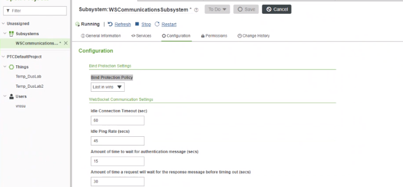

### User rights

```
Unable to open connection THINGWORX with id 301: Unable to dispatch [ uri = /Resources/EntityServices/Services/GetEntityList/]: Entity EntityServices does not exist or is not yet associated with a Thing
```
This error message is related to administration rights, please be sure that on Thingworx, the user as rights for getting entity list.
