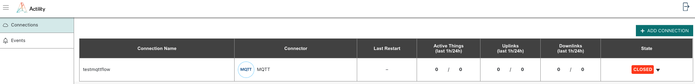
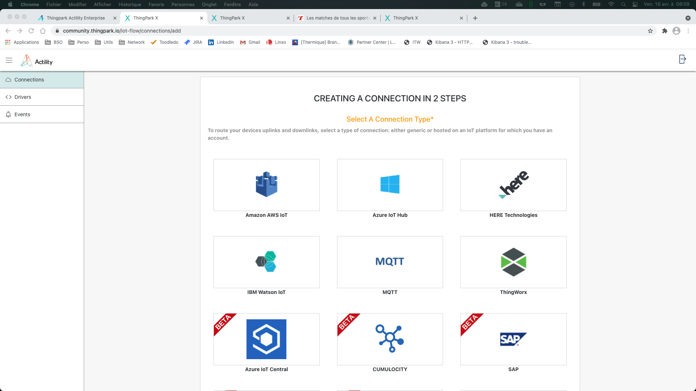
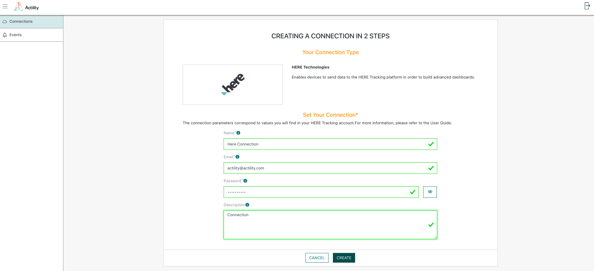
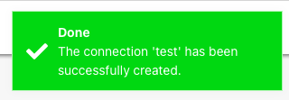
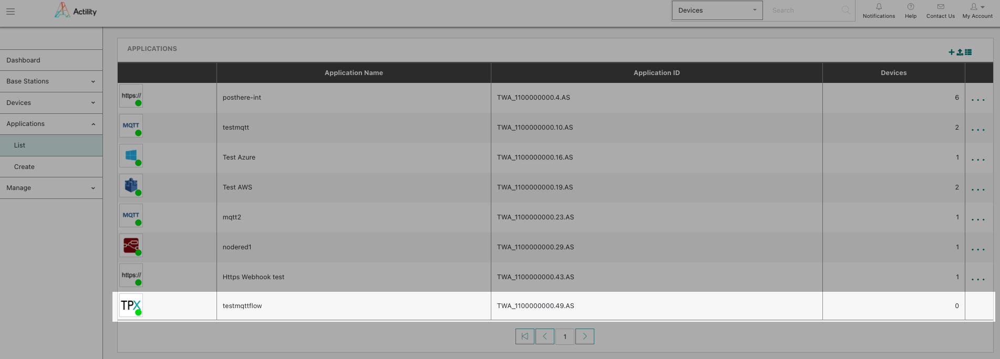

# Creating a connection instance using ThingPark X IoT Flow UI

## Connection creation steps

1. From the **Connections menu**, click on «Add Connection»

   

Note that «Add connection» button is also available as a shortcut on TP X IoT Flow UI dashboard.

2. Select the desired connector to create your connection instance.
   

Connectors flagged as «BETA»  are functional but haven’t be widely used in production yet. Minor limitations or bugs might be encountered using them.

3. Complete the information required for the selected connector.

   
    * Mandatory parameters are marked with a ‘*’ .
    * Detailed information about connector’s parameters is available in the **Connectors section** of this online documentation.

4. Click on «Create» to submit your form. A toaster will confirm successful creation of the connection, and the connection detailed view is opened.

The newly created connection is now visible in the connections list of the TP X IoT Flow UI.

## Connection creation for ThingPark Enterprise users.
When creating a TP X IoT Flow connection as a ThingPark Entreprise user, this will also trigger the creation of a ThingPark Enterprise Application, labelled as a  «TP X application», listed on the application list of thin ThingPark Enterprise UI.

