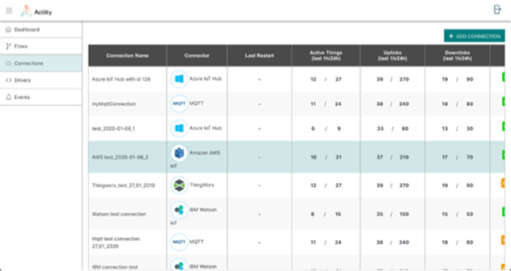

# ThingPark X IoT Flow Overview

Actility believes in a radically more efficient and sustainable world through ubiquitous digital-twin technology.
Digital twins are software representation of physical devices.
The software interface exposes the device properties (and their current values like battery level), along with callable method sending
downlink messages.

We want to spark this transition and become the leading global mediation platform between cloud apps & physical world.
ThingPark X is the cornerstone of Actility’s vision to make digital twins common place. Positioned at the edge of the LoRaWAN network,
ThingPark X simplifies the interface between LPWAN-connected sensors and IoT application,
transforming sensors raw data into application-friendly actionable information,
that can be fed into digital twins object of various IoT Platforms.

## ThingPark X IoT Flow in the ThingPark Product Stack

ThingPark X IoT-Flow acts as a mediation layer handling bi-directional communication between ThingPark powered networks and
application servers or major cloud-based IoT Services in order to keep digital twins in sync.
This ability to feed digital twins consistently whatever the LPWAN sensors connected relies on
key capabilities delivered by TPX IoT-Flow:

1. ***Drivers***: Transforms the device specific payload into a generic JSON object. Based on ThingPark device profiles, our TPX Platform will be able to decode uplink messages collected through the LPWAN network, in order to transform raw data into actionable data points. ThingPark X Drivers Library supports already more that 100 sensor models and offers the possibility to upload custom drivers.

2. ***Connections***: Adapting transport protocol and forwarding to external application servers or cloud providers. Connectors ensure the proper delivery of the extracted sensor data (via the driver engine) to your selected IoT platform(TPX IoT Core, AWS IoT Core, Azure IoT hub, Thingworx,…), ensuring that:

   a. Authentication is properly handled

   b. Device / Thing provisioning is consistent. E.g. AWS IoT Core connector will create dedicated thing type on AWS IoT Core and instantiates things if it does not exist yet.

   c. Data publication at the right place - E.g.  in the device shadow, or in the alarm framework of the IoT platform if data extracted is an alarm.

3. ***Flows***: A data flow (Flow) processes payloads and sends commands to a list of devices associated to tihs Flow. The Flow is associated to one or more Connections to external application servers or IoT platform proviers. As part of a given Flow instance you can also define the drivers to use for payload decoding/command encoding, add optional filtering, transformation and forwarding rules. Typically a flow will first decde the devices' payload into the ThingPark X normalized ontology, then translate this payload into the format expected by the target IoT platform. 

## ThingPark Solution Overview

## Key Concepts

Moving your devices’ data using IoT Flow requires two pieces of information that are ***the data source and its destination***.
In TPX IoT ***Flow***, this information is encapsulated into a Flow object.
The Flow object allows you to define simple rules in order to route the data from a set of devices to another set of destinations.
On the source side, a Flow is attached to your devices using **Keys** (Dev_EUI) or **Tags**.
On the destination side, a Flow send the data into a **Connection**. A Connection uses a **Connector** to communication with an external service like a cloud provider.

### Connectors

TPX-IoT Flow ***connectors*** are profile that will determine the communication parameters toward the IoT Cloud platform.
Amongst the available connectors currently available you will find generic connectors such as MQTT or HTTP,
as well as application specific connectors like AWS IoT Core or Azure IoT Hub.

TPX-IoT Flow `connectors` is a link which establish the communication between Actility and your application server.

See the full connector list <a href="../Connector/MQTT/" style="color:teal">here</a>.

### Connection

A **connection** is a specific instance of a `Connector` for which you define specific parameters to establish a communication stream with the selected IoT cloud platform.

### IoT Flow

An  **IoT Flow** is the object that will create an association between a sensor and an IoT cloud platform.
This association is done by matching sensors traffic to a specific ***Connection*** using ***tags*** available as metadata in uplink/downlink messages.

### IoT Flow Rest API

The IoT Flow REST API is a set of webservice allowing to create and configure the IoT Flows.

##### Configuration Steps

In order to establish a bi-directional communication between an LPWAN connected sensor and a compatible IoT cloud platform using TPX-IoT Flow, you need to complete the following steps:

This flow is described in the subsequent sections of this document.

*	To create your first IoT Flow, follow the <a href="../Getting_Started/Getting_Started_ThingPark" style="color:teal" >Getting started</a> section.

## Interfaces

Two interfaces are available to interact with ThingPark X IoT Flow: a graphical user interface and an API.

### Graphical User Interface - GUI

The GUI is useful to manage the objects interactively and to monitor events in case of problem.
It’s designed to give a meaningful overview of the user’s objects.
You can use the GUI when the number of objects you need to evaluate are under 10, for example when a particular connection must be fixed.
It’s not designed to perform analytics nor bulk operations.

### Application Programmable Interface - API

The IoT Flow REST API is a set of webservices allowing to create and configure the IoT Flows.
The API is useful to allow machines to communicate in order to automate repetitive tasks or integrate with an existing system.
When you need to perform bulk operations, or analytics, the API allows the manipulation of hundreds of objects.

## ThingPark X IoT Flow product variants

There are 2 ways to get access to ThingPark X IoT Flow product.

- **As a standalone product**: This options is used to integrate TPX-IoT Flow capabilities on top of ThingPark Wireless or a 3rd party network server. In that scenario, all the capabilities and interfaces described in that documentation are exposed to the user.

- **As a ThingPark Enterprise component**: ThingPark Enterprise software integrates TPX-IoT Flow product components by default. In order to optimize the user experience for ThingPark Enterprise, some of the TPX-IoT Flow features depicted in that documentation have been hidden to the user. For example, the concept of flow is not visible from the UI.

This documentation depicts all capabilities offered by ThingPark X IoT-Flow as a standalone products.
Whenever applicable, notes will be added to highlight concepts, procedures or interfaces that will not apply in the ThingPark Enterprise context.

## ThingPark Solution Overview

The ThingPark X IoT Flow module aims at interconnecting ThingPark Wireless sensor event sources and command sinks (or other bidirectional data endpoints) with IoT cloud providers (Microsoft Azure, AWS or MQTT) or ThingPark X IoT Core.
As depicted below, ThingPark Wireless forwards uplinks messages to TPX IoT-Flow that then deliver those messages to the selected IoT Cloud platform, through the available connections implementing the proper connector type.

### Key Concepts

The following key concepts are defined in ThingPark X IoT-Flow.

### Connector

TPX IoT-Flow `connectors` is a link that establish communication between Actility and your application server.

See the full connectors list <a href="../Connectors" style="color:teal">here</a>.

### Connection

A **connection** is a specific instance of a `Connector` for which you define specific parameters to establish a communication stream with the selected IoT cloud platform.

### IoT Flow

An **IoT Flow** is the object that will create an association between a sensor and an IoT cloud platform.
This association is done by matching sensors traffic to a specific **Connection** using `tags` available as metadata in uplink/downlink messages.

### IoT Flow Rest API

The IoT Flow REST API is a set of webservice allowing to create and configure the IoT Flows.

### Configuration Steps

In order to establish a bi-directional communication between an LPWAN connected sensor and a compatible IoT cloud platform using TPX IoT-Flow, you need to complete the following steps:

## IoT Admin API

If you want to directly interact with the API go to [Swagger UI](../../swagger-ui/index.html?urls.primaryName=IoT%20Admin%20API)

### Concepts

The ThingPark X IoT Admin API is the base API for a user to access its reachable list of accounts and to manage them.
An account could be either:

* **Personal**: it means the account is linked to a single user who owns it. A user can only have one personal account
* **Organization**: it means the account relates to an organization composed of several users (called **Members**)

An account is always composed of a list of **Members** who are associated with a **Role** which are:

* **Reader**: the member can access in read-only to the ThingPark X account
* **Writer**: the member can access in read-write to the ThingPark X account (but cannot send downlinks nor delete resources)
* **Controller**: the member can access in read-write and send downlinks to things on the ThingPark X account (but cannot delete resources) 
* **Owner**: the member has all rights on the ThingPark X account

In the case of a **Personal** account there is only one possible member who is the **Owner**

An account could be created through two ways:

* using a POST on the IoT Admin API when it is authorized for the realm. It is only possible to create a **Personal**
account through this way
* by subscribing to a VGSCL gateway on ThingPark OS. This will create an **Organization** account accessible to all
ThingPark users linked to the **Subscriber**

## IoT Flow API

### Concepts

The ThingPark X IoT Flow API is an API allowing to control the stream of messages (uplinks) generated by a device
and the stream of commands (downlinks) sent to a device. It is a bidirectional flow linking device infrastructures to
cloud platforms.

A flow is composed of a pre-defined set of modules designed to address the problematics raised by the IoT field:

|Module name|Description|
|-|-|
|binder|This is the source of the IoT Flow connecting the device infrastructure to the ThingPark X IoT Flow platform. It is in charge of ingesting messages coming from a device and pushing commands to a device using the protocol exposed by the device infrastructure|
|driver|This is a core part of the ThingPark X IoT Flow framework. It is the module responsible of decoding device messages and encoding commands targeting it. Optionally, it is capable of automatically configure a device or detect its capabilities|
|processor|This is a module responsible of treating device messages and to produce new data by analyzing it. It is called in parallel after the driver output|
|connector|This is destination of the IoT Flow connecting the ThingPark X IoT Flow platform to a cloud platform. It is in charge of pushing messages coming from a device to the cloud and ingesting commands targeting a device from the cloud using the protocol exposed by the cloud platform|

Here is a complete representation of a flow:

### Levels of representation

Device messages and commands are expressed using three different levels of representation in the ThingPark X IoT Flow
framework:

|Level|Description|
|-|-|
|raw|This is the raw view of an uplink or downlink. Basically, this is the byte array that is received/sent from/to the device on the device infrastructure|
|message|This is the uplink/downlink view as defined by the driver provider. This is an abstract proprietary JSON node|
|thing|This is the device representation in the IoT Flow framework. It is a generic view of the device composed of points which is the data coming from the device and commands exposed by the device. Optionally, points and/or commands can follow on ontology which means they share the same representation to allow device interworking|

Basically, it is the driver module which is responsible of enriching messages flowing in the IoT Flow with the missing
representations.

## Scope

The purpose of this User Guide is to describe the ThingPark X IoT Flow functionality, part of the ThingPark X framework. IoT Flows process bi-directional data streams produced and consumed by IoT sensors & IoT applications.

An LPWAN Device is both a source of events (“uplinks”) and a sink for commands (“downlinks”).
An IoT cloud service such as Azure IoT hub or AWS IoT also acts as both a sink and a source of events.
ThingPark X IoT Flow interconnects such endpoints, while also allowing additional value-added processing of the data in transit.
ThingPark X IoT Flow does not provide any persistent storage facility, if you need to store your IoT data for the long term, consider using ThingPark X IoT Core, or equivalent 3rd party cloud systems.

This document targets end-user or developers who need to understand ThingPark X IoT Flow key concepts and learn how to configure it together with ThingPark Wireless.

Reading this user guide, you will learn how to perform the following tasks:

* Create an instance of IoT Flow
* Set a connection with a 3rd party cloud API connector
* Configure settings of connectors to supported IoT cloud platforms
* Configure ThingPark Wireless in order to associate a Device with an IoT flow.

