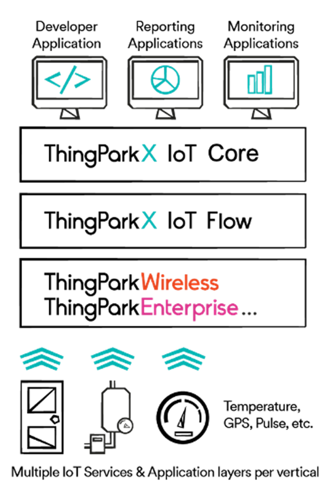
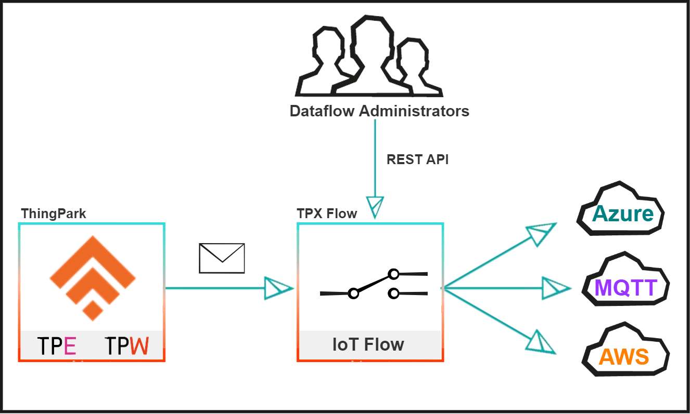
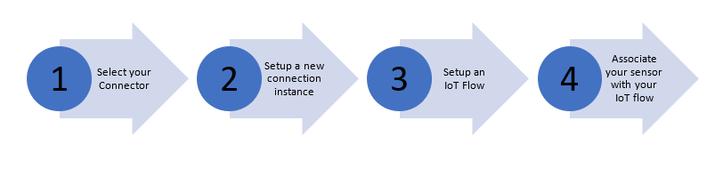
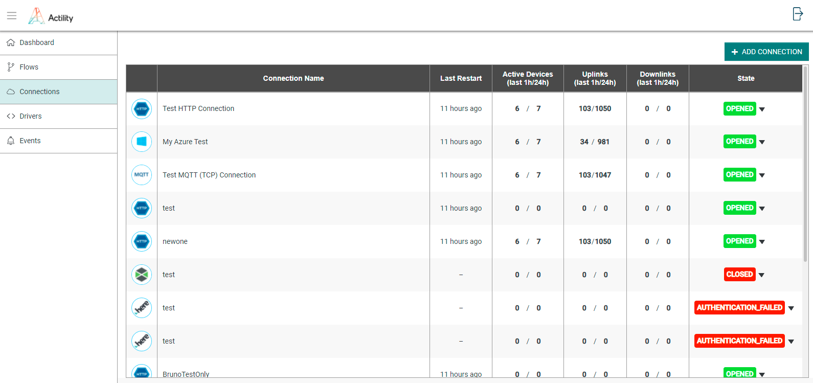
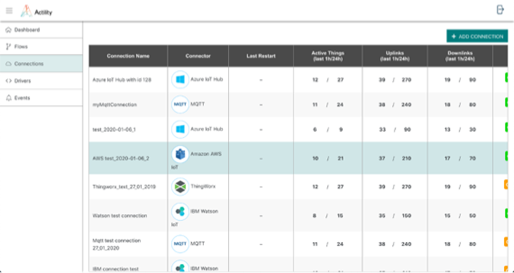

# ThingPark X IoT Flow Overview

Actility believes in a radically more efficient and sustainable world through ubiquitous digital-twin technology.
Digital twins are software representation of physical devices.
The software interface exposes the device properties (and their current values like battery level), along with callable method sending
downlink messages.

We want to spark this transition and become the leading global mediation platform between cloud apps & physical world.
ThingPark X is the cornerstone of Actility’s vision to make digital twins common place. Positioned at the edge of the LoRaWAN network,
ThingPark X simplifies the interface between LPWAN-connected sensors and IoT application,
transforming sensors raw data into application-friendly actionable information,
that can be fed into digital twins object of various IoT Platforms.

### ThingPark X IoT Flow in the ThingPark Product Stack

ThingPark X IoT Flow acts as a mediation layer handling bi-directional communication between ThingPark powered networks and
application servers or major cloud-based IoT Services in order to keep digital twins in sync.
This ability to feed digital twins consistently whatever the LPWAN sensors connected relies on
key capabilities delivered by TP X IoT Flow:

1. ***ThingPark X Drivers***: Transforms the device specific payload into a generic JSON object. Based on ThingPark device profiles, our TP X Platform will be able to decode uplink messages collected through the LPWAN network, in order to transform raw data into actionable data points. ThingPark X Drivers Library supports already more that 100 sensor models and offers the possibility to upload custom drivers.

2. ***ThingPark X IoT Flow Connections***: Adapting transport protocol and forwarding to external application servers or cloud providers. Connectors ensure the proper delivery of the extracted sensor data (via the driver engine) to your selected IoT platform(TP X IoT Core, AWS IoT Core, Azure IoT hub, Thingworx,…), ensuring that:

   a. Authentication is properly handled

   b. Device / Thing provisioning is consistent. E.g. AWS IoT Core connector will create dedicated thing type on AWS IoT Core and instantiates things if it does not exist yet.

   c. Data publication at the right place - E.g.  in the device shadow, or in the alarm framework of the IoT platform if data extracted is an alarm.

3. ***ThingPark X IoT Flow Flows***: Define the list of devices to listen payloads to, the driver to use for those devices in order to decode their payloads, and the connection to send the data in. It allows filtering and forwarding along with optional data transformation (decoding payloads).

## ThingPark Solution Overview

The ThingPark X IoT Flow module aims at interconnecting ThingPark Wireless sensor event sources and command sinks (or other bidirectional data endpoints) with IoT cloud providers (Microsoft Azure, AWS or MQTT) or ThingPark X IoT Core.
As depicted below, ThingPark Wireless forwards uplinks messages to TP X IoT Flow that then deliver those messages to the selected IoT Cloud platform, through the available connections implementing the proper connector type.

## Key Concepts

Moving your devices’ data using IoT Flow requires two pieces of information that are ***the data source and its destination***.
In TPX IoT ***Flow***, this information is encapsulated into a Flow object.
The Flow object allows you to define simple rules in order to route the data from a set of devices to another set of destinations.
On the source side, a Flow is attached to your devices using ***Keys***(Dev_EUI) or ***Tags***.
On the destination side, a Flow send the data into a ***Connection***. A Connection uses a ***Connector*** to communication with an external service like a cloud provider.

### Connectors

TP X IoT Flow ***connectors*** are profile that will determine the communication parameters toward the IoT Cloud platform.
Amongst the available connectors currently available you will find generic connectors such as MQTT or HTTP,
as well as application specific connectors like AWS IoT Core or Azure IoT Hub.

TP X IoT Flow `connectors` is a profile that will determine the communication parameters toward the IoT Cloud platform.
Amongst the available connectors currently available you will find :

* 	AWS IoT
*   Azure IoT Hub
* 	ThingWorx
* 	IBM Watson IoT
* 	MQTT

### Connection

A ***connection*** is a specific instance of a ***Connector*** for which you define specific parameters to establish a communication
stream with the selected IoT cloud platform.

A **connection** is a specific instance of a `Connector` for which you define specific parameters to establish a communication stream with the selected IoT cloud platform.

### IoT Flow

An  ***IoT Flow*** is the object that will create an association between a sensor and an IoT cloud platform.
This association is done by matching sensors traffic to a specific ***Connection*** using ***tags*** available as metadata in uplink/downlink messages.

### IoT Flow Rest API

The IoT Flow REST API is a set of webservice allowing to create and configure the IoT Flows.

##### Configuration Steps

In order to establish a bi-directional communication between an LPWAN connected sensor and a compatible IoT cloud platform using TP X IoT Flow, you need to complete the following steps:

This flow is described in the subsequent sections of this document.

*	To create your first IoT Flow, get started here [Getting Started](../Getting_Started/Getting_Started_ThingPark).

## Interfaces

2 interfaces are available to interact with ThingPark X IoT Flow: a graphical user interface and an API.

### Graphical User Interface - GUI

The GUI is useful to manage the objects interactively and to monitor events in case of problem.
It’s designed to give a meaningful overview of the user’s objects.
You can use the GUI when the number of objects you need to evaluate are under 10, for example when a particular connection must be fixed.
It’s not designed to perform analytics nor bulk operations.

### Application Programmable Interface - API

The IoT Flow REST API is a set of webservices allowing to create and configure the IoT Flows.
The API is useful to allow machines to communicate in order to automate repetitive tasks or integrate with an existing system.
When you need to perform bulk operations, or analytics, the API allows the manipulation of hundreds of objects.

## ThingPark X IoT Flow product variants

There are 2 ways to get access to ThingPark X IoT Flow product.

- ***As a standalone product***: This options is used to integrate TP X IoT Flow capabilities on top of ThingPark Wireless or a 3rd party network server. In that scenario, all the capabilities and interfaces described in that documentation are exposed to the user.

- ***As a ThingPark Enterprise component***: ThingPark Enterprise software integrates TP X IoT Flow product components by default. In order to optimize the user experience for ThingPark Enterprise, some of the TP X IoT Flow features depicted in that documentation have been hidden to the user. For example, the concept of flow is not visible from the UI.

This documentation depicts all capabilities offered by ThingPark X IoT Flow as a standalone products.
Whenever applicable, notes will be added to highlight concepts, procedures or interfaces that will not apply in the ThingPark Enterprise context.

## ThingPark Solution Overview

The ThingPark X IoT Flow module aims at interconnecting ThingPark Wireless sensor event sources and command sinks (or other bidirectional data endpoints) with IoT cloud providers (Microsoft Azure, AWS or MQTT) or ThingPark X IoT Core.
As depicted below, ThingPark Wireless forwards uplinks messages to TP X IoT Flow that then deliver those messages to the selected IoT Cloud platform, through the available connections implementing the proper connector type.

### Key Concepts

The following key concepts are defined in ThingPark X IoT Flow.

### Connector

TP X IoT Flow `connectors` is a profile that will determine the communication parameters toward the IoT Cloud platform.
Amongst the available connectors currently available you will find :

* 	AWS IoT
*   Azure IoT Hub
* 	ThingWorx
* 	IBM Watson IoT
* 	MQTT
     

### Connection

A **connection** is a specific instance of a `Connector` for which you define specific parameters to establish a communication stream with the selected IoT cloud platform.

### IoT Flow

An **IoT Flow** is the object that will create an association between a sensor and an IoT cloud platform.
This association is done by matching sensors traffic to a specific **Connection** using `tags` available as metadata in uplink/downlink messages.

### IoT Flow Rest API

The IoT Flow REST API is a set of webservice allowing to create and configure the IoT Flows.

### Configuration Steps

In order to establish a bi-directional communication between an LPWAN connected sensor and a compatible IoT cloud platform using TP X IoT Flow, you need to complete the following steps:

