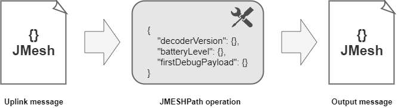

# JMesh

* JMesh is a portable and versatile JSON-based file format for storage of unstructured mesh and shape data.

* JMESPath (JSON Matching Expression paths) is a query language used for searching in JSON documents. It allows you to declaratively extract elements from a JSON document.

We used custom output processors which are based on JMESPath.



## JMesh uplink example

A message envelopped with this custom processor will looks similar to this:

```json
{
    "DevEUI_uplink": {
        "Time": "2021-12-01T00:00:11.013+01:00",
        "DevEUI": "402C765000000074",
        "FPort": 2,
        "FCntUp": 53,
        "ADRbit": 1,
        "MType": 4,
        "FCntDn": 54,
        "payload_hex": "02300040a0",
        "mic_hex": "61fa24cf",
        "InstantPER": 0.0,
        "MeanPER": 0.0,
        "DevAddr": "04D2848E",
    },
    "output": {
        "DevEUI_uplink": {
            "Time": "2021-12-01T00:00:11.013+01:00",
            "DevEUI": "402C765000000074",
            "FPort": 2,
            "FCntUp": 53,
            "ADRbit": 1,
            "MType": 4,
            "FCntDn": 54,
            "payload_hex": "02300040a0",
            "mic_hex": "61fa24cf",
            "CustomerID": "100133870",
            "DriverCfg": {
                "id": "custom:baumer-wep:1"
            },
            "payload": {
                "type": "pressure",
                "decoder_version": "BAUMER_GEN1_V103",
                "diagnostic": {
                    "failure_status": 0,
                    "battery_level": 3.6,
                    "temp_electronic_board": 23
                },
                "debug": {
                    "debug_unit_code": 0,
                    "debug_etendu": 4,
                    "debug_pressurePercent": 0.1,
                    "debug_payload": [2,48,0,64,160]
                }
            }
        }
    }    
}
```

:::tip Note
Some informations are missing in order to simplify the example.
:::

## JMESPath operation

After receiving a message like the one above, we passed a JMESPath operation like this:

```jmeshpath
{
    "decoderVersion": {
        { DevEUI_uplink.payload.decoder_version }
    },
    "batteryLevel": {
        { DevEUI_uplink.payload.diagnostic.battery_level }
    },
    "firstDebugPayload": {
        { DevEUI_uplink.payload.debug.debug_payload[0] }
    } 
}
```

## Processor output

The output of the processor should be:

```json
    {
        "decoderVersion": "BAUMER_GEN1_V103",
        "batteryLevel": 3.6,
        "firstDebugPayload": 2
    }
```
