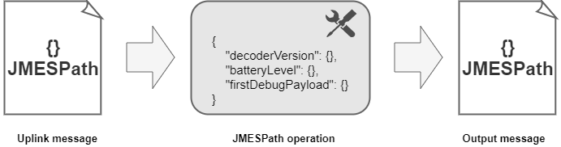

# JMESPath

* JMESPath is a portable and versatile JSON-based file format for storage of unstructured mesh and shape data.

* JMESPath (JSON Matching Expression paths) is a query language used for searching in JSON documents. It allows you to declaratively extract elements from a JSON document.

We used custom output processors which are based on JMESPath.



## Input message

A simplified input message could be similar to this:

```json
{
    "DevEUI_uplink": {
        "Time": "2021-12-01T00:00:11.013+01:00",
        "DevEUI": "402C765000000074",
        "FPort": 2,
        "FCntUp": 53,
        "ADRbit": 1,
        "FCntDn": 54,
        "payload_hex": "02300040a0",
        "mic_hex": "61fa24cf",
        "DevAddr": "04D2848E",
        "payload": {
          "temperature": 0.5,
          "batteryVoltage": 3.6
        }
    }
}
```

## JMESPath operation

After receiving a message like the one above, we passed a JMESPath operation like this:

```json
{
  "Time": "{{ DevEUI_uplink.Time }}",
  "DevEUI": "{{ DevEUI_uplink.DevEUI }}",
  "FPort": "{{ DevEUI_uplink.FPort }}",
  "FCntUp": "{{ DevEUI_uplink.FCntUp }}",
  "FCntDn": "{{ DevEUI_uplink.FCntDn }}",
  "payload": "{{ DevEUI_uplink.payload_hex }}",
  "batteryVoltage": "{{ DevEUI_uplink.payload.batteryVoltage }}",
  "temperature": "{{ DevEUI_uplink.payload.temperature }}",
  "special": "我爱"
}
```
::: warning
You can found more information on <a href="https://jmespath.org/">JMESPath</a>.
:::

## Output message

The output of the processor is:

```json
{
	"Time": "2021-12-01T00:00:11.013+01:00",
	"DevEUI": "402C765000000074",
	"FPort": 2,
	"FCntUp": 53,
	"FCntDn": 54,
	"payload": "02300040a0",
	"batteryVoltage": 3.6,
	"temperature": 0.5,
	"special": "我爱"
}
```
