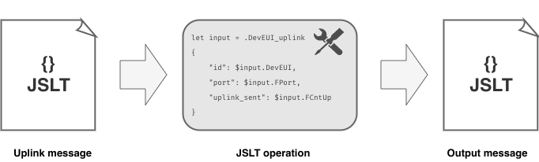

# JSLT

* JSLT is a complete query and transformation language for JSON. The language design is inspired by jq, XPath, and XQuery.

We used custom output processors which are based on JSLT.



## JSLT uplink example

A JSLT uplink will looks similar to this:

```json
{
    "DevEUI_uplink": {
        "Time": "2021-12-01T00:00:11.013+01:00",
        "DevEUI": "402C765000000074",
        "FPort": 2,
        "FCntUp": 53,
        "ADRbit": 1,
        "MType": 4,
        "FCntDn": 54,
        "payload_hex": "02300040a0",
        "mic_hex": "61fa24cf",
        "InstantPER": 0.0,
        "MeanPER": 0.0,
        "DevAddr": "04D2848E",
    }
}
```

:::tip Note
Some informations are missing in order to simplify the example.
:::

## JSLT operation

After receiving a message like the one above, we passed a JSLT operation like this:

```json
let input = .DevEUI_uplink
{
    "id": $input.DevEUI,
    "port": $input.FPort,
    "uplink_sent": $input.FCntUp,
    "downlink_sent": $input.FCntDn,
    "total_messages": ($input.FCntUp + $input.FCntDn),
    "encoded_payload": $input.payload_hex,
    "temperature": round(3 * 100 / 3.6) + "%"
}
```

## Processor output

The output of the processor should be:

```json
{
  "id" : "402C765000000074",
  "port" : 2,
  "uplink_sent" : 53,
  "downlink_sent" : 54,
  "total_messages" : 107,
  "encoded_payload" : "02300040a0",
  "temperature" : "83%"
}
```
