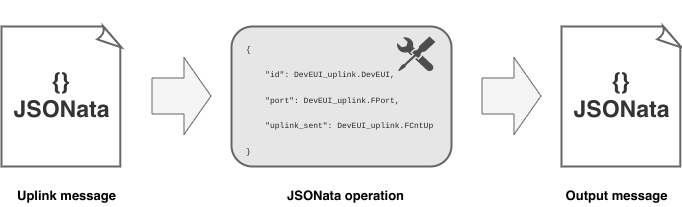

# JSONata

* JSONata is a lightweight query and transformation language for JSON data inspired by location path semantics of XPath 3.1

We used custom output processors which are based on JSONata.



## Actility minimalist message

A minimalist Actility message looks similar to this:

```json
{
    "DevEUI_uplink": {
        "Time": "2021-12-01T00:00:11.013+01:00",
        "DevEUI": "402C765000000074",
        "FPort": 2,
        "FCntUp": 53,
        "ADRbit": 1,
        "FCntDn": 54,
        "payload_hex": "02300040a0",
        "mic_hex": "61fa24cf",
        "DevAddr": "04D2848E",
        "payload": {
          "temperature": 0.5,
          "batteryVoltage": 3.6
        }
    }
}
```

## JSONata operation

After receiving a message like the one above, we passed a JSONata operation like this:

```json
{
    "Time": DevEUI_uplink.Time, 
    "DevEUI": DevEUI_uplink.DevEUI,
    "FPort": DevEUI_uplink.FPort,
    "FCntUp": DevEUI_uplink.FCntUp,
    "FCntDn": DevEUI_uplink.FCntDn,
    "payload": DevEUI_uplink.payload_hex,
    "batteryLevel": $round(DevEUI_uplink.payload.batteryVoltage * 100 / 3.6) & "%",
    "temperature": (DevEUI_uplink.payload.temperature * 9/5) + 32 & " °F",
    "special": "救恩"
}
```
::: warning
You can found more information on <a href="http://docs.jsonata.org/overview">JSONata</a>.
:::

## Processor output

The output of the processor should be:

```json
{
  "Time": "2021-12-01T00:00:11.013+01:00",
  "DevEUI": "402C765000000074",
  "FPort": 2,
  "FCntUp": 53,
  "FCntDn": 54,
  "payload": "02300040a0",
  "batteryLevel": "100%",
  "temperature": "32.9 °F",
  "special": "救恩"
}
```
